# ShopAPI - Developer Onboarding Guide

**Generated by:** Codebase Onboarding Guide Plugin v1.0.0
**Date:** 2025-12-31
**Analysis Depth:** Standard
**Time to Complete:** 15 minutes

---

## Table of Contents

1. [Quick Start](#quick-start)
2. [Architecture Overview](#architecture-overview)
3. [Technology Stack](#technology-stack)
4. [Project Structure](#project-structure)
5. [Most Important Files](#most-important-files)
6. [Key Features & Where to Find Them](#key-features--where-to-find-them)
7. [How Requests Flow Through the System](#how-requests-flow-through-the-system)
8. [Data Models](#data-models)
9. [API Reference](#api-reference)
10. [Glossary](#glossary)
11. [Common Development Tasks](#common-development-tasks)
12. [Learning Path](#learning-path)
13. [Resources](#resources)

---

## Quick Start

### Prerequisites

- Node.js 18+
- PostgreSQL 14+
- Redis 7+
- Docker (for local development)

### Setup Steps

```bash
# 1. Clone and install
git clone https://github.com/example/shop-api.git
cd shop-api
npm install

# 2. Configure environment
cp .env.example .env
# Edit .env with your database credentials

# 3. Start dependencies
docker-compose up -d postgres redis

# 4. Run migrations
npm run migrate

# 5. Seed test data
npm run seed

# 6. Start development server
npm run dev
# API will be available at http://localhost:3000
```

### Your First Task

Try adding a new field to the Product model:

1. Add field to `src/models/Product.ts`
2. Create migration: `npm run migration:create add-product-field`
3. Edit migration file in `src/migrations/`
4. Run migration: `npm run migrate`
5. Update validation in `src/validators/product.validator.ts`
6. Test: `npm test src/models/Product.test.ts`

### Helpful Commands

| Command | Description |
|---------|-------------|
| `npm run dev` | Start development server with hot reload |
| `npm test` | Run all tests |
| `npm test -- --watch` | Run tests in watch mode |
| `npm run lint` | Check code style |
| `npm run migrate` | Run database migrations |
| `npm run db:reset` | Reset database (⚠️ deletes all data) |
| `npm run docs` | Generate API documentation |

---

## Architecture Overview

**Pattern:** Layered Architecture (MVC-inspired)

ShopAPI follows a clean layered architecture with clear separation of concerns:

```
┌─────────────────────────────────────┐
│         API Layer (Routes)          │  ← HTTP endpoints
└────────────────┬────────────────────┘
                 │
┌────────────────▼────────────────────┐
│      Controllers (Business Logic)   │  ← Request handling
└────────────────┬────────────────────┘
                 │
┌────────────────▼────────────────────┐
│         Services (Domain Logic)     │  ← Core business rules
└────────────────┬────────────────────┘
                 │
┌────────────────▼────────────────────┐
│      Repositories (Data Access)     │  ← Database operations
└────────────────┬────────────────────┘
                 │
┌────────────────▼────────────────────┐
│          Database (PostgreSQL)      │  ← Data storage
└─────────────────────────────────────┘
```

### Key Architectural Characteristics

- **RESTful API Design:** Standard REST conventions for all endpoints
- **Dependency Injection:** Uses `tsyringe` for DI container
- **Database ORM:** TypeORM for type-safe database operations
- **Validation:** Zod schemas for request validation
- **Authentication:** JWT-based with refresh tokens
- **Caching:** Redis for session storage and performance
- **Error Handling:** Centralized error middleware
- **Testing:** Jest with repository pattern for easy mocking

---

## Technology Stack

### Core Technologies

| Category | Technology | Version | Purpose |
|----------|-----------|---------|---------|
| **Runtime** | Node.js | 18.x | JavaScript runtime |
| **Language** | TypeScript | 5.x | Type-safe development |
| **Framework** | Express | 4.18.x | Web framework |
| **Database** | PostgreSQL | 14.x | Primary data store |
| **ORM** | TypeORM | 0.3.x | Database abstraction |
| **Cache** | Redis | 7.x | Session & caching |
| **Testing** | Jest | 29.x | Unit & integration tests |
| **Validation** | Zod | 3.x | Schema validation |

### Key Dependencies

| Library | Purpose |
|---------|---------|
| `tsyringe` | Dependency injection |
| `jsonwebtoken` | JWT authentication |
| `bcrypt` | Password hashing |
| `express-rate-limit` | Rate limiting |
| `helmet` | Security headers |
| `winston` | Logging |
| `dotenv` | Environment config |

---

## Project Structure

```
shop-api/
├── src/
│   ├── index.ts                    # 🔥 Application entry point
│   ├── app.ts                      # 🔥 Express app configuration
│   │
│   ├── routes/                     # API route definitions
│   │   ├── index.ts               # Route aggregation
│   │   ├── auth.routes.ts         # /api/auth/*
│   │   ├── products.routes.ts     # /api/products/*
│   │   ├── orders.routes.ts       # /api/orders/*
│   │   └── users.routes.ts        # /api/users/*
│   │
│   ├── controllers/                # 🔥 Request handlers
│   │   ├── AuthController.ts      # Login, register, refresh
│   │   ├── ProductController.ts   # Product CRUD
│   │   ├── OrderController.ts     # Order management
│   │   └── UserController.ts      # User management
│   │
│   ├── services/                   # 🔥 Business logic
│   │   ├── AuthService.ts         # Authentication logic
│   │   ├── ProductService.ts      # Product business rules
│   │   ├── OrderService.ts        # Order processing
│   │   ├── PaymentService.ts      # Payment integration
│   │   └── EmailService.ts        # Email notifications
│   │
│   ├── repositories/               # Data access layer
│   │   ├── ProductRepository.ts
│   │   ├── OrderRepository.ts
│   │   └── UserRepository.ts
│   │
│   ├── models/                     # 🔥 Database entities
│   │   ├── User.ts                # User entity
│   │   ├── Product.ts             # Product entity
│   │   ├── Order.ts               # Order entity
│   │   └── OrderItem.ts           # Order items
│   │
│   ├── validators/                 # Request validation schemas
│   │   ├── product.validator.ts
│   │   ├── order.validator.ts
│   │   └── user.validator.ts
│   │
│   ├── middleware/                 # Express middleware
│   │   ├── auth.middleware.ts     # JWT verification
│   │   ├── error.middleware.ts    # Error handling
│   │   ├── validation.middleware.ts
│   │   └── rateLimit.middleware.ts
│   │
│   ├── utils/                      # Utility functions
│   │   ├── logger.ts              # Winston logger
│   │   ├── errors.ts              # Custom error classes
│   │   └── pagination.ts          # Pagination helpers
│   │
│   ├── config/                     # Configuration
│   │   ├── database.ts            # TypeORM config
│   │   ├── redis.ts               # Redis config
│   │   └── constants.ts           # App constants
│   │
│   └── migrations/                 # Database migrations
│       └── YYYYMMDDHHMMSS-*.ts
│
├── tests/                          # Test files (mirrors src/)
│   ├── unit/
│   ├── integration/
│   └── fixtures/
│
├── docs/                           # Documentation
│   └── api/                        # Generated API docs
│
├── .env.example                    # Environment template
├── docker-compose.yml              # Local development setup
├── package.json
└── tsconfig.json

🔥 = Most important files to understand first
```

---

## Most Important Files

**Start with these files to understand the system:**

### 1. `src/index.ts` - Application Entry Point
**Importance Score: 95/100**

This is where the application starts. It:
- Initializes the database connection
- Sets up dependency injection container
- Starts the Express server
- Handles graceful shutdown

**Read this first** to understand the application lifecycle.

### 2. `src/app.ts` - Express Application Configuration
**Importance Score: 92/100**

Configures the Express application with:
- Middleware (CORS, helmet, body parsing)
- Route registration
- Error handling
- Request logging

**Read this second** to understand the request pipeline.

### 3. `src/models/` - Database Entities
**Importance Score: 90/100**

TypeORM entity definitions. Understanding the data models is crucial:
- **User.ts** - User accounts, authentication
- **Product.ts** - Product catalog
- **Order.ts** - Order management
- **OrderItem.ts** - Order line items

**Read these third** to understand the data structure.

### 4. `src/controllers/ProductController.ts` - Example Controller
**Importance Score: 85/100**

A representative controller showing the pattern used throughout the app:
- Request validation
- Service layer calls
- Response formatting
- Error handling

**Read this fourth** to understand the controller pattern.

### 5. `src/services/OrderService.ts` - Complex Business Logic
**Importance Score: 85/100**

Shows how complex operations are handled:
- Order creation workflow
- Payment processing
- Inventory updates
- Email notifications

**Read this fifth** to understand service orchestration.

### Complete Ranking (Top 20 Files)

| Rank | File | Importance | Why |
|------|------|------------|-----|
| 1 | `src/index.ts` | 95 | Entry point |
| 2 | `src/app.ts` | 92 | App configuration |
| 3 | `src/models/*.ts` | 90 | Data models |
| 4 | `src/controllers/ProductController.ts` | 85 | Controller pattern |
| 5 | `src/services/OrderService.ts` | 85 | Complex logic |
| 6 | `src/middleware/auth.middleware.ts` | 82 | Authentication |
| 7 | `src/middleware/error.middleware.ts` | 80 | Error handling |
| 8 | `src/routes/index.ts` | 78 | Route aggregation |
| 9 | `src/config/database.ts` | 75 | DB configuration |
| 10 | `src/utils/logger.ts` | 70 | Logging setup |
| 11 | `src/validators/product.validator.ts` | 68 | Validation pattern |
| 12 | `src/repositories/ProductRepository.ts` | 65 | Data access pattern |
| 13 | `src/services/AuthService.ts` | 65 | Authentication logic |
| 14 | `src/utils/errors.ts` | 60 | Error classes |
| 15 | `src/config/redis.ts` | 58 | Cache configuration |

---

## Key Features & Where to Find Them

### Authentication & Authorization

**Location:** `src/controllers/AuthController.ts` + `src/services/AuthService.ts`
**Entry Point:** `POST /api/auth/login`

```
Login Flow:
POST /api/auth/login
  → AuthController.login()
    → AuthService.authenticate()
      → UserRepository.findByEmail()
      → bcrypt.compare(password)
      → JWT.sign(token)
    → Redis.setex(refreshToken)
  ← 200 { accessToken, refreshToken }
```

**Files:**
- `src/routes/auth.routes.ts` - Auth endpoints
- `src/controllers/AuthController.ts` - Login, register, refresh
- `src/services/AuthService.ts` - Authentication logic
- `src/middleware/auth.middleware.ts` - JWT verification
- `src/models/User.ts` - User entity

### Product Management

**Location:** `src/controllers/ProductController.ts` + `src/services/ProductService.ts`
**Entry Point:** `GET /api/products`

**Files:**
- `src/routes/products.routes.ts` - Product endpoints
- `src/controllers/ProductController.ts` - CRUD operations
- `src/services/ProductService.ts` - Business logic
- `src/repositories/ProductRepository.ts` - Database queries
- `src/models/Product.ts` - Product entity
- `src/validators/product.validator.ts` - Request validation

### Order Processing

**Location:** `src/controllers/OrderController.ts` + `src/services/OrderService.ts`
**Entry Point:** `POST /api/orders`

**Files:**
- `src/routes/orders.routes.ts` - Order endpoints
- `src/controllers/OrderController.ts` - Order operations
- `src/services/OrderService.ts` - Order orchestration
- `src/services/PaymentService.ts` - Payment integration
- `src/services/EmailService.ts` - Order confirmation emails
- `src/models/Order.ts` + `OrderItem.ts` - Order entities

### User Management

**Location:** `src/controllers/UserController.ts` + `src/services/UserService.ts`
**Entry Point:** `GET /api/users/me`

**Files:**
- `src/routes/users.routes.ts` - User endpoints
- `src/controllers/UserController.ts` - User operations
- `src/models/User.ts` - User entity

### Payment Processing

**Location:** `src/services/PaymentService.ts`
**Integration:** Stripe API

**Files:**
- `src/services/PaymentService.ts` - Stripe integration
- `src/config/stripe.ts` - Stripe configuration

---

## How Requests Flow Through the System

### Example: Creating a Product

```mermaid
sequenceDiagram
    participant Client
    participant Express
    participant AuthMW as Auth Middleware
    participant Validator as Validation MW
    participant Controller as ProductController
    participant Service as ProductService
    participant Repo as ProductRepository
    participant DB as PostgreSQL

    Client->>Express: POST /api/products<br/>{name, price, stock}
    Express->>AuthMW: Verify JWT
    AuthMW->>AuthMW: Check token validity
    AuthMW->>Express: ✓ User authenticated

    Express->>Validator: Validate request body
    Validator->>Validator: Check Zod schema
    Validator->>Express: ✓ Valid data

    Express->>Controller: createProduct(req, res)
    Controller->>Service: createProduct(productData)
    Service->>Service: Apply business rules
    Service->>Repo: create(product)
    Repo->>DB: INSERT INTO products
    DB->>Repo: Product record
    Repo->>Service: Product entity
    Service->>Controller: Created product
    Controller->>Client: 201 {id, name, price, stock}
```



### Request Pipeline

Every request goes through this pipeline:

1. **Middleware Stack** (in order):
   - `helmet` - Security headers
   - `cors` - CORS handling
   - `express.json()` - Body parsing
   - `logger` - Request logging
   - `rateLimit` - Rate limiting
   - `auth.middleware` - JWT verification (protected routes)
   - `validation.middleware` - Request validation

2. **Route Handler:**
   - Routes defined in `src/routes/*.routes.ts`
   - Maps to controller method

3. **Controller:**
   - Validates request
   - Calls service layer
   - Formats response
   - Handles errors

4. **Service:**
   - Business logic
   - Transaction coordination
   - Calls multiple repositories if needed
   - Triggers side effects (emails, etc.)

5. **Repository:**
   - Database queries
   - TypeORM operations
   - Data mapping

6. **Error Handling:**
   - Custom errors thrown at any layer
   - Caught by `error.middleware.ts`
   - Formatted as JSON response

---

## Data Models

### Entity Relationship Diagram


### Key Entities

#### User
**File:** `src/models/User.ts`

**Purpose:** Stores user accounts for authentication and authorization.

**Key Fields:**
- `email` - Unique identifier, used for login
- `password` - Bcrypt hashed, never returned in API
- `role` - ADMIN or CUSTOMER (used for authorization)
- `firstName`, `lastName` - Display name

**Relationships:**
- One user can have many orders

**Validation Rules:**
- Email must be valid format
- Password minimum 8 characters, requires uppercase, lowercase, number

#### Product
**File:** `src/models/Product.ts`

**Purpose:** Product catalog with inventory tracking.

**Key Fields:**
- `name` - Product name (indexed for search)
- `price` - Current price (decimal for accuracy)
- `stock` - Current inventory count
- `active` - Soft delete flag

**Relationships:**
- Products appear in order items

**Business Rules:**
- Stock decremented on order creation
- Can't order if stock < quantity

#### Order
**File:** `src/models/Order.ts`

**Purpose:** Customer orders with items and status tracking.

**Key Fields:**
- `userId` - Who placed the order
- `total` - Calculated from order items
- `status` - PENDING → PAID → PROCESSING → SHIPPED → DELIVERED

**Relationships:**
- Belongs to one user
- Has many order items

**State Machine:**
```
PENDING → PAID → PROCESSING → SHIPPED → DELIVERED
   ↓                              ↓
CANCELLED                    CANCELLED
```

#### OrderItem
**File:** `src/models/OrderItem.ts`

**Purpose:** Line items in an order (junction table).

**Key Fields:**
- `productId` - Which product
- `quantity` - How many
- `price` - Price at time of order (historical record)
- `subtotal` - quantity × price (calculated)

---

## API Reference

### Base URL
- **Development:** `http://localhost:3000/api`
- **Production:** `https://api.shop.example.com/api`

### Authentication
All endpoints except `/auth/*` require JWT authentication.

**Header:**
```
Authorization: Bearer <access_token>
```

### Endpoints Overview

| Endpoint | Method | Auth | Description |
|----------|--------|------|-------------|
| `/auth/register` | POST | No | Create account |
| `/auth/login` | POST | No | Login |
| `/auth/refresh` | POST | No | Refresh token |
| `/products` | GET | No | List products |
| `/products/:id` | GET | No | Get product |
| `/products` | POST | Admin | Create product |
| `/products/:id` | PUT | Admin | Update product |
| `/products/:id` | DELETE | Admin | Delete product |
| `/orders` | GET | Yes | List my orders |
| `/orders/:id` | GET | Yes | Get order details |
| `/orders` | POST | Yes | Create order |
| `/users/me` | GET | Yes | Get my profile |
| `/users/me` | PUT | Yes | Update profile |

### Example: Create Order

**Endpoint:** `POST /api/orders`

**Request:**
```json
{
  "items": [
    {
      "productId": "a3bb189e-8bf9-3888-9912-ace4e6543002",
      "quantity": 2
    },
    {
      "productId": "b4cc290f-9cga-4999-0023-bdf5f7654113",
      "quantity": 1
    }
  ]
}
```

**Response:** `201 Created`
```json
{
  "id": "c5dd391g-0dhb-5000-1134-ceg6g8765224",
  "userId": "d6ee402h-1eic-6111-2245-dfh7h9876335",
  "items": [
    {
      "id": "e7ff513i-2fjd-7222-3356-egi8i0987446",
      "productId": "a3bb189e-8bf9-3888-9912-ace4e6543002",
      "productName": "Widget",
      "quantity": 2,
      "price": "29.99",
      "subtotal": "59.98"
    },
    {
      "id": "f8gg624j-3gke-8333-4467-fhj9j1098557",
      "productId": "b4cc290f-9cga-4999-0023-bdf5f7654113",
      "productName": "Gadget",
      "quantity": 1,
      "price": "49.99",
      "subtotal": "49.99"
    }
  ],
  "total": "109.97",
  "status": "PENDING",
  "createdAt": "2025-12-31T10:30:00Z"
}
```

**Error Responses:**
- `400` - Invalid product ID or insufficient stock
- `401` - Not authenticated
- `500` - Server error

---

## Glossary

### Business Terms

**Cart Abandonment:** When a user adds items but doesn't complete the order. (Currently not tracked)

**Fulfillment:** The process of picking, packing, and shipping an order. Handled externally.

**Inventory:** The stock of products available for sale. Tracked in `Product.stock` field.

**SKU (Stock Keeping Unit):** Not currently implemented. Products are identified by UUID.

### Technical Terms

**Controller:** Handles HTTP requests and responses. Thin layer that delegates to services.
- **File:** `src/controllers/*.ts`
- **Example:** `ProductController.createProduct()`

**Service:** Contains business logic and orchestrates operations.
- **File:** `src/services/*.ts`
- **Example:** `OrderService.createOrder()` handles payment, inventory, emails

**Repository:** Data access layer that talks to the database.
- **File:** `src/repositories/*.ts`
- **Example:** `ProductRepository.findById()`

**Entity:** TypeORM model representing a database table.
- **File:** `src/models/*.ts`
- **Example:** `Product`, `Order`, `User`

**Middleware:** Express functions that run before route handlers.
- **File:** `src/middleware/*.ts`
- **Example:** `auth.middleware.ts` verifies JWTs

**Validator:** Zod schema that validates request data.
- **File:** `src/validators/*.ts`
- **Example:** `productValidator.create`

**Migration:** Database schema change script.
- **File:** `src/migrations/*.ts`
- **Command:** `npm run migrate`

### Acronyms

- **ORM:** Object-Relational Mapping (TypeORM)
- **DTO:** Data Transfer Object (not currently used)
- **UUID:** Universally Unique Identifier (used for all IDs)
- **JWT:** JSON Web Token (authentication)
- **CRUD:** Create, Read, Update, Delete
- **REST:** Representational State Transfer

---

## Common Development Tasks

### How to Add a New API Endpoint

**Example: Add GET /api/products/:id/reviews**

1. **Add route** in `src/routes/products.routes.ts`:
   ```typescript
   router.get('/:id/reviews', ProductController.getReviews);
   ```

2. **Add controller method** in `src/controllers/ProductController.ts`:
   ```typescript
   async getReviews(req: Request, res: Response): Promise<void> {
     const { id } = req.params;
     const reviews = await this.productService.getReviews(id);
     res.json(reviews);
   }
   ```

3. **Add service method** in `src/services/ProductService.ts`:
   ```typescript
   async getReviews(productId: string): Promise<Review[]> {
     return this.reviewRepository.findByProductId(productId);
   }
   ```

4. **Test it:**
   ```bash
   npm test src/controllers/ProductController.test.ts
   ```

### How to Add a New Database Field

**Example: Add `category` field to Product**

1. **Update entity** in `src/models/Product.ts`:
   ```typescript
   @Column({ nullable: true })
   category?: string;
   ```

2. **Create migration:**
   ```bash
   npm run migration:create add-product-category
   ```

3. **Edit migration** in `src/migrations/YYYYMMDDHHMMSS-add-product-category.ts`:
   ```typescript
   await queryRunner.addColumn('products', new TableColumn({
     name: 'category',
     type: 'varchar',
     isNullable: true
   }));
   ```

4. **Run migration:**
   ```bash
   npm run migrate
   ```

5. **Update validator** in `src/validators/product.validator.ts`:
   ```typescript
   category: z.string().optional()
   ```

6. **Update tests** in `tests/unit/models/Product.test.ts`

### How to Add Authentication to an Endpoint

Add the `authenticate` middleware to the route:

```typescript
import { authenticate } from '../middleware/auth.middleware';

// Before:
router.get('/products', ProductController.getAll);

// After (requires authentication):
router.get('/products', authenticate, ProductController.getAll);
```

For admin-only endpoints:

```typescript
import { authenticate, requireAdmin } from '../middleware/auth.middleware';

router.post('/products', authenticate, requireAdmin, ProductController.create);
```

### How to Debug a Request

1. **Enable debug logging** in `.env`:
   ```
   LOG_LEVEL=debug
   ```

2. **Add breakpoint** in VS Code at your controller method

3. **Send request** using curl or Postman

4. **Check logs** in console:
   ```
   [2025-12-31 10:30:00] DEBUG POST /api/products
   [2025-12-31 10:30:00] DEBUG Request body: {...}
   ```

5. **Query database directly** if needed:
   ```bash
   docker-compose exec postgres psql -U shop_user -d shop_db
   ```

### How to Run Tests

```bash
# All tests
npm test

# Single test file
npm test src/services/OrderService.test.ts

# With coverage
npm test -- --coverage

# Watch mode
npm test -- --watch
```

---

## Learning Path

### Phase 1: Foundation (Day 1) ⏱️ 2-3 hours

**Goal:** Understand the system architecture and basic flow

**Tasks:**
- [ ] Read this onboarding guide (you're here!)
- [ ] Set up local development environment
- [ ] Run the application and make a test API call
- [ ] Read `src/index.ts` and `src/app.ts`
- [ ] Read all entity files in `src/models/`
- [ ] Explore the database using a SQL client

**Completion Criteria:**
- Application runs locally
- You can explain the layered architecture
- You understand the data model

---

### Phase 2: Request Flow (Day 1-2) ⏱️ 3-4 hours

**Goal:** Understand how requests flow through the system

**Tasks:**
- [ ] Trace a GET request from route to database
- [ ] Trace a POST request with validation
- [ ] Understand authentication middleware
- [ ] Read `ProductController` and `ProductService`
- [ ] Understand the repository pattern

**Completion Criteria:**
- You can explain the full request pipeline
- You understand dependency injection
- You can trace any endpoint in the codebase

---

### Phase 3: First Contribution (Day 2-3) ⏱️ 4-6 hours

**Goal:** Make your first code change

**Tasks:**
- [ ] Pick a starter task from backlog
- [ ] Add a new field to an existing model
- [ ] Create a migration
- [ ] Update validation
- [ ] Write tests
- [ ] Create a pull request

**Completion Criteria:**
- Pull request approved and merged
- Tests passing
- You're comfortable with the development workflow

---

### Phase 4: Advanced Features (Week 2) ⏱️ 1-2 days

**Goal:** Understand complex features

**Tasks:**
- [ ] Study `OrderService` (complex orchestration)
- [ ] Understand payment processing
- [ ] Learn error handling patterns
- [ ] Study testing strategies
- [ ] Review caching implementation

**Completion Criteria:**
- You can implement a feature end-to-end
- You understand error handling
- You can write comprehensive tests

---

### Phase 5: Production Ready (Week 3+) ⏱️ Ongoing

**Goal:** Be fully productive

**Tasks:**
- [ ] Understand deployment process
- [ ] Learn monitoring and logging
- [ ] Study performance optimization
- [ ] Contribute to architecture decisions
- [ ] Mentor other new developers

**Completion Criteria:**
- You can work on any part of the codebase
- You can review pull requests
- You're fully integrated into the team

---

## Resources

### Essential Documentation

- [TypeORM Documentation](https://typeorm.io) - Database ORM
- [Express.js Guide](https://expressjs.com/en/guide/routing.html) - Web framework
- [Zod Documentation](https://zod.dev) - Validation library
- [Jest Testing Guide](https://jestjs.io/docs/getting-started) - Testing framework

### Internal Resources

- `docs/api/` - Generated API documentation
- `CONTRIBUTING.md` - How to contribute
- `ARCHITECTURE.md` - Detailed architecture docs
- Team Wiki - https://wiki.example.com/shop-api

### Getting Help

- **Slack:** `#shop-api-dev`
- **Email:** dev-team@example.com
- **Office Hours:** Tuesday/Thursday 2-3pm
- **Code Reviews:** All PRs reviewed within 24 hours

### Recommended Reading

1. **Week 1:** This onboarding guide + TypeORM docs
2. **Week 2:** Express best practices + Testing patterns
3. **Week 3:** Clean Architecture principles
4. **Week 4:** Domain-Driven Design basics

---

## Quick Reference Card

### File Naming Conventions

- Controllers: `PascalCase` + `Controller.ts` (e.g., `ProductController.ts`)
- Services: `PascalCase` + `Service.ts` (e.g., `OrderService.ts`)
- Models: `PascalCase.ts` (e.g., `Product.ts`)
- Routes: `kebab-case.routes.ts` (e.g., `auth.routes.ts`)
- Tests: `*.test.ts` (e.g., `ProductService.test.ts`)

### Code Patterns

**Controller Pattern:**
```typescript
async methodName(req: Request, res: Response): Promise<void> {
  const data = await this.service.method(req.params);
  res.json(data);
}
```

**Service Pattern:**
```typescript
@injectable()
class SomeService {
  constructor(
    @inject(SomeRepository) private repo: SomeRepository
  ) {}

  async method(): Promise<Result> {
    return this.repo.query();
  }
}
```

**Repository Pattern:**
```typescript
findById(id: string): Promise<Entity | null> {
  return this.repository.findOne({ where: { id } });
}
```

### Common Gotchas

- **UUID vs Number:** All IDs are UUIDs (strings), not numbers
- **Password hashing:** Always use bcrypt, never store plain text
- **Async/await:** All database calls are async
- **Validation:** Validate at controller, not service layer
- **Errors:** Throw custom errors, don't return error objects

---

**Generated by Codebase Onboarding Guide Plugin**
**Questions? Contact the dev team in #shop-api-dev**
