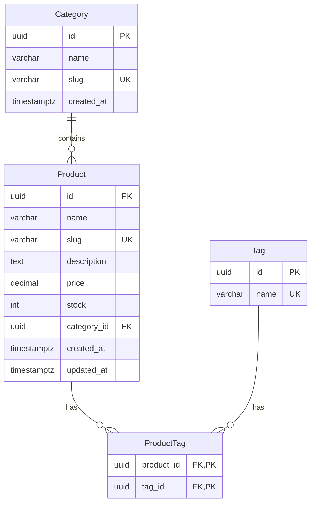

# Workflow: Design Schema for Feature

**Trigger:** User requests schema design for a new feature
**Duration:** 15-30 minutes
**Agents:** 6-8 agents working in coordination

## Workflow Phases

### Phase 1: Requirements Analysis (5 min)

**Agents:** Requirements Analyzer, Entity Modeler

**Requirements Analyzer:**
1. Extracts data requirements from feature description
2. Identifies access patterns (read-heavy? write-heavy?)
3. Estimates scale (rows, queries per second)
4. Documents business constraints

**Entity Modeler:**
1. Identifies core entities
2. Maps relationships (1:1, 1:N, M:N)
3. Determines cardinalities
4. Creates preliminary entity model

**Output:**
```yaml
entities:
  - name: Product
    relationships:
      - type: many-to-one
        target: Category
      - type: many-to-many
        target: Tag
  - name: Category
    relationships:
      - type: one-to-many
        target: Product

access_patterns:
  - query: "List products in category"
    frequency: high
    type: read
  - query: "Search products by name"
    frequency: medium
    type: read
  - query: "Create product"
    frequency: low
    type: write

scale_estimates:
  products: 100k rows
  categories: 500 rows
  tags: 1k rows
  queries_per_second: 500
```

### Phase 2: Schema Design (10 min)

**Agents:** Schema Architect, Normalization Agent

**Schema Architect (Lead):**
1. Designs production-ready schema
2. Selects optimal data types
3. Plans indexing strategy
4. Designs for performance at scale

**Normalization Agent:**
1. Validates normalization (3NF)
2. Suggests strategic denormalization if needed
3. Ensures data integrity through constraints

**Output:**
```prisma
// schema.prisma

model Product {
  id          String   @id @default(uuid()) @db.Uuid
  name        String   @db.VarChar(200)
  slug        String   @unique @db.VarChar(200)
  description String   @db.Text
  price       Decimal  @db.Decimal(10, 2)
  stock       Int      @default(0)

  // Relationships
  categoryId  String   @db.Uuid
  category    Category @relation(fields: [categoryId], references: [id])
  tags        ProductTag[]

  // Full-text search (denormalized for performance)
  searchVector String?  @db.TsVector

  // Timestamps
  createdAt   DateTime @default(now()) @db.Timestamptz
  updatedAt   DateTime @updatedAt @db.Timestamptz

  @@index([categoryId])
  @@index([slug])
  @@index([searchVector], type: Gin)
  @@index([createdAt])
  @@map("products")
}

model Category {
  id          String    @id @default(uuid()) @db.Uuid
  name        String    @db.VarChar(100)
  slug        String    @unique @db.VarChar(100)
  products    Product[]
  createdAt   DateTime  @default(now()) @db.Timestamptz

  @@map("categories")
}

model Tag {
  id        String       @id @default(uuid()) @db.Uuid
  name      String       @unique @db.VarChar(50)
  products  ProductTag[]

  @@map("tags")
}

model ProductTag {
  productId String   @db.Uuid
  tagId     String   @db.Uuid
  product   Product  @relation(fields: [productId], references: [id], onDelete: Cascade)
  tag       Tag      @relation(fields: [tagId], references: [id], onDelete: Cascade)

  @@id([productId, tagId])
  @@index([tagId])
  @@map("product_tags")
}
```

### Phase 3: Optimization (5 min)

**Agents:** Index Optimizer, Query Analyzer

**Index Optimizer:**
1. Validates index strategy
2. Suggests additional indexes for access patterns
3. Identifies candidates for covering indexes
4. Estimates index sizes and overhead

**Query Analyzer:**
1. Validates schema supports efficient queries
2. Checks for potential N+1 queries
3. Suggests eager loading strategies

**Output:**
```sql
-- Covering index for product listings (no table lookup needed)
CREATE INDEX CONCURRENTLY idx_products_listing
  ON products(created_at DESC)
  INCLUDE (id, name, slug, price, category_id)
  WHERE stock > 0;  -- Partial index for in-stock products only

-- Full-text search index
CREATE INDEX CONCURRENTLY idx_products_search
  ON products USING GIN(to_tsvector('english', name || ' ' || description));

-- Index for category filter
CREATE INDEX CONCURRENTLY idx_products_category_created
  ON products(category_id, created_at DESC);
```

### Phase 4: Migration Planning (5 min)

**Agents:** Migration Strategist, Zero-Downtime Planner

**Migration Strategist:**
1. Generates migration files
2. Plans data migration if needed
3. Creates rollback plan

**Zero-Downtime Planner:**
1. Ensures backward compatibility
2. Plans phased deployment if needed
3. Creates safety checklist

**Output:**
```typescript
// prisma/migrations/20240115_add_products/migration.sql

-- CreateEnum
CREATE TYPE "product_status" AS ENUM ('draft', 'published', 'archived');

-- CreateTable
CREATE TABLE "products" (
    "id" UUID NOT NULL DEFAULT gen_random_uuid(),
    "name" VARCHAR(200) NOT NULL,
    "slug" VARCHAR(200) NOT NULL,
    "description" TEXT NOT NULL,
    "price" DECIMAL(10,2) NOT NULL,
    "stock" INTEGER NOT NULL DEFAULT 0,
    "category_id" UUID NOT NULL,
    "created_at" TIMESTAMPTZ NOT NULL DEFAULT CURRENT_TIMESTAMP,
    "updated_at" TIMESTAMPTZ NOT NULL,

    CONSTRAINT "products_pkey" PRIMARY KEY ("id")
);

-- CreateTable
CREATE TABLE "categories" (
    "id" UUID NOT NULL DEFAULT gen_random_uuid(),
    "name" VARCHAR(100) NOT NULL,
    "slug" VARCHAR(100) NOT NULL,
    "created_at" TIMESTAMPTZ NOT NULL DEFAULT CURRENT_TIMESTAMP,

    CONSTRAINT "categories_pkey" PRIMARY KEY ("id")
);

-- CreateTable
CREATE TABLE "tags" (
    "id" UUID NOT NULL DEFAULT gen_random_uuid(),
    "name" VARCHAR(50) NOT NULL,

    CONSTRAINT "tags_pkey" PRIMARY KEY ("id")
);

-- CreateTable
CREATE TABLE "product_tags" (
    "product_id" UUID NOT NULL,
    "tag_id" UUID NOT NULL,

    CONSTRAINT "product_tags_pkey" PRIMARY KEY ("product_id","tag_id")
);

-- CreateIndex
CREATE UNIQUE INDEX "products_slug_key" ON "products"("slug");
CREATE INDEX "products_category_id_idx" ON "products"("category_id");
CREATE INDEX "products_created_at_idx" ON "products"("created_at");

-- CreateIndex
CREATE UNIQUE INDEX "categories_slug_key" ON "categories"("slug");

-- CreateIndex
CREATE UNIQUE INDEX "tags_name_key" ON "tags"("name");

-- CreateIndex
CREATE INDEX "product_tags_tag_id_idx" ON "product_tags"("tag_id");

-- AddForeignKey
ALTER TABLE "products" ADD CONSTRAINT "products_category_id_fkey"
    FOREIGN KEY ("category_id") REFERENCES "categories"("id") ON DELETE RESTRICT ON UPDATE CASCADE;

-- AddForeignKey
ALTER TABLE "product_tags" ADD CONSTRAINT "product_tags_product_id_fkey"
    FOREIGN KEY ("product_id") REFERENCES "products"("id") ON DELETE CASCADE ON UPDATE CASCADE;

-- AddForeignKey
ALTER TABLE "product_tags" ADD CONSTRAINT "product_tags_tag_id_fkey"
    FOREIGN KEY ("tag_id") REFERENCES "tags"("id") ON DELETE CASCADE ON UPDATE CASCADE;
```

### Phase 5: Validation & Testing (3 min)

**Agents:** Migration Validator, Seed Generator

**Migration Validator:**
1. Validates migration syntax
2. Checks for safety issues
3. Confirms backward compatibility

**Seed Generator:**
1. Generates realistic seed data
2. Creates test fixtures

**Output:**
```typescript
// prisma/seeds/products.seed.ts

import { PrismaClient } from '@prisma/client';
import { faker } from '@faker-js/faker';

const prisma = new PrismaClient();

async function seedProducts() {
  // Create categories
  const categories = await Promise.all(
    ['Electronics', 'Clothing', 'Books', 'Home & Garden', 'Sports'].map(name =>
      prisma.category.create({
        data: {
          name,
          slug: name.toLowerCase().replace(/ & /g, '-').replace(/ /g, '-')
        }
      })
    )
  );

  // Create tags
  const tags = await Promise.all(
    ['new', 'sale', 'featured', 'bestseller', 'limited'].map(name =>
      prisma.tag.create({ data: { name } })
    )
  );

  // Create products
  for (let i = 0; i < 100; i++) {
    const category = faker.helpers.arrayElement(categories);
    const productTags = faker.helpers.arrayElements(tags, { min: 0, max: 3 });

    await prisma.product.create({
      data: {
        name: faker.commerce.productName(),
        slug: faker.helpers.slugify(faker.commerce.productName()).toLowerCase(),
        description: faker.commerce.productDescription(),
        price: faker.commerce.price({ min: 10, max: 1000, dec: 2 }),
        stock: faker.number.int({ min: 0, max: 100 }),
        categoryId: category.id,
        tags: {
          create: productTags.map(tag => ({
            tagId: tag.id
          }))
        }
      }
    });
  }

  console.log('✅ Seeded 100 products with categories and tags');
}

seedProducts()
  .catch(console.error)
  .finally(() => prisma.$disconnect());
```

### Phase 6: Documentation (2 min)

**Agents:** ERD Generator

**ERD Generator:**
1. Creates Entity-Relationship Diagram
2. Documents schema decisions
3. Provides migration instructions

**Output:**


## Final Deliverables

1. ✅ **schema.prisma** with complete schema definition
2. ✅ **Migration SQL** with CREATE TABLE statements and indexes
3. ✅ **Seed data script** for testing
4. ✅ **ERD diagram** in Mermaid format
5. ✅ **Performance analysis** with estimated query times
6. ✅ **Index strategy** documentation
7. ✅ **Migration safety checklist**

## Example User Interaction

**User:** "Design a schema for a product catalog with categories and tags"

**Workflow Execution:**

1. Requirements Analyzer extracts: products, categories, tags, many-to-many for tags
2. Entity Modeler creates entity relationship model
3. Schema Architect designs Prisma schema with optimal indexes
4. Index Optimizer adds covering indexes for common queries
5. Migration Strategist generates migration SQL
6. Seed Generator creates test data
7. ERD Generator creates diagram

**Time:** ~20 minutes
**Output:** Production-ready schema with migrations and seed data
**Quality:** Optimized for scale, zero N+1 queries, safe migrations

Remember: This is a collaborative workflow. Agents work in parallel where possible and hand off work seamlessly.
