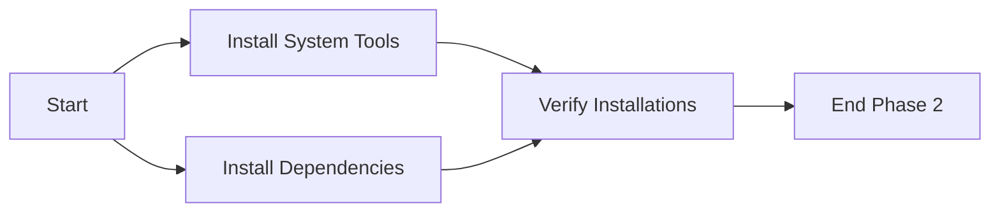

# Quick Project Setup Workflow

**Workflow ID:** `quick-setup`
**Estimated Time:** 5-10 minutes
**Automation Level:** Full
**Agents Required:** 6-8

---

## Overview

End-to-end development environment setup for new team members or fresh clones. Gets developers from zero to productive in minutes.

---

## Workflow Phases

### Phase 1: Analyze (2-3 minutes)

**Agents:**
- `project-analyzer` (Primary)
- `dependency-detector` (Parallel)

**Tasks:**
1. Scan project directory for package files (package.json, requirements.txt, etc.)
2. Detect tech stack (languages, frameworks, databases)
3. Identify build system and scripts
4. Map dependency graph
5. Detect platform requirements (OS, architecture)
6. Check for existing Docker/env configs

**Outputs:**
- `project-analysis.json` - Complete tech stack analysis
- `dependency-graph.json` - Dependency tree with versions
- `missing-tools.json` - Required but missing tools

**Success Criteria:**
- All package files parsed successfully
- Tech stack detected with 95%+ confidence
- No critical parsing errors

---

### Phase 2: Install (2-4 minutes)

**Agents:**
- `dependency-installer` (Primary)
- `tool-installer` (Parallel)

**Tasks:**
1. Install missing system dependencies (Docker, Node, Python, etc.)
2. Install project dependencies (npm install, pip install, etc.)
3. Verify version compatibility
4. Resolve dependency conflicts
5. Run security scans on dependencies
6. Update lock files if needed

**Outputs:**
- `installation-report.json` - What was installed
- `dependency-updates.log` - Versions updated
- `security-scan.json` - Vulnerability report

**Success Criteria:**
- All dependencies installed without errors
- No critical vulnerabilities detected
- Lock files generated/updated

**Parallel Execution:**


---

### Phase 3: Configure (1-2 minutes)

**Agents:**
- `docker-generator` (Primary)
- `env-template-generator` (Parallel)
- `ide-configurator` (Parallel)
- `config-fixer` (On-demand)

**Tasks:**
1. Generate Dockerfile with multi-stage build
2. Create docker-compose.yml with all services
3. Generate .dockerignore
4. Create .env.example template
5. Set up VSCode/Cursor settings
6. Configure pre-commit hooks
7. Generate README setup section

**Outputs:**
```
configuration-files/
├── Dockerfile
├── docker-compose.yml
├── .dockerignore
├── .env.example
├── .vscode/
│   ├── settings.json
│   ├── extensions.json
│   ├── tasks.json
│   └── launch.json
├── .husky/
│   ├── pre-commit
│   └── pre-push
└── SETUP.md
```

**Success Criteria:**
- All configuration files generated
- No syntax errors in configs
- Configs match detected tech stack

---

### Phase 4: Verify (1-2 minutes)

**Agents:**
- `environment-validator` (Primary)
- `build-verifier` (Secondary)

**Tasks:**
1. Validate all dependencies installed
2. Check tool versions match requirements
3. Verify environment variables documented
4. Test Docker build (if enabled)
5. Attempt to run build command
6. Run smoke tests
7. Generate verification report

**Outputs:**
- `verification-report.json` - Pass/fail for each check
- `build-test.log` - Build output
- `recommendations.md` - Suggested improvements

**Verification Checks:**
```typescript
interface VerificationChecks {
  runtime: {
    node?: string;      // "✓ Node.js 20.10.0"
    python?: string;    // "✓ Python 3.11.5"
    go?: string;        // "✓ Go 1.21.3"
  };
  dependencies: {
    installed: number;  // Count of installed packages
    missing: number;    // Should be 0
    conflicts: number;  // Should be 0
  };
  docker: {
    dockerInstalled: boolean;
    composeInstalled: boolean;
    buildSucceeds: boolean;
  };
  build: {
    canBuild: boolean;
    canTest: boolean;
    canStart: boolean;
  };
  ide: {
    vsCodeConfigured: boolean;
    extensionsDocumented: boolean;
  };
}
```

**Success Criteria:**
- 90%+ checks passing
- Build succeeds (or clearly documented why not)
- No critical failures

---

## Workflow Orchestration

### Agent Communication

```typescript
interface PhaseTransition {
  from: string;
  to: string;
  handoff: {
    data: object;        // Outputs from previous phase
    status: "success" | "warning" | "error";
    blockers: string[];  // Issues preventing next phase
  };
}
```

### Error Handling

**Recoverable Errors:**
- Missing optional dependencies → Continue with warning
- Docker not installed → Skip containerization, continue
- IDE not detected → Skip IDE config, continue

**Blocking Errors:**
- No package files found → Cannot determine stack
- Critical dependency conflict → Cannot proceed safely
- Build system not detected → Cannot verify setup

**Recovery Strategy:**
1. Log error with context
2. Attempt auto-fix if available
3. Provide manual fix instructions
4. Mark step as "partial" if some succeeded
5. Continue to next phase if non-critical

---

## Usage Examples

### Command Line
```bash
# Full setup
claude bootstrap:setup

# Setup with options
claude bootstrap:setup --skip-docker --ide=cursor

# Resume from specific phase
claude bootstrap:setup --from=configure

# Dry run (analyze only)
claude bootstrap:setup --dry-run
```

### Programmatic
```typescript
import { runWorkflow } from "@claude/orchestration";

const result = await runWorkflow("quick-setup", {
  config: {
    autoSetup: true,
    dockerEnabled: true,
    ideTarget: "both",
    preCommitHooks: true,
  },
  onProgress: (phase, progress) => {
    console.log(`${phase}: ${progress}%`);
  },
});

console.log(result.summary);
```

---

## Output Summary

### Success Message
```
✅ Development environment setup complete!

📊 Summary:
   • Tech Stack: Next.js 14 + FastAPI + PostgreSQL
   • Dependencies: 247 installed (0 vulnerabilities)
   • Docker: ✓ Configured (multi-stage build)
   • IDE: ✓ VSCode + Cursor configured
   • Build: ✓ Verified (23.4s)

🚀 Next Steps:
   1. Copy .env.example to .env and fill in secrets
   2. Run: docker-compose up -d
   3. Run: npm run dev
   4. Open: http://localhost:3000

📚 Documentation: ./SETUP.md
```

### Partial Success Message
```
⚠️  Setup completed with warnings

✅ Completed:
   • Dependencies installed
   • Configuration files generated

⚠️  Warnings:
   • Docker not installed (skipped containerization)
   • 3 optional dependencies missing

❌ Failed:
   • Build verification failed (see build-test.log)

🔧 Fixes Available:
   1. Install Docker: brew install docker
   2. Fix build: npm install --save-dev missing-package

Run: claude bootstrap:troubleshoot
```

---

## Performance Optimization

### Parallel Execution
- Phase 1: Run project-analyzer + dependency-detector simultaneously
- Phase 2: Install system tools + project dependencies in parallel
- Phase 3: Generate all configs (Docker, env, IDE) in parallel

### Caching
- Cache dependency resolution between runs
- Reuse Docker layer cache
- Cache tool version lookups

### Estimated Time Breakdown
```
Phase 1 (Analyze):    30-90 seconds
Phase 2 (Install):    60-180 seconds (depends on package count)
Phase 3 (Configure):  20-60 seconds
Phase 4 (Verify):     30-90 seconds
-----------------------------------
Total:                140-420 seconds (2.5-7 minutes)
```

---

## Integration Points

### Jira Integration
- Create setup task when issue transitions to "In Progress"
- Comment on issue with setup status
- Update issue fields with environment info

### Git Integration
- Commit generated configs to branch
- Create .gitignore entries for secrets
- Add setup instructions to PR description

### Slack/Notification Integration
- Notify team when new member completes setup
- Alert if setup fails with errors
- Share setup metrics to team channel

---

## Workflow State Management

Stored in: `.claude/orchestration/state/bootstrap-quick-setup.json`

```typescript
interface WorkflowState {
  workflowId: "quick-setup";
  status: "pending" | "running" | "completed" | "failed";
  currentPhase: number;
  phases: {
    analyze: { status: string; duration: number; outputs: string[] };
    install: { status: string; duration: number; outputs: string[] };
    configure: { status: string; duration: number; outputs: string[] };
    verify: { status: string; duration: number; outputs: string[] };
  };
  startedAt: string;
  completedAt: string | null;
  totalDuration: number;
}
```

---

## Testing & Validation

### Pre-flight Checks
- Project directory exists and is accessible
- User has write permissions
- Internet connection available (for package installs)
- Sufficient disk space (minimum 500MB)

### Post-completion Tests
- All generated files are valid (syntax check)
- Build succeeds from clean state
- Docker image builds successfully
- Environment variables documented match code usage

---

## Rollback Strategy

If setup fails critically:
1. Save state to `.claude/orchestration/rollback/`
2. Restore original package files if modified
3. Remove generated config files (with confirmation)
4. Provide detailed error report
5. Offer to retry with different options

**Rollback Command:**
```bash
claude bootstrap:rollback --to=before-setup
```
