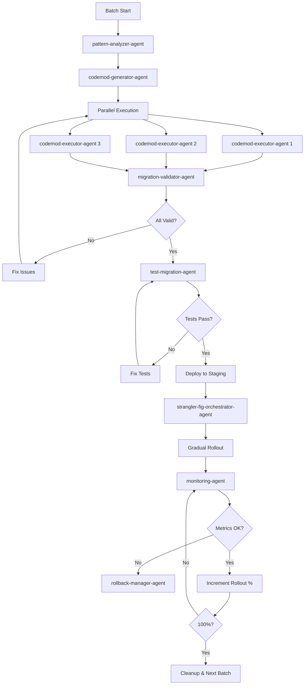

# Incremental Codebase Migration Workflow

**Purpose:** Migrate entire codebase incrementally using strangler fig pattern

**Duration:** Days to weeks (depending on codebase size)
**Agents Required:** 10-13
**Complexity:** Very Hard

## Workflow Overview

```
┌─────────────────────────────────────────────────────────────────────┐
│             INCREMENTAL CODEBASE MIGRATION WORKFLOW                  │
│                  "Strangler Fig Pattern"                             │
├─────────────────────────────────────────────────────────────────────┤
│                                                                      │
│   ANALYZE → PRIORITIZE → SETUP → BATCH-MIGRATE → VALIDATE → DEPLOY │
│                ↑                                            │        │
│                │                                            │        │
│                └────────────── ITERATE ─────────────────────┘        │
│                                                                      │
└─────────────────────────────────────────────────────────────────────┘
```

## Phase 1: Global Analysis (30-60 minutes)

**Lead Agent:** pattern-analyzer-agent (opus)

**Tasks:**
1. Scan entire codebase
2. Identify all migration candidates
3. Analyze dependencies between files
4. Build migration dependency graph
5. Estimate total effort

**Sub-Agents:**
- `pattern-analyzer-agent`: Scan codebase patterns
- `breaking-change-detector-agent`: Identify breaking changes
- `dependency-mapper-agent`: Build dependency graph

**Output:**
```typescript
{
  scope: {
    totalFiles: 347,
    migrableFiles: 284,
    breakingChanges: 23,
    estimatedDuration: "2-3 weeks"
  },

  fileGroups: [
    {
      name: "Leaf Components (no dependencies)",
      files: 120,
      difficulty: "easy",
      priority: 1
    },
    {
      name: "Intermediate Components",
      files: 98,
      difficulty: "medium",
      priority: 2
    },
    {
      name: "Core Components (many dependents)",
      files: 45,
      difficulty: "hard",
      priority: 3
    },
    {
      name: "Root/Entry Components",
      files: 21,
      difficulty: "medium",
      priority: 4
    }
  ],

  dependencyGraph: {
    nodes: 284,
    edges: 892,
    criticalPath: ["App.jsx", "Router.jsx", "Layout.jsx"]
  }
}
```

## Phase 2: Prioritization & Planning (15-30 minutes)

**Lead Agent:** strangler-fig-orchestrator-agent (opus)

**Tasks:**
1. Order files by dependency (leaf-first)
2. Group files into migration batches
3. Identify critical path components
4. Plan adapter layer strategy
5. Define rollout phases

**Sub-Agents:**
- `strangler-fig-orchestrator-agent`: Plan incremental strategy
- `architecture-planner-agent`: Design adapter layer

**Migration Plan:**
```yaml
strategy: strangler-fig
approach: component-based

batches:
  batch_1_leaf_components:
    files: 50
    dependencies: 0
    risk: low
    duration: 2_days
    canRunInParallel: true

  batch_2_intermediate:
    files: 40
    dependencies: batch_1
    risk: medium
    duration: 3_days
    canRunInParallel: true

  batch_3_core:
    files: 25
    dependencies: [batch_1, batch_2]
    risk: high
    duration: 4_days
    canRunInParallel: false

  batch_4_root:
    files: 15
    dependencies: [batch_1, batch_2, batch_3]
    risk: medium
    duration: 2_days
    canRunInParallel: false

adapter_strategy:
  type: component-based
  featureFlags: true
  shadowMode: true
  dualRender: true

rollout:
  phase_1: 10% (internal users)
  phase_2: 25% (beta users)
  phase_3: 50% (general users)
  phase_4: 100% (all users)
```

## Phase 3: Adapter Setup (1-2 hours)

**Lead Agent:** strangler-fig-orchestrator-agent (opus)

**Tasks:**
1. Create component adapter wrapper
2. Set up feature flag system
3. Implement monitoring
4. Create rollback mechanisms
5. Deploy adapter (0% new components)

**Sub-Agents:**
- `adapter-builder-agent`: Build adapter layer
- `feature-flag-manager-agent`: Set up feature flags
- `monitoring-agent`: Configure monitoring

**Adapter Implementation:**
```typescript
// ComponentAdapter.tsx
import { lazy, Suspense } from 'react';
import { useFeatureFlag } from '@/lib/feature-flags';
import { trackComponentRender } from '@/lib/monitoring';

interface AdapterProps {
  componentName: string;
  oldPath: string;
  newPath: string;
  fallback?: React.ReactNode;
}

export function ComponentAdapter({
  componentName,
  oldPath,
  newPath,
  fallback = <Loading />
}: AdapterProps) {
  const useNewComponent = useFeatureFlag(`new-${componentName}`, {
    defaultValue: false,
    rolloutPercentage: 0
  });

  const OldComponent = lazy(() => import(oldPath));
  const NewComponent = lazy(() => import(newPath));

  const Component = useNewComponent ? NewComponent : OldComponent;

  useEffect(() => {
    trackComponentRender(componentName, useNewComponent ? 'new' : 'old');
  }, [componentName, useNewComponent]);

  return (
    <Suspense fallback={fallback}>
      <Component {...props} />
    </Suspense>
  );
}

// Usage in router:
<Route path="/profile" element={
  <ComponentAdapter
    componentName="UserProfile"
    oldPath="./old/UserProfile"
    newPath="./new/UserProfile"
  />
} />
```

## Phase 4: Batch Migration (Iterative)

**Lead Agent:** codemod-executor-agent (sonnet)

**Tasks per Batch:**
1. Select next batch (up to 20 files)
2. Generate codemods for batch
3. Execute dry-run on all files
4. Validate transformations
5. Apply migrations
6. Run tests
7. Fix failures
8. Deploy with feature flags at 0%

**Sub-Agents (per batch):**
- `pattern-analyzer-agent`: Analyze batch patterns
- `codemod-generator-agent`: Generate codemods
- `codemod-executor-agent`: Execute transformations
- `test-migration-agent`: Migrate and run tests
- `migration-validator-agent`: Validate results

**Batch Execution Flow:**
```bash
# Batch 1: Leaf Components (50 files)
# Duration: 2 days

Day 1:
  Morning:
    - Analyze 50 leaf components
    - Generate codemods
    - Dry-run on all files
    - Review and adjust

  Afternoon:
    - Apply migrations (25 files)
    - Run tests
    - Fix failures
    - Commit batch 1a

Day 2:
  Morning:
    - Apply migrations (25 files)
    - Run tests
    - Fix failures
    - Commit batch 1b

  Afternoon:
    - Integration testing
    - Deploy with feature flags (0%)
    - Monitor for issues
    - Prepare batch 2

# Batch Progress Report
Batch 1: ████████████████████ 100% (50/50 files)
  ✅ Migrated: 50
  ❌ Failed: 0
  ⚠️  Manual: 3
  ✓ Tests: 487/487 passing
  Duration: 1.5 days
```

## Phase 5: Validation & Testing (Per Batch)

**Lead Agent:** migration-validator-agent (sonnet)

**Tasks:**
1. Run full test suite
2. Check code coverage
3. Validate types (TypeScript)
4. Run linting
5. Performance testing
6. Visual regression testing (if UI)

**Sub-Agents:**
- `migration-validator-agent`: Validate correctness
- `test-migration-agent`: Run test suite
- `regression-detector-agent`: Detect regressions

**Validation Results:**
```yaml
batch_1_validation:
  syntax: passed
  types: passed
  tests:
    unit: 487/487 passed
    integration: 45/45 passed
    e2e: 12/12 passed
  linting: passed (3 warnings)
  coverage: 94% (maintained)
  performance:
    build_time: 12.3s (vs 12.1s baseline, +1.6%)
    bundle_size: 485KB (vs 492KB baseline, -1.4% ✓)
  visual_regression: 0 differences

  status: APPROVED FOR ROLLOUT
```

## Phase 6: Gradual Rollout (Per Batch)

**Lead Agent:** strangler-fig-orchestrator-agent (opus)

**Tasks:**
1. Enable feature flag at 10%
2. Monitor metrics for 24-48 hours
3. Increment to 25%
4. Monitor
5. Increment to 50%
6. Monitor
7. Increment to 100%
8. Stabilize for 7 days
9. Remove adapter and old code

**Sub-Agents:**
- `feature-flag-manager-agent`: Manage rollout
- `monitoring-agent`: Track metrics
- `rollback-manager-agent`: Handle rollbacks if needed

**Rollout Timeline:**
```yaml
batch_1_rollout:
  phase_1:
    percentage: 10
    start: 2024-01-15 09:00
    duration: 48_hours
    criteria: internal_users
    metrics:
      error_rate: 0.05% (vs 0.08% old, BETTER ✓)
      latency_p95: 145ms (vs 168ms old, BETTER ✓)
      user_satisfaction: 4.8/5
    status: APPROVED

  phase_2:
    percentage: 25
    start: 2024-01-17 09:00
    duration: 72_hours
    criteria: beta_users
    metrics:
      error_rate: 0.06%
      latency_p95: 149ms
      user_satisfaction: 4.7/5
    status: APPROVED

  phase_3:
    percentage: 50
    start: 2024-01-20 09:00
    duration: 96_hours
    metrics:
      error_rate: 0.07%
      latency_p95: 152ms
    status: APPROVED

  phase_4:
    percentage: 100
    start: 2024-01-24 09:00
    duration: 168_hours (7 days stabilization)
    metrics:
      error_rate: 0.06%
      latency_p95: 148ms
    status: STABLE

  cleanup:
    date: 2024-01-31
    actions:
      - Remove component adapter
      - Delete old component files
      - Update imports
      - Remove feature flags
    status: COMPLETED
```

## Phase 7: Iteration & Progress Tracking

**Lead Agent:** migration-reporter-agent (haiku)

**Tasks:**
1. Track progress across all batches
2. Generate daily reports
3. Update stakeholders
4. Adjust strategy based on learnings

**Progress Dashboard:**
```
┌─────────────────────────────────────────────────────────────────────┐
│                    MIGRATION PROGRESS DASHBOARD                      │
├─────────────────────────────────────────────────────────────────────┤
│                                                                      │
│   Overall Progress: ████████░░░░░░░░░░ 40% (120/284 files)         │
│   Estimated Completion: 2024-02-15 (12 days remaining)              │
│                                                                      │
│   Batch Status:                                                      │
│   ✅ Batch 1 (Leaf):         ████████████████████ 100% DEPLOYED    │
│   ✅ Batch 2 (Intermediate): ████████████████████ 100% DEPLOYED    │
│   🔄 Batch 3 (Core):         ██████████░░░░░░░░░  50% IN PROGRESS  │
│   ⏳ Batch 4 (Root):         ░░░░░░░░░░░░░░░░░░░░   0% PENDING     │
│                                                                      │
│   Metrics:                                                           │
│   • Files Migrated: 120/284 (42%)                                   │
│   • Tests Passing: 1,247/1,247 (100%)                               │
│   • Coverage: 94% (maintained)                                       │
│   • Regressions: 0                                                   │
│   • Rollbacks: 0                                                     │
│                                                                      │
│   New vs Old System:                                                 │
│   • Error Rate: 0.06% vs 0.12% (50% BETTER ✓)                      │
│   • Latency P95: 148ms vs 185ms (20% FASTER ✓)                     │
│   • Bundle Size: 485KB vs 562KB (14% SMALLER ✓)                    │
│                                                                      │
└─────────────────────────────────────────────────────────────────────┘
```

## Rollback Strategy

**Automatic Rollback Triggers:**
```yaml
rollback_conditions:
  - error_rate > baseline * 1.5
  - latency_p95 > baseline * 1.3
  - test_failure_rate > 5%
  - crash_loop_detected: true
  - critical_bug_reported: true

rollback_procedure:
  1. Set all feature flags to 0%
  2. Verify old system handling 100% traffic
  3. Notify team
  4. Create incident report
  5. Analyze root cause
  6. Fix issues
  7. Resume migration after validation
```

## Success Criteria

```yaml
migration_complete:
  - all_files_migrated: 284/284
  - all_tests_passing: true
  - coverage_maintained: >= 90%
  - production_stable: 7_days
  - feature_flags_removed: true
  - old_code_deleted: true
  - documentation_updated: true
  - team_trained: true
```

## Command Usage

```bash
# Start incremental migration
/migrate:incremental \
  --from=react-class \
  --to=react-hooks \
  --strategy=strangler-fig \
  --batch-size=20

# Check status
/migrate:status

# Resume after pause
/migrate:incremental --resume

# Rollback batch
/migrate:rollback --batch=3

# Generate report
/migrate:report --format=dashboard
```

## Estimated Resource Usage

```yaml
total_duration: 2-3 weeks
agents_per_batch: 8-10
total_agent_instances: 100+
estimated_cost: $50-100 (full migration)
tokens: ~2M tokens
```

## Agent Orchestration (Per Batch)


