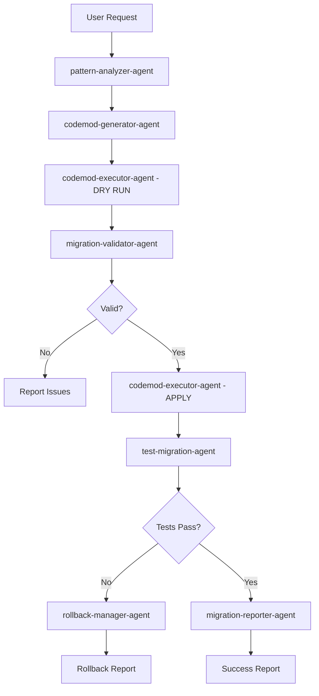

# Single File Migration Workflow

**Purpose:** Migrate a single file with comprehensive validation and rollback capability

**Duration:** 5-15 minutes
**Agents Required:** 6-8
**Complexity:** Medium

## Workflow Overview

```
┌─────────────────────────────────────────────────────────────────────┐
│                   SINGLE FILE MIGRATION WORKFLOW                     │
├─────────────────────────────────────────────────────────────────────┤
│                                                                      │
│   ANALYZE → GENERATE → DRY-RUN → VALIDATE → APPLY → TEST           │
│                                                                      │
└─────────────────────────────────────────────────────────────────────┘
```

## Phase 1: Analysis (2-3 minutes)

**Lead Agent:** pattern-analyzer-agent (sonnet)

**Tasks:**
1. Read target file
2. Identify framework/library patterns
3. Detect API usage
4. Analyze dependencies
5. Identify potential breaking changes

**Sub-Agents:**
- `pattern-analyzer-agent`: Scan for migration patterns
- `breaking-change-detector-agent`: Identify breaking changes

**Output:**
```typescript
{
  file: "src/components/UserProfile.jsx",
  framework: "react",
  patterns: [
    {
      type: "class-component",
      occurrences: 1,
      lines: [10-85],
      features: ["state", "lifecycle", "refs"]
    }
  ],
  breakingChanges: [],
  dependencies: ["react", "prop-types"],
  migrationDifficulty: "medium",
  estimatedTime: "8 minutes"
}
```

## Phase 2: Codemod Generation (3-5 minutes)

**Lead Agent:** codemod-generator-agent (opus)

**Tasks:**
1. Select appropriate codemod template
2. Generate custom transformation rules
3. Handle edge cases specific to file
4. Create test fixtures
5. Validate codemod syntax

**Sub-Agents:**
- `codemod-generator-agent`: Generate transformation
- `api-mapper-agent`: Map old API to new API
- `type-inference-agent`: Infer TypeScript types (if needed)

**Output:**
```typescript
{
  codemod: {
    path: ".migration/codemods/UserProfile-class-to-hooks.ts",
    type: "react-class-to-hooks",
    parser: "tsx",
    testCases: 5
  },
  apiMappings: [
    { from: "this.setState", to: "setState" },
    { from: "componentDidMount", to: "useEffect(() => {}, [])" },
    { from: "this.state.count", to: "count" }
  ]
}
```

## Phase 3: Dry Run (1-2 minutes)

**Lead Agent:** codemod-executor-agent (sonnet)

**Tasks:**
1. Execute codemod in dry-run mode
2. Generate diff preview
3. Identify potential issues
4. Validate syntax of transformed code

**Sub-Agents:**
- `codemod-executor-agent`: Run transformation
- `migration-validator-agent`: Validate output

**Output:**
```diff
--- src/components/UserProfile.jsx
+++ src/components/UserProfile.jsx (migrated)
@@ -1,45 +1,28 @@
-import React, { Component } from 'react';
+import React, { useState, useEffect, useRef } from 'react';
 import PropTypes from 'prop-types';

-class UserProfile extends Component {
-  constructor(props) {
-    super(props);
-    this.state = {
-      user: null,
-      loading: true
-    };
-    this.containerRef = React.createRef();
-  }
+function UserProfile(props) {
+  const [user, setUser] = useState(null);
+  const [loading, setLoading] = useState(true);
+  const containerRef = useRef(null);

-  componentDidMount() {
+  useEffect(() => {
     this.fetchUser();
-  }
+  }, []);

-  fetchUser = async () => {
+  const fetchUser = async () => {
-    this.setState({ loading: true });
+    setLoading(true);
     const data = await api.getUser(this.props.userId);
-    this.setState({ user: data, loading: false });
+    setUser(data);
+    setLoading(false);
   };

-  render() {
-    const { user, loading } = this.state;
     return (
       <div ref={this.containerRef}>
         {loading ? <Spinner /> : <User data={user} />}
       </div>
     );
-  }
 }
```

## Phase 4: Validation (2-3 minutes)

**Lead Agent:** migration-validator-agent (sonnet)

**Tasks:**
1. Parse transformed code (syntax check)
2. Run TypeScript compiler (if TypeScript)
3. Run ESLint
4. Check for runtime issues
5. Verify imports are correct

**Sub-Agents:**
- `migration-validator-agent`: Validate correctness
- `type-inference-agent`: Validate types

**Validation Checks:**
```yaml
syntax_check:
  status: passed
  parser: babel
  errors: 0

type_check:
  status: passed
  compiler: typescript
  errors: 0
  warnings: 1
    - "Unused import: PropTypes (can be removed)"

linting:
  status: passed
  linter: eslint
  errors: 0
  warnings: 0

imports:
  status: passed
  added: [useState, useEffect, useRef]
  removed: [Component]
  updated: []

runtime_safety:
  status: passed
  checks:
    - hooks_rules: passed
    - dependency_arrays: passed
    - ref_usage: passed
```

## Phase 5: Apply Migration (30 seconds)

**Lead Agent:** codemod-executor-agent (sonnet)

**Tasks:**
1. Create git backup/checkpoint
2. Apply codemod transformation
3. Format code (prettier/eslint --fix)
4. Update related files (if needed)

**Sub-Agents:**
- `codemod-executor-agent`: Execute transformation
- `rollback-manager-agent`: Create restore point

**Actions:**
```bash
# 1. Create checkpoint
git add src/components/UserProfile.jsx
git stash push -m "pre-migration-checkpoint-UserProfile"

# 2. Apply codemod
jscodeshift -t .migration/codemods/UserProfile-class-to-hooks.ts \
  src/components/UserProfile.jsx

# 3. Format
prettier --write src/components/UserProfile.jsx
eslint --fix src/components/UserProfile.jsx

# 4. Git status
git diff src/components/UserProfile.jsx
```

## Phase 6: Test & Verify (2-3 minutes)

**Lead Agent:** test-migration-agent (sonnet)

**Tasks:**
1. Run unit tests for migrated component
2. Run integration tests
3. Check test coverage
4. Verify no regressions

**Sub-Agents:**
- `test-migration-agent`: Run tests
- `migration-validator-agent`: Verify results

**Test Results:**
```yaml
unit_tests:
  total: 8
  passed: 8
  failed: 0
  duration: 1.2s

integration_tests:
  total: 3
  passed: 3
  failed: 0
  duration: 2.5s

coverage:
  statements: 95%
  branches: 90%
  functions: 100%
  lines: 95%
  delta: +2% (improved!)

regressions:
  detected: 0
  warnings: 0
```

## Phase 7: Report & Cleanup (30 seconds)

**Lead Agent:** migration-reporter-agent (haiku)

**Tasks:**
1. Generate migration report
2. Document manual changes (if any)
3. Update migration progress
4. Clean up temporary files

**Output:**
```markdown
# Migration Report: UserProfile.jsx

**Status:** ✅ SUCCESS
**Duration:** 8 minutes 45 seconds
**Complexity:** Medium

## Summary
- Migrated React class component to functional component with hooks
- Transformed 85 lines to 56 lines (-34%)
- All tests passing (11/11)
- Coverage improved: 93% → 95%

## Changes
- ✅ `state` → `useState` (2 state variables)
- ✅ `componentDidMount` → `useEffect` with empty deps
- ✅ `createRef` → `useRef`
- ✅ Instance methods → function declarations
- ✅ Updated imports

## Breaking Changes
None detected

## Manual Actions Required
None

## Next Steps
- Commit changes: `git add . && git commit -m "Migrate UserProfile to hooks"`
- Run full test suite: `npm test`
- Deploy to staging for verification
```

## Rollback Procedure

If migration fails at any stage:

```bash
# Restore from checkpoint
git stash pop

# Or if already committed
git revert HEAD

# Verify restoration
npm test
```

## Success Criteria

```yaml
migration_success:
  - syntax_valid: true
  - types_valid: true
  - tests_passing: true
  - no_regressions: true
  - code_formatted: true
  - imports_updated: true
```

## Command Usage

```bash
# Run single file migration
/migrate:file src/components/UserProfile.jsx \
  --from=react-class \
  --to=react-hooks \
  --dry-run=true

# Apply migration
/migrate:file src/components/UserProfile.jsx \
  --from=react-class \
  --to=react-hooks \
  --apply=true

# Rollback if needed
/migrate:rollback UserProfile.jsx
```

## Agent Orchestration



## Estimated Resource Usage

```yaml
duration: 8-12 minutes
agents: 6-8 sub-agents
cost: $0.15 - $0.30
tokens: ~50K tokens
```
