# Jira Orchestrator Plugin

<div align="center">


**Intelligent Jira issue orchestration with multi-agent workflows**

Transform Jira issues into fully orchestrated development workflows with automatic triage, code review, testing, and pull request creation.

[Features](#features) • [Installation](#installation) • [Commands](#commands) • [Agents](#agents) • [Workflows](#workflows)

</div>

---

## Overview

The **Jira Orchestrator** is a Claude Code plugin that provides intelligent, automated orchestration of Jira issues from detection through deployment. It automatically triages issues, coordinates specialized sub-agents through a mandatory 6-phase protocol, ensures quality gates, and handles the entire development lifecycle with full Confluence integration.

### Key Capabilities

- **Automatic Jira Detection**: Detects Jira issue keys (e.g., PROJ-123) in conversations and suggests orchestration
- **Intelligent Triage**: Analyzes issue complexity, priority, and expertise requirements
- **Multi-Agent Coordination**: Orchestrates 11 specialized sub-agents in parallel where possible
- **Confluence Integration**: Bidirectional sync between Jira issues and Confluence documentation
- **Quality Gates**: Enforces code review before PR creation
- **Full Automation**: From issue fetch to PR creation, documentation, and Jira/Confluence updates
- **6-Phase Protocol**: EXPLORE → PLAN → CODE → TEST → FIX → DOCUMENT

---

## Features

### Automated Workflow Orchestration

- **Context-Aware Issue Detection**: Recognizes Jira issue keys in natural language and suggests appropriate workflows
- **Smart Triage System**: Classifies issues by type (bug/feature/epic), complexity, and required expertise
- **Parallel Agent Execution**: Runs multiple specialized agents concurrently for faster delivery
- **Quality Enforcement**: Blocking code review gate prevents PR creation without approval
- **Session Management**: Tracks orchestration state, supports pause/resume, and manages agent coordination

### Development Intelligence

- **Requirement Analysis**: Extracts acceptance criteria, story points, and business context from Jira
- **Codebase Understanding**: Analyzes existing code to understand architecture and patterns
- **Test Strategy**: Automatically generates comprehensive test plans and implements tests
- **Code Review**: AI-powered code review identifies issues, suggests improvements, ensures standards
- **Documentation Generation**: Creates ADRs, updates README files, syncs to Obsidian vault

### Integration Features

- **Jira Integration**: Full CRUD operations, status transitions, comments, and issue linking via Atlassian MCP
- **Confluence Integration**: Read requirements, create design docs, generate API docs, write runbooks, sync with Jira
- **GitHub Integration**: Creates pull requests, manages branches, references issues in commits
- **Obsidian Integration**: Stores documentation, learnings, and ADRs in personal knowledge vault
- **Context7 Support**: Fetches library documentation for informed implementation decisions

---

## Installation

### Quick Start

The Jira Orchestrator includes an **automated installation system** that configures everything for you:

```bash
# Run the installation script
bash scripts/install.sh

# Set environment variables (shown by installer)
export JIRA_API_TOKEN="your_token_here"
export JIRA_SITE_URL="https://yourcompany.atlassian.net"
export JIRA_USER_EMAIL="your.email@company.com"

# Run the interactive setup wizard
claude /jira:setup
```

### Detailed Installation

For complete installation instructions, see:

- **[INSTALLATION.md](INSTALLATION.md)** - Complete installation guide with troubleshooting
- **[INSTALL-CHECKLIST.md](INSTALL-CHECKLIST.md)** - Step-by-step installation checklist
- **[scripts/README.md](scripts/README.md)** - Installation scripts documentation

### Prerequisites

- **Claude Code CLI**: Latest version with plugin support
- **Node.js & npm**: For running the Atlassian MCP server
- **Atlassian Account**: Jira access with API token
- **Git**: For cloning and updates

### Automatic Installation Features

The installation system automatically:

✅ Creates required directories (sessions/, logs/, cache/)
✅ Adds the Atlassian MCP server to Claude Code
✅ Verifies environment variables
✅ Checks plugin structure
✅ Makes hook scripts executable
✅ Tests Jira connection
✅ Provides detailed troubleshooting guidance

### Environment Variables

The plugin requires three environment variables:

```bash
# Your Jira API token (generate at: https://id.atlassian.com/manage-profile/security/api-tokens)
export JIRA_API_TOKEN="your_token_here"

# Your Jira site URL (no trailing slash)
export JIRA_SITE_URL="https://yourcompany.atlassian.net"

# Your Jira account email
export JIRA_USER_EMAIL="your.email@company.com"
```

Add these to your shell profile (`~/.bashrc`, `~/.zshrc`, etc.) for persistence.

### Atlassian MCP Server

The installation automatically adds the Atlassian MCP server:

```bash
# Automatically configured during installation:
claude mcp add atlassian -- npx -y mcp-remote https://mcp.atlassian.com/v1/sse
```

No manual MCP configuration needed!

### Verification

After installation, verify everything is working:

```bash
# Run post-install verification
bash scripts/post-install.sh

# Run interactive setup wizard
claude /jira:setup

# Test with a real issue
claude /jira:triage YOUR-ISSUE-KEY
```

### Installation Scripts

| Script | Purpose |
|--------|---------|
| `install.sh` | Main installation - sets up MCP server and directories |
| `post-install.sh` | Verification - checks everything is working |
| `check-mcp.sh` | Verify Atlassian MCP server is installed |
| `check-env.sh` | Check environment variables are set |
| `verify-plugin.sh` | Verify plugin structure is complete |

See [scripts/README.md](scripts/README.md) for detailed documentation.

### Troubleshooting

If installation fails:

1. **Check logs**: `cat logs/install-*.log`
2. **Run diagnostics**: `bash scripts/check-*.sh`
3. **Review guide**: See [INSTALLATION.md](INSTALLATION.md) troubleshooting section
4. **Run setup wizard**: `claude /jira:setup`

Common issues and solutions are documented in [INSTALLATION.md](INSTALLATION.md).

The plugin includes an `.mcp.json` file that configures the Atlassian MCP server. Claude Code will automatically load this configuration.

4. **Verify installation:**

```bash
# Start Claude Code
claude

# Check if commands are available
/jira:help
```

### MCP Server Configuration

The plugin automatically configures the Atlassian MCP server via `.mcp.json`:

```json
{
  "mcpServers": {
    "atlassian": {
      "command": "npx",
      "args": ["-y", "mcp-remote", "https://mcp.atlassian.com/v1/sse"],
      "env": {
        "ATLASSIAN_API_TOKEN": "${ATLASSIAN_API_TOKEN}",
        "ATLASSIAN_EMAIL": "${ATLASSIAN_EMAIL}",
        "ATLASSIAN_SITE_URL": "${ATLASSIAN_SITE_URL}"
      }
    }
  }
}
```

This provides access to Jira tools:
- `jira_get_issue`: Fetch issue details
- `jira_create_issue`: Create new issues
- `jira_update_issue`: Update issue fields
- `jira_transition_issue`: Change issue status
- `jira_add_comment`: Post comments
- `jira_link_issues`: Create issue links
- `jira_search_issues`: JQL-based search

---

## Commands

The plugin provides 8 slash commands for Jira orchestration:

### `/jira:work`

**Start orchestrated work on a Jira issue with full 6-phase protocol.**

```bash
/jira:work PROJ-123
```

**What it does:**
1. Fetches issue details from Jira
2. Transitions issue to "In Progress"
3. Creates orchestration plan based on issue type
4. Executes 6-phase protocol (EXPLORE → PLAN → CODE → TEST → FIX → DOCUMENT)
5. Spawns 3-13 specialized sub-agents
6. Creates pull request with acceptance criteria
7. Updates Jira with PR link and status

**Use cases:**
- Working on any Jira issue (bug, feature, task)
- Full end-to-end automated implementation
- Ensuring consistent quality and testing

**Example:**
```bash
# Work on a bug
/jira:work BUG-456

# Work on a feature story
/jira:work FEAT-123

# Work on a technical task
/jira:work TASK-789
```

---

### `/jira:status`

**Check orchestration status and sub-agent progress.**

```bash
/jira:status [ISSUE-KEY] --format=dashboard --depth=detailed
```

**Parameters:**
- `ISSUE-KEY` (optional): Specific issue to track
- `--format`: Output format (`dashboard` | `table` | `json`)
- `--depth`: Detail level (`summary` | `detailed` | `comprehensive`)
- `--filter`: Filter sessions (e.g., `phase:CODE`, `status:active`)
- `--follow`: Real-time updates (`true` | `false`)

**What it displays:**
- Current orchestration phase and progress
- Active sub-agents and their tasks
- Blockers and issues
- Session statistics (agents deployed, tasks completed, time elapsed)
- Recent activity log

**Example:**
```bash
# Status of specific issue
/jira:status PROJ-123

# All active orchestrations
/jira:status --filter=status:active

# Real-time monitoring
/jira:status PROJ-456 --follow=true
```

---

### `/jira:sync`

**Sync local orchestration state with Jira.**

```bash
/jira:sync [ISSUE-KEY]
```

**What it does:**
- Fetches latest issue details from Jira
- Updates local session state
- Syncs status transitions
- Resolves conflicts between local and remote state

**Use cases:**
- Resume work after interruption
- Sync changes made in Jira web UI
- Resolve state conflicts

**Example:**
```bash
# Sync specific issue
/jira:sync PROJ-123

# Sync all active sessions
/jira:sync --all
```

---

### `/jira:cancel`

**Cancel orchestration with checkpoint and cleanup.**

```bash
/jira:cancel ISSUE-KEY [--reason="reason"] [--checkpoint]
```

**Parameters:**
- `ISSUE-KEY`: Issue to cancel
- `--reason`: Cancellation reason (stored in Jira comment)
- `--checkpoint`: Save current state for later resume

**What it does:**
- Gracefully stops all active sub-agents
- Saves checkpoint if requested
- Adds cancellation comment to Jira
- Cleans up temporary files
- Optionally transitions issue back to previous status

**Example:**
```bash
# Cancel with checkpoint
/jira:cancel PROJ-123 --reason="Waiting for requirements clarification" --checkpoint

# Cancel without checkpoint
/jira:cancel PROJ-456 --reason="Duplicate work"
```

---

### `/jira:triage`

**Triage and classify Jira issues for optimal workflow routing.**

```bash
/jira:triage ISSUE-KEY [--auto-assign]
```

**Parameters:**
- `ISSUE-KEY`: Issue to triage
- `--auto-assign`: Automatically start recommended workflow

**What it does:**
- Classifies issue type (bug/feature/epic/spike/tech debt)
- Calculates complexity score (1-100)
- Assesses priority and business impact
- Maps required expertise (frontend/backend/fullstack)
- Recommends optimal workflow and agent sequence
- Identifies risks and escalation needs

**Output:**
- Triage report with classification, complexity, and recommendations
- Workflow assignment (quick-fix, standard-feature, complex-feature, epic-decomposition, etc.)
- Estimated effort and agent count
- Risk assessment and mitigation strategies

**Example:**
```bash
# Triage an issue
/jira:triage PROJ-123

# Triage and auto-start workflow
/jira:triage PROJ-456 --auto-assign
```

---

### `/jira:review`

**Run AI-powered code review on current work.**

```bash
/jira:review [ISSUE-KEY]
```

**What it does:**
- Spawns `code-reviewer` agent
- Analyzes all modified files
- Checks against coding standards
- Identifies security vulnerabilities
- Suggests performance improvements
- Generates review report with actionable feedback

**Review criteria:**
- Code quality and maintainability
- Test coverage and quality
- Security best practices
- Performance considerations
- Accessibility standards
- Documentation completeness

**Example:**
```bash
# Review current work
/jira:review PROJ-123

# Review before PR creation
/jira:review
```

---

### `/jira:pr`

**Create pull request for completed work.**

```bash
/jira:pr ISSUE-KEY [--title="Custom title"] [--draft]
```

**Parameters:**
- `ISSUE-KEY`: Jira issue to create PR for
- `--title`: Custom PR title (defaults to issue summary)
- `--draft`: Create as draft PR

**What it does:**
- Ensures all changes are committed
- Creates feature branch if needed
- Pushes to remote repository
- Creates PR with structured template
- Links PR to Jira issue
- Updates Jira status to "In Review"

**PR Template:**
```markdown
## Summary
- [Brief description from Jira]
- References: PROJ-123

## Acceptance Criteria Met
- [ ] Criterion 1
- [ ] Criterion 2

## Testing
- [ ] All tests passing
- [ ] Coverage meets threshold
- [ ] Manual testing completed

## Related Issues
- Jira: PROJ-123

🤖 Generated with Claude Code
```

**Example:**
```bash
# Create PR for issue
/jira:pr PROJ-123

# Create draft PR
/jira:pr PROJ-456 --draft
```

---

### `/jira:docs`

**Generate and sync documentation.**

```bash
/jira:docs ISSUE-KEY [--obsidian] [--readme] [--adr]
```

**Parameters:**
- `ISSUE-KEY`: Issue to document
- `--obsidian`: Sync to Obsidian vault
- `--readme`: Update project README
- `--adr`: Create Architecture Decision Record

**What it does:**
- Spawns `documentation-writer` agent
- Generates comprehensive documentation
- Updates README and relevant docs
- Creates ADRs for architectural decisions
- Syncs to Obsidian vault for knowledge management

**Documentation includes:**
- Issue summary and solution approach
- Implementation details
- Testing results
- Lessons learned
- API changes
- Architecture decisions

**Example:**
```bash
# Generate all documentation
/jira:docs PROJ-123 --obsidian --readme

# Create ADR only
/jira:docs PROJ-456 --adr
```

---

## Agents

The plugin includes 11 specialized agents that coordinate through the orchestration workflow:

### 1. Triage Agent (`triage-agent`)

**Model:** Haiku (fast, cost-effective)
**Color:** Orange
**When to Use:** First agent called when any Jira issue is detected

**Responsibilities:**
- Issue classification (bug/feature/epic/spike/tech debt)
- Complexity assessment (1-100 scale)
- Priority analysis (business impact, urgency)
- Expertise mapping (frontend/backend/fullstack)
- Workflow selection (quick-fix, standard-feature, complex-feature, etc.)
- Risk detection and escalation

**Tools:**
- Read, Grep, Glob, Task
- Jira MCP (get_issue, search_issues, get_project)
- Obsidian MCP (vault_search, get_file_contents)

**Output:**
- Structured triage report
- Workflow assignment
- Agent sequence recommendation
- Risk assessment

---

### 2. Task Enricher (`task-enricher`)

**Model:** Sonnet
**Color:** Blue
**When to Use:** After triage, before planning phase

**Responsibilities:**
- Extract acceptance criteria from Jira
- Gather requirements and context
- Identify dependencies and related issues
- Analyze existing codebase
- Enrich issue with technical details
- Document assumptions and constraints

**Tools:**
- Read, Grep, Glob, Task
- Jira MCP (get_issue, search_issues, add_comment)
- Context7 MCP (fetch library docs)

**Output:**
- Enriched issue context
- Dependency map
- Technical constraints
- Reference documentation

---

### 3. Requirements Analyzer (`requirements-analyzer`)

**Model:** Sonnet
**Color:** Green
**When to Use:** PLAN phase for feature stories

**Responsibilities:**
- Parse and clarify requirements
- Validate acceptance criteria
- Identify edge cases
- Define success metrics
- Create test scenarios
- Document functional and non-functional requirements

**Output:**
- Detailed requirements specification
- Test scenarios
- Success criteria validation

---

### 4. Quality Enhancer (`quality-enhancer`)

**Model:** Sonnet
**Color:** Cyan
**When to Use:** CODE phase alongside implementation

**Responsibilities:**
- Enforce coding standards
- Optimize code quality
- Ensure test coverage
- Validate error handling
- Check accessibility
- Review documentation

**Output:**
- Quality metrics
- Improvement suggestions
- Standards compliance report

---

### 5. Test Strategist (`test-strategist`)

**Model:** Sonnet
**Color:** Yellow
**When to Use:** Before TEST phase

**Responsibilities:**
- Design test strategy
- Create test plan (unit, integration, e2e)
- Generate test cases
- Implement automated tests
- Define coverage goals
- Plan performance tests

**Output:**
- Comprehensive test plan
- Test cases and scenarios
- Coverage strategy

---

### 6. Code Reviewer (`code-reviewer`)

**Model:** Opus (for complex analysis)
**Color:** Red
**When to Use:** Before PR creation (BLOCKING GATE)

**Responsibilities:**
- Comprehensive code review
- Security vulnerability detection
- Performance analysis
- Best practices validation
- Documentation review
- Test quality assessment

**Tools:**
- Read, Grep, Glob
- Static analysis tools
- Security scanners

**Output:**
- Review report with findings
- Pass/fail decision
- Actionable improvement suggestions

**CRITICAL:** This agent runs as a blocking quality gate - PR creation is prevented until review passes.

---

### 7. PR Creator (`pr-creator`)

**Model:** Haiku
**Color:** Purple
**When to Use:** After code review passes

**Responsibilities:**
- Create feature branch if needed
- Commit all changes with proper messages
- Push to remote repository
- Create PR with structured template
- Link PR to Jira issue
- Update Jira status

**Tools:**
- Bash (git operations)
- GitHub CLI (gh pr create)
- Jira MCP (add_comment, transition_issue)

**Output:**
- Pull request URL
- Updated Jira issue

---

### 8. Documentation Writer (`documentation-writer`)

**Model:** Haiku
**Color:** Gray
**When to Use:** DOCUMENT phase (final phase)

**Responsibilities:**
- Update README and docs
- Create Architecture Decision Records (ADRs)
- Document implementation details
- Sync to Obsidian vault
- Update API documentation
- Create changelog entries

**Tools:**
- Read, Write, Edit
- Obsidian MCP (vault_add, vault_update)
- Grep, Glob

**Output:**
- Updated documentation
- ADRs in Obsidian vault
- Changelog entries

---

### 9. Epic Decomposer (`epic-decomposer`)

**Model:** Sonnet
**Color:** Purple
**When to Use:** When triage identifies an epic

**Responsibilities:**
- Break epics into user stories
- Apply INVEST principles
- Create acceptance criteria
- Estimate story points
- Map dependencies
- Allocate to sprints

**Tools:**
- Jira MCP (create_issue, link_issues, update_issue)
- Task (spawn parallel analysis agents)

**Output:**
- Child stories in Jira
- Dependency graph
- Sprint allocation plan
- Estimation summary

---

### 10. Confluence Manager (`confluence-manager`)

**Model:** Sonnet
**Color:** Blue
**When to Use:** When working with Confluence documentation linked to Jira issues

**Responsibilities:**
- Read Confluence pages linked to Jira issues
- Search Confluence for related documentation
- Extract requirements from Confluence specs
- Create technical design documents
- Generate API documentation
- Write runbooks and operational playbooks
- Create architecture decision records in Confluence
- Update release notes and sprint retrospectives
- Sync Jira issues with Confluence pages
- Maintain documentation lifecycle
- Auto-link pages to Jira issues

**Tools:**
- Read, Write, Edit, Grep, Glob
- Confluence MCP (create_page, update_page, get_page, search, list_pages)
- Jira MCP (get_issue, add_comment, update_issue, search_issues)

**Output:**
- Technical design documents
- API documentation pages
- Operational runbooks
- Requirements specifications
- Release notes
- Bidirectionally linked Jira and Confluence content

**Templates Provided:**
- Technical Design Document
- API Reference Documentation
- Operational Runbook/Playbook
- Architecture Decision Record
- Release Notes
- Sprint Retrospective

---

### 11. Main Orchestrator (Implicit)

**Model:** Sonnet 4.5
**Color:** White
**When to Use:** Coordinates all other agents

**Responsibilities:**
- Execute 6-phase protocol
- Coordinate sub-agent execution
- Manage parallel agent execution
- Track progress and state
- Handle errors and retries
- Ensure quality gates
- Post Jira updates

**Output:**
- Fully implemented feature
- Pull request created
- Jira issue updated
- Documentation complete

---

## Skills

The plugin includes 5 specialized skills for advanced capabilities:

### 1. `jira-orchestration`

**Purpose:** Full orchestration knowledge and protocol execution

**Provides:**
- 6-phase protocol implementation
- Agent coordination patterns
- State management
- Error recovery strategies
- Quality gate enforcement

**Activated by:**
- `/jira:work` command
- Mentions of "orchestrate", "full workflow"

---

### 2. `task-details`

**Purpose:** Deep Jira issue analysis and enrichment

**Provides:**
- Issue field extraction
- Acceptance criteria parsing
- Dependency identification
- Related issue analysis
- Story point interpretation

**Activated by:**
- Need for detailed issue context
- Requirement analysis tasks

---

### 3. `triage`

**Purpose:** Issue classification and workflow routing

**Provides:**
- Classification framework
- Complexity scoring matrix
- Workflow selection logic
- Risk assessment criteria
- Escalation rules

**Activated by:**
- `/jira:triage` command
- New issue detection

---

### 4. `code-review`

**Purpose:** AI-powered code quality analysis

**Provides:**
- Review criteria and standards
- Security best practices
- Performance optimization patterns
- Accessibility guidelines
- Documentation standards

**Activated by:**
- `/jira:review` command
- Pre-PR quality gate

---

### 5. `pr-workflow`

**Purpose:** Pull request creation and management

**Provides:**
- PR template generation
- Commit message formatting
- Branch naming conventions
- Jira integration patterns
- Review assignment logic

**Activated by:**
- `/jira:pr` command
- End of orchestration workflow

---

## Workflows

### Primary Workflow: 6-Phase Orchestration Protocol

All Jira orchestrations follow this mandatory protocol:

```
EXPLORE → PLAN → CODE → TEST → FIX → DOCUMENT
```

#### Phase 1: EXPLORE (2+ agents)

**Goal:** Understand the problem space and gather context

**Activities:**
- Fetch Jira issue details
- Extract acceptance criteria
- Analyze existing codebase
- Identify dependencies
- Research technical approaches
- Document findings

**Agents:**
- `triage-agent`: Classify and route
- `task-enricher`: Gather context
- `requirements-analyzer`: Parse requirements (for features)

**Output:**
- Issue context document
- Dependency map
- Technical constraints
- Research findings

---

#### Phase 2: PLAN (1-2 agents)

**Goal:** Create detailed execution plan

**Activities:**
- Design solution architecture
- Break down into tasks
- Create task dependency graph (DAG)
- Assign agents to tasks
- Define checkpoints
- Plan parallel execution

**Agents:**
- `planner-agent` (from orchestration system)
- `architect-agent` (for complex features)

**Output:**
- Execution plan with task DAG
- Agent assignments
- Success criteria
- Risk mitigation strategies

---

#### Phase 3: CODE (2-4 agents, parallel)

**Goal:** Implement the solution with tests

**Activities:**
- Write production code
- Implement unit tests
- Handle edge cases
- Write integration tests
- Document code
- Commit with clear messages

**Agents (parallel where possible):**
- `frontend-dev`: UI implementation
- `backend-dev`: API/service implementation
- `unit-tester`: Write tests alongside code
- `integrator`: Ensure components work together

**Output:**
- Implemented feature
- Comprehensive tests
- Git commits with issue references

---

#### Phase 4: TEST (2-3 agents, parallel)

**Goal:** Validate implementation against acceptance criteria

**Activities:**
- Run full test suite
- Measure code coverage
- Execute integration tests
- Run end-to-end tests
- Validate acceptance criteria
- Document test results

**Agents (parallel):**
- `test-runner`: Execute all tests
- `coverage-analyst`: Measure coverage
- `acceptance-validator`: Verify criteria met

**Output:**
- Test results report
- Coverage metrics
- Acceptance validation
- Performance benchmarks

---

#### Phase 5: FIX (1-2 agents)

**Goal:** Address failures and optimize

**Activities:**
- Diagnose test failures
- Fix bugs and issues
- Optimize performance
- Address security vulnerabilities
- Improve coverage
- Re-run tests

**Agents:**
- `debugger`: Diagnose failures
- `fixer`: Implement fixes

**Output:**
- All tests passing
- Coverage goals met
- No blockers remaining

---

#### Phase 6: DOCUMENT (1-2 agents)

**Goal:** Create comprehensive documentation

**Activities:**
- Update README and docs
- Create ADRs for architecture decisions
- Document API changes
- Sync to Obsidian vault
- Update changelog
- Prepare final commit

**Agents:**
- `documentation-writer`: Create docs
- `vault-syncer`: Sync to Obsidian

**Output:**
- Updated documentation
- ADRs in vault
- Knowledge captured

---

### Workflow Diagram (Mermaid)

```mermaid
graph TB
    Start[User: /jira:work PROJ-123] --> Fetch[Fetch Issue from Jira]
    Fetch --> Triage[Triage Agent: Classify & Route]

    Triage --> Explore[PHASE 1: EXPLORE]
    Explore --> Enrich[Task Enricher]
    Explore --> Req[Requirements Analyzer]
    Enrich --> Plan
    Req --> Plan

    Plan[PHASE 2: PLAN] --> Planner[Planner Agent]
    Planner --> Code

    Code[PHASE 3: CODE] --> Frontend[Frontend Dev]
    Code --> Backend[Backend Dev]
    Code --> UnitTest[Unit Tester]
    Frontend --> Test
    Backend --> Test
    UnitTest --> Test

    Test[PHASE 4: TEST] --> TestRunner[Test Runner]
    Test --> Coverage[Coverage Analyst]
    Test --> Acceptance[Acceptance Validator]
    TestRunner --> Decision{All Tests Pass?}
    Coverage --> Decision
    Acceptance --> Decision

    Decision -->|No| Fix[PHASE 5: FIX]
    Fix --> Debugger[Debugger]
    Fix --> Fixer[Fixer]
    Fixer --> Test

    Decision -->|Yes| Review[Code Review Gate]
    Review --> ReviewAgent[Code Reviewer Agent]
    ReviewAgent --> ReviewDecision{Review Pass?}

    ReviewDecision -->|No| Fix
    ReviewDecision -->|Yes| Document[PHASE 6: DOCUMENT]

    Document --> DocWriter[Documentation Writer]
    Document --> VaultSync[Vault Syncer]
    DocWriter --> PR
    VaultSync --> PR

    PR[Create Pull Request] --> PRCreator[PR Creator Agent]
    PRCreator --> JiraUpdate[Update Jira Status]
    JiraUpdate --> Complete[Complete ✓]

    style Start fill:#e1f5ff
    style Complete fill:#d4edda
    style Review fill:#fff3cd
    style Fix fill:#f8d7da
    style Explore fill:#e7f3ff
    style Plan fill:#e7f3ff
    style Code fill:#e7f3ff
    style Test fill:#e7f3ff
    style Document fill:#e7f3ff
```



---

### Alternative Workflows

#### Quick Fix Workflow (Simple Issues)

**Criteria:** Complexity 1-10, clear scope, single file

**Sequence:**
```
Triage → Enricher → Coder → Tester → PR Creator
```

**Duration:** 1-4 hours
**Agents:** 3-5

---

#### Epic Decomposition Workflow

**Criteria:** Issue type = Epic, complexity > 40

**Sequence:**
```
Triage → Enricher → Epic Decomposer → Dependency Analyzer → Estimator → Doc Writer
```

**Output:** Child stories in Jira with dependencies and estimates
**Duration:** 1-2 days

---

#### Critical Bug Workflow

**Criteria:** Priority = Highest, production impact

**Sequence:**
```
Triage → Root Cause Analyzer → Hotfix Planner → Coder → Regression Tester → PR Creator (fast-track) → Postmortem
```

**Duration:** 2-8 hours
**Priority:** Immediate

---

## Hooks

The plugin includes 5 intelligent hooks for automation and quality gates:

### 1. `detect-jira-issue` (UserPromptSubmit)

**Event:** UserPromptSubmit
**Blocking:** No

**Purpose:** Auto-detects Jira issue keys in user messages

**Example:**
```
User: "I need to work on PROJ-123"

Hook Response:
> I noticed you mentioned PROJ-123. Would you like me to use
> `/jira:work` to orchestrate a complete solution?
```

---

### 2. `triage-completion-trigger` (PostToolUse)

**Event:** PostToolUse (after `jira_get_issue`)
**Blocking:** No

**Purpose:** Suggests triage analysis after fetching issue

**Triggers when:** `jira_get_issue` MCP tool is used

**Action:** Auto-suggests running triage-agent

---

### 3. `code-review-gate` (PreToolUse)

**Event:** PreToolUse (before `gh_pr_create`)
**Blocking:** **YES** (Critical quality gate)

**Purpose:** Blocks PR creation until code review passes

**Checks:**
- Code review agent completed
- Review result is "passed" or "approved"
- No critical issues found
- Tests are passing

**Exit Codes:**
- `0`: Review passed, allow PR
- `1`: Review failed or missing, block PR
- `2`: Review in progress, wait

**This is a mandatory quality gate and cannot be bypassed.**

---

### 4. `documentation-reminder` (Stop)

**Event:** Stop (session/agent completion)
**Blocking:** No

**Purpose:** Reminds to document work after completion

**Checks:**
- Significant work completed
- Number of agents executed
- Files modified
- Existing documentation

**Action:** Suggests creating documentation in Obsidian vault

---

### 5. `active-issue-check` (SessionStart)

**Event:** SessionStart
**Blocking:** No

**Purpose:** Shows active orchestrations on session start

**Action:**
- Lists active sessions
- Shows stale sessions (>24h)
- Offers to resume or clean up

---

## Usage Examples

### Example 1: Working on a Feature Story

```bash
# User message
"I need to implement user profile editing for PROJ-456"

# Hook detects PROJ-456 and suggests
/jira:work PROJ-456

# Orchestration begins
# 1. Fetches issue from Jira
# 2. Triages as "standard-feature" workflow
# 3. EXPLORE phase: 3 agents analyze requirements, codebase, dependencies
# 4. PLAN phase: Creates implementation plan with task DAG
# 5. CODE phase: 3 agents implement frontend, backend, tests (parallel)
# 6. TEST phase: 3 agents run tests, measure coverage, validate criteria (parallel)
# 7. FIX phase: If needed, fixes issues
# 8. CODE REVIEW: Blocks until review passes
# 9. DOCUMENT phase: Updates docs, syncs to Obsidian
# 10. PR created and Jira updated

# Result: Complete implementation with PR, tests passing, docs updated
```

---

### Example 2: Fixing a Critical Bug

```bash
# Start work on critical bug
/jira:work BUG-789

# Triage classifies as critical-bug workflow
# Fast-tracked sequence:
# 1. Root cause analysis
# 2. Hotfix plan
# 3. Implementation
# 4. Regression testing
# 5. PR creation (expedited)
# 6. Postmortem documentation

# Duration: 2-4 hours
# Jira updated with fix details and postmortem
```

---

### Example 3: Decomposing an Epic

```bash
# Triage identifies epic needs decomposition
/jira:triage EPIC-123

# Output suggests epic-decomposition workflow
/jira:work EPIC-123

# Orchestration:
# 1. Epic analysis and user journey mapping
# 2. Story creation following INVEST principles
# 3. Dependency mapping
# 4. Story point estimation
# 5. Sprint allocation

# Result: 15 child stories created in Jira with dependencies and estimates
```

---

### Example 4: Checking Status

```bash
# Check status of active work
/jira:status PROJ-456

# Output:
╔════════════════════════════════════════════════════════╗
║  PROJ-456: User Profile Editing                       ║
║  ├─ Phase: CODE [████████░░░░░░░░░░░░░] 40%          ║
║  ├─ Time Elapsed: 1h 15m                              ║
║  ├─ Active Sub-Agents: 3                              ║
║  │  ├─ frontend-dev: Implementing UI components       ║
║  │  ├─ backend-dev: Creating API endpoints            ║
║  │  └─ unit-tester: Writing test cases                ║
║  └─ Blockers: None                                     ║
╚════════════════════════════════════════════════════════╝
```

---

### Example 5: Manual Code Review

```bash
# Run code review before PR
/jira:review PROJ-456

# Review agent analyzes code
# Generates report with findings

# If review passes:
/jira:pr PROJ-456

# PR created and linked to Jira
```

---

## Configuration

### Environment Variables

| Variable | Required | Description | Example |
|----------|----------|-------------|---------|
| `ATLASSIAN_API_TOKEN` | Yes | Jira API token | `ATATTxxxxx` |
| `ATLASSIAN_EMAIL` | Yes | Your Atlassian email | `you@example.com` |
| `ATLASSIAN_SITE_URL` | Yes | Jira instance URL | `https://yoursite.atlassian.net` |
| `OBSIDIAN_VAULT_PATH` | No | Obsidian vault path | `/path/to/vault` |
| `GITHUB_TOKEN` | No | GitHub API token (for PR creation) | `ghp_xxxxx` |

### Plugin Settings

Edit `.claude-plugin/settings.json` to customize:

```json
{
  "default_model": "sonnet-4.5",
  "min_agents": 3,
  "max_agents": 13,
  "enable_parallel_execution": true,
  "enable_code_review_gate": true,
  "obsidian_sync": true
}
```

### Workflow Customization

Customize workflows in `workflows/`:
- `quick-fix.yml`
- `standard-feature.yml`
- `complex-feature.yml`
- `epic-decomposition.yml`
- `critical-bug.yml`

---

## Troubleshooting

### Issue: Commands not showing up

**Solution:**
1. Verify plugin is in correct directory: `.claude/plugins/jira-orchestrator/`
2. Restart Claude Code CLI
3. Check plugin.json is valid JSON

---

### Issue: Jira API connection fails

**Solution:**
1. Verify environment variables are set correctly
2. Check API token is valid and hasn't expired
3. Verify ATLASSIAN_SITE_URL format (include https://)
4. Test connection: `curl -u $ATLASSIAN_EMAIL:$ATLASSIAN_API_TOKEN $ATLASSIAN_SITE_URL/rest/api/3/myself`

---

### Issue: Code review gate blocking PR

**Solution:**
This is by design. To proceed:
1. Run `/jira:review` to see review findings
2. Address all critical issues
3. Re-run review until it passes
4. Then create PR

---

### Issue: Hooks not triggering

**Solution:**
1. Ensure hooks are enabled in Claude Code settings
2. Check hook scripts are executable: `chmod +x hooks/scripts/*.sh`
3. Verify hook configuration in `hooks/hooks.json`
4. Check hook timeout settings

---

### Issue: Session state lost

**Solution:**
1. Run `/jira:sync` to restore from Jira
2. Check `sessions/active/` for session files
3. Use `/jira:status` to see active sessions

---

## Contributing

Contributions are welcome! Please follow these guidelines:

### Development Setup

1. Fork the repository
2. Create a feature branch: `git checkout -b feature/my-feature`
3. Make your changes
4. Test thoroughly with real Jira issues
5. Update documentation
6. Submit a pull request

### Code Standards

- Follow existing code structure
- Add comments for complex logic
- Update README for new features
- Include examples for new commands
- Test with multiple issue types

### Testing

Before submitting PR:
- Test all 8 commands
- Verify hooks trigger correctly
- Test with various issue types (bug, feature, epic)
- Verify quality gates work
- Test parallel agent execution

### Documentation

Update these files for new features:
- `README.md` - Main documentation
- `commands/*.md` - Command documentation
- `agents/*.md` - Agent documentation
- `hooks/README.md` - Hook documentation

---

## License

MIT License

Copyright (c) 2025 Jira Orchestrator Contributors

Permission is hereby granted, free of charge, to any person obtaining a copy
of this software and associated documentation files (the "Software"), to deal
in the Software without restriction, including without limitation the rights
to use, copy, modify, merge, publish, distribute, sublicense, and/or sell
copies of the Software, and to permit persons to whom the Software is
furnished to do so, subject to the following conditions:

The above copyright notice and this permission notice shall be included in all
copies or substantial portions of the Software.

THE SOFTWARE IS PROVIDED "AS IS", WITHOUT WARRANTY OF ANY KIND, EXPRESS OR
IMPLIED, INCLUDING BUT NOT LIMITED TO THE WARRANTIES OF MERCHANTABILITY,
FITNESS FOR A PARTICULAR PURPOSE AND NONINFRINGEMENT. IN NO EVENT SHALL THE
AUTHORS OR COPYRIGHT HOLDERS BE LIABLE FOR ANY CLAIM, DAMAGES OR OTHER
LIABILITY, WHETHER IN AN ACTION OF CONTRACT, TORT OR OTHERWISE, ARISING FROM,
OUT OF OR IN CONNECTION WITH THE SOFTWARE OR THE USE OR OTHER DEALINGS IN THE
SOFTWARE.

---

## Acknowledgments

- **Claude Code Team**: For the extensible plugin architecture
- **Atlassian**: For the Jira MCP server integration
- **Community Contributors**: For feedback, bug reports, and feature suggestions

---

## Support

### Documentation

- **Full Documentation**: See `docs/` directory
- **Agent Reference**: `agents/README.md`
- **Workflow Reference**: `workflows/README.md`
- **Hook Reference**: `hooks/README.md`

### Getting Help

- **Issues**: Report bugs and feature requests via GitHub Issues
- **Discussions**: Join community discussions
- **Examples**: See `examples/` directory for common patterns

### Related Projects

- **Claude Code**: https://github.com/anthropics/claude-code
- **Atlassian MCP**: https://mcp.atlassian.com/
- **Obsidian**: https://obsidian.md/

---

<div align="center">

**Built with Claude Code**

Intelligent orchestration for modern development teams

[Report Bug](../../issues) • [Request Feature](../../issues) • [Documentation](docs/)

</div>
