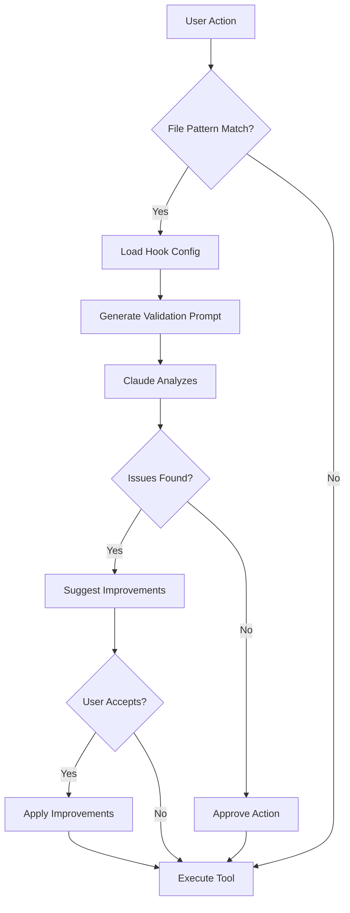
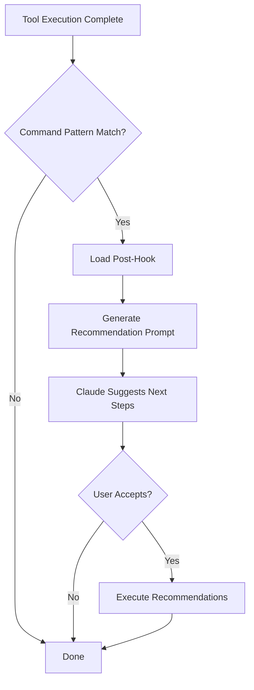

# Container Workflow Hooks - Integration Guide

## How Hooks Integrate with Claude Code

The container-workflow plugin leverages Claude Code's hook system to provide intelligent, automated validation throughout your container development workflow.

## Architecture Overview

```
┌─────────────────────────────────────────────────────────┐
│                    Claude Code CLI                      │
│                                                         │
│  User: "Write a Dockerfile for my Node.js app"        │
└───────────────────┬─────────────────────────────────────┘
                    │
                    ▼
┌─────────────────────────────────────────────────────────┐
│              Hook System (Pre-Tool Use)                 │
│                                                         │
│  1. Detects: Write tool + "Dockerfile" pattern         │
│  2. Loads: hooks/hooks.json                            │
│  3. Matches: Dockerfile write hook                      │
│  4. Triggers: Validation prompt                         │
└───────────────────┬─────────────────────────────────────┘
                    │
                    ▼
┌─────────────────────────────────────────────────────────┐
│                Claude Analysis Layer                    │
│                                                         │
│  Claude receives prompt:                               │
│  "Before writing this Dockerfile, validate:            │
│   - Base image security                                │
│   - Multi-stage builds                                 │
│   - Non-root user                                      │
│   - Layer optimization                                 │
│   - Secrets detection"                                 │
│                                                         │
│  Claude analyzes planned Dockerfile content            │
│  Claude suggests improvements or proceeds              │
└───────────────────┬─────────────────────────────────────┘
                    │
                    ▼
┌─────────────────────────────────────────────────────────┐
│                  Tool Execution                         │
│                                                         │
│  Write tool creates Dockerfile with:                   │
│  - Optimized base image (alpine)                       │
│  - Multi-stage build                                   │
│  - Non-root USER instruction                           │
│  - HEALTHCHECK defined                                 │
└───────────────────┬─────────────────────────────────────┘
                    │
                    ▼
┌─────────────────────────────────────────────────────────┐
│              Hook System (Post-Tool Use)                │
│                                                         │
│  1. Detects: Dockerfile was written                    │
│  2. Loads: Post-write hook                             │
│  3. Triggers: Recommendation prompt                    │
└───────────────────┬─────────────────────────────────────┘
                    │
                    ▼
┌─────────────────────────────────────────────────────────┐
│            Claude Recommendations Layer                 │
│                                                         │
│  Claude suggests:                                      │
│  "Would you like me to:                                │
│   1. Build the image and test it?                      │
│   2. Lint the Dockerfile with hadolint?                │
│   3. Check for security issues?"                       │
└───────────────────┬─────────────────────────────────────┘
                    │
                    ▼
┌─────────────────────────────────────────────────────────┐
│                  User Decision                          │
│                                                         │
│  User: "Yes, build and scan for security issues"       │
└─────────────────────────────────────────────────────────┘
```

---

## Hook Lifecycle

### Phase 1: Pre-Tool Validation

**When:** Before any Write/Edit/Bash tool executes



**Example Flow:**

1. **User:** "Create a Dockerfile for Python app"
2. **Hook Detects:** Write tool + Dockerfile pattern
3. **Hook Loads:** `hooks/hooks.json` → Dockerfile validation
4. **Claude Receives:** Validation prompt with checklist
5. **Claude Analyzes:**
   - "Using python:3.11-slim-bookworm for minimal size"
   - "Adding multi-stage build for dependencies"
   - "Creating non-root user 'app'"
   - "Including HEALTHCHECK instruction"
6. **Tool Executes:** Writes optimized Dockerfile

---

### Phase 2: Post-Tool Recommendations

**When:** After tool successfully executes



**Example Flow:**

1. **Command:** `docker build -t my-app .`
2. **Build Completes:** Successfully built image
3. **Hook Detects:** "docker build" pattern
4. **Hook Loads:** Post-build recommendations
5. **Claude Suggests:**
   ```bash
   # Security scan
   trivy image my-app:latest

   # Size analysis
   docker images my-app --format '{{.Size}}'

   # Layer inspection
   docker history my-app:latest
   ```
6. **User:** "Run security scan"
7. **Claude Executes:** `trivy image my-app:latest`
8. **Claude Reports:** Scan results and vulnerabilities

---

## Integration Points

### 1. File-Based Hooks

**Trigger:** File operations (Write, Edit) on container-related files

| File Pattern | Hook Type | Purpose |
|--------------|-----------|---------|
| `**/Dockerfile*` | Pre-Write | Validate best practices |
| `**/Dockerfile*` | Pre-Edit | Check change impact |
| `**/docker-compose*.yml` | Pre-Write | Security validation |
| `**/docker-compose*.yml` | Pre-Edit | Service impact analysis |
| `**/.dockerignore` | Pre-Write | Required exclusions |

**Implementation:**
```json
{
  "matcher": {
    "tool": "Write",
    "filePattern": "**/Dockerfile*"
  },
  "hooks": [
    {
      "type": "prompt",
      "prompt": "Validation instructions..."
    }
  ]
}
```

---

### 2. Command-Based Hooks

**Trigger:** Bash commands matching specific patterns

| Command Pattern | Hook Type | Purpose |
|-----------------|-----------|---------|
| `docker build.*` | Post-Execution | Recommend scans |
| `docker-compose up.*` | Post-Execution | Validate health |
| `docker push.*` | Post-Execution | Tagging & docs |

**Implementation:**
```json
{
  "matcher": {
    "tool": "Bash",
    "commandPattern": "docker build.*"
  },
  "hooks": [
    {
      "type": "prompt",
      "prompt": "Recommendation instructions..."
    }
  ]
}
```

---

## Real-World Workflow Examples

### Example 1: Building a Production Dockerfile

**User Request:** "Create a production Dockerfile for my Express API"

**Hook Integration Flow:**

```
1. PRE-WRITE HOOK TRIGGERS
   ├─ Hook: Dockerfile validation
   ├─ Claude analyzes requirements
   ├─ Claude suggests:
   │  ├─ Multi-stage build (builder + runtime)
   │  ├─ node:20-alpine base image
   │  ├─ Non-root user
   │  └─ Health check on /health endpoint
   └─ User approves

2. TOOL EXECUTES
   └─ Dockerfile created with best practices

3. POST-WRITE HOOK TRIGGERS
   ├─ Hook: Recommend build test
   ├─ Claude suggests:
   │  ├─ docker build -t api:test .
   │  ├─ hadolint Dockerfile
   │  └─ Check image size
   └─ User: "Build and scan"

4. BUILD EXECUTES
   └─ docker build -t api:test .

5. POST-BUILD HOOK TRIGGERS
   ├─ Hook: Security scan recommendation
   ├─ Claude suggests:
   │  ├─ trivy image api:test
   │  ├─ docker history api:test
   │  └─ Test container startup
   └─ User: "Run trivy scan"

6. SCAN EXECUTES
   └─ trivy image api:test

7. RESULTS REPORTED
   └─ Claude analyzes scan output
   └─ Claude highlights critical CVEs
   └─ Claude suggests base image update if needed
```

**Result:** Production-ready Dockerfile created, validated, and scanned in a guided workflow.

---

### Example 2: Deploying with docker-compose

**User Request:** "Create docker-compose for dev environment with PostgreSQL and Redis"

**Hook Integration Flow:**

```
1. PRE-WRITE HOOK TRIGGERS
   ├─ Hook: docker-compose validation
   ├─ Claude checks:
   │  ├─ No hardcoded passwords
   │  ├─ Named volumes for data persistence
   │  ├─ Health checks for services
   │  ├─ Restart policies
   │  └─ Network isolation
   └─ User approves

2. TOOL EXECUTES
   └─ docker-compose.yml created

3. USER STARTS STACK
   └─ docker-compose up -d

4. POST-COMPOSE-UP HOOK TRIGGERS
   ├─ Hook: Service health validation
   ├─ Claude suggests:
   │  ├─ docker-compose ps (check status)
   │  ├─ docker-compose logs --tail=50
   │  └─ Test database connection
   └─ User: "Check health"

5. VALIDATION EXECUTES
   ├─ docker-compose ps shows all services running
   ├─ Logs show no errors
   └─ Health checks passing

6. CLAUDE CONFIRMS
   └─ "All services healthy and ready for development"
```

---

### Example 3: Pushing to Registry

**User Request:** "Push my-app image to GitHub Container Registry"

**Hook Integration Flow:**

```
1. USER PUSHES
   └─ docker push ghcr.io/org/my-app:v1.2.3

2. POST-PUSH HOOK TRIGGERS
   ├─ Hook: Registry recommendations
   ├─ Claude suggests:
   │  ├─ Verify push in registry UI
   │  ├─ Tag with semantic version
   │  ├─ Update deployment manifests
   │  └─ Document in CHANGELOG
   └─ User: "Help me tag properly"

3. CLAUDE ASSISTS
   ├─ Claude reads current tags
   ├─ Claude suggests version bump
   ├─ Claude creates additional tags:
   │  ├─ v1.2.3 (specific version)
   │  ├─ v1.2 (minor version)
   │  ├─ v1 (major version)
   │  └─ latest (stable release)
   └─ Claude updates CHANGELOG.md

4. DEPLOYMENT READY
   └─ Claude offers to update K8s/Helm manifests
```

---

## Hook Configuration Best Practices

### 1. Targeted Validation

**Good:** Specific, actionable validation
```json
{
  "prompt": "Verify this Dockerfile:\n1. Uses official Node.js image?\n2. Has HEALTHCHECK instruction?\n3. Runs as non-root user?"
}
```

**Bad:** Vague, overwhelming validation
```json
{
  "prompt": "Check if this Dockerfile follows all best practices and security guidelines and optimization strategies and..."
}
```

---

### 2. Contextual Recommendations

**Good:** Context-aware suggestions
```json
{
  "matcher": {
    "commandPattern": "docker build.*production.*"
  },
  "prompt": "Production build detected. MUST run:\n1. Security scan (trivy)\n2. CIS benchmark\n3. SBOM generation"
}
```

**Bad:** Generic suggestions
```json
{
  "prompt": "Maybe you should scan the image or something"
}
```

---

### 3. Progressive Complexity

Start with essential validations, expand as needed:

**Minimal (Startups):**
```json
{
  "PreToolUse": [
    {
      "matcher": {"tool": "Write", "filePattern": "**/Dockerfile*"},
      "hooks": [{"type": "prompt", "prompt": "Check: official base image, non-root user, HEALTHCHECK"}]
    }
  ]
}
```

**Comprehensive (Enterprise):**
```json
{
  "PreToolUse": [
    {
      "matcher": {"tool": "Write", "filePattern": "**/Dockerfile*"},
      "hooks": [
        {"type": "prompt", "prompt": "Validate base image against company policy"},
        {"type": "script", "script": "./hooks/scripts/lint-dockerfile.sh"},
        {"type": "prompt", "prompt": "Verify compliance with CIS Docker Benchmark"}
      ]
    }
  ]
}
```

---

## Extending Hooks

### Add Custom Validation

**Scenario:** Enforce company-approved base images

```json
{
  "PreToolUse": [
    {
      "matcher": {
        "tool": "Write",
        "filePattern": "**/Dockerfile*"
      },
      "hooks": [
        {
          "type": "prompt",
          "prompt": "COMPANY POLICY: Only use these base images:\n\n- node:20-alpine3.18 (Node.js apps)\n- python:3.11-slim-bookworm (Python apps)\n- golang:1.21-alpine (Go apps)\n- nginx:1.25-alpine (Static sites)\n\nVerify base image matches approved list."
        }
      ]
    }
  ]
}
```

---

### Add Custom Post-Build Steps

**Scenario:** Automatically push to internal registry after successful build

```json
{
  "PostToolUse": [
    {
      "matcher": {
        "tool": "Bash",
        "commandPattern": "docker build.*--tag.*:latest"
      },
      "hooks": [
        {
          "type": "prompt",
          "prompt": "Latest tag built. Push to internal registry?\n\n1. Tag for internal registry: internal.company.com/my-app:latest\n2. Push to internal registry\n3. Run post-push security scan\n\nProceed with internal deployment?"
        }
      ]
    }
  ]
}
```

---

## Debugging Hooks

### Enable Verbose Logging

Check if hooks are triggering correctly:

```bash
# Set debug environment variable
export CLAUDE_DEBUG_HOOKS=1

# Run Claude Code
claude "Create a Dockerfile"

# Check logs
tail -f ~/.claude/logs/hooks.log
```

### Test Hook Patterns

Validate your matchers:

```bash
# Test file pattern matching
node -e "
const pattern = '**/Dockerfile*';
const testFiles = ['Dockerfile', 'Dockerfile.prod', 'docker/Dockerfile'];
testFiles.forEach(f => console.log(f, 'matches:', minimatch(f, pattern)));
"

# Test command pattern matching
node -e "
const pattern = /docker build.*/;
const testCmds = ['docker build .', 'docker-compose up', 'docker build -t app .'];
testCmds.forEach(c => console.log(c, 'matches:', pattern.test(c)));
"
```

---

## Performance Considerations

### Hook Execution Time

- **Pre-hooks:** Add ~100-500ms (Claude analysis)
- **Post-hooks:** Add ~200-800ms (recommendations)
- **Script hooks:** Vary by script complexity

### Optimization Tips

1. **Cache hook configs:** Don't reload `hooks.json` on every execution
2. **Lazy load prompts:** Only inject prompts when needed
3. **Batch validations:** Combine related checks in single prompt
4. **Skip for trivial changes:** Don't validate minor edits

---

## Security Considerations

### Hook Execution Safety

- ✅ Hooks run in user's context (same permissions)
- ✅ Script hooks use shell sandboxing
- ✅ No automatic code execution without user approval
- ⚠️ Review third-party hook scripts before use

### Sensitive Data

- ❌ Never put secrets in hooks.json
- ❌ Don't log sensitive command outputs
- ✅ Use environment variables for credentials
- ✅ Reference secrets managers in prompts

---

## Related Documentation

- [Hooks Configuration](./hooks.json) - Full hook definitions
- [Settings Guide](../SETTINGS.md) - Customize hook behavior
- [Container Best Practices](../skills/container-best-practices.md) - Knowledge base
- [Security Scanner Agent](../agents/security-scanner.md) - Automated scanning

---

**Last Updated:** 2025-12-13
**Integration Version:** 1.0.0
**Claude Code Compatibility:** 1.0+

