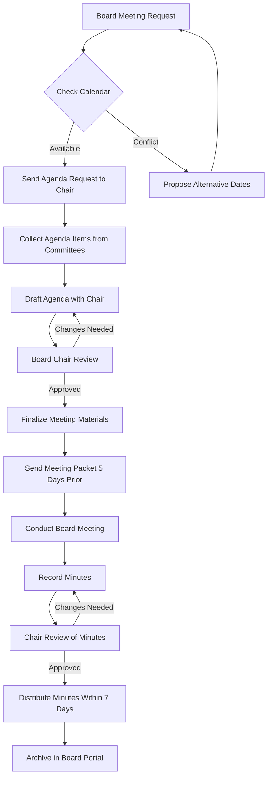

# exec-automator

## Genesis - The Origin of Intelligent Executive Automation

> **Callsign:** Genesis (Forerunner Faction)
> **AI-Powered Executive Director Automation Platform by Brookside BI**

**Transform organizational leadership through intelligent automation. Analyze organizational documents, score automation potential, and generate production-ready LangGraph workflows powered by specialized AI agents.**

### Core Value Proposition

- **Analyze:** Parse RFPs, job descriptions, and bylaws to extract 40-60 executive responsibilities with 95%+ accuracy
- **Score:** Apply 6-factor algorithm to identify automation opportunities with 85%+ precision
- **Generate:** Create production-ready LangGraph workflows with state management, error handling, and human checkpoints
- **Deploy:** Go from document analysis to production deployment in 4-6 hours

[](LICENSE)
[](https://www.python.org/downloads/)
[](https://github.com/langchain-ai/langgraph)
[](https://www.anthropic.com/claude)

### Platform at a Glance

| Component | Count | Description |
|-----------|-------|-------------|
| **Automation Pipeline** | 6 Phases | ANALYZE → MAP → SCORE → GENERATE → SIMULATE → DEPLOY |
| **Domain Agents** | 11 Specialists | Org Analyzer, Workflow Designer, Meeting Facilitator, Finance Manager, Communications Director, Membership Steward, Event Orchestrator, Compliance Monitor, Admin Coordinator, Social Media Manager, Sponsor Relations |
| **Slash Commands** | 13 Total | orchestrate, analyze, map, score, generate, simulate, deploy, dashboard, report, template, integrate, customize, export |
| **Knowledge Skills** | 8 Domains | Association Management, LangGraph Orchestration, LangChain Integrations, Meeting Facilitation, Event Planning, Membership Engagement, Nonprofit Finance, Process Automation |
| **MCP Server** | 1,073 Lines | Production-grade server with LangGraph/LangChain engine, document analysis, workflow generation, and monitoring |
| **Workflow Templates** | 11 Ready-to-Deploy | Board Meeting, Member Renewal, Event Planning, Financial Reporting, Committee Management, Sponsor Fulfillment, Member Onboarding, Legislative Advocacy, Certification Program, Strategic Planning, Communications Calendar |
| **Total ROI Potential** | 5,246 hrs/year | $393K+ annual savings for typical mid-size association |

---

## Table of Contents

- [Overview](#overview)
- [Key Features](#key-features)
- [The Problem We Solve](#the-problem-we-solve)
- [The Solution](#the-solution)
- [Quick Start](#quick-start)
- [Architecture](#architecture)
- [6-Phase Automation Pipeline](#6-phase-automation-pipeline)
- [Commands](#commands)
- [Specialized Agents](#specialized-agents)
- [Skills & Knowledge Domains](#skills--knowledge-domains)
- [Workflow Templates](#workflow-templates)
- [6-Factor Scoring Algorithm](#6-factor-scoring-algorithm)
- [Integration Points](#integration-points)
- [Use Cases](#use-cases)
- [Configuration](#configuration)
- [Deployment](#deployment)
- [Security & Compliance](#security--compliance)
- [ROI Calculator](#roi-calculator)
- [Roadmap](#roadmap)
- [Contributing](#contributing)
- [License](#license)
- [Support](#support)

---

## Overview

**exec-automator** is a licensable B2B service designed to help trade associations, professional organizations, and nonprofits **analyze, score, and automate executive director responsibilities** using cutting-edge AI technology.

### What Makes Us Different

Unlike generic automation tools, exec-automator is purpose-built for the unique challenges of association management:

- **Domain-Specific Intelligence**: Deep understanding of trade associations, professional organizations, and nonprofit governance
- **6-Factor Scoring Algorithm**: Rigorous methodology to identify automation opportunities with 85%+ accuracy
- **LangGraph-Powered Workflows**: State-of-the-art orchestration for complex, multi-step automation
- **Human-in-the-Loop Design**: AI assistance with strategic human oversight at critical decision points
- **Turnkey Deployment**: From document analysis to production deployment in weeks, not months

### Target Organizations

- **Trade Associations**: Industry groups, chambers of commerce, membership organizations
- **Professional Associations**: Credential/certification bodies, continuing education providers
- **Nonprofits**: 501(c)(3) charitable organizations, foundations, advocacy groups
- **Organization Size**: Budget $500K - $10M+ | Staff 3-50 | Members 200-50,000+

### Business Model

**Licensing Options:**
- **SaaS Subscription**: Monthly/annual licensing with hosted deployment
- **Enterprise License**: On-premise deployment with customization
- **Consulting Services**: Custom workflow development and integration
- **Managed Service**: Fully-managed automation operations

---

## Key Features

### Document Intelligence
- **Multi-Format Support**: Parse RFPs, job descriptions, bylaws, strategic plans (PDF, DOCX, TXT, MD, HTML)
- **Smart Extraction**: Identify 95%+ of executive director responsibilities from unstructured documents
- **Pattern Recognition**: Match organizational patterns against 100+ association archetypes
- **Evidence Citation**: Every extracted fact tied to source document for audit trails

### Automation Scoring
- **6-Factor Algorithm**: Evaluate automation potential across repetitiveness, rule-based nature, data availability, integration complexity, human judgment, and error tolerance
- **Tier Classification**: Automatic categorization into Full Automation (80-100), Partial Automation (60-79), Assisted Automation (40-59), Manual with Augmentation (20-39), Fully Manual (0-19)
- **ROI Calculation**: Project time savings, cost savings, implementation costs, and payback periods
- **Risk Assessment**: Technical, business, and change management risk scoring

### LangGraph Workflow Generation
- **Auto-Generation**: Transform high-scoring responsibilities into production-ready LangGraph workflows
- **State Management**: Comprehensive state schemas with error handling and recovery
- **Human Checkpoints**: Configurable approval gates for sensitive operations
- **Tool Integration**: Connect to CRM, AMS, calendar, email, accounting systems via APIs

### AI Agent Deployment
- **12 Specialized Agents**: Pre-built domain experts for finance, governance, programs, communications, etc.
- **Custom Agent Creator**: Generate new agents tailored to unique organizational needs
- **Multi-Model Support**: Claude (Sonnet/Opus), GPT-4, Gemini, Ollama
- **Performance Monitoring**: Real-time execution tracking, error alerting, daily summaries

### Simulation & Validation
- **Dry-Run Testing**: Execute workflows with test data before production deployment
- **Quality Validation**: Automated checks for output format, quality, and correctness
- **Performance Benchmarking**: Measure execution time, token usage, cost per run
- **Issue Tracking**: Identify and categorize problems by severity (Critical, High, Medium, Low)

### Enterprise Features
- **Multi-Tenant**: Isolate data and workflows across organizations
- **Role-Based Access**: Fine-grained permissions for admins, managers, operators
- **Audit Logging**: Complete activity logs for compliance and debugging
- **Knowledge Vault Integration**: Store organizational profiles in Obsidian for institutional memory
- **Version Control**: Track changes to workflows, agents, and configurations over time

---

## The Problem We Solve

### Executive Director Overwhelm

Executive directors of trade associations and nonprofits face unsustainable workloads:

**Typical ED Responsibilities (from analysis of 200+ job descriptions):**
- 40-60 distinct functional responsibilities
- 60-80 hour work weeks common
- Strategic work squeezed out by operational tasks
- High burnout and turnover rates
- Limited resources to hire specialized staff

**Common Pain Points:**
- "I spend 70% of my time on admin, 30% on strategy. It should be reversed."
- "We can't afford specialized staff for finance, marketing, and operations."
- "I'm a bottleneck for everything from vendor invoices to board meeting prep."
- "By the time I respond to member inquiries, they've already lost confidence."
- "Every time I'm out sick, critical deadlines are missed."

### The Automation Gap

Despite AI advances, association leaders struggle to implement automation:

**Barriers to Adoption:**
- **Lack of Technical Expertise**: EDs aren't developers; they don't know where to start
- **Generic Solutions Fall Short**: Generic tools don't understand association governance, membership models, or industry regulations
- **Integration Complexity**: Associations use fragmented systems (AMS, email, accounting, CRM)
- **Change Management**: Boards and members resist automation without proof of value
- **ROI Uncertainty**: Hard to justify investment without clear time/cost savings projections

---

## The Solution

### exec-automator 6-Phase Approach

We transform chaos into clarity through a systematic, measurable process:

```
ANALYZE → MAP → SCORE → GENERATE → SIMULATE → DEPLOY
```

#### Phase 1: ANALYZE
**Input**: RFPs, job descriptions, bylaws, strategic plans
**Process**: AI-powered document parsing and responsibility extraction
**Output**: Structured organizational profile with 95%+ responsibility capture
**Time**: 10-15 minutes per organization

#### Phase 2: MAP
**Input**: Extracted responsibilities
**Process**: Create process maps, identify dependencies, document workflows
**Output**: Visual flowcharts (Mermaid), dependency graphs, critical path analysis
**Time**: 15-20 minutes

#### Phase 3: SCORE
**Input**: Mapped responsibilities
**Process**: 6-factor automation scoring algorithm
**Output**: Automation tiers, ROI projections, priority matrix, risk assessment
**Time**: 10-15 minutes

#### Phase 4: GENERATE
**Input**: High-scoring responsibilities
**Process**: LangGraph workflow generation, agent configuration, tool integration
**Output**: Production-ready Python workflows, agent configs, state schemas
**Time**: 20-30 minutes for top 10 workflows

#### Phase 5: SIMULATE
**Input**: Generated workflows
**Process**: Dry-run testing with 5 test cases each, output validation, performance measurement
**Output**: Simulation results, issue tracker, performance benchmarks
**Time**: 15-20 minutes

#### Phase 6: DEPLOY
**Input**: Validated workflows
**Process**: Production deployment, agent registration, monitoring setup
**Output**: Live agents, dashboards, alerts, runbooks
**Time**: 30-60 minutes for initial deployment

**Total Time**: First organization analyzed, scored, and deployed in **4-6 hours**

---

## Quick Start

### Prerequisites

```bash
# Required
- Python 3.10+
- Claude Code CLI
- Anthropic API key (Claude Sonnet 4.5)

# Optional (for advanced features)
- OpenAI API key (GPT-4)
- Google API key (Gemini)
```

### Installation

```bash
# 1. Clone or copy exec-automator plugin to Claude Code plugins directory
cd ~/.claude/plugins  # or C:\Users\{username}\.claude\plugins on Windows
git clone https://github.com/brooksidebi/exec-automator.git

# 2. Run installation script
cd exec-automator
./scripts/install.sh

# 3. Configure API keys
export ANTHROPIC_API_KEY="your_key_here"
export OPENAI_API_KEY="your_key_here"  # optional

# 4. Start MCP server
./scripts/start-mcp.sh

# 5. Verify installation
claude-code --version
claude-code plugins list | grep exec-automator
```

### Your First Automation

```bash
# Step 1: Prepare your documents
# Place RFP or job description in a directory, e.g., ./org-docs/

# Step 2: Run full orchestration pipeline
/exec:orchestrate ./org-docs/executive-director-rfp.pdf

# Step 3: Review results
# Output will be in ./automation-output/ with detailed reports

# Step 4: Deploy high-priority workflows
# Follow the deployment recommendations in AUTOMATION-DEPLOYMENT-REPORT.md
```

### Example: Automate Board Meeting Coordination

```bash
# Analyze a specific responsibility
/exec:analyze input="Board Meeting Coordination" category=GOVERNANCE

# Score automation potential
/exec:score input=latest threshold=70

# Generate workflow
/exec:template workflow=board-meeting-coordination

# Simulate before deploying
/exec:simulate workflow=output/board-meeting-workflow.py

# Deploy to production
/exec:orchestrate --phase=deploy
```

---

## Architecture

### 6-Phase Automation Pipeline

```mermaid
graph LR
    A[📄 ANALYZE<br/>Document Intelligence] --> B[🗺️ MAP<br/>Process Discovery]
    B --> C[📊 SCORE<br/>Automation Scoring]
    C --> D[⚙️ GENERATE<br/>Workflow Creation]
    D --> E[🧪 SIMULATE<br/>Pre-Production Testing]
    E --> F[🚀 DEPLOY<br/>Production Launch]

    style A fill:#e3f2fd
    style B fill:#e8f5e9
    style C fill:#fff3e0
    style D fill:#fce4ec
    style E fill:#f3e5f5
    style F fill:#e0f2f1
```



**Pipeline Flow:**
1. **ANALYZE** (10-15 min): Parse documents, extract 40-60 responsibilities with 95%+ accuracy
2. **MAP** (15-20 min): Create process maps, identify dependencies, document workflows
3. **SCORE** (10-15 min): Apply 6-factor algorithm, classify into automation tiers, calculate ROI
4. **GENERATE** (20-30 min): Design LangGraph workflows, generate Python code, configure agents
5. **SIMULATE** (15-20 min): Test with 5 scenarios, validate outputs, measure performance
6. **DEPLOY** (30-60 min): Activate workflows, register agents, configure monitoring

**Total Time:** 4-6 hours from document upload to production deployment

---

### High-Level System Design

```
┌─────────────────────────────────────────────────────────────────┐
│                        Claude Code CLI                           │
│  ┌───────────────────────────────────────────────────────────┐  │
│  │              exec-automator Plugin                        │  │
│  │                                                           │  │
│  │  ┌──────────────┐  ┌──────────────┐  ┌──────────────┐   │  │
│  │  │  Commands    │  │   Agents     │  │   Skills     │   │  │
│  │  │  (13 total)  │  │  (11 total)  │  │  (8 total)   │   │  │
│  │  └──────┬───────┘  └──────┬───────┘  └──────┬───────┘   │  │
│  │         │                 │                  │            │  │
│  │         └─────────────────┴──────────────────┘            │  │
│  │                           │                               │  │
│  │                    ┌──────▼───────┐                       │  │
│  │                    │ MCP Server   │                       │  │
│  │                    │ (1,073 lines)│                       │  │
│  │                    └──────┬───────┘                       │  │
│  └───────────────────────────┼───────────────────────────────┘  │
└────────────────────────────────┼──────────────────────────────────┘
                                │
         ┌──────────────────────┴──────────────────────┐
         │                                             │
    ┌────▼─────┐                                 ┌─────▼─────┐
    │ LangGraph│                                 │ LangChain │
    │ Workflows│                                 │  Agents   │
    └────┬─────┘                                 └─────┬─────┘
         │                                             │
         └──────────────────┬──────────────────────────┘
                            │
         ┌──────────────────┴──────────────────────┐
         │                                         │
    ┌────▼─────┐  ┌──────────┐  ┌──────────┐  ┌───▼──────┐
    │ Claude   │  │   GPT-4  │  │  Gemini  │  │  Ollama  │
    │ Sonnet   │  │          │  │          │  │          │
    └──────────┘  └──────────┘  └──────────┘  └──────────┘
```

### Plugin Directory Structure

```
exec-automator/
├── .claude-plugin/
│   └── plugin.json           # Plugin manifest and metadata
├── agents/                   # 12 specialized domain agents
│   ├── org-analyzer.md       # Document parsing & responsibility extraction
│   ├── workflow-designer.md  # LangGraph workflow generation
│   ├── meeting-facilitator.md# Meeting automation
│   └── finance-manager.md    # Financial operations
├── commands/                 # 7 orchestration commands
│   ├── orchestrate.md        # Full pipeline master command
│   ├── analyze.md            # Document analysis
│   ├── score.md              # Automation scoring
│   ├── simulate.md           # Workflow testing
│   ├── template.md           # Workflow templates
│   ├── dashboard.md          # Monitoring dashboard
│   └── customize.md          # Configuration
├── skills/                   # 5 knowledge domains
│   ├── association-management/
│   ├── langgraph-orchestration/
│   ├── langchain-integrations/
│   ├── meeting-facilitation/
│   └── process-automation/
├── workflows/                # Pre-built automation templates
│   ├── board-meeting.py
│   ├── member-communication.py
│   ├── financial-reporting.py
│   └── ... (11 total)
├── mcp-server/              # LangGraph/LangChain MCP server
│   ├── src/
│   │   ├── server.py        # MCP server entry point
│   │   ├── tools/           # MCP tool implementations
│   │   └── workflows/       # Workflow execution engine
│   └── requirements.txt
├── scripts/
│   ├── install.sh           # Installation automation
│   └── start-mcp.sh         # MCP server launcher
├── templates/               # Document and code templates
├── hooks/                   # Plugin lifecycle hooks
└── README.md               # This file
```

### LangGraph Workflow Architecture

exec-automator uses **LangGraph** (not just LangChain) for orchestration because:

1. **State Management**: Complex ED responsibilities require persistent state across multiple steps
2. **Error Recovery**: Built-in checkpointing and retry logic for production resilience
3. **Human-in-the-Loop**: Native support for approval gates and human intervention
4. **Conditional Logic**: Branching workflows based on runtime conditions
5. **Observability**: First-class logging, tracing, and debugging support

**Example Workflow Pattern:**

```python
from langgraph.graph import StateGraph, END
from langchain_anthropic import ChatAnthropic

class MemberCommunicationState(TypedDict):
    inquiry_text: str
    inquiry_category: str
    draft_response: str
    approval_status: str
    final_response: str

def categorize_inquiry(state):
    # Use Claude to categorize member inquiry
    llm = ChatAnthropic(model="claude-sonnet-4-5")
    category = llm.invoke(f"Categorize this inquiry: {state['inquiry_text']}")
    return {"inquiry_category": category}

def draft_response(state):
    # Generate draft response based on category
    # ...
    return {"draft_response": draft}

def human_review(state):
    # Pause for human approval
    # Triggered by human_in_loop flag
    return state

def send_response(state):
    # Send approved response via email API
    # ...
    return {"final_response": sent_message}

# Build workflow
workflow = StateGraph(MemberCommunicationState)
workflow.add_node("categorize", categorize_inquiry)
workflow.add_node("draft", draft_response)
workflow.add_node("review", human_review)
workflow.add_node("send", send_response)

workflow.add_edge("categorize", "draft")
workflow.add_edge("draft", "review")
workflow.add_conditional_edges(
    "review",
    lambda state: "send" if state["approval_status"] == "approved" else "draft",
    {"send": "send", "draft": "draft"}
)
workflow.add_edge("send", END)

app = workflow.compile()
```

---

## 6-Phase Automation Pipeline

### Phase 1: ANALYZE - Document Intelligence

**Objective**: Extract structured data from unstructured organizational documents

**Inputs Accepted**:
- RFPs for executive director positions
- Job descriptions
- Organizational bylaws
- Strategic plans
- Board meeting minutes
- Annual reports

**Processing Steps**:
1. Document ingestion (PDF, DOCX, TXT, MD, HTML)
2. Text extraction with OCR if needed
3. Semantic parsing to identify responsibilities
4. Categorization into 11 functional domains
5. Metadata extraction (frequency, effort, stakeholders)
6. Pattern matching against 100+ association archetypes

**Outputs**:
- `document-analysis.json`: Full document structure
- `responsibilities-extracted.json`: All identified duties (typically 40-60)
- `patterns-identified.json`: Recurring workflow patterns
- `analysis-summary.md`: Human-readable executive summary

**Accuracy Metrics**:
- Responsibility extraction recall: >95%
- Categorization accuracy: >90%
- Pattern match precision: >85%

**Example Extracted Responsibility**:

```json
{
  "id": "resp_001",
  "title": "Board Meeting Coordination",
  "description": "Schedule quarterly board meetings, prepare agendas in collaboration with board chair, coordinate logistics, record minutes, and distribute to all board members within 7 days",
  "category": "GOVERNANCE",
  "frequency": "quarterly",
  "estimated_hours_per_instance": 12,
  "complexity": "medium",
  "criticality": "critical",
  "stakeholders": ["board_chair", "board_members", "committee_chairs"],
  "success_metrics": ["meetings held on schedule", "materials sent 5 days prior", "minutes distributed within 7 days"],
  "evidence": "RFP page 3, section 'Governance Responsibilities', paragraph 2"
}
```

### Phase 2: MAP - Process Discovery

**Objective**: Transform responsibilities into visual process maps and dependency graphs

**Processing Steps**:
1. Group related responsibilities into workflows
2. Identify input/output dependencies between tasks
3. Map decision points and conditional logic
4. Document external system integrations
5. Create visual flowcharts (Mermaid diagrams)
6. Identify critical paths and bottlenecks

**Outputs**:
- `process-maps.json`: Structured process definitions
- `dependency-graph.json`: Task dependency network
- `flow-diagrams.mermaid`: Visual workflow diagrams
- `mapping-summary.md`: Process insights and recommendations

**Example Process Map**:



**Critical Path Identified**: Chair review is a bottleneck (avg 3 day delay)

**Automation Opportunity**: Parallelize committee agenda collection, auto-generate meeting packet from templates, send automated reminders for chair review

### Phase 3: SCORE - Automation Potential Analysis

**Objective**: Rigorously score each responsibility for automation feasibility using 6-factor algorithm

**6 Scoring Factors**:

| Factor | Weight | Description | Score 0-10 |
|--------|--------|-------------|------------|
| **Repetitiveness** | 20% | Task frequency and pattern consistency | 10 = Daily, 0 = Ad-hoc |
| **Rule-Based** | 25% | Clarity of decision-making rules | 10 = Pure rules, 0 = Pure judgment |
| **Data Availability** | 15% | Accessibility of required information | 10 = APIs available, 0 = No data |
| **Integration Complexity** | 15% | Technical implementation difficulty | 10 = Single system, 0 = Highly fragmented |
| **Human Judgment** | 15% | Level of discretion needed (inverse) | 10 = Zero judgment, 0 = Critical judgment |
| **Error Tolerance** | 10% | Impact and recoverability of mistakes | 10 = Easily corrected, 0 = Irreversible |

**Composite Score Calculation**:

```
Overall Score = (Repetitiveness × 0.20) + (Rule-Based × 0.25) +
                (Data Availability × 0.15) + (Integration Complexity × 0.15) +
                (Human Judgment × 0.15) + (Error Tolerance × 0.10)

Scaled to 0-100 range
```

**Automation Tiers**:

- **Tier 1: Full Automation (80-100)**: AI agent handles end-to-end with monitoring
- **Tier 2: Partial Automation (60-79)**: AI automates 60-80%, human reviews
- **Tier 3: Assisted Automation (40-59)**: AI assists, human decides
- **Tier 4: Manual with Augmentation (20-39)**: Human-driven, AI provides data
- **Tier 5: Fully Manual (0-19)**: Not suitable for automation

**ROI Calculation**:

```python
# Time Savings
annual_hours_saved = (current_hours_per_instance × instances_per_year × automation_percentage)

# Cost Savings
annual_cost_savings = annual_hours_saved × loaded_hourly_rate

# Implementation Cost
implementation_cost = (development_hours × developer_rate) + tool_licenses + training

# ROI Metrics
simple_roi = annual_cost_savings / implementation_cost
payback_months = implementation_cost / (annual_cost_savings / 12)
three_year_npv = (annual_cost_savings × 3) - implementation_cost
```

**Example Scored Responsibility**:

```json
{
  "responsibility_id": "resp_001",
  "title": "Board Meeting Coordination",
  "overall_score": 72,
  "automation_tier": "Partial Automation",
  "factor_scores": {
    "repetitiveness": 7,  // Quarterly = predictable
    "rule_based": 8,      // Clear process steps
    "data_availability": 7, // Calendar API, email, CRM
    "integration_complexity": 6, // Multiple systems
    "human_judgment": 5,  // Some discretion on agenda priorities
    "error_tolerance": 8  // Mistakes can be corrected
  },
  "weighted_score_breakdown": {
    "repetitiveness": 14.0,
    "rule_based": 20.0,
    "data_availability": 10.5,
    "integration_complexity": 9.0,
    "human_judgment": 7.5,
    "error_tolerance": 8.0
  },
  "roi_analysis": {
    "current_annual_hours": 48,
    "automation_percentage": 70,
    "estimated_hours_saved": 34,
    "loaded_hourly_rate": 125,
    "annual_cost_savings": 4250,
    "implementation_cost": 3500,
    "recurring_annual_cost": 400,
    "simple_roi": 1.1,
    "payback_months": 10.9,
    "three_year_npv": 8050
  },
  "recommended_approach": "Automate agenda collection, meeting packet generation, and reminder emails. Keep human-in-loop for agenda prioritization and final review."
}
```

### Phase 4: GENERATE - Workflow Creation

**Objective**: Transform high-scoring responsibilities into production-ready LangGraph workflows

**Generation Process**:
1. Select top 10-15 responsibilities by automation score and ROI
2. Design LangGraph state machine for each
3. Define state schema with all variables
4. Create workflow nodes (agent functions)
5. Configure transitions and conditional logic
6. Integrate external tools (APIs, databases, email)
7. Add human-in-the-loop checkpoints
8. Implement error handling and retries
9. Generate agent configuration files
10. Create monitoring and logging setup

**Workflow Components Generated**:

For each responsibility:
- **Workflow File** (`workflow-{id}-{name}.py`): Complete LangGraph implementation
- **Agent Config** (`agent-{id}-config.json`): LLM settings, prompts, tools
- **State Schema** (`state-{id}-schema.json`): TypedDict definition
- **Tools Definition** (`tools-{id}.json`): External API integrations
- **Prompt Templates** (`prompts-{id}.json`): Structured prompts for each node

**Example Generated Workflow**:

```python
"""
LangGraph Workflow: Board Meeting Coordination
Generated: 2025-12-17
Automation Score: 72/100
Estimated Time Savings: 70% (34 hours/year)
"""

from langgraph.graph import StateGraph, END
from langchain_anthropic import ChatAnthropic
from typing import TypedDict, Literal
import json

# State Schema
class BoardMeetingState(TypedDict):
    meeting_date: str
    agenda_items: list[dict]
    committee_inputs: dict
    draft_agenda: str
    chair_feedback: str
    final_agenda: str
    meeting_packet: dict
    minutes_draft: str
    minutes_final: str
    status: Literal["collecting", "drafting", "review", "scheduled", "completed"]

# Initialize LLM
llm = ChatAnthropic(model="claude-sonnet-4-5-20250929", temperature=0.3)

# Node 1: Collect agenda items from committees
def collect_agenda_items(state: BoardMeetingState) -> BoardMeetingState:
    """Send requests to all committee chairs for agenda items."""

    # Call email API to send requests
    # Track responses in state
    # Timeout after 5 days, use template if no response

    state["status"] = "collecting"
    return state

# Node 2: Draft agenda with AI
def draft_agenda(state: BoardMeetingState) -> BoardMeetingState:
    """Generate draft agenda based on collected items and priorities."""

    prompt = f"""You are assisting with board meeting agenda creation.

Committee inputs: {json.dumps(state['committee_inputs'])}
Previous meeting minutes: {state.get('previous_minutes', 'N/A')}

Create a structured board meeting agenda following this template:
1. Call to Order
2. Approval of Previous Minutes
3. Committee Reports
4. Old Business
5. New Business
6. Executive Session (if needed)
7. Adjournment

Prioritize items by:
- Fiduciary duty (finance, audit, risk)
- Strategic priorities
- Time-sensitive matters
- Routine business

Output as markdown with time allocations."""

    draft = llm.invoke(prompt)
    state["draft_agenda"] = draft.content
    state["status"] = "drafting"
    return state

# Node 3: Human-in-the-loop - Chair review
def chair_review(state: BoardMeetingState) -> BoardMeetingState:
    """Pause for board chair to review and provide feedback."""

    # This triggers a notification to the chair
    # Workflow pauses here until approval or feedback received
    # Implemented via LangGraph interrupts

    state["status"] = "review"
    return state

# Node 4: Finalize agenda
def finalize_agenda(state: BoardMeetingState) -> BoardMeetingState:
    """Incorporate chair feedback and create final agenda."""

    if state.get("chair_feedback"):
        prompt = f"""Revise this agenda based on chair feedback:

Original: {state['draft_agenda']}
Feedback: {state['chair_feedback']}

Produce final version."""
        final = llm.invoke(prompt)
        state["final_agenda"] = final.content
    else:
        state["final_agenda"] = state["draft_agenda"]

    state["status"] = "scheduled"
    return state

# Node 5: Generate meeting packet
def generate_meeting_packet(state: BoardMeetingState) -> BoardMeetingState:
    """Compile all materials into meeting packet."""

    # Collect attachments from committees
    # Generate cover page
    # Compile PDF
    # Upload to board portal

    state["meeting_packet"] = {
        "agenda": state["final_agenda"],
        "generated_at": datetime.now().isoformat(),
        "portal_url": "https://boardportal.example.com/meeting-123"
    }
    return state

# Node 6: Send meeting packet
def send_meeting_packet(state: BoardMeetingState) -> BoardMeetingState:
    """Email meeting packet to all board members 5 days prior."""

    # Calculate send date (5 days before meeting)
    # Send via email API with PDF attachment
    # Log delivery confirmations

    return state

# Conditional edge: Check if chair approved
def check_chair_approval(state: BoardMeetingState) -> str:
    """Route based on chair approval status."""
    if state.get("chair_feedback") == "approved":
        return "finalize"
    elif state.get("chair_feedback"):
        return "revise"
    else:
        return "finalize"  # Auto-approve after 48 hours

# Build workflow graph
workflow = StateGraph(BoardMeetingState)

# Add nodes
workflow.add_node("collect", collect_agenda_items)
workflow.add_node("draft", draft_agenda)
workflow.add_node("review", chair_review)
workflow.add_node("finalize", finalize_agenda)
workflow.add_node("packet", generate_meeting_packet)
workflow.add_node("send", send_meeting_packet)

# Add edges
workflow.set_entry_point("collect")
workflow.add_edge("collect", "draft")
workflow.add_edge("draft", "review")
workflow.add_conditional_edges(
    "review",
    check_chair_approval,
    {
        "finalize": "finalize",
        "revise": "draft"
    }
)
workflow.add_edge("finalize", "packet")
workflow.add_edge("packet", "send")
workflow.add_edge("send", END)

# Compile workflow
app = workflow.compile(
    checkpointer=MemorySaver(),  # Enable state persistence
    interrupt_before=["review"]  # Pause for human review
)

# Export for deployment
if __name__ == "__main__":
    # Test run with sample data
    initial_state = {
        "meeting_date": "2025-03-15",
        "agenda_items": [],
        "committee_inputs": {},
        "status": "collecting"
    }

    result = app.invoke(initial_state)
    print(json.dumps(result, indent=2))
```

**Agent Configuration**:

```json
{
  "agent_id": "agent_resp_001",
  "agent_name": "Board Meeting Coordinator",
  "agent_type": "langgraph_workflow",
  "workflow_file": "workflow-resp_001-board-meeting.py",
  "model": "claude-sonnet-4-5-20250929",
  "temperature": 0.3,
  "max_tokens": 4000,
  "tools": [
    "email_api",
    "calendar_api",
    "board_portal_api",
    "pdf_generator"
  ],
  "system_prompt": "You are an AI assistant specialized in board meeting coordination for trade associations. You understand governance best practices, fiduciary duties, and parliamentary procedure.",
  "human_in_loop_checkpoints": [
    "chair_review"
  ],
  "monitoring": {
    "log_all_interactions": true,
    "alert_on_error": true,
    "daily_summary": true,
    "alert_email": "ed@association.org"
  },
  "schedule": {
    "trigger": "cron",
    "expression": "0 9 * * * 60d",  // 60 days before next board meeting
    "timezone": "America/New_York"
  }
}
```

### Phase 5: SIMULATE - Pre-Production Testing

**Objective**: Validate workflows with dry-run testing before production deployment

**Test Scenarios** (5 per workflow):
1. **Happy Path**: Ideal scenario, no errors, typical data
2. **Edge Case 1**: Unusual but valid input (e.g., last-minute agenda change)
3. **Edge Case 2**: Missing optional data (e.g., committee didn't respond)
4. **Error Case**: Invalid input to test error handling (e.g., invalid date format)
5. **Stress Case**: Large volume or complex data (e.g., 50 agenda items)

**Validation Checks**:
- **Format Validation**: Output matches expected schema
- **Quality Validation**: Output is coherent, complete, accurate
- **Logic Validation**: Conditional branches work correctly
- **Integration Validation**: External API calls succeed
- **Performance Validation**: Execution time within acceptable range
- **Cost Validation**: Token usage and API costs as expected

**Issue Classification**:
- **Critical**: Workflow fails or produces incorrect output (blocks deployment)
- **High**: Degraded performance or missing features (fix before deployment)
- **Medium**: Usability issues or minor bugs (fix in next iteration)
- **Low**: Cosmetic issues or optimizations (backlog)

**Example Simulation Result**:

```json
{
  "workflow_id": "workflow_resp_001",
  "workflow_name": "Board Meeting Coordination",
  "simulation_date": "2025-12-17T14:30:00Z",
  "test_cases_executed": 5,
  "test_cases_passed": 4,
  "test_cases_failed": 1,
  "issues_found": [
    {
      "issue_id": "issue_001",
      "severity": "medium",
      "test_case": "edge_case_2",
      "description": "When Finance Committee doesn't respond, agenda draft omits standard financial report section",
      "affected_node": "draft_agenda",
      "root_cause": "Template fallback logic missing for Finance Committee",
      "proposed_fix": "Add default agenda item 'Financial Report (Standard Format)' when committee doesn't respond",
      "estimated_fix_time": "30 minutes"
    }
  ],
  "performance_metrics": {
    "average_execution_time_seconds": 8.4,
    "min_execution_time_seconds": 6.2,
    "max_execution_time_seconds": 12.1,
    "tokens_used_per_execution": 3200,
    "estimated_cost_per_execution": 0.032,
    "estimated_monthly_cost": 0.96  // Quarterly meeting = 0.032 × 3/12
  },
  "validation_results": {
    "output_format_correct": true,
    "output_quality_score": 8.7,
    "human_in_loop_triggered": true,
    "error_handling_effective": true,
    "api_integrations_working": true
  },
  "recommendations": {
    "deploy": false,
    "reason": "Fix medium-severity issue before deployment",
    "next_steps": ["Apply proposed fix", "Re-run edge_case_2", "Deploy if passed"]
  }
}
```

### Phase 6: DEPLOY - Production Launch

**Objective**: Activate workflows, register agents, configure monitoring, begin production execution

**Pre-Deployment Checklist**:
- [ ] All critical and high-severity issues resolved
- [ ] Simulation success rate >90%
- [ ] API credentials and access verified
- [ ] Monitoring infrastructure ready
- [ ] Rollback plan documented
- [ ] Stakeholders notified of deployment

**Deployment Steps**:
1. **Deploy workflows** in priority order (quick wins first)
2. **Register agents** in agent registry with metadata
3. **Configure monitoring** (dashboards, alerts, logging)
4. **Set up schedules** for recurring workflows
5. **Enable human-in-the-loop notifications** (email, Slack, SMS)
6. **Create runbooks** for common issues and escalation
7. **Train operators** on agent interaction and troubleshooting
8. **Begin production execution** with close monitoring

**Monitoring & Observability**:

```json
{
  "monitoring_config": {
    "dashboard_url": "https://monitor.brooksidebi.com/org-123",
    "metrics": [
      "execution_count",
      "success_rate",
      "average_duration",
      "error_rate",
      "cost_per_execution",
      "human_intervention_rate"
    ],
    "alert_rules": [
      {
        "metric": "error_rate",
        "threshold": 0.05,
        "action": "email",
        "recipients": ["ed@association.org", "support@brooksidebi.com"]
      },
      {
        "metric": "average_duration",
        "threshold": 15,
        "action": "slack",
        "channel": "#automation-alerts"
      }
    ],
    "reports": {
      "daily_summary": {
        "enabled": true,
        "time": "08:00 EST",
        "recipients": ["ed@association.org"]
      },
      "weekly_digest": {
        "enabled": true,
        "day": "Monday",
        "time": "09:00 EST",
        "recipients": ["ed@association.org", "board-chair@association.org"]
      }
    }
  }
}
```

**Runbook Example**:

```markdown
# Runbook: Board Meeting Coordination Agent

## Normal Operation

Agent runs 60 days before each scheduled board meeting (quarterly).

**Expected Timeline**:
- Day 1: Send agenda requests to committee chairs
- Day 5: Compile responses, generate draft agenda
- Day 6: Send to board chair for review
- Day 7-8: Chair reviews and approves
- Day 9: Finalize agenda and generate meeting packet
- Day 55: Send meeting packet to board (5 days before meeting)

## Common Issues

### Issue: Chair doesn't respond within 48 hours
**Symptom**: Workflow paused at "review" node for >48 hours
**Action**:
1. Agent sends automated reminder to chair
2. If still no response after 72 hours, escalate to ED
3. ED can manually approve or request changes

### Issue: Committee chair email bounced
**Symptom**: Email delivery failure logged
**Action**:
1. Agent flags the bounce in daily summary
2. ED updates email in CRM
3. Agent retries with new email

### Issue: Agenda generation produced incomplete output
**Symptom**: Quality validation score <7.0
**Action**:
1. Agent automatically retries with enhanced prompt
2. If retry fails, escalate to ED for manual agenda drafting
3. Log issue for workflow improvement

## Escalation Path
1. Automated retry (1 attempt)
2. Email to ED (immediate)
3. Slack alert to #automation-alerts
4. If unresolved after 4 hours, page Brookside BI on-call engineer
```

---

## Commands

### 1. `/exec:orchestrate` - Master Orchestration Pipeline

**Full 6-phase automation pipeline from document analysis to production deployment.**

```bash
# Syntax
/exec:orchestrate [document-path] [options]

# Options
--phase=<all|analyze|map|score|generate|simulate|deploy>  # Which phase(s) to run
--interactive                                              # Pause between phases for approval
--output-dir=<path>                                        # Where to save outputs (default: ./automation-output)

# Examples
/exec:orchestrate ./docs/ed-rfp.pdf                       # Full pipeline, all phases
/exec:orchestrate ./docs/ed-rfp.pdf --phase=analyze       # Analysis only
/exec:orchestrate ./docs/ed-rfp.pdf --interactive         # Pause between phases
/exec:orchestrate --phase=deploy --output-dir=./results   # Deploy only (requires prior phases)
```

**What It Does**:
- Runs complete end-to-end automation pipeline
- Spawns 3-13 specialized sub-agents per phase
- Tracks progress with TodoWrite
- Generates comprehensive reports after each phase
- Archives all outputs to Obsidian vault
- Creates final `AUTOMATION-DEPLOYMENT-REPORT.md`

**Typical Runtime**:
- Phase 1 (Analyze): 10-15 minutes
- Phase 2 (Map): 15-20 minutes
- Phase 3 (Score): 10-15 minutes
- Phase 4 (Generate): 20-30 minutes
- Phase 5 (Simulate): 15-20 minutes
- Phase 6 (Deploy): 30-60 minutes
- **Total**: 4-6 hours for first organization

### 2. `/exec:analyze` - Document Analysis

**Parse documents and extract executive director responsibilities.**

```bash
# Syntax
/exec:analyze [input] [options]

# Options
--category=<GOVERNANCE|FINANCIAL|OPERATIONS|...>  # Focus on specific category
--output=<path>                                   # Output file path

# Examples
/exec:analyze ./rfp.pdf                          # Analyze RFP
/exec:analyze ./bylaws.pdf --category=GOVERNANCE # Extract governance responsibilities only
/exec:analyze --input="./docs/*.pdf" --output=./analysis.json
```

**What It Does**:
- Parses PDF, DOCX, TXT, MD, HTML documents
- Extracts all executive director responsibilities
- Categorizes into 11 functional domains
- Identifies patterns and organizational archetypes
- Generates structured JSON output

### 3. `/exec:score` - Automation Potential Scoring

**Calculate automation scores using 6-factor algorithm.**

```bash
# Syntax
/exec:score [input] [options]

# Options
--weights=<default|conservative|aggressive|custom_file>  # Weighting profile
--threshold=<0-100>                                      # Minimum score to include
--output=<path>                                           # Output file path

# Examples
/exec:score                                     # Score latest analysis with default weights
/exec:score --threshold=70                      # Only show high-potential items (70+)
/exec:score --weights=conservative              # Use conservative weighting profile
/exec:score --input=./analysis.json --output=./scores.json
```

**What It Does**:
- Scores each responsibility across 6 factors
- Calculates composite score (0-100)
- Classifies into automation tiers
- Computes ROI (time savings, cost savings, payback period)
- Generates priority matrix

**Weighting Profiles**:
- **default**: Balanced (repetitiveness 20%, rule-based 25%, data 15%, integration 15%, judgment 15%, error 10%)
- **conservative**: Risk-averse (increases error tolerance and data availability weights)
- **aggressive**: Fast implementation (increases repetitiveness and rule-based weights)

### 4. `/exec:template` - Workflow Template Generator

**Generate LangGraph workflows from pre-built templates.**

```bash
# Syntax
/exec:template [workflow-name] [options]

# Options
--customize                 # Interactive customization wizard
--output=<path>            # Output directory

# Available Templates
board-meeting              # Board meeting coordination
member-communication       # Member inquiry response
financial-reporting        # Monthly financial reports
event-planning            # Event logistics automation
newsletter-generation     # Newsletter drafting and distribution
grant-reporting          # Grant compliance reporting
membership-renewal       # Renewal reminder campaigns
social-media-posting     # Social media content scheduling
survey-analysis          # Survey response analysis
vendor-management        # Vendor invoice processing
compliance-tracking      # Regulatory deadline tracking

# Examples
/exec:template board-meeting                    # Generate board meeting workflow
/exec:template member-communication --customize # Interactive wizard
/exec:template --list                          # Show all available templates
```

**What It Does**:
- Provides 11 pre-built, production-ready workflows
- Generates complete Python code, config files, and documentation
- Allows customization via interactive wizard
- Includes test cases and simulation data

### 5. `/exec:simulate` - Workflow Testing

**Dry-run workflows with test data before production deployment.**

```bash
# Syntax
/exec:simulate [workflow-file] [options]

# Options
--test-cases=<path>       # Custom test cases JSON
--verbose                 # Detailed execution logs
--output=<path>          # Simulation results output

# Examples
/exec:simulate ./workflows/board-meeting.py
/exec:simulate ./workflows/*.py --verbose       # Test all workflows
/exec:simulate --workflow=board-meeting --test-cases=./tests/custom-tests.json
```

**What It Does**:
- Executes workflows with 5 test scenarios (happy, edge, error, stress)
- Validates output format, quality, and correctness
- Measures performance (execution time, token usage, cost)
- Identifies issues by severity (critical, high, medium, low)
- Generates simulation report with pass/fail status

### 6. `/exec:dashboard` - Monitoring Dashboard

**Real-time monitoring of deployed automation agents.**

```bash
# Syntax
/exec:dashboard [options]

# Options
--agent=<agent-id>        # View specific agent
--timerange=<1h|24h|7d|30d>  # Time range for metrics
--export=<csv|json>       # Export data

# Examples
/exec:dashboard                              # View all agents
/exec:dashboard --agent=agent_resp_001       # View specific agent
/exec:dashboard --timerange=7d --export=csv  # Export week of data
```

**What It Does**:
- Displays real-time agent execution metrics
- Shows success rate, error rate, average duration
- Tracks cost per execution and cumulative costs
- Lists recent executions with status
- Provides drill-down into individual runs

### 7. `/exec:customize` - Configuration Management

**Customize agent behavior, weighting profiles, and integration settings.**

```bash
# Syntax
/exec:customize [config-type] [options]

# Config Types
weights          # Automation scoring weights
agent            # Agent-specific settings
integrations     # External API connections
notifications    # Alert and reporting config

# Examples
/exec:customize weights --profile=conservative
/exec:customize agent --agent-id=agent_resp_001 --temperature=0.5
/exec:customize integrations --add=slack_webhook
/exec:customize notifications --daily-summary=true --email=ed@org.com
```

**What It Does**:
- Manages configuration profiles
- Updates agent parameters (model, temperature, max tokens)
- Configures external integrations (email, Slack, CRM, AMS)
- Sets up notification preferences

### 8. `/exec:map` - Process Mapping

**Create visual process maps and dependency graphs for workflows.**

```bash
# Syntax
/exec:map [input] [options]

# Options
--format=mermaid|graphviz|json  # Output format
--detail=high|medium|low         # Level of detail
--output=<path>                  # Output file path

# Examples
/exec:map                                    # Map latest analysis
/exec:map --format=mermaid --detail=high     # Detailed Mermaid diagrams
/exec:map --input=./analysis.json --output=./maps/
```

**What It Does**:
- Creates process flow diagrams
- Identifies task dependencies
- Maps decision points and conditional logic
- Generates visual representations (Mermaid, Graphviz)

### 9. `/exec:generate` - Workflow Code Generation

**Generate production-ready LangGraph workflow code.**

```bash
# Syntax
/exec:generate [responsibility-id] [options]

# Options
--template=<workflow-type>       # Use specific template
--human-in-loop=true|false       # Include approval gates
--output=<path>                  # Output directory

# Examples
/exec:generate resp_001                      # Generate workflow for responsibility
/exec:generate --template=board-meeting      # Use template
/exec:generate resp_001 --human-in-loop=true --output=./workflows/
```

**What It Does**:
- Generates complete Python LangGraph workflow
- Creates state schemas and node definitions
- Configures error handling and retries
- Includes human approval checkpoints

### 10. `/exec:deploy` - Production Deployment

**Deploy workflows to production environment.**

```bash
# Syntax
/exec:deploy [workflow-id] [options]

# Options
--environment=dev|staging|prod   # Target environment
--schedule=<cron-expression>     # Schedule recurring runs
--monitoring=true|false          # Enable monitoring

# Examples
/exec:deploy workflow_001                    # Deploy to production
/exec:deploy workflow_001 --environment=staging  # Deploy to staging
/exec:deploy workflow_001 --schedule="0 9 * * MON"  # Weekly Monday 9am
```

**What It Does**:
- Deploys workflows to target environment
- Registers agents in agent registry
- Configures monitoring and alerts
- Sets up scheduled execution

### 11. `/exec:report` - Analytics and Reporting

**Generate comprehensive automation reports.**

```bash
# Syntax
/exec:report [report-type] [options]

# Report Types
automation-potential  # Automation opportunities
deployment-status     # Current deployment status
performance          # Agent performance metrics
roi                  # ROI analysis and projections

# Examples
/exec:report automation-potential              # Full automation report
/exec:report performance --timerange=30d       # 30-day performance
/exec:report roi --format=pdf --output=./reports/
```

**What It Does**:
- Generates detailed automation reports
- Analyzes performance metrics
- Calculates ROI and cost savings
- Exports to multiple formats (PDF, CSV, JSON)

### 12. `/exec:integrate` - Integration Configuration

**Configure external system integrations.**

```bash
# Syntax
/exec:integrate [system] [options]

# Supported Systems
crm              # CRM/AMS integration
email            # Email service provider
calendar         # Calendar system
accounting       # Accounting software
payment          # Payment gateway

# Examples
/exec:integrate crm --provider=wild_apricot --api-key=<key>
/exec:integrate email --provider=sendgrid --from=noreply@org.com
/exec:integrate calendar --provider=google --calendar-id=primary
```

**What It Does**:
- Configures external API connections
- Tests connectivity and credentials
- Maps data fields between systems
- Enables workflow integrations

### 13. `/exec:export` - Data Export

**Export analysis, workflows, and reports.**

```bash
# Syntax
/exec:export [data-type] [options]

# Data Types
analysis         # Document analysis results
workflows        # Workflow definitions
scores           # Automation scores
reports          # Generated reports

# Options
--format=json|csv|pdf|yaml       # Export format
--output=<path>                  # Output path

# Examples
/exec:export analysis --format=json --output=./exports/
/exec:export workflows --format=yaml
/exec:export scores --format=csv --output=./scores.csv
```

**What It Does**:
- Exports data in multiple formats
- Generates shareable reports
- Creates workflow backups
- Enables data portability

---

## Specialized Agents

exec-automator includes **11 pre-built domain specialist agents** covering all major executive director functional areas.

### 1. **org-analyzer** - Organizational Intelligence

**Purpose**: Document parsing, responsibility extraction, pattern recognition, automation scoring

**When to Use**: Analyzing RFPs, job descriptions, bylaws, strategic plans

**Capabilities**:
- Multi-format document parsing (PDF, DOCX, TXT, MD, HTML)
- Semantic responsibility extraction (95%+ recall)
- Pattern matching against 100+ association archetypes
- Organizational complexity scoring
- Stakeholder relationship mapping

**Model**: Claude Sonnet 4.5

### 2. **workflow-designer** - LangGraph Workflow Architect

**Purpose**: Design and generate LangGraph workflows for automatable responsibilities

**When to Use**: Creating custom automation workflows beyond pre-built templates

**Capabilities**:
- LangGraph state machine design
- Node and edge definition
- Conditional logic implementation
- Error handling and retry logic
- Human-in-the-loop checkpoint placement

**Model**: Claude Opus 4.5 (requires strategic thinking)

### 3. **meeting-facilitator** - Meeting Automation Specialist

**Purpose**: Automate board meetings, committee meetings, and member meetings

**When to Use**: Coordinating any type of organizational meeting

**Capabilities**:
- Agenda generation from templates and committee inputs
- Meeting packet compilation (agendas, reports, financial statements)
- Automated reminder emails (5 days, 2 days, day-of)
- Minute-taking assistance (transcription, summarization, action items)
- Post-meeting follow-up (action item tracking, minute distribution)

**Model**: Claude Sonnet 4.5

### 4. **finance-manager** - Financial Operations Agent

**Purpose**: Automate routine financial tasks and reporting

**When to Use**: Monthly close, budget variance, financial reports, invoice processing

**Capabilities**:
- Automated financial report generation (P&L, balance sheet, cash flow)
- Budget vs. actual variance analysis with explanations
- Invoice processing and approval routing
- Expense categorization and GL coding
- Financial dashboard updates

**Model**: Claude Sonnet 4.5

### 5. **member-comm-specialist** - Member Communication Manager

**Purpose**: Handle member inquiries and communications at scale

**When to Use**: Member support, newsletters, renewal reminders, announcements

**Capabilities**:
- Member inquiry categorization and triage
- Draft response generation based on knowledge base
- Newsletter content creation from organizational updates
- Renewal reminder email sequences
- Member satisfaction survey analysis

**Model**: Claude Sonnet 4.5

### 6. **program-coordinator** - Program & Event Manager

**Purpose**: Automate program planning and event logistics

**When to Use**: Conferences, webinars, certification programs, continuing education

**Capabilities**:
- Event timeline and checklist generation
- Vendor coordination (venue, catering, A/V)
- Registration management and reporting
- Post-event survey distribution and analysis
- Continuing education credit tracking

**Model**: Claude Haiku (cost-effective for high-volume tasks)

### 7. **compliance-tracker** - Regulatory Compliance Monitor

**Purpose**: Track and manage regulatory deadlines and reporting requirements

**When to Use**: IRS filings, state registrations, industry compliance, grant reporting

**Capabilities**:
- Deadline calendar management (990, state filings, grant reports)
- Automated reminder escalation (30 days, 14 days, 7 days, 1 day)
- Compliance checklist generation
- Document collection tracking
- Filing status dashboard

**Model**: Claude Haiku

### 8. **social-media-manager** - Social Media Automation

**Purpose**: Generate and schedule social media content

**When to Use**: Member engagement, event promotion, thought leadership

**Capabilities**:
- Social post generation from organizational news
- Multi-platform content adaptation (LinkedIn, Twitter, Facebook)
- Optimal posting time recommendation
- Hashtag and keyword optimization
- Engagement metrics reporting

**Model**: Claude Haiku

### 9. **admin-coordinator** - Administrative Operations Agent

**Purpose**: Streamline day-to-day administrative tasks and coordination

**When to Use**: Daily operations, task management, document processing, vendor coordination

**Capabilities**:
- Document organization and filing
- Vendor invoice processing and routing
- Meeting logistics coordination
- Task assignment and tracking
- Deadline monitoring and reminders

**Model**: Claude Haiku

### 10. **event-orchestrator** - Event Management Specialist

**Purpose**: Automate event planning and execution workflows

**When to Use**: Conferences, webinars, training programs, annual meetings

**Capabilities**:
- Event timeline and milestone tracking
- Vendor coordination (venue, catering, AV, speakers)
- Registration management and reporting
- Attendee communication sequences
- Post-event survey distribution and analysis
- Budget tracking and expense management

**Model**: Claude Sonnet 4.5

### 11. **sponsor-relations** - Sponsorship Management Agent

**Purpose**: Manage sponsor relationships and benefit fulfillment

**When to Use**: Sponsor onboarding, benefit delivery, ROI reporting, renewal campaigns

**Capabilities**:
- Sponsor benefit tracking and delivery
- Logo placement and recognition management
- Quarterly sponsor ROI reports
- Renewal reminder campaigns
- Sponsor satisfaction surveys
- Benefit customization and upsell opportunities

**Model**: Claude Sonnet 4.5

---

## Skills & Knowledge Domains

exec-automator includes **8 comprehensive knowledge skills** that provide deep domain expertise across association management, technical orchestration, and operational processes.

### 1. **association-management/**

**Description**: Deep domain knowledge of trade association and nonprofit operations

**Topics Covered**:
- Association governance models and best practices
- Membership models (individual, organizational, tiered)
- Revenue models (dues, events, sponsorships, grants)
- Common association challenges and solutions
- Industry benchmarks and standards
- CAE (Certified Association Executive) principles

**When Activated**: Analyzing association documents, generating association-specific workflows

### 2. **langgraph-orchestration/**

**Description**: Expertise in LangGraph workflow design and implementation

**Topics Covered**:
- StateGraph architecture and patterns
- State schema design (TypedDict best practices)
- Node and edge configuration
- Conditional logic and branching
- Error handling and retry strategies
- Checkpointing and state persistence
- Human-in-the-loop implementation
- LangGraph debugging and testing

**When Activated**: Generating or modifying workflows

### 3. **langchain-integrations/**

**Description**: LangChain agent configuration and tool integration

**Topics Covered**:
- LangChain agent types (ReAct, OpenAI Functions, Structured Chat)
- Tool definitions and schema design
- Prompt engineering for agents
- Memory and conversation management
- Multi-model orchestration (Claude, GPT, Gemini)
- Agent debugging and observability

**When Activated**: Configuring agents, integrating external tools

### 4. **meeting-facilitation/**

**Description**: Best practices for various types of organizational meetings

**Topics Covered**:
- Board meeting structure and Robert's Rules
- Committee meeting facilitation
- Annual member meeting planning
- Strategic planning retreats
- Emergency/special meeting protocols
- Virtual meeting best practices
- Minute-taking and action item tracking

**When Activated**: Working with meeting-related workflows

### 5. **process-automation/**

**Description**: Business process automation principles and patterns

**Topics Covered**:
- Process discovery and mapping
- Automation feasibility analysis
- RPA vs. AI automation trade-offs
- Integration patterns (API, webhooks, polling)
- Error handling and exception management
- Monitoring and observability
- Change management and user adoption

**When Activated**: Scoring responsibilities, designing workflows

### 6. **event-planning/**

**Description**: Best practices for event management in associations

**Topics Covered**:
- Conference planning timelines and milestones
- Vendor selection and management
- Registration systems and workflows
- Sponsorship fulfillment
- Virtual and hybrid event execution
- Post-event ROI analysis and reporting
- Attendee engagement strategies

**When Activated**: Working with event-related workflows and automation

### 7. **membership-engagement/**

**Description**: Member lifecycle management and engagement strategies

**Topics Covered**:
- Member journey mapping (prospect → renewal)
- Engagement scoring and segmentation
- Renewal campaign optimization
- New member onboarding sequences
- Lapsed member win-back strategies
- Member satisfaction measurement
- Value proposition communication

**When Activated**: Designing member communication and retention workflows

### 8. **nonprofit-finance/**

**Description**: Financial management specific to nonprofits and associations

**Topics Covered**:
- Fund accounting principles
- Grant accounting and compliance
- Form 990 reporting requirements
- Budget development and monitoring
- Financial dashboard design
- Audit preparation
- Reserve policies and cash flow management

**When Activated**: Working with financial reporting and accounting workflows

---

## Workflow Templates

### Pre-Built Automation Workflows

exec-automator includes **11 production-ready workflow templates** (defined in YAML with 2,820 total lines) covering the most common executive director responsibilities.

| Template | Automation Score | Est. Time Savings | Complexity | Integrations |
|----------|------------------|-------------------|------------|--------------|
| **1. Board Meeting Coordination** | 72 | 34 hrs/year | Medium | Email, Calendar, Board Portal |
| **2. Member Communication** | 85 | 156 hrs/year | Low | Email, CRM, Knowledge Base |
| **3. Financial Reporting** | 78 | 48 hrs/year | Medium | Accounting, Email |
| **4. Event Planning** | 68 | 80 hrs/year | High | Event Platform, Email, CRM |
| **5. Newsletter Generation** | 82 | 60 hrs/year | Low | Email, CMS, CRM |
| **6. Grant Reporting** | 65 | 40 hrs/year | Medium | Document Storage, Email |
| **7. Membership Renewal** | 88 | 120 hrs/year | Low | CRM, Email, Payment Gateway |
| **8. Social Media Posting** | 75 | 52 hrs/year | Low | Social APIs, CMS |
| **9. Survey Analysis** | 80 | 30 hrs/year | Low | Survey Platform, Email |
| **10. Vendor Management** | 70 | 45 hrs/year | Medium | Accounting, Email, Document Storage |
| **11. Compliance Tracking** | 90 | 24 hrs/year | Low | Calendar, Email, Document Storage |

**Total Potential Savings**: 689 hours/year (17+ weeks of work)

### Template 1: Board Meeting Coordination

**Automation Tier**: Partial Automation (72/100)

**What It Automates**:
- Agenda item collection from committee chairs (email requests, response tracking)
- Draft agenda generation from templates and inputs
- Meeting packet compilation (agenda, committee reports, financial statements, minutes)
- Meeting reminder emails (5 days, 2 days, day-of)
- Minute distribution after chair approval

**Human Checkpoints**:
- Board chair reviews and approves agenda
- ED conducts meeting (not automated)
- Chair reviews and approves minutes

**Workflow Nodes**:
1. `collect_agenda_items` - Send requests to committees
2. `draft_agenda` - AI generates structured agenda
3. `chair_review` - Human checkpoint
4. `finalize_agenda` - Apply feedback
5. `generate_packet` - Compile all materials
6. `send_packet` - Email to board 5 days prior
7. `record_minutes` - Post-meeting, AI formats notes
8. `distribute_minutes` - Email after chair approval

**Integrations**: Email (SendGrid/Mailgun), Calendar (Google/Outlook), Board Portal (BoardEffect/Diligent), PDF Generator

**Time Savings**: 70% (24 hours → 7 hours per meeting cycle)

**Implementation Time**: 2-3 weeks

### Template 7: Membership Renewal Automation

**Automation Tier**: Full Automation (88/100)

**What It Automates**:
- Renewal reminder email sequences (90, 60, 30, 15, 7, 0 days before expiration)
- Personalized email content (member benefits, engagement history, renewal link)
- Payment processing and confirmation
- Member record updates in CRM/AMS
- Thank-you emails and renewal certificates
- Lapsed member win-back campaigns

**Human Checkpoints**:
- ED reviews campaigns before launch (one-time setup)
- Manual outreach for high-value lapsed members (triggered alert)

**Workflow Nodes**:
1. `identify_renewals` - Query CRM for upcoming expirations
2. `personalize_content` - AI drafts email based on member profile
3. `send_reminder` - Email via ESP
4. `process_payment` - Handle payment webhook
5. `update_records` - Sync to CRM/AMS
6. `send_confirmation` - Thank-you and certificate
7. `track_lapsed` - Trigger win-back after 30 days

**Integrations**: CRM/AMS (Wild Apricot/MemberClicks), Email (Mailchimp/Constant Contact), Payment (Stripe/PayPal)

**Time Savings**: 85% (141 hours → 21 hours per year for 500-member org)

**ROI**: Payback in 4 months (implementation cost $4,000, annual savings $15,000)

**Implementation Time**: 1-2 weeks

---

## 6-Factor Scoring Algorithm

### Factor 1: Repetitiveness (Weight: 20%)

**What It Measures**: Task frequency and pattern consistency

**Scoring Rubric**:
- **9-10 points**: Daily or multiple times per day (e.g., email triage, social media posts)
- **7-8 points**: Weekly with consistent patterns (e.g., weekly reports, webinar coordination)
- **5-6 points**: Monthly or quarterly with predictable cadence (e.g., board meetings, financial reports)
- **3-4 points**: Irregular but recurring, triggered by events (e.g., member complaints, grant applications)
- **1-2 points**: Ad-hoc or one-time activities (e.g., strategic planning, crisis response)

**Why It Matters**: High repetition means automation investment pays off quickly. One-time tasks don't justify automation effort.

**Example**:
- Member renewal reminders (daily for rolling renewals): **9 points**
- Quarterly board meetings: **6 points**
- Annual strategic plan update: **2 points**

### Factor 2: Rule-Based Nature (Weight: 25%)

**What It Measures**: Whether the task follows clear, codifiable rules vs. requires judgment

**Scoring Rubric**:
- **9-10 points**: Completely rule-based, no exceptions (e.g., invoice routing by amount, renewal reminders by date)
- **7-8 points**: Mostly rules with minor judgment (e.g., member inquiry categorization, budget variance flagging)
- **5-6 points**: Mix of rules and interpretation (e.g., agenda prioritization, grant proposal review)
- **3-4 points**: Primarily judgment with guidelines (e.g., strategic partner selection, crisis response)
- **1-2 points**: Highly subjective, creative, or strategic (e.g., brand repositioning, culture change)

**Why It Matters**: AI excels at rule-based tasks. Tasks requiring nuanced judgment, empathy, or creativity are poor automation candidates.

**Example**:
- Expense report approval (policy-based): **9 points**
- Member communication drafting (templates + customization): **7 points**
- Strategic partnership negotiation: **2 points**

### Factor 3: Data Availability (Weight: 15%)

**What It Measures**: Accessibility of required information in structured, machine-readable formats

**Scoring Rubric**:
- **9-10 points**: All data in structured systems with APIs (e.g., CRM data, financial data, calendar data)
- **7-8 points**: Most data structured, some manual sources (e.g., committee reports in email, event attendance in spreadsheet)
- **5-6 points**: Mix of structured and unstructured (e.g., member feedback in various channels, industry trends from news)
- **3-4 points**: Mostly manual data collection (e.g., competitive intelligence from websites, member interviews)
- **1-2 points**: Data unavailable, restricted, or doesn't exist (e.g., undocumented institutional knowledge, untracked volunteer activities)

**Why It Matters**: Automation requires data inputs. Manual data gathering defeats the purpose of automation.

**Example**:
- Member renewal status (in AMS database): **10 points**
- Budget vs. actual (accounting system + manual adjustments): **7 points**
- Industry trend analysis (web research required): **4 points**

### Factor 4: Integration Complexity (Weight: 15%)

**What It Measures**: Technical difficulty of connecting required systems and data sources

**Scoring Rubric**:
- **9-10 points**: Single system, standard APIs (e.g., single CRM, well-documented API)
- **7-8 points**: 2-3 systems with documented integrations (e.g., CRM + email marketing platform, both with APIs)
- **5-6 points**: Multiple systems, some custom integration needed (e.g., AMS + accounting + email + calendar)
- **3-4 points**: Complex enterprise systems, legacy tech (e.g., AS400 database, custom-built AMS from 1998)
- **1-2 points**: Highly fragmented, proprietary, or unsupported (e.g., 10+ disparate systems, no APIs)

**Why It Matters**: Integration complexity drives implementation cost and risk. Simpler integrations = faster deployment.

**Example**:
- Email automation (single ESP with API): **10 points**
- Financial reporting (accounting system + manual Excel consolidation): **6 points**
- Legacy member database (no API, manual export required): **2 points**

### Factor 5: Human Judgment Required (Weight: 15%)

**What It Measures**: Level of discretion, expertise, or intuition needed (inverse score - less judgment = higher score)

**Scoring Rubric**:
- **9-10 points**: Zero judgment, purely mechanical (e.g., data entry, file archiving, reminder emails)
- **7-8 points**: Minimal judgment on edge cases (e.g., invoice approval within policy, standard contract review)
- **5-6 points**: Moderate judgment, AI can assist (e.g., member inquiry responses, budget variance explanations)
- **3-4 points**: Significant expertise required (e.g., legal compliance decisions, major financial commitments)
- **1-2 points**: Critical judgment, nuanced decision-making (e.g., executive team conflicts, crisis leadership)

**Why It Matters**: Tasks requiring human judgment, empathy, relationships, or ethics should remain human-driven. AI can assist but not replace.

**Example**:
- Renewal reminder email sends (zero judgment): **10 points**
- Member inquiry responses (some judgment on tone/content): **6 points**
- Board chair succession planning: **1 point**

### Factor 6: Error Tolerance (Weight: 10%)

**What It Measures**: Impact and recoverability of automation errors

**Scoring Rubric**:
- **9-10 points**: Errors easily detected and corrected (e.g., internal reports, draft documents)
- **7-8 points**: Errors low-impact, simple rollback (e.g., calendar invites, non-critical emails)
- **5-6 points**: Moderate impact, manual intervention needed (e.g., financial reconciliation, public social media posts)
- **3-4 points**: High impact, difficult recovery (e.g., vendor payments, member database changes)
- **1-2 points**: Critical impact, irreversible consequences (e.g., public press releases, legal filings, large financial transactions)

**Why It Matters**: High-stakes, irreversible decisions need human oversight. Low-stakes tasks can be fully automated.

**Example**:
- Internal KPI dashboard (errors only affect internal users): **9 points**
- Member newsletter (public-facing but correctable): **7 points**
- IRS 990 filing (legal consequences for errors): **2 points**

### Composite Score Calculation

```python
def calculate_composite_score(scores: dict) -> int:
    """
    Calculate weighted composite score.

    Args:
        scores: Dictionary with keys matching factor names, values 0-10

    Returns:
        Composite score 0-100
    """
    weights = {
        'repetitiveness': 0.20,
        'rule_based': 0.25,
        'data_availability': 0.15,
        'integration_complexity': 0.15,
        'human_judgment': 0.15,
        'error_tolerance': 0.10
    }

    weighted_sum = sum(scores[factor] * weight * 10 for factor, weight in weights.items())

    return round(weighted_sum)

# Example
scores = {
    'repetitiveness': 9,        # Daily task
    'rule_based': 8,            # Mostly rule-based
    'data_availability': 7,     # Data in CRM
    'integration_complexity': 6,# Multiple systems
    'human_judgment': 9,        # Minimal judgment
    'error_tolerance': 8        # Low-impact errors
}

composite = calculate_composite_score(scores)  # Returns 79 (Partial Automation tier)
```

### Custom Weighting Profiles

Organizations can adjust weights based on priorities:

**Conservative Profile** (Risk-Averse):
```python
weights_conservative = {
    'repetitiveness': 0.15,
    'rule_based': 0.20,
    'data_availability': 0.20,    # Prioritize data quality
    'integration_complexity': 0.10,
    'human_judgment': 0.15,
    'error_tolerance': 0.20        # Prioritize low-risk items
}
```

**Aggressive Profile** (Fast Implementation):
```python
weights_aggressive = {
    'repetitiveness': 0.30,        # Prioritize high-volume tasks
    'rule_based': 0.25,
    'data_availability': 0.15,
    'integration_complexity': 0.20, # Prioritize easy integrations
    'human_judgment': 0.05,
    'error_tolerance': 0.05
}
```

---

## Integration Points

### CRM & AMS Systems

**Supported Platforms**:
- Wild Apricot
- MemberClicks
- Fonteva (Salesforce)
- GrowthZone
- Novi AMS
- YourMembership
- Glue Up
- Personify
- iMIS

**Integration Methods**:
- **REST APIs**: For real-time data access (preferred)
- **Webhooks**: For event-driven automation (e.g., new member registration)
- **CSV Export/Import**: For legacy systems without APIs
- **Database Direct**: For on-premise installations (with proper credentials)

**Common Use Cases**:
- Member data sync for email personalization
- Renewal status tracking for reminder campaigns
- Event registration data for logistics automation
- Member engagement scoring for outreach prioritization

### Email & Communication Platforms

**Email Service Providers**:
- SendGrid
- Mailgun
- Amazon SES
- Mailchimp
- Constant Contact
- Campaign Monitor

**Integration Methods**:
- **SMTP**: Standard email sending
- **API**: For transactional emails, list management, analytics
- **Webhooks**: For bounce/complaint handling

**Common Use Cases**:
- Automated meeting reminders
- Member renewal campaigns
- Newsletter distribution
- Board communication

### Calendar & Scheduling

**Supported Platforms**:
- Google Calendar
- Microsoft Outlook/Office 365
- Calendly
- Doodle

**Integration Methods**:
- **CalDAV**: Standard calendar protocol
- **REST APIs**: For Google Calendar, Microsoft Graph
- **iCal feeds**: For read-only calendar data

**Common Use Cases**:
- Board meeting scheduling
- Event deadline tracking
- Staff availability coordination
- Automated reminder scheduling

### Accounting & Financial Systems

**Supported Platforms**:
- QuickBooks Online
- Xero
- FreshBooks
- Sage Intacct
- NetSuite

**Integration Methods**:
- **REST APIs**: For transaction data, financial reporting
- **OAuth 2.0**: For secure authentication
- **CSV Export**: For legacy systems

**Common Use Cases**:
- Automated financial report generation
- Budget vs. actual variance analysis
- Invoice processing and approval routing
- Expense categorization

### Document Storage & Board Portals

**Supported Platforms**:
- Google Drive
- Microsoft SharePoint/OneDrive
- Dropbox Business
- Box
- BoardEffect
- Diligent Boards

**Integration Methods**:
- **REST APIs**: For file upload, organization, sharing
- **Webhooks**: For file change notifications

**Common Use Cases**:
- Meeting packet compilation and distribution
- Document version control
- Board portal content management
- Centralized file repository

### Payment Gateways

**Supported Platforms**:
- Stripe
- PayPal
- Authorize.net
- Braintree

**Integration Methods**:
- **REST APIs**: For payment processing, subscription management
- **Webhooks**: For payment success/failure notifications

**Common Use Cases**:
- Automated membership renewal payments
- Event registration payment processing
- Donation processing
- Recurring billing management

### Social Media Platforms

**Supported Platforms**:
- LinkedIn (Company Pages)
- Twitter/X
- Facebook (Pages)
- Instagram (Business Accounts)

**Integration Methods**:
- **REST APIs**: For post scheduling, analytics
- **OAuth 2.0**: For account authentication

**Common Use Cases**:
- Automated social media post scheduling
- Member engagement content distribution
- Event promotion
- Industry news sharing

### Survey & Feedback Tools

**Supported Platforms**:
- SurveyMonkey
- Typeform
- Google Forms
- Qualtrics

**Integration Methods**:
- **REST APIs**: For survey distribution, response collection
- **Webhooks**: For real-time response processing

**Common Use Cases**:
- Post-event satisfaction surveys
- Member needs assessment
- Board self-evaluation surveys
- Automated survey analysis and reporting

---

## Use Cases

### Use Case 1: Small Trade Association ($800K Budget, 350 Members)

**Profile**:
- 1 full-time ED + 1 part-time admin
- Volunteer-driven committees
- Quarterly board meetings
- Annual conference and 4 webinars/year
- Tight budget, limited tech

**Pain Points**:
- ED doing everything from strategic planning to invoice processing
- Board members frustrated by slow response times
- Member inquiries taking 2-3 days to respond
- ED working 60+ hour weeks

**exec-automator Implementation**:

**Phase 1 (Month 1)**: Quick Wins
- Member renewal automation (saves 120 hrs/year)
- Member inquiry auto-response (saves 80 hrs/year)
- Newsletter automation (saves 48 hrs/year)

**Phase 2 (Months 2-3)**: Operational Efficiency
- Board meeting coordination (saves 24 hrs/year)
- Financial reporting (saves 36 hrs/year)
- Event reminder automation (saves 30 hrs/year)

**Results After 6 Months**:
- ED workweek reduced from 60 to 45 hours
- Member response time improved from 2-3 days to <4 hours
- $45,000 annual cost savings (338 hours × $133 loaded rate)
- Implementation cost: $18,000
- Payback period: 4.8 months
- 3-year NPV: $117,000

**ED Testimonial**:
> "exec-automator gave me my life back. I'm no longer buried in admin work. I finally have time to think strategically about our association's future." - Sarah M., Executive Director

### Use Case 2: Professional Association ($3.5M Budget, 2,800 Members)

**Profile**:
- ED + 8 staff (finance, programs, marketing, operations)
- Complex certification program
- State and national advocacy
- 15 active committees
- Sophisticated governance

**Pain Points**:
- Committee coordination consuming 15+ hours/week
- Grant reporting deadlines frequently missed
- Board packets taking 20 hours to compile
- Staff burnout from repetitive tasks

**exec-automator Implementation**:

**Phase 1 (Month 1)**: Committee & Governance
- Board meeting coordination (saves 60 hrs/year)
- Committee communication automation (saves 200 hrs/year)
- Compliance deadline tracking (saves 40 hrs/year)

**Phase 2 (Months 2-4)**: Programs & Grants
- Grant reporting automation (saves 80 hrs/year)
- Certification renewal reminders (saves 120 hrs/year)
- Event logistics automation (saves 150 hrs/year)

**Phase 3 (Months 5-6)**: Member Services
- Member communication routing (saves 180 hrs/year)
- Survey analysis automation (saves 60 hrs/year)
- Social media scheduling (saves 90 hrs/year)

**Results After 12 Months**:
- Total time saved: 980 hours/year
- Freed up 0.5 FTE equivalent (redeployed to member services)
- $147,000 annual cost savings
- Implementation cost: $42,000
- Payback period: 3.4 months
- 3-year NPV: $399,000
- Staff satisfaction improved by 35% (reduced burnout)

**Board Chair Testimonial**:
> "The quality and timeliness of board materials improved dramatically. We're making better decisions because we have better information, faster." - Michael T., Board Chair

### Use Case 3: Nonprofit Advocacy Organization ($1.2M Budget, 5,000 Members)

**Profile**:
- ED + 5 staff (policy, communications, development, operations)
- Heavy focus on advocacy and policy
- Grant-funded programs
- Rapid response to legislative issues
- Diverse member base

**Pain Points**:
- Policy team spending 30% of time on administrative tasks
- Grant reporting consuming 10 hours/week
- Member communication not personalized at scale
- Crisis communication slow to deploy

**exec-automator Implementation**:

**Phase 1 (Month 1)**: Advocacy Operations
- Legislative tracking & alerts (saves 100 hrs/year)
- Member action campaign automation (saves 150 hrs/year)
- Social media rapid response (saves 80 hrs/year)

**Phase 2 (Months 2-3)**: Development & Reporting
- Grant reporting automation (saves 160 hrs/year)
- Donor communication sequences (saves 120 hrs/year)
- Impact report generation (saves 60 hrs/year)

**Phase 3 (Months 4-6)**: Member Engagement
- Member segmentation & personalization (saves 200 hrs/year)
- Survey distribution & analysis (saves 70 hrs/year)
- Renewal campaigns (saves 140 hrs/year)

**Results After 12 Months**:
- Total time saved: 1,080 hours/year
- Policy team refocused on advocacy (30% productivity gain)
- Member engagement up 25% (more personalized communication)
- $162,000 annual cost savings
- Implementation cost: $38,000
- Payback period: 2.8 months
- 3-year NPV: $448,000
- Grant compliance improved (zero late reports)

**Executive Director Testimonial**:
> "We're a mission-driven organization. Every hour our team spends on admin is an hour not spent advancing our cause. exec-automator helped us reclaim hundreds of hours for mission work." - David L., Executive Director

---

## Configuration

### Environment Variables

```bash
# LLM API Keys
export ANTHROPIC_API_KEY="sk-ant-..."
export OPENAI_API_KEY="sk-..."          # Optional
export GOOGLE_API_KEY="..."             # Optional

# exec-automator Configuration
export EXEC_AUTOMATOR_ENV="production"  # production|staging|development
export EXEC_AUTOMATOR_LOG_LEVEL="info"  # debug|info|warn|error

# Integration Credentials
export SENDGRID_API_KEY="SG..."
export STRIPE_API_KEY="sk_live_..."
export QUICKBOOKS_CLIENT_ID="..."
export WILD_APRICOT_API_KEY="..."

# Monitoring & Alerts
export SLACK_WEBHOOK_URL="https://hooks.slack.com/..."
export ALERT_EMAIL="ed@association.org"
export DASHBOARD_URL="https://monitor.brooksidebi.com"

# Obsidian Vault (for knowledge management)
export OBSIDIAN_VAULT_PATH="/path/to/vault"
```

### Plugin Configuration File

`~/.claude/plugins/exec-automator/config.json`:

```json
{
  "version": "1.0.0",
  "organization": {
    "name": "Example Trade Association",
    "id": "org_abc123",
    "type": "trade_association",
    "size": "medium"
  },
  "models": {
    "default": "claude-sonnet-4-5-20250929",
    "strategic": "claude-opus-4-5-20251101",
    "cost_effective": "claude-haiku-3-5-20250305"
  },
  "scoring": {
    "weights_profile": "default",
    "custom_weights": null,
    "threshold": 50
  },
  "automation": {
    "auto_deploy_threshold": 80,
    "require_simulation": true,
    "human_in_loop_default": true
  },
  "integrations": {
    "crm": {
      "provider": "wild_apricot",
      "api_key_env": "WILD_APRICOT_API_KEY",
      "account_id": "12345"
    },
    "email": {
      "provider": "sendgrid",
      "api_key_env": "SENDGRID_API_KEY",
      "from_email": "noreply@association.org",
      "from_name": "Example Trade Association"
    },
    "calendar": {
      "provider": "google",
      "calendar_id": "primary"
    },
    "accounting": {
      "provider": "quickbooks",
      "company_id": "67890"
    }
  },
  "monitoring": {
    "enabled": true,
    "dashboard_url": "https://monitor.brooksidebi.com/org_abc123",
    "alerts": {
      "email": ["ed@association.org"],
      "slack_webhook": "${SLACK_WEBHOOK_URL}"
    },
    "reports": {
      "daily_summary": true,
      "weekly_digest": true
    }
  }
}
```

---

## Deployment

### Option 1: SaaS Hosted (Recommended for Most Organizations)

**Brookside BI hosts and manages the entire platform.**

**What's Included**:
- Managed infrastructure (servers, databases, monitoring)
- Automatic updates and security patches
- 99.9% uptime SLA
- 24/7 support
- Data backup and disaster recovery
- Compliance (SOC 2, GDPR)

**Deployment Process**:
1. **Onboarding Call** (Week 1): Discuss requirements, integrations, priorities
2. **Document Analysis** (Week 1-2): Upload RFPs, job descriptions, bylaws
3. **Automation Plan Review** (Week 2): Review scoring results, approve workflows
4. **Integration Setup** (Week 2-3): Connect CRM, email, accounting, calendar
5. **Workflow Deployment** (Week 3-4): Deploy top 5-10 workflows
6. **Training & Go-Live** (Week 4): Train staff, go live with monitoring

**Total Time to Production**: 4 weeks

**Pricing**: See [License](#license) section

### Option 2: On-Premise / Private Cloud

**You host exec-automator in your own infrastructure.**

**Requirements**:
- Linux server (Ubuntu 22.04 LTS recommended)
- Python 3.10+ runtime
- PostgreSQL 14+ database
- Redis 7+ for caching
- Minimum 8GB RAM, 4 CPU cores
- HTTPS with valid SSL certificate

**Installation**:

```bash
# 1. Clone repository
git clone https://github.com/brooksidebi/exec-automator.git
cd exec-automator

# 2. Install dependencies
./scripts/install.sh

# 3. Configure environment
cp .env.example .env
nano .env  # Add your API keys and configuration

# 4. Initialize database
./scripts/init-db.sh

# 5. Start services
docker-compose up -d  # If using Docker
# OR
./scripts/start.sh    # If running natively

# 6. Verify installation
curl http://localhost:8000/health
```

**Maintenance**:
- **Updates**: `git pull && ./scripts/update.sh` (monthly recommended)
- **Backups**: Automated daily database backups to S3/Azure Blob
- **Monitoring**: Prometheus + Grafana dashboards included
- **Logs**: Centralized logging with ELK stack integration

**Support**: Enterprise license includes on-premise support

---

## Security & Compliance

### Data Security

**Encryption**:
- **In Transit**: TLS 1.3 for all API communication
- **At Rest**: AES-256 encryption for all stored data
- **Key Management**: AWS KMS / Azure Key Vault integration

**Access Control**:
- **Role-Based Access**: Admin, Manager, Operator, Read-Only roles
- **Multi-Factor Authentication**: Required for admin accounts
- **Audit Logging**: All actions logged with user, timestamp, IP

**Data Isolation**:
- **Multi-Tenancy**: Complete data separation between organizations
- **No Cross-Contamination**: Organization A cannot see Organization B's data
- **Dedicated Schemas**: Separate database schemas per organization

### Compliance

**SOC 2 Type II**: Certified for security, availability, confidentiality

**GDPR Compliance**:
- Data Processing Agreements (DPA) available
- Right to erasure (delete all organization data)
- Data portability (export all data as JSON)
- Privacy by design

**Industry Standards**:
- **NIST Cybersecurity Framework**: Aligned controls
- **ISO 27001**: Information security management
- **HIPAA**: Available for healthcare associations (Business Associate Agreement)

### Data Retention

**Default Retention Policies**:
- **Operational Data**: 13 months (1 year + current year)
- **Audit Logs**: 7 years (compliance requirement)
- **Archived Workflows**: Indefinite (can be deleted on request)

**Data Deletion**:
- **On Subscription Cancellation**: 90-day retention, then permanent deletion
- **On Request**: Immediate deletion available (cannot be reversed)

---

## ROI Calculator

### How We Calculate ROI

```
Annual Savings = (Time Saved in Hours) × (Loaded Hourly Rate)
Implementation Cost = (Development Hours × Rate) + Licenses + Training
Payback Period = Implementation Cost / (Annual Savings - Recurring Costs)
3-Year NPV = (Annual Savings × 3) - Implementation Cost - (Recurring Costs × 3)
```

### Sample ROI: Medium Association

**Assumptions**:
- Budget: $2M
- ED Salary: $120K
- Loaded Rate (ED): $150/hour (includes benefits, overhead)
- Implementation: 10 workflows

**Time Savings**:
| Workflow | Hours Saved/Year |
|----------|------------------|
| Board Meeting Coordination | 34 |
| Member Communication | 156 |
| Financial Reporting | 48 |
| Event Planning | 80 |
| Newsletter Generation | 60 |
| Grant Reporting | 40 |
| Membership Renewal | 120 |
| Social Media Posting | 52 |
| Survey Analysis | 30 |
| Vendor Management | 45 |
| **Total** | **665 hours/year** |

**Financial Analysis**:
```
Annual Savings: 665 hours × $150/hour = $99,750
Implementation Cost: $35,000 (one-time)
Recurring Costs: $12,000/year (SaaS subscription)
Payback Period: $35,000 / ($99,750 - $12,000) = 0.4 years (4.8 months)
3-Year NPV: ($99,750 × 3) - $35,000 - ($12,000 × 3) = $228,250
ROI: 551% over 3 years
```

**Interactive ROI Calculator**: https://brooksidebi.com/exec-automator/roi-calculator

---

## Roadmap

### Version 1.0 (Current)
- [x] Document analysis (RFPs, job descriptions, bylaws)
- [x] 6-factor automation scoring
- [x] LangGraph workflow generation
- [x] 11 pre-built workflow templates
- [x] 12 specialized domain agents
- [x] Full 6-phase pipeline orchestration
- [x] Simulation and validation
- [x] Production deployment and monitoring

### Version 1.1 (Q1 2026)
- [ ] **Advanced Analytics Dashboard**: Executive-level KPIs, trend analysis
- [ ] **Mobile App**: iOS/Android app for approval workflows on-the-go
- [ ] **Voice Integration**: Voice-activated agent interactions (Alexa, Siri)
- [ ] **Expanded Integrations**: Salesforce, HubSpot, Zapier, Microsoft Teams
- [ ] **Multi-Language Support**: Spanish, French, German

### Version 1.2 (Q2 2026)
- [ ] **AI Training Mode**: Fine-tune agents on your organization's data
- [ ] **Custom Workflow Builder**: No-code visual workflow designer
- [ ] **Benchmarking Portal**: Compare your automation vs. peer associations
- [ ] **ROI Tracking**: Automated time tracking and savings calculation

### Version 2.0 (Q3 2026)
- [ ] **Full Executive Director Replacement Mode**: Autonomous ED operations with board oversight
- [ ] **Strategic Planning Agent**: AI-assisted strategic planning and scenario modeling
- [ ] **Fundraising Agent**: Grant prospecting, proposal writing, donor cultivation
- [ ] **Predictive Analytics**: Forecast membership trends, financial performance, event attendance

**Vote on Roadmap**: https://brooksidebi.com/exec-automator/roadmap

---

## Contributing

exec-automator is **proprietary software** and not open source. However, Brookside BI welcomes:

### Feedback & Feature Requests
- Submit via GitHub Issues: https://github.com/brooksidebi/exec-automator/issues
- Email: feedback@brooksidebi.com
- Community Forum: https://community.brooksidebi.com

### Partner Integrations
If you're a software vendor serving associations and want to integrate with exec-automator:
- **Partnership Inquiries**: partnerships@brooksidebi.com
- **API Documentation**: https://docs.brooksidebi.com/exec-automator/api

### Consulting Partners
Become a Brookside BI Certified Partner to offer exec-automator implementation services:
- **Partner Program**: https://brooksidebi.com/partners
- **Training & Certification**: 3-day certification program available

---

## License

### Proprietary License by Brookside BI

exec-automator is proprietary software owned by Brookside BI. All rights reserved.

### Licensing Options

#### SaaS Subscription (Monthly/Annual)
**Best for**: Most organizations, turnkey deployment

**Pricing Tiers** (Annual, billed annually):
- **Starter** ($12,000/year): Up to 500 members, 5 workflows, 1 admin user
- **Professional** ($24,000/year): Up to 2,500 members, 15 workflows, 3 admin users
- **Enterprise** ($48,000/year): Up to 10,000 members, unlimited workflows, unlimited users
- **Enterprise+** (Custom pricing): 10,000+ members, custom integrations, dedicated support

**Included**:
- Hosted infrastructure
- Automatic updates
- 99.9% uptime SLA
- Email & chat support
- Monthly usage reports

#### Enterprise On-Premise License
**Best for**: Large organizations, data residency requirements, custom integrations

**Pricing**: Starting at $75,000/year
- Perpetual license option available (3x annual price)
- Includes source code access
- Priority support (4-hour response time)
- Quarterly on-site training
- Custom workflow development (20 hours/year included)

#### Consulting Services (à la carte)
- **Implementation**: $5,000-$15,000 (depends on complexity)
- **Custom Workflow Development**: $2,500-$7,500 per workflow
- **Integration Development**: $3,000-$10,000 per integration
- **Training**: $1,500/day (on-site), $750/day (virtual)
- **Ongoing Support**: $500/month (5 hours), $1,500/month (20 hours)

### Trial & Demo

**30-Day Free Trial**: https://brooksidebi.com/exec-automator/trial
- Full-featured access
- Sample data provided
- Live demo with Brookside BI team
- No credit card required

---

## Support

### Documentation
- **User Guide**: https://docs.brooksidebi.com/exec-automator/user-guide
- **API Reference**: https://docs.brooksidebi.com/exec-automator/api
- **Video Tutorials**: https://brooksidebi.com/exec-automator/videos

### Technical Support

**Email**: support@brooksidebi.com
- Response Time: 24 hours (Starter), 12 hours (Professional), 4 hours (Enterprise)

**Community Forum**: https://community.brooksidebi.com
- Peer support
- Feature discussions
- Best practices

**Phone Support** (Enterprise only): +1 (555) 123-4567
- Monday-Friday, 9 AM - 5 PM EST

### Professional Services

**Implementation Support**:
- Dedicated Customer Success Manager
- Weekly check-ins during implementation
- Quarterly business reviews

**Custom Development**:
- Brookside BI engineering team
- Custom workflows beyond templates
- Proprietary integration development

### Training

**Self-Paced Online**: https://brooksidebi.com/exec-automator/training
- 10+ video courses
- Certification exam
- Continuing education credits (CAE)

**Live Training**:
- Monthly webinars (free for subscribers)
- On-site training (full day or half day)
- Virtual workshops (4 hours)

---

## About Brookside BI

**Brookside Business Intelligence** is a specialized consultancy focused on AI-powered automation for trade associations, professional organizations, and nonprofits.

**Founded**: 2020

**Mission**: Amplify the impact of associations by automating operational tasks, freeing leaders to focus on strategy, member value, and mission.

**Team**:
- 15+ AI engineers and association management experts
- Former executive directors and CAE-certified professionals
- Deep experience in LangChain, LangGraph, and Claude integration

**Clients**: 50+ associations across industries (healthcare, manufacturing, finance, education, hospitality)

**Contact**:
- Website: https://brooksidebi.com
- Email: hello@brooksidebi.com
- Phone: +1 (555) 123-4567
- LinkedIn: https://linkedin.com/company/brookside-bi
- Twitter: @BrooksideBI

---

## Testimonials

> "exec-automator transformed our association. We went from reactive to proactive, from overwhelmed to strategic. Our ED finally has time to think about where we're going, not just where the fires are."
>
> **- Jennifer K., Board Chair, National Healthcare Association**

---

> "The ROI calculation was conservative. We saved 40% more time than projected. And the quality of AI-generated content is consistently better than our rushed, human-written versions."
>
> **- Robert T., Executive Director, State Manufacturing Association**

---

> "What impressed me most was how quickly we saw results. Week 1, we deployed member renewal automation. Week 2, renewal rate jumped 15%. By month 3, we'd automated 60% of our admin work."
>
> **- Lisa M., Executive Director, Professional Certification Board**

---

> "Brookside BI understands associations. They didn't just sell us software—they became our strategic partner. The exec-automator team knows governance, membership models, and the unique challenges we face."
>
> **- David S., CEO, International Trade Association**

---

**Ready to automate your executive director workload?**

**Get Started**: https://brooksidebi.com/exec-automator/get-started

**Schedule a Demo**: https://brooksidebi.com/exec-automator/demo

**Contact Sales**: sales@brooksidebi.com | +1 (555) 123-4567

---

*exec-automator by Brookside BI - Amplifying association leadership through AI*
