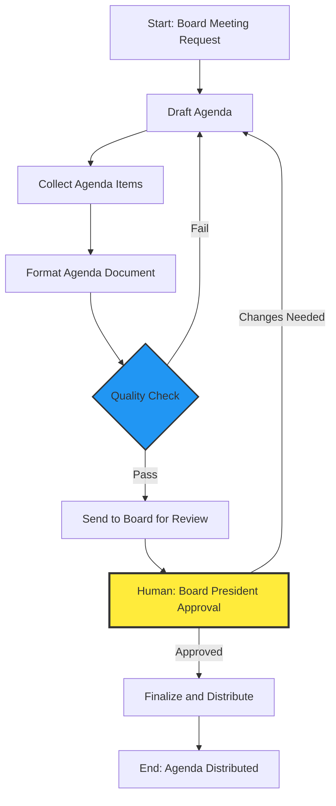
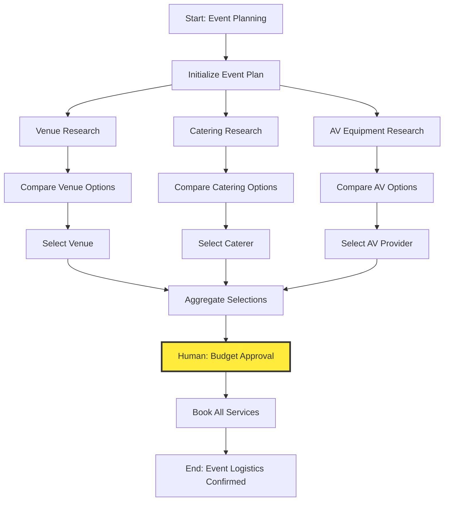
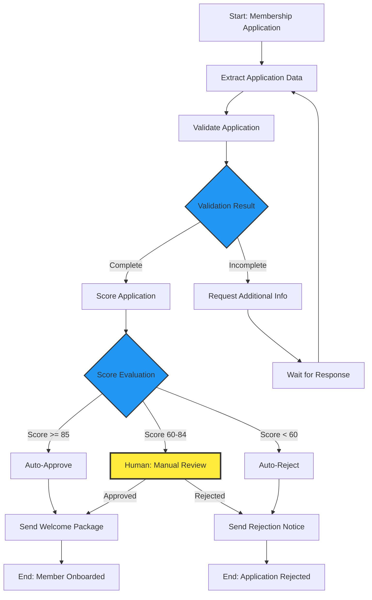

# LangGraph Workflow Mapping Command

Transform analyzed executive director responsibilities into comprehensive LangGraph workflow architecture. This command is the critical bridge between responsibility analysis and workflow generation—converting organizational requirements into executable AI agent workflows.

## COMMAND OVERVIEW

**Purpose:** Map executive director responsibilities to LangGraph workflow components (nodes, edges, state schemas, conditional logic, human approval gates).

**Input:** Analysis output from `/exec:analyze` or `/exec:extract` commands containing extracted responsibilities.

**Output:** Detailed workflow topology maps, node definitions, state schemas, edge relationships, checkpoint recommendations, and architecture documentation.

**Workflow Patterns Supported:**
- Sequential workflows (linear task chains)
- Parallel workflows (concurrent task execution)
- Conditional workflows (decision-based routing)
- Iterative workflows (loops and refinement cycles)
- Human-in-the-loop workflows (approval gates)
- Multi-agent workflows (agent collaboration)
- Event-driven workflows (trigger-based execution)

---

## EXECUTION PROTOCOL

You are the **Workflow Mapping Specialist**. Your mission is to:

1. **Load and analyze extracted responsibilities** from previous analysis phase
2. **Identify workflow patterns** and categorize by automation approach
3. **Map responsibilities to LangGraph node types** (agent, tool, human, decision)
4. **Define state schemas** for data flow between nodes
5. **Establish edge relationships** including conditional routing logic
6. **Identify human-in-the-loop checkpoints** for approval and oversight
7. **Generate comprehensive workflow visualizations** (Mermaid diagrams, topology maps)
8. **Produce architecture documentation** for workflow generation phase

---

## INPUT PARAMETERS

Parse the user's command to extract:

- **analysis-path**: Path to analysis output file (default: "latest" = most recent in `./automation-output/01-analysis/`)
- **--format**: Output format for workflow maps
  - `visual` (default) - Generate Mermaid diagrams, ASCII topology maps
  - `json` - Output structured JSON workflow definitions
  - `code` - Generate Python code stubs for LangGraph workflows
  - `all` - Generate all formats
- **--include-examples**: Include example implementations for each node type (default: false)
- **--output-dir**: Where to save mapping outputs (default: `./mapping-output`)

---

## OUTPUT STRUCTURE

Create the following output structure:

```
{output-dir}/
├── workflow-topology-maps/
│   ├── {responsibility-id}-topology.mermaid
│   ├── {responsibility-id}-topology.json
│   ├── {responsibility-id}-topology.txt (ASCII art)
│   └── ...
├── node-definitions/
│   ├── {responsibility-id}-nodes.json
│   ├── {responsibility-id}-nodes.md
│   └── ...
├── state-schemas/
│   ├── {responsibility-id}-state.json
│   ├── {responsibility-id}-state.py (TypedDict)
│   └── ...
├── edge-definitions/
│   ├── {responsibility-id}-edges.json
│   ├── {responsibility-id}-conditions.py
│   └── ...
├── human-checkpoints/
│   ├── {responsibility-id}-approvals.json
│   ├── checkpoint-matrix.md
│   └── ...
├── workflow-patterns/
│   ├── sequential-patterns.json
│   ├── parallel-patterns.json
│   ├── conditional-patterns.json
│   └── hybrid-patterns.json
├── architecture-diagrams/
│   ├── full-system-architecture.mermaid
│   ├── agent-interaction-map.mermaid
│   └── data-flow-diagram.mermaid
└── MAPPING-SUMMARY.md
```

---

## STEP 1: LOAD ANALYSIS RESULTS

### Objective
Load the extracted responsibilities from the analysis phase and prepare data structures for workflow mapping.

### Execution Steps

1. **Determine Analysis Source**
   ```python
   if analysis_path == "latest":
       # Find most recent analysis output
       analysis_files = Glob(pattern="**/01-analysis/responsibilities-extracted.json")
       analysis_path = get_most_recent(analysis_files)
   ```

2. **Read Analysis Data**
   ```python
   analysis_data = Read(file_path=analysis_path)
   responsibilities = parse_json(analysis_data)
   ```

3. **Validate Input Data**
   - Confirm required fields present: `id`, `title`, `description`, `frequency`, `complexity`
   - Check for automation_potential scores
   - Verify at least 5 responsibilities available for mapping
   - Validate JSON structure integrity

4. **Extract Metadata**
   ```python
   metadata = {
       "organization": analysis_data.get("organization"),
       "analysis_date": analysis_data.get("analysis_date"),
       "responsibilities_count": len(responsibilities),
       "source_documents": analysis_data.get("source_documents")
   }
   ```

5. **Initialize Output Structure**
   ```bash
   mkdir -p {output-dir}/workflow-topology-maps
   mkdir -p {output-dir}/node-definitions
   mkdir -p {output-dir}/state-schemas
   mkdir -p {output-dir}/edge-definitions
   mkdir -p {output-dir}/human-checkpoints
   mkdir -p {output-dir}/workflow-patterns
   mkdir -p {output-dir}/architecture-diagrams
   ```

---

## STEP 2: IDENTIFY WORKFLOW PATTERNS

### Objective
Analyze responsibilities to identify automation workflow patterns and categorize by complexity.

### Workflow Pattern Types

#### 2.1 Sequential Workflows
**Characteristics:**
- Linear task progression (A → B → C → D)
- Each step depends on previous step completion
- Single path through workflow
- No branching or parallel execution

**Example Responsibilities:**
- Board meeting minute preparation (Draft → Review → Approve → Distribute)
- Membership renewal processing (Notify → Receive Payment → Update Database → Send Confirmation)
- Monthly report generation (Collect Data → Analyze → Format → Send)

**LangGraph Structure:**
```python
workflow.add_edge("step_1", "step_2")
workflow.add_edge("step_2", "step_3")
workflow.add_edge("step_3", "step_4")
workflow.add_edge("step_4", END)
```

#### 2.2 Parallel Workflows
**Characteristics:**
- Multiple independent tasks execute simultaneously
- Tasks can be completed in any order
- Join point waits for all parallel tasks to complete
- Significant efficiency gains from parallelization

**Example Responsibilities:**
- Multi-channel communication campaigns (Email + Social Media + Website Update in parallel)
- Event planning logistics (Venue Booking || Catering || AV Setup || Marketing)
- Document review by multiple stakeholders (Board Member A || Board Member B || Board Member C)

**LangGraph Structure:**
```python
# Fork to parallel branches
workflow.add_edge("start", "task_a")
workflow.add_edge("start", "task_b")
workflow.add_edge("start", "task_c")

# Join at end node
workflow.add_edge("task_a", "join_node")
workflow.add_edge("task_b", "join_node")
workflow.add_edge("task_c", "join_node")
workflow.add_edge("join_node", END)
```

#### 2.3 Conditional Workflows
**Characteristics:**
- Decision points that route to different paths
- Conditional logic determines next step
- Multiple possible outcomes based on state
- Requires evaluation functions for routing

**Example Responsibilities:**
- Membership application review (Approve → Onboarding OR Deny → Send Rejection OR Request More Info → Wait)
- Budget variance analysis (Within Threshold → Auto-Approve OR Over Threshold → Escalate OR Negative Variance → Alert)
- Event registration (Available Spots → Confirm OR Waitlist → Notify OR Full → Redirect)

**LangGraph Structure:**
```python
def routing_function(state: WorkflowState) -> str:
    if state["score"] >= 0.8:
        return "approve_path"
    elif state["score"] >= 0.5:
        return "review_path"
    else:
        return "reject_path"

workflow.add_conditional_edges(
    "decision_node",
    routing_function,
    {
        "approve_path": "approve_node",
        "review_path": "human_review_node",
        "reject_path": "rejection_node"
    }
)
```

#### 2.4 Iterative Workflows
**Characteristics:**
- Loops that repeat until condition met
- Refinement cycles (Draft → Review → Revise → Review again)
- Retry logic for error recovery
- Maximum iteration limits to prevent infinite loops

**Example Responsibilities:**
- Grant proposal development (Draft → Review → Revise loop until approved)
- Policy document creation (Write → Feedback → Incorporate → Review cycle)
- Vendor negotiation (Propose → Counter → Revise loop until agreement)

**LangGraph Structure:**
```python
def should_continue(state: WorkflowState) -> str:
    if state["approved"] or state["iterations"] >= 5:
        return "finalize"
    else:
        return "revise"

workflow.add_conditional_edges(
    "review_node",
    should_continue,
    {
        "revise": "draft_node",  # Loop back
        "finalize": "finalize_node"
    }
)
```

#### 2.5 Human-in-the-Loop Workflows
**Characteristics:**
- Explicit approval gates requiring human decision
- Interrupt workflow execution for human input
- Capture human feedback and incorporate into state
- Resume workflow after human intervention

**Example Responsibilities:**
- Financial transaction approval (AI prepares → Human approves → AI executes)
- Legal document review (AI drafts → Lawyer reviews → AI finalizes)
- Hiring decisions (AI screens → Human interviews → AI onboards)

**LangGraph Structure:**
```python
from langgraph.checkpoint import MemorySaver

workflow.add_node("prepare_document", ai_prepare_function)
workflow.add_node("human_review", interrupt("awaiting_human_approval"))
workflow.add_node("finalize_document", ai_finalize_function)

workflow.add_edge("prepare_document", "human_review")
workflow.add_edge("human_review", "finalize_document")

# Use checkpointer for state persistence
memory = MemorySaver()
app = workflow.compile(checkpointer=memory)
```

#### 2.6 Multi-Agent Workflows
**Characteristics:**
- Multiple specialized AI agents collaborate
- Each agent has distinct role and capabilities
- Agents communicate via shared state
- Orchestrator coordinates agent interactions

**Example Responsibilities:**
- Strategic planning (Research Agent → Analysis Agent → Writing Agent → Review Agent)
- Event management (Logistics Agent || Marketing Agent || Finance Agent → Coordination Agent)
- Crisis response (Monitoring Agent → Assessment Agent → Communication Agent → Action Agent)

**LangGraph Structure:**
```python
workflow.add_node("research_agent", research_agent_function)
workflow.add_node("analysis_agent", analysis_agent_function)
workflow.add_node("writing_agent", writing_agent_function)
workflow.add_node("orchestrator", orchestrator_function)

workflow.add_edge("research_agent", "orchestrator")
workflow.add_edge("analysis_agent", "orchestrator")
workflow.add_edge("writing_agent", "orchestrator")
workflow.add_edge("orchestrator", END)
```

#### 2.7 Event-Driven Workflows
**Characteristics:**
- Triggered by external events or schedule
- Reactive workflows that activate on specific conditions
- May include webhook listeners or cron schedules
- Often combined with other workflow patterns

**Example Responsibilities:**
- Membership expiration notifications (Triggered by date thresholds)
- Payment processing (Triggered by payment gateway webhook)
- Emergency communications (Triggered by alert system)

**LangGraph Structure:**
```python
# External trigger invokes workflow
def handle_event_trigger(event_data: dict):
    initial_state = {
        "event_type": event_data["type"],
        "event_payload": event_data["payload"],
        "timestamp": event_data["timestamp"]
    }
    result = app.invoke(initial_state)
    return result
```

### Execution Steps for Pattern Identification

1. **Analyze Each Responsibility**
   - Extract task steps from description
   - Identify dependencies between steps
   - Check for decision points
   - Look for parallel execution opportunities
   - Identify human approval requirements

2. **Classify Workflow Pattern**
   ```python
   def classify_workflow_pattern(responsibility: dict) -> dict:
       pattern_indicators = {
           "sequential": has_linear_steps(responsibility),
           "parallel": has_independent_tasks(responsibility),
           "conditional": has_decision_points(responsibility),
           "iterative": has_refinement_cycles(responsibility),
           "human_in_loop": requires_human_approval(responsibility),
           "multi_agent": requires_multiple_specializations(responsibility),
           "event_driven": has_external_triggers(responsibility)
       }

       primary_pattern = max(pattern_indicators, key=pattern_indicators.get)
       secondary_patterns = [k for k, v in pattern_indicators.items() if v and k != primary_pattern]

       return {
           "primary_pattern": primary_pattern,
           "secondary_patterns": secondary_patterns,
           "hybrid": len(secondary_patterns) > 0
       }
   ```

3. **Calculate Pattern Complexity**
   ```python
   complexity_score = (
       num_nodes * 2 +
       num_conditional_edges * 5 +
       num_loops * 3 +
       num_human_checkpoints * 4 +
       num_parallel_branches * 2
   )
   ```

4. **Generate Pattern Summary**
   ```json
   {
     "responsibility_id": "resp_002",
     "title": "Member Communication Management",
     "workflow_pattern": {
       "primary": "sequential",
       "secondary": ["human_in_loop", "conditional"],
       "hybrid": true,
       "complexity_score": 18
     },
     "estimated_nodes": 6,
     "estimated_edges": 7,
     "human_checkpoints": 2,
     "parallel_branches": 0,
     "conditional_branches": 2
   }
   ```

---

## STEP 3: MAP TO LANGGRAPH NODE TYPES

### Objective
Convert each responsibility step into specific LangGraph node types with clear input/output contracts.

### LangGraph Node Types

#### 3.1 Agent Nodes
**Purpose:** Nodes powered by LLM agents that perform reasoning, analysis, or content generation.

**When to Use:**
- Requires natural language understanding or generation
- Needs decision-making based on context
- Involves creative tasks (writing, summarizing, ideation)
- Requires tool use (search, API calls, calculations)

**Node Structure:**
```python
from langchain_anthropic import ChatAnthropic
from langchain.agents import create_tool_calling_agent

def agent_node_name(state: WorkflowState) -> WorkflowState:
    """
    Agent node that performs {specific_task}.

    Inputs: state["{input_key}"]
    Outputs: state["{output_key}"]
    """
    llm = ChatAnthropic(model="claude-sonnet-4-5-20250929", temperature=0.3)

    prompt = ChatPromptTemplate.from_messages([
        ("system", "You are a specialized agent for {task_description}"),
        ("human", "{input}")
    ])

    agent = create_tool_calling_agent(llm, tools=[tool1, tool2], prompt=prompt)
    agent_executor = AgentExecutor(agent=agent, tools=[tool1, tool2])

    result = agent_executor.invoke({"input": state["input_key"]})

    state["output_key"] = result["output"]
    state["current_step"] = "agent_node_name"

    return state
```

**Example Mappings:**
- "Draft board meeting agenda" → `draft_agenda_agent_node`
- "Analyze budget variance" → `budget_analysis_agent_node`
- "Respond to member inquiry" → `member_inquiry_agent_node`
- "Summarize grant proposal" → `grant_summarization_agent_node`

#### 3.2 Tool Nodes
**Purpose:** Nodes that execute deterministic functions, API calls, or data transformations without LLM reasoning.

**When to Use:**
- Requires specific API integration (email, calendar, CRM)
- Performs data validation or transformation
- Executes calculations or database queries
- Retrieves external information

**Node Structure:**
```python
def tool_node_name(state: WorkflowState) -> WorkflowState:
    """
    Tool node that performs {specific_action}.

    Inputs: state["{input_key}"]
    Outputs: state["{output_key}"]
    """
    try:
        # Execute tool/API call
        result = execute_tool_function(
            param1=state["input_key"],
            param2=state["config_value"]
        )

        state["output_key"] = result
        state["errors"] = []

    except Exception as e:
        state["errors"].append({
            "node": "tool_node_name",
            "error": str(e),
            "timestamp": datetime.now().isoformat()
        })

    state["current_step"] = "tool_node_name"
    return state
```

**Example Mappings:**
- "Send email notification" → `send_email_tool_node`
- "Update member database" → `update_crm_tool_node`
- "Schedule calendar event" → `create_calendar_event_tool_node`
- "Process payment" → `payment_processing_tool_node`

#### 3.3 Human Nodes (Approval/Review)
**Purpose:** Interrupt workflow for human input, review, or approval before proceeding.

**When to Use:**
- Requires human judgment or expertise
- Involves financial transactions or legal commitments
- High-risk decisions needing oversight
- Creative approval (design, messaging, strategy)

**Node Structure:**
```python
from langgraph.checkpoint import interrupt

def human_review_node(state: WorkflowState) -> WorkflowState:
    """
    Human review checkpoint for {review_purpose}.

    Inputs: state["{content_to_review}"]
    Outputs: state["human_feedback"], state["approved"]
    """
    # Prepare review package for human
    review_package = {
        "content": state["content_to_review"],
        "context": state.get("context", ""),
        "recommendation": state.get("ai_recommendation", ""),
        "review_timestamp": datetime.now().isoformat()
    }

    state["review_package"] = review_package

    # Interrupt workflow - will resume when human provides input
    human_input = interrupt("awaiting_human_review")

    state["human_feedback"] = human_input.get("feedback", "")
    state["approved"] = human_input.get("approved", False)
    state["reviewer_id"] = human_input.get("reviewer_id", "")
    state["current_step"] = "human_review_node"

    return state
```

**Example Mappings:**
- "Board approval for budget" → `board_budget_approval_node`
- "Executive director review of communication" → `ed_communication_review_node`
- "Legal review of contract" → `legal_contract_review_node`
- "Finance approval of expenditure" → `finance_approval_node`

#### 3.4 Decision/Router Nodes
**Purpose:** Evaluate state and route workflow to different paths based on conditions.

**When to Use:**
- Multiple possible next steps based on data
- Error handling and retry logic
- Quality thresholds determining workflow path
- Business rule evaluation

**Node Structure:**
```python
def decision_router_node(state: WorkflowState) -> str:
    """
    Decision router that determines next workflow path.

    Inputs: state["{decision_criteria}"]
    Outputs: Path name (string) for conditional_edges
    """
    decision_criteria = state["decision_criteria"]

    # Evaluate business rules
    if decision_criteria["score"] >= 0.9:
        return "auto_approve_path"
    elif decision_criteria["score"] >= 0.6:
        return "human_review_path"
    elif decision_criteria["errors_count"] > 0:
        return "error_recovery_path"
    else:
        return "reject_path"

# Usage in workflow
workflow.add_conditional_edges(
    "decision_router_node",
    decision_router_node,
    {
        "auto_approve_path": "finalize_node",
        "human_review_path": "human_review_node",
        "error_recovery_path": "error_handler_node",
        "reject_path": "rejection_node"
    }
)
```

**Example Mappings:**
- "Evaluate membership application" → `membership_evaluation_router`
- "Check budget threshold" → `budget_threshold_router`
- "Assess event capacity" → `event_capacity_router`
- "Validate document completeness" → `document_validation_router`

#### 3.5 Aggregator/Join Nodes
**Purpose:** Combine results from parallel branches or multiple sources into unified output.

**When to Use:**
- After parallel execution branches
- Combining multi-agent outputs
- Merging data from multiple sources
- Synthesizing diverse inputs

**Node Structure:**
```python
def aggregator_join_node(state: WorkflowState) -> WorkflowState:
    """
    Aggregator that combines results from parallel branches.

    Inputs: state["branch_a_result"], state["branch_b_result"], state["branch_c_result"]
    Outputs: state["combined_result"]
    """
    branch_results = [
        state.get("branch_a_result"),
        state.get("branch_b_result"),
        state.get("branch_c_result")
    ]

    # Filter out None values
    valid_results = [r for r in branch_results if r is not None]

    # Combine/synthesize results
    combined_result = {
        "summary": synthesize_summaries([r["summary"] for r in valid_results]),
        "data": merge_data([r["data"] for r in valid_results]),
        "confidence": average([r["confidence"] for r in valid_results])
    }

    state["combined_result"] = combined_result
    state["current_step"] = "aggregator_join_node"

    return state
```

**Example Mappings:**
- "Combine stakeholder feedback" → `feedback_aggregator_node`
- "Merge research findings" → `research_synthesis_node`
- "Consolidate committee votes" → `vote_consolidation_node`
- "Aggregate multi-channel metrics" → `metrics_aggregator_node`

### Execution Steps for Node Mapping

1. **Parse Responsibility into Steps**
   ```python
   def extract_workflow_steps(responsibility: dict) -> list:
       """Extract discrete steps from responsibility description"""
       description = responsibility["description"]

       # Use LLM to identify workflow steps
       steps = llm_extract_steps(description)

       return [
           {
               "step_number": i,
               "step_name": step["name"],
               "step_description": step["description"],
               "step_type": step["type"]  # action, decision, review, etc.
           }
           for i, step in enumerate(steps, 1)
       ]
   ```

2. **Classify Each Step as Node Type**
   ```python
   def classify_node_type(step: dict) -> str:
       """Determine appropriate LangGraph node type"""

       keywords = {
           "agent": ["draft", "write", "analyze", "summarize", "generate", "respond"],
           "tool": ["send", "update", "create", "delete", "retrieve", "calculate"],
           "human": ["approve", "review", "decide", "sign", "authorize"],
           "decision": ["check", "evaluate", "assess", "validate", "route"],
           "aggregator": ["combine", "merge", "synthesize", "consolidate"]
       }

       step_text = (step["step_name"] + " " + step["step_description"]).lower()

       for node_type, type_keywords in keywords.items():
           if any(keyword in step_text for keyword in type_keywords):
               return node_type

       return "agent"  # Default to agent node
   ```

3. **Define Node Input/Output Contracts**
   ```python
   node_definition = {
       "node_id": f"node_{step_number}",
       "node_name": sanitize_name(step["step_name"]),
       "node_type": classified_node_type,
       "inputs": [
           {"key": "input_data", "type": "str", "required": True},
           {"key": "context", "type": "dict", "required": False}
       ],
       "outputs": [
           {"key": "output_data", "type": "str"},
           {"key": "confidence_score", "type": "float"}
       ],
       "error_handling": {
           "retry_count": 3,
           "timeout_seconds": 30,
           "fallback_node": "error_handler"
       }
   }
   ```

4. **Generate Node Code Stubs** (if `--format=code`)
   ```python
   Write(
       file_path=f"{output_dir}/node-definitions/{responsibility_id}-{node_name}.py",
       content=generate_node_code_stub(node_definition)
   )
   ```

---

## STEP 4: DEFINE STATE SCHEMAS

### Objective
Create comprehensive state schemas that define all data flowing through the workflow.

### State Schema Components

#### 4.1 Core State Fields
Every workflow state must include:

```python
from typing import TypedDict, Annotated, Sequence
from langgraph.graph import add_messages

class BaseWorkflowState(TypedDict):
    """Base state schema for all workflows"""

    # Workflow metadata
    workflow_id: str
    workflow_name: str
    execution_id: str
    started_at: str  # ISO timestamp

    # Current execution state
    current_step: str
    previous_steps: list[str]
    completed_steps: list[str]

    # Error tracking
    errors: list[dict]
    warnings: list[dict]

    # Human interaction
    human_feedback: str | None
    requires_human_review: bool
    review_status: str  # "pending", "approved", "rejected"

    # Messages (for agent communication)
    messages: Annotated[Sequence[dict], add_messages]
```

#### 4.2 Domain-Specific State Fields
Add fields specific to the responsibility domain:

```python
class MemberCommunicationState(BaseWorkflowState):
    """State schema for member communication workflows"""

    # Input data
    communication_type: str  # "email", "newsletter", "announcement"
    target_audience: list[str]  # member IDs or segments
    communication_purpose: str

    # Content generation
    draft_content: str
    final_content: str
    subject_line: str

    # Personalization
    personalization_data: dict[str, dict]  # member_id -> {name, interests, etc}

    # Approval workflow
    approval_required: bool
    approved_by: str | None
    approval_timestamp: str | None

    # Delivery tracking
    sent_count: int
    delivery_status: dict[str, str]  # member_id -> "sent"|"failed"|"pending"

    # Analytics
    open_rate: float
    click_rate: float
    response_count: int
```

#### 4.3 State Schema Patterns

**Accumulator Pattern** (for iterative refinement):
```python
class DocumentDraftingState(TypedDict):
    """State for iterative document drafting"""
    draft_versions: list[dict]  # History of all drafts
    current_draft: str
    revision_count: int
    feedback_history: list[dict]
    quality_score: float
```

**Fork-Join Pattern** (for parallel execution):
```python
class ParallelResearchState(TypedDict):
    """State for parallel research tasks"""
    research_tasks: list[dict]
    task_a_result: dict | None
    task_b_result: dict | None
    task_c_result: dict | None
    all_tasks_complete: bool
    combined_findings: dict
```

**Conditional Routing Pattern**:
```python
class ApplicationReviewState(TypedDict):
    """State for conditional application review"""
    application_data: dict
    automated_score: float
    score_threshold: float
    routing_decision: str  # "auto_approve"|"manual_review"|"reject"
    rejection_reason: str | None
    approval_conditions: list[str]
```

### Execution Steps for State Schema Definition

1. **Identify All Data Points**
   ```python
   def identify_state_fields(responsibility: dict, nodes: list) -> list:
       """Extract all data fields needed across workflow"""
       fields = set()

       # Add base fields
       fields.update(BASE_WORKFLOW_FIELDS)

       # Extract from responsibility description
       fields.update(extract_entities_from_description(responsibility["description"]))

       # Extract from node inputs/outputs
       for node in nodes:
           fields.update(node["inputs"])
           fields.update(node["outputs"])

       return list(fields)
   ```

2. **Define Field Types**
   ```python
   field_definitions = []
   for field_name in state_fields:
       field_type = infer_field_type(field_name, responsibility)
       field_required = is_field_required(field_name, nodes)
       field_default = get_field_default(field_name, field_type)

       field_definitions.append({
           "name": field_name,
           "type": field_type,
           "required": field_required,
           "default": field_default,
           "description": generate_field_description(field_name)
       })
   ```

3. **Generate TypedDict Code**
   ```python
   state_schema_code = f"""
from typing import TypedDict, Annotated, Sequence
from langgraph.graph import add_messages

class {responsibility["title"].replace(" ", "")}State(TypedDict):
    \"\"\"
    State schema for {responsibility["title"]} workflow.

    Responsibility ID: {responsibility["id"]}
    Generated: {datetime.now().isoformat()}
    \"\"\"

    # Base workflow fields
{generate_base_fields()}

    # Domain-specific fields
{generate_domain_fields(field_definitions)}
"""
   ```

4. **Save State Schema**
   ```python
   Write(
       file_path=f"{output_dir}/state-schemas/{responsibility_id}-state.py",
       content=state_schema_code
   )
   ```

---

## STEP 5: ESTABLISH EDGE RELATIONSHIPS

### Objective
Define all connections between nodes, including conditional routing logic and error handling paths.

### Edge Types

#### 5.1 Direct Edges (Unconditional)
Simple node-to-node connections with no branching:

```python
workflow.add_edge("node_a", "node_b")
workflow.add_edge("node_b", "node_c")
workflow.add_edge("node_c", END)
```

**Mapping Criteria:**
- Next step is always the same
- No decision logic required
- Linear workflow progression

#### 5.2 Conditional Edges (Decision-Based Routing)
Edges that route to different nodes based on state evaluation:

```python
def routing_function(state: WorkflowState) -> str:
    """Determine next node based on state"""
    if state["quality_score"] >= 0.9:
        return "publish"
    elif state["quality_score"] >= 0.7:
        return "review"
    else:
        return "revise"

workflow.add_conditional_edges(
    source="evaluate_quality",
    path=routing_function,
    path_map={
        "publish": "publish_node",
        "review": "human_review_node",
        "revise": "revision_node"
    }
)
```

**Mapping Criteria:**
- Multiple possible next steps
- Decision depends on data/context
- Business rules govern routing

#### 5.3 Loop Edges (Iterative Workflows)
Edges that create cycles for refinement or retry logic:

```python
def should_continue_loop(state: WorkflowState) -> str:
    """Decide whether to continue loop or exit"""
    if state["approved"] or state["iteration_count"] >= MAX_ITERATIONS:
        return "exit_loop"
    else:
        return "continue_loop"

workflow.add_conditional_edges(
    source="review_node",
    path=should_continue_loop,
    path_map={
        "continue_loop": "draft_node",  # Loop back
        "exit_loop": "finalize_node"
    }
)
```

**Mapping Criteria:**
- Iterative refinement needed
- Quality thresholds not met
- Retry after failure
- Maximum iteration limit enforced

#### 5.4 Fan-Out Edges (Parallel Execution)
Single source node connecting to multiple parallel nodes:

```python
# Start parallel execution
workflow.add_edge("start_parallel", "task_a")
workflow.add_edge("start_parallel", "task_b")
workflow.add_edge("start_parallel", "task_c")
```

**Mapping Criteria:**
- Tasks are independent
- Can execute simultaneously
- No data dependencies between parallel tasks

#### 5.5 Fan-In Edges (Join After Parallel)
Multiple parallel nodes converging to single aggregator node:

```python
# Join parallel results
workflow.add_edge("task_a", "join_node")
workflow.add_edge("task_b", "join_node")
workflow.add_edge("task_c", "join_node")
workflow.add_edge("join_node", END)
```

**Mapping Criteria:**
- All parallel tasks complete before proceeding
- Results must be combined/synthesized
- Single continuation point needed

### Edge Definition Structure

```json
{
  "edge_id": "edge_001",
  "source_node": "draft_agenda_node",
  "target_node": "review_agenda_node",
  "edge_type": "direct",
  "condition": null,
  "condition_description": null,
  "error_handling": {
    "on_source_failure": "error_handler_node",
    "timeout_seconds": 60,
    "retry_policy": {
      "max_retries": 3,
      "backoff_multiplier": 2
    }
  },
  "metadata": {
    "created_by": "workflow_mapping_agent",
    "created_at": "2025-12-17T10:00:00Z"
  }
}
```

### Conditional Edge Function Templates

**Threshold-Based Routing:**
```python
def threshold_router(state: WorkflowState) -> str:
    """Route based on numeric threshold"""
    value = state["metric_value"]
    threshold_high = state.get("threshold_high", 0.8)
    threshold_low = state.get("threshold_low", 0.5)

    if value >= threshold_high:
        return "high_path"
    elif value >= threshold_low:
        return "medium_path"
    else:
        return "low_path"
```

**Approval Status Router:**
```python
def approval_router(state: WorkflowState) -> str:
    """Route based on approval status"""
    if state.get("approved", False):
        return "approved_path"
    elif state.get("requires_revision", False):
        return "revision_path"
    else:
        return "rejected_path"
```

**Error Recovery Router:**
```python
def error_recovery_router(state: WorkflowState) -> str:
    """Route based on error presence"""
    if not state.get("errors"):
        return "success_path"
    elif state.get("retry_count", 0) < 3:
        return "retry_path"
    else:
        return "failure_path"
```

### Execution Steps for Edge Definition

1. **Map Node Relationships**
   ```python
   def map_node_relationships(nodes: list, pattern: dict) -> list:
       """Determine edge connections between nodes"""
       edges = []

       for i, node in enumerate(nodes):
           if i < len(nodes) - 1:
               next_node = nodes[i + 1]

               # Check if decision point
               if node["node_type"] == "decision":
                   edges.append(create_conditional_edge(node, next_node))
               else:
                   edges.append(create_direct_edge(node, next_node))

       return edges
   ```

2. **Define Conditional Logic**
   ```python
   def generate_conditional_function(decision_node: dict) -> str:
       """Generate Python code for conditional routing function"""

       function_code = f"""
def {decision_node['node_name']}_router(state: WorkflowState) -> str:
    \"\"\"Route based on {decision_node['decision_criteria']}\"\"\"

    {generate_condition_logic(decision_node)}

    return selected_path
"""
       return function_code
   ```

3. **Save Edge Definitions**
   ```python
   Write(
       file_path=f"{output_dir}/edge-definitions/{responsibility_id}-edges.json",
       content=json.dumps(edges, indent=2)
   )

   if format_includes_code:
       Write(
           file_path=f"{output_dir}/edge-definitions/{responsibility_id}-conditions.py",
           content=generate_all_conditional_functions(edges)
       )
   ```

---

## STEP 6: IDENTIFY HUMAN-IN-THE-LOOP CHECKPOINTS

### Objective
Determine where human review, approval, or input is required within workflows.

### Checkpoint Categories

#### 6.1 Financial Approval Checkpoints
**Triggers:**
- Transactions above dollar threshold
- Budget allocation changes
- Contract signing
- Grant fund disbursement

**Checkpoint Structure:**
```python
{
    "checkpoint_id": "fin_approval_001",
    "checkpoint_type": "financial_approval",
    "trigger_node": "prepare_payment_node",
    "approval_node": "finance_director_approval",
    "resume_node": "execute_payment_node",
    "threshold": {
        "amount_usd": 1000,
        "condition": "greater_than_or_equal"
    },
    "approver_roles": ["finance_director", "treasurer"],
    "timeout_hours": 48,
    "escalation_after_timeout": "board_president"
}
```

#### 6.2 Legal Review Checkpoints
**Triggers:**
- Contract execution
- Policy creation/modification
- Public statements on sensitive topics
- Compliance-related documents

**Checkpoint Structure:**
```python
{
    "checkpoint_id": "legal_review_001",
    "checkpoint_type": "legal_review",
    "trigger_node": "draft_contract_node",
    "review_node": "legal_counsel_review",
    "resume_node": "finalize_contract_node",
    "review_criteria": [
        "liability_exposure",
        "regulatory_compliance",
        "organizational_risk"
    ],
    "approver_roles": ["legal_counsel", "executive_director"],
    "required_approvals": 1,
    "timeout_hours": 72
}
```

#### 6.3 Quality Assurance Checkpoints
**Triggers:**
- Content publication (website, social media, newsletter)
- External communications
- Member-facing documents
- Brand representation

**Checkpoint Structure:**
```python
{
    "checkpoint_id": "qa_review_001",
    "checkpoint_type": "quality_assurance",
    "trigger_node": "generate_newsletter_node",
    "review_node": "communications_director_review",
    "resume_node": "send_newsletter_node",
    "review_criteria": [
        "brand_consistency",
        "messaging_accuracy",
        "professional_tone",
        "grammar_spelling"
    ],
    "approver_roles": ["communications_director", "executive_director"],
    "auto_approve_threshold": 0.95,  # AI confidence score
    "timeout_hours": 24
}
```

#### 6.4 Strategic Decision Checkpoints
**Triggers:**
- Policy changes
- Strategic plan modifications
- Partnership decisions
- Major program launches

**Checkpoint Structure:**
```python
{
    "checkpoint_id": "strategic_decision_001",
    "checkpoint_type": "strategic_decision",
    "trigger_node": "analyze_partnership_proposal_node",
    "review_node": "board_strategic_review",
    "resume_node": "execute_partnership_node",
    "review_criteria": [
        "mission_alignment",
        "strategic_fit",
        "resource_requirements",
        "risk_assessment"
    ],
    "approver_roles": ["board_president", "executive_director"],
    "required_approvals": 2,
    "timeout_hours": 168  # 1 week
}
```

### Checkpoint Matrix

Generate a matrix showing all checkpoints across workflows:

```markdown
| Workflow | Checkpoint Type | Trigger | Approver | Timeout |
|----------|----------------|---------|----------|---------|
| Member Communication | Quality Assurance | Before sending newsletter | Communications Dir | 24h |
| Budget Adjustment | Financial Approval | Amount > $1000 | Finance Dir | 48h |
| Contract Execution | Legal Review | Before contract signing | Legal Counsel | 72h |
| Policy Creation | Strategic Decision | Before policy adoption | Board President | 168h |
```

### Execution Steps for Checkpoint Identification

1. **Analyze Responsibility for Approval Requirements**
   ```python
   def identify_checkpoints(responsibility: dict, nodes: list) -> list:
       """Identify where human approval is needed"""
       checkpoints = []

       approval_keywords = {
           "financial": ["payment", "budget", "expenditure", "transaction", "contract"],
           "legal": ["legal", "contract", "compliance", "policy", "agreement"],
           "quality": ["publish", "send", "communicate", "announce", "release"],
           "strategic": ["partnership", "strategic", "policy", "program", "initiative"]
       }

       for node in nodes:
           for checkpoint_type, keywords in approval_keywords.items():
               if any(kw in node["node_name"].lower() for kw in keywords):
                   checkpoints.append(create_checkpoint(node, checkpoint_type))

       return checkpoints
   ```

2. **Define Checkpoint Configuration**
   ```python
   def create_checkpoint(node: dict, checkpoint_type: str) -> dict:
       """Create checkpoint configuration"""
       return {
           "checkpoint_id": f"{checkpoint_type}_{node['node_id']}",
           "checkpoint_type": checkpoint_type,
           "trigger_node": node["node_id"],
           "approval_node": f"{node['node_id']}_approval",
           "resume_node": get_next_node(node),
           "approver_roles": get_approver_roles(checkpoint_type),
           "timeout_hours": get_timeout_hours(checkpoint_type),
           "escalation_policy": get_escalation_policy(checkpoint_type)
       }
   ```

3. **Generate Checkpoint Documentation**
   ```python
   Write(
       file_path=f"{output_dir}/human-checkpoints/{responsibility_id}-approvals.json",
       content=json.dumps(checkpoints, indent=2)
   )
   ```

---

## STEP 7: GENERATE WORKFLOW VISUALIZATIONS

### Objective
Create visual representations of workflow topology for human understanding and validation.

### Visualization Formats

#### 7.1 Mermaid Flowchart Diagrams

**Sequential Workflow Example:**


**Parallel Workflow Example:**


**Conditional Workflow Example:**


#### 7.2 ASCII Topology Maps

For terminal/text-only viewing:

```
Board Meeting Agenda Workflow
==============================

    [Start]
       |
       v
  [Draft Agenda]
       |
       v
  [Collect Items] <-------+
       |                  |
       v                  |
  [Format Document]       |
       |                  |
       v                  |
    {Quality?}            |
     /     \              |
   Yes     No-------------+
    |
    v
  [Send to Board]
       |
       v
  [[Human Review]] <-----+
    /        \           |
Approved  Changes--------+
   |
   v
[Distribute]
   |
   v
 [End]

Legend:
  [ ] = Agent/Tool Node
  { } = Decision Node
  [[ ]] = Human Checkpoint
```

#### 7.3 JSON Topology Definitions

Machine-readable format for programmatic processing:

```json
{
  "workflow_id": "workflow_resp_001",
  "workflow_name": "Board Meeting Agenda Workflow",
  "topology": {
    "nodes": [
      {
        "id": "node_1",
        "name": "draft_agenda",
        "type": "agent",
        "position": {"x": 100, "y": 50}
      },
      {
        "id": "node_2",
        "name": "collect_items",
        "type": "tool",
        "position": {"x": 100, "y": 150}
      },
      {
        "id": "node_3",
        "name": "quality_check",
        "type": "decision",
        "position": {"x": 100, "y": 250}
      },
      {
        "id": "node_4",
        "name": "board_president_approval",
        "type": "human",
        "position": {"x": 100, "y": 350}
      }
    ],
    "edges": [
      {
        "id": "edge_1",
        "source": "node_1",
        "target": "node_2",
        "type": "direct"
      },
      {
        "id": "edge_2",
        "source": "node_2",
        "target": "node_3",
        "type": "direct"
      },
      {
        "id": "edge_3",
        "source": "node_3",
        "target": "node_4",
        "type": "conditional",
        "condition": "quality_passed"
      },
      {
        "id": "edge_4",
        "source": "node_3",
        "target": "node_1",
        "type": "conditional",
        "condition": "quality_failed"
      }
    ]
  },
  "metadata": {
    "complexity_score": 15,
    "estimated_execution_time_seconds": 120,
    "human_checkpoints": 1,
    "parallel_branches": 0
  }
}
```

### Execution Steps for Visualization Generation

1. **Generate Mermaid Diagrams**
   ```python
   def generate_mermaid_diagram(nodes: list, edges: list, checkpoints: list) -> str:
       """Generate Mermaid flowchart syntax"""

       mermaid_code = "graph TD\n"

       # Add nodes
       for node in nodes:
           node_shape = get_node_shape(node["node_type"])
           mermaid_code += f"    {node['id']}{node_shape[0]}{node['name']}{node_shape[1]}\n"

       # Add edges
       for edge in edges:
           if edge["type"] == "direct":
               mermaid_code += f"    {edge['source']} --> {edge['target']}\n"
           elif edge["type"] == "conditional":
               mermaid_code += f"    {edge['source']} -->|{edge['condition']}| {edge['target']}\n"

       # Style human checkpoints
       for checkpoint in checkpoints:
           mermaid_code += f"    style {checkpoint['approval_node']} fill:#ffeb3b,stroke:#333,stroke-width:3px\n"

       return mermaid_code
   ```

2. **Generate ASCII Topology**
   ```python
   def generate_ascii_topology(nodes: list, edges: list) -> str:
       """Generate text-based topology map"""

       ascii_map = f"{workflow_name} Workflow\n"
       ascii_map += "=" * len(f"{workflow_name} Workflow") + "\n\n"

       # Build linear representation (simplified)
       for i, node in enumerate(nodes):
           node_symbol = get_ascii_symbol(node["node_type"])
           ascii_map += f"  {node_symbol}{node['name']}{node_symbol}\n"

           if i < len(nodes) - 1:
               ascii_map += "       |\n       v\n"

       return ascii_map
   ```

3. **Save All Visualizations**
   ```python
   for responsibility in responsibilities:
       resp_id = responsibility["id"]

       # Mermaid
       Write(
           file_path=f"{output_dir}/workflow-topology-maps/{resp_id}-topology.mermaid",
           content=generate_mermaid_diagram(...)
       )

       # ASCII
       Write(
           file_path=f"{output_dir}/workflow-topology-maps/{resp_id}-topology.txt",
           content=generate_ascii_topology(...)
       )

       # JSON
       Write(
           file_path=f"{output_dir}/workflow-topology-maps/{resp_id}-topology.json",
           content=json.dumps(generate_json_topology(...), indent=2)
       )
   ```

---

## STEP 8: GENERATE MAPPING SUMMARY

### Objective
Create comprehensive documentation of all mapping decisions, patterns identified, and workflow recommendations.

### Summary Structure

```markdown
# LangGraph Workflow Mapping Summary

**Organization:** {organization_name}
**Analysis Date:** {analysis_date}
**Mapping Date:** {mapping_date}
**Responsibilities Mapped:** {count}
**Workflows Generated:** {count}

---

## Executive Summary

{2-3 paragraph overview of mapping results}

**Key Findings:**
- Total workflows mapped: {count}
- Most common workflow pattern: {pattern}
- Average workflow complexity: {score}
- Total human checkpoints: {count}
- Estimated development effort: {person-hours} hours

---

## Workflow Pattern Distribution

| Pattern | Count | % of Total | Avg Complexity |
|---------|-------|------------|----------------|
| Sequential | {count} | {pct}% | {score} |
| Parallel | {count} | {pct}% | {score} |
| Conditional | {count} | {pct}% | {score} |
| Iterative | {count} | {pct}% | {score} |
| Human-in-Loop | {count} | {pct}% | {score} |
| Multi-Agent | {count} | {pct}% | {score} |
| Event-Driven | {count} | {pct}% | {score} |
| Hybrid | {count} | {pct}% | {score} |

---

## Node Type Distribution

| Node Type | Count | % of Total |
|-----------|-------|------------|
| Agent | {count} | {pct}% |
| Tool | {count} | {pct}% |
| Human | {count} | {pct}% |
| Decision | {count} | {pct}% |
| Aggregator | {count} | {pct}% |

---

## Workflow Complexity Analysis

**Top 5 Most Complex Workflows:**
1. {workflow_name} - Complexity Score: {score}
2. {workflow_name} - Complexity Score: {score}
3. ...

**Top 5 Simplest Workflows:**
1. {workflow_name} - Complexity Score: {score}
2. {workflow_name} - Complexity Score: {score}
3. ...

**Complexity Distribution:**
- Low (0-10): {count} workflows
- Medium (11-25): {count} workflows
- High (26-50): {count} workflows
- Very High (51+): {count} workflows

---

## Human Checkpoint Analysis

**Total Checkpoints:** {count}

**Checkpoint Type Distribution:**
| Type | Count | Avg Timeout (hours) |
|------|-------|---------------------|
| Financial Approval | {count} | {hours} |
| Legal Review | {count} | {hours} |
| Quality Assurance | {count} | {hours} |
| Strategic Decision | {count} | {hours} |

**Most Critical Checkpoints:**
1. {checkpoint} - {workflow} - Required Approvals: {count}
2. {checkpoint} - {workflow} - Required Approvals: {count}
3. ...

---

## State Schema Complexity

**Average State Fields per Workflow:** {count}

**Most Complex State Schemas:**
1. {workflow_name} - {count} fields
2. {workflow_name} - {count} fields
3. ...

**Common State Field Categories:**
- Workflow metadata: {count} fields
- Business data: {count} fields
- Error tracking: {count} fields
- Human interaction: {count} fields

---

## Recommendations

### High-Priority Workflows (Implement First)
1. **{workflow_name}** - {reason}
2. **{workflow_name}** - {reason}
3. ...

### Medium-Priority Workflows
1. **{workflow_name}** - {reason}
2. **{workflow_name}** - {reason}
3. ...

### Low-Priority Workflows (Future Consideration)
1. **{workflow_name}** - {reason}
2. **{workflow_name}** - {reason}
3. ...

### Architecture Recommendations
- {recommendation_1}
- {recommendation_2}
- {recommendation_3}

### Integration Recommendations
- {integration_1}
- {integration_2}
- {integration_3}

---

## Next Steps

### Phase 1: Setup (Week 1)
- [ ] Set up LangGraph development environment
- [ ] Configure LLM API access (Claude, OpenAI)
- [ ] Establish state persistence (checkpointer)
- [ ] Create base workflow templates

### Phase 2: Core Workflows (Weeks 2-4)
- [ ] Implement top 5 high-priority workflows
- [ ] Test workflows with sample data
- [ ] Configure human checkpoint interrupts
- [ ] Set up monitoring and logging

### Phase 3: Refinement (Weeks 5-6)
- [ ] Implement medium-priority workflows
- [ ] Conduct user acceptance testing
- [ ] Optimize performance and costs
- [ ] Create operator documentation

### Phase 4: Deployment (Week 7)
- [ ] Deploy to production environment
- [ ] Train users on workflow interaction
- [ ] Establish support procedures
- [ ] Begin monitoring and iteration

---

## Appendices

### Appendix A: Full Workflow Inventory
{table_of_all_workflows}

### Appendix B: Node Definition Reference
{node_definitions}

### Appendix C: State Schema Reference
{state_schemas}

### Appendix D: Edge Condition Reference
{edge_conditions}

### Appendix E: Human Checkpoint Matrix
{checkpoint_matrix}

---

**Generated by:** exec-automator mapping command
**Mapping Engine:** Claude Sonnet 4.5
**Contact:** {contact_email}
```

### Save Mapping Summary

```python
Write(
    file_path=f"{output_dir}/MAPPING-SUMMARY.md",
    content=generate_mapping_summary(all_mappings)
)
```

---

## STEP 9: ARCHIVE TO OBSIDIAN

### Objective
Document all mapping results in Obsidian vault for long-term reference and integration with other project documentation.

### Execution Steps

1. **Create Mapping Documentation**
   ```python
   obsidian_content = f"""
---
title: Workflow Mapping - {organization_name}
created: {datetime.now().isoformat()}
tags:
  - exec-automator
  - workflow-mapping
  - langgraph
  - org/{organization_slug}
status: completed
---

# Workflow Mapping: {organization_name}

## Overview

{mapping_summary}

## Workflows Mapped

{workflow_list}

## Architecture Diagrams

{mermaid_diagrams}

## Next Steps

{next_steps}

## Related Documents

- [[Repositories/{org}/exec-automator|Exec Automator]]
- [[Projects/Exec-Automator/README|Project Overview]]
- [[Projects/Exec-Automator/Analyses/{org}-analysis|Analysis Phase]]
"""
   ```

2. **Archive to Obsidian**
   ```python
   mcp__obsidian__obsidian_append_content(
       filepath=f"Projects/Exec-Automator/Mappings/{organization_name}-workflow-mapping.md",
       content=obsidian_content
   )
   ```

3. **Create Cross-References**
   ```python
   # Link from analysis phase to mapping phase
   mcp__obsidian__obsidian_append_content(
       filepath=f"Projects/Exec-Automator/Analyses/{organization_name}-analysis.md",
       content=f"\n\n## Workflow Mapping\n\nSee [[Projects/Exec-Automator/Mappings/{organization_name}-workflow-mapping|Workflow Mapping Results]]\n"
   )
   ```

---

## PROGRESS TRACKING

Use TodoWrite to track mapping progress:

```python
TodoWrite(todos=[
    {
        "content": "Load analysis results and validate input data",
        "activeForm": "Loading analysis results",
        "status": "in_progress"
    },
    {
        "content": "Identify workflow patterns and classify responsibilities",
        "activeForm": "Identifying workflow patterns",
        "status": "pending"
    },
    {
        "content": "Map responsibilities to LangGraph node types",
        "activeForm": "Mapping to node types",
        "status": "pending"
    },
    {
        "content": "Define state schemas for all workflows",
        "activeForm": "Defining state schemas",
        "status": "pending"
    },
    {
        "content": "Establish edge relationships and conditional logic",
        "activeForm": "Establishing edge relationships",
        "status": "pending"
    },
    {
        "content": "Identify human-in-the-loop checkpoints",
        "activeForm": "Identifying human checkpoints",
        "status": "pending"
    },
    {
        "content": "Generate workflow visualizations (Mermaid, ASCII, JSON)",
        "activeForm": "Generating visualizations",
        "status": "pending"
    },
    {
        "content": "Create comprehensive mapping summary documentation",
        "activeForm": "Creating mapping summary",
        "status": "pending"
    },
    {
        "content": "Archive all results to Obsidian vault",
        "activeForm": "Archiving to Obsidian",
        "status": "pending"
    }
])
```

---

## ERROR HANDLING

### Common Errors and Recovery

1. **Analysis File Not Found**
   - Error: `Cannot locate analysis file at {path}`
   - Recovery: List available analysis files, prompt user to select
   - Fallback: Search for most recent analysis in default directories

2. **Invalid Analysis Format**
   - Error: `Analysis file missing required fields`
   - Recovery: Validate schema, identify missing fields, prompt for manual input
   - Fallback: Use default values for non-critical fields

3. **Workflow Too Complex**
   - Error: `Workflow complexity score exceeds threshold ({score} > 100)`
   - Recovery: Break into sub-workflows, create hierarchical workflow structure
   - Fallback: Flag for manual review by architect

4. **Visualization Generation Failure**
   - Error: `Cannot generate Mermaid diagram`
   - Recovery: Validate node/edge structure, retry with simplified graph
   - Fallback: Generate ASCII topology instead

---

## EXECUTION SUMMARY

When the user runs `/exec:map`:

1. **Parse command arguments** - Extract analysis path, format, output directory
2. **Load analysis results** - Read responsibilities from analysis phase
3. **Identify workflow patterns** - Classify each responsibility by workflow pattern
4. **Map to LangGraph nodes** - Convert steps to node types (agent, tool, human, decision)
5. **Define state schemas** - Create TypedDict schemas for data flow
6. **Establish edge relationships** - Define connections and conditional routing
7. **Identify human checkpoints** - Determine approval gates and review points
8. **Generate visualizations** - Create Mermaid diagrams, ASCII maps, JSON topology
9. **Create mapping summary** - Document all decisions and recommendations
10. **Archive to Obsidian** - Save results to vault with cross-references

**Remember:**
- This is the critical bridge between analysis and generation phases
- Focus on clear, implementable LangGraph patterns
- Document all architectural decisions
- Provide actionable recommendations for implementation priority
- Generate comprehensive visualizations for stakeholder communication

**Model Usage:**
- Use Sonnet 4.5 for pattern identification and mapping logic
- Use Opus 4.5 for complex architectural decisions (if needed)
- Use Haiku for visualization generation and documentation formatting

Begin mapping now.
