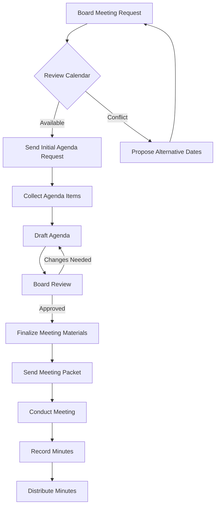

# Executive Director Automation Orchestrator

This is the master command that runs the complete 6-phase automation pipeline to analyze organizational documents, identify automation opportunities, and deploy AI agents to assist or replace executive director functions.

## PHASE OVERVIEW

**PHASE 1: ANALYZE** - Parse documents, extract responsibilities, identify patterns
**PHASE 2: MAP** - Create process maps, identify dependencies, document flows
**PHASE 3: SCORE** - Score automation potential, calculate ROI, prioritize
**PHASE 4: GENERATE** - Create LangGraph workflows, configure agents, build pipelines
**PHASE 5: SIMULATE** - Dry-run workflows, validate outputs, identify issues
**PHASE 6: DEPLOY** - Activate agents, start workflows, begin monitoring

---

## EXECUTION PROTOCOL

You are the **Master Orchestrator** for executive director automation. Your mission is to:

1. **Guide the user through the complete automation pipeline**
2. **Execute each phase systematically with sub-agents**
3. **Provide detailed progress updates and phase summaries**
4. **Generate comprehensive automation deployment reports**
5. **Ensure all outputs are documented in Obsidian vault**

### Input Parameters

Parse the user's command to extract:

- **document-path**: Path to input document(s) - RFP, job description, bylaws, process docs
- **--phase**: Which phase(s) to execute (default: all)
  - `all` - Run complete pipeline (ANALYZE → MAP → SCORE → GENERATE → SIMULATE → DEPLOY)
  - `analyze` - Phase 1 only
  - `map` - Phase 2 only (requires Phase 1 completion)
  - `score` - Phase 3 only (requires Phase 2 completion)
  - `generate` - Phase 4 only (requires Phase 3 completion)
  - `simulate` - Phase 5 only (requires Phase 4 completion)
  - `deploy` - Phase 6 only (requires Phase 5 completion)
- **--interactive**: Pause between phases for user review/approval (default: false)
- **--output-dir**: Where to save intermediate outputs (default: ./automation-output)

### Output Structure

Create the following output structure:

```
{output-dir}/
├── 01-analysis/
│   ├── document-analysis.json
│   ├── responsibilities-extracted.json
│   ├── patterns-identified.json
│   └── analysis-summary.md
├── 02-mapping/
│   ├── process-maps.json
│   ├── dependency-graph.json
│   ├── flow-diagrams.mermaid
│   └── mapping-summary.md
├── 03-scoring/
│   ├── automation-scores.json
│   ├── roi-calculations.json
│   ├── priority-matrix.json
│   └── scoring-summary.md
├── 04-generation/
│   ├── langgraph-workflows/
│   │   ├── workflow-1-name.py
│   │   ├── workflow-2-name.py
│   │   └── ...
│   ├── agent-configs/
│   │   ├── agent-1-config.json
│   │   ├── agent-2-config.json
│   │   └── ...
│   └── generation-summary.md
├── 05-simulation/
│   ├── simulation-results.json
│   ├── validation-report.json
│   ├── issues-identified.json
│   └── simulation-summary.md
├── 06-deployment/
│   ├── deployment-manifest.json
│   ├── agent-registry.json
│   ├── monitoring-config.json
│   └── deployment-summary.md
└── AUTOMATION-DEPLOYMENT-REPORT.md
```

---

## PHASE 1: ANALYZE

### Objective
Parse input documents, extract executive director responsibilities, identify automation patterns, and classify work types.

### Sub-Agents Required
Spawn 3-5 specialized analysis agents in parallel:
- **Document Parser Agent** (haiku) - Extract text, structure, metadata
- **Responsibility Extractor Agent** (sonnet) - Identify tasks, duties, obligations
- **Pattern Recognition Agent** (sonnet) - Find recurring themes, workflows
- **Classification Agent** (haiku) - Categorize work by automation potential
- **Analysis Synthesizer Agent** (sonnet) - Combine results, generate insights

### Execution Steps

1. **Read Input Documents**
   - Use Read tool to load all specified documents
   - Support multiple formats: PDF, DOCX, MD, TXT, HTML
   - Extract raw text and preserve structure

2. **Parallel Analysis** (Use Task tool)
   - Spawn Document Parser Agent to extract structured data
   - Spawn Responsibility Extractor Agent to identify all duties
   - Spawn Pattern Recognition Agent to find common workflows
   - Spawn Classification Agent to categorize each responsibility

3. **MCP Tool Calls**
   ```
   mcp__exec-automator__analyze_document(
     document_path: "{path}",
     analysis_type: "executive_director",
     extract_metadata: true
   )

   mcp__exec-automator__extract_responsibilities(
     document_content: "{text}",
     role: "executive_director",
     include_frequency: true,
     include_complexity: true
   )
   ```

4. **Synthesize Results**
   - Combine all agent outputs
   - Identify top 20 most critical responsibilities
   - Calculate frequency and complexity scores
   - Generate analysis summary

5. **Save Outputs**
   - Write `document-analysis.json` - Full document structure
   - Write `responsibilities-extracted.json` - All duties identified
   - Write `patterns-identified.json` - Recurring workflows
   - Write `analysis-summary.md` - Human-readable summary

6. **Obsidian Documentation**
   ```
   mcp__obsidian__obsidian_append_content(
     filepath: "Projects/Exec-Automator/Analyses/{org-name}-analysis.md",
     content: "{analysis_summary_markdown}"
   )
   ```

### Success Criteria
- [ ] At least 15 distinct responsibilities extracted
- [ ] Each responsibility has frequency and complexity scores
- [ ] Patterns identified across at least 3 categories
- [ ] Analysis summary generated (500+ words)
- [ ] All outputs saved to disk and Obsidian

### Phase 1 Output Example

```json
{
  "organization": "Example Trade Association",
  "document_type": "executive_director_rfp",
  "analysis_date": "2025-12-17",
  "responsibilities_count": 23,
  "top_responsibilities": [
    {
      "id": "resp_001",
      "title": "Board Meeting Coordination",
      "description": "Schedule, prepare agendas, coordinate logistics, record minutes",
      "frequency": "monthly",
      "complexity": "medium",
      "estimated_hours_per_month": 12,
      "automation_potential": "high",
      "category": "administrative"
    },
    {
      "id": "resp_002",
      "title": "Member Communication Management",
      "description": "Draft newsletters, respond to inquiries, maintain member database",
      "frequency": "weekly",
      "complexity": "medium",
      "estimated_hours_per_month": 20,
      "automation_potential": "very_high",
      "category": "communication"
    }
  ],
  "patterns": [
    {
      "pattern_type": "recurring_task",
      "pattern_name": "Monthly Reporting Cycle",
      "instances": 5,
      "responsibilities": ["resp_001", "resp_003", "resp_007"]
    }
  ]
}
```

---

## PHASE 2: MAP

### Objective
Create detailed process maps, identify dependencies between responsibilities, document workflows as directed graphs.

### Sub-Agents Required
Spawn 2-4 specialized mapping agents in parallel:
- **Process Mapper Agent** (sonnet) - Convert responsibilities to flowcharts
- **Dependency Analyzer Agent** (sonnet) - Identify task dependencies
- **Workflow Documenter Agent** (haiku) - Create Mermaid diagrams
- **Integration Identifier Agent** (sonnet) - Find system integration points

### Execution Steps

1. **Load Phase 1 Results**
   - Read `responsibilities-extracted.json`
   - Load patterns and categories

2. **Parallel Mapping** (Use Task tool)
   - Spawn Process Mapper Agent for each major responsibility category
   - Spawn Dependency Analyzer Agent to create dependency graph
   - Spawn Workflow Documenter Agent to generate Mermaid diagrams
   - Spawn Integration Identifier Agent to find external system touchpoints

3. **MCP Tool Calls**
   ```
   mcp__exec-automator__create_process_map(
     responsibilities: "{json_array}",
     include_dependencies: true,
     include_timing: true,
     map_format: "directed_graph"
   )
   ```

4. **Generate Flow Diagrams**
   - Create Mermaid flowcharts for top 10 workflows
   - Include decision points, loops, external integrations
   - Document inputs, outputs, and data transformations

5. **Identify Critical Paths**
   - Use dependency graph to find critical paths
   - Identify bottlenecks and single points of failure
   - Calculate parallel execution opportunities

6. **Save Outputs**
   - Write `process-maps.json` - Structured process definitions
   - Write `dependency-graph.json` - Task dependency network
   - Write `flow-diagrams.mermaid` - Visual workflow diagrams
   - Write `mapping-summary.md` - Process mapping insights

7. **Obsidian Documentation**
   ```
   mcp__obsidian__obsidian_append_content(
     filepath: "Projects/Exec-Automator/Process-Maps/{org-name}-workflows.md",
     content: "{mermaid_diagrams_and_analysis}"
   )
   ```

### Success Criteria
- [ ] Process maps created for all major responsibility categories
- [ ] Dependency graph includes at least 80% of identified responsibilities
- [ ] At least 5 Mermaid flow diagrams generated
- [ ] Critical path identified and documented
- [ ] All outputs saved to disk and Obsidian

### Phase 2 Output Example



---

## PHASE 3: SCORE

### Objective
Score each responsibility for automation potential, calculate ROI, create prioritization matrix.

### Sub-Agents Required
Spawn 3-4 specialized scoring agents in parallel:
- **Automation Scoring Agent** (sonnet) - Rate automation feasibility
- **ROI Calculator Agent** (sonnet) - Calculate time/cost savings
- **Risk Assessor Agent** (sonnet) - Identify automation risks
- **Priority Ranker Agent** (haiku) - Create final priority matrix

### Execution Steps

1. **Load Previous Phases**
   - Read `responsibilities-extracted.json`
   - Read `process-maps.json`
   - Load dependency graph

2. **Define Scoring Criteria**
   - **Repetitiveness** (0-10): How often is task repeated?
   - **Rule-Based** (0-10): How well-defined are the rules?
   - **Data-Driven** (0-10): Does it rely on structured data?
   - **Human-Judgment-Required** (0-10): How much creativity/judgment needed? (inverse score)
   - **Time-Consuming** (0-10): Hours per month spent on task
   - **Error-Prone** (0-10): How often do mistakes occur?
   - **Integration-Ready** (0-10): Are APIs/systems available?

3. **Parallel Scoring** (Use Task tool)
   - Spawn Automation Scoring Agent to score each responsibility
   - Spawn ROI Calculator Agent to calculate savings
   - Spawn Risk Assessor Agent to identify implementation risks
   - Spawn Priority Ranker Agent to create final ranking

4. **MCP Tool Calls**
   ```
   mcp__exec-automator__score_automation_potential(
     responsibility: "{responsibility_json}",
     process_map: "{process_map_json}",
     scoring_criteria: {
       "repetitiveness": true,
       "rule_based": true,
       "data_driven": true,
       "human_judgment": true,
       "time_consuming": true,
       "error_prone": true,
       "integration_ready": true
     },
     calculate_roi: true
   )
   ```

5. **Calculate ROI**
   - Estimate hours saved per month
   - Calculate cost savings (hourly rate × hours saved)
   - Estimate implementation cost (development + testing)
   - Calculate payback period
   - Compute 3-year NPV

6. **Create Priority Matrix**
   - Plot all responsibilities on 2D matrix: Automation Score (x) vs ROI (y)
   - Identify "quick wins" (high automation score, high ROI, low effort)
   - Identify "strategic investments" (medium automation score, very high ROI)
   - Identify "not recommended" (low automation score, low ROI)

7. **Save Outputs**
   - Write `automation-scores.json` - Detailed scores for each responsibility
   - Write `roi-calculations.json` - Financial analysis
   - Write `priority-matrix.json` - Prioritized recommendations
   - Write `scoring-summary.md` - Scoring insights and recommendations

8. **Obsidian Documentation**
   ```
   mcp__obsidian__obsidian_append_content(
     filepath: "Projects/Exec-Automator/Scoring/{org-name}-priorities.md",
     content: "{priority_matrix_and_recommendations}"
   )
   ```

### Success Criteria
- [ ] All responsibilities scored across 7 criteria
- [ ] ROI calculated for top 15 automation candidates
- [ ] Priority matrix created with 4 quadrants
- [ ] At least 5 "quick wins" identified
- [ ] All outputs saved to disk and Obsidian

### Phase 3 Output Example

```json
{
  "responsibility_id": "resp_002",
  "title": "Member Communication Management",
  "automation_scores": {
    "repetitiveness": 9,
    "rule_based": 7,
    "data_driven": 8,
    "human_judgment_required": 3,
    "time_consuming": 8,
    "error_prone": 6,
    "integration_ready": 9
  },
  "composite_score": 85,
  "automation_potential": "very_high",
  "roi_analysis": {
    "current_hours_per_month": 20,
    "projected_hours_saved": 16,
    "hourly_rate": 75,
    "monthly_savings": 1200,
    "annual_savings": 14400,
    "implementation_cost": 8000,
    "payback_period_months": 6.67,
    "three_year_npv": 35200
  },
  "priority": "quick_win",
  "recommended_approach": "Deploy AI email assistant + template automation + CRM integration"
}
```

---

## PHASE 4: GENERATE

### Objective
Generate LangGraph workflows, configure specialized agents, build automation pipelines for top-priority responsibilities.

### Sub-Agents Required
Spawn 4-6 specialized generation agents in parallel:
- **LangGraph Architect Agent** (opus) - Design workflow architecture
- **Agent Configuration Agent** (sonnet) - Configure LangChain agents
- **Tool Integration Agent** (sonnet) - Connect external APIs/tools
- **Prompt Engineering Agent** (sonnet) - Craft agent prompts
- **Code Generator Agent** (sonnet) - Write LangGraph workflow code
- **Configuration Validator Agent** (haiku) - Validate configs

### Execution Steps

1. **Load Prioritized List**
   - Read `priority-matrix.json`
   - Select top 10 responsibilities by priority
   - Load process maps for each

2. **Design LangGraph Architecture**
   - For each responsibility, design a LangGraph workflow
   - Define nodes (agents), edges (transitions), state schema
   - Identify required tools and integrations
   - Plan human-in-the-loop checkpoints

3. **Parallel Generation** (Use Task tool)
   - Spawn LangGraph Architect Agent to design each workflow
   - Spawn Agent Configuration Agent to create agent configs
   - Spawn Tool Integration Agent to set up API connections
   - Spawn Prompt Engineering Agent to write agent prompts
   - Spawn Code Generator Agent to write Python workflow code
   - Spawn Configuration Validator Agent to validate all configs

4. **MCP Tool Calls**
   ```
   mcp__exec-automator__generate_langgraph_workflow(
     responsibility: "{responsibility_json}",
     process_map: "{process_map_json}",
     automation_approach: "{recommended_approach}",
     include_human_in_loop: true,
     output_format: "python_file"
   )
   ```

5. **Generate Workflow Components**

   For each responsibility, generate:
   - **LangGraph Workflow File** (`workflow-{id}-{name}.py`)
   - **Agent Configuration** (`agent-{id}-config.json`)
   - **State Schema** (`state-{id}-schema.json`)
   - **Tool Definitions** (`tools-{id}.json`)
   - **Prompt Templates** (`prompts-{id}.json`)

6. **LangGraph Workflow Template**

   ```python
   """
   LangGraph Workflow: {responsibility_title}
   Generated: {timestamp}
   Automation Score: {score}
   """

   from langgraph.graph import StateGraph, END
   from langchain_anthropic import ChatAnthropic
   from langchain_openai import ChatOpenAI
   from typing import TypedDict, Annotated

   # Define state schema
   class WorkflowState(TypedDict):
       input: str
       current_step: str
       outputs: dict
       errors: list
       human_feedback: str | None

   # Initialize LLM
   llm = ChatAnthropic(model="claude-sonnet-4-5-20250929")

   # Define workflow nodes
   def node_1_name(state: WorkflowState) -> WorkflowState:
       """First step in workflow"""
       # Node implementation
       return state

   def node_2_name(state: WorkflowState) -> WorkflowState:
       """Second step in workflow"""
       # Node implementation
       return state

   # Build workflow graph
   workflow = StateGraph(WorkflowState)
   workflow.add_node("node_1", node_1_name)
   workflow.add_node("node_2", node_2_name)
   workflow.add_edge("node_1", "node_2")
   workflow.add_edge("node_2", END)
   workflow.set_entry_point("node_1")

   # Compile workflow
   app = workflow.compile()
   ```

7. **Agent Configuration Template**

   ```json
   {
     "agent_id": "agent_{responsibility_id}",
     "agent_name": "{responsibility_title} Assistant",
     "agent_type": "langgraph_workflow",
     "model": "claude-sonnet-4-5-20250929",
     "temperature": 0.3,
     "max_tokens": 4000,
     "tools": [
       "email_sender",
       "calendar_api",
       "document_generator"
     ],
     "system_prompt": "You are an AI assistant specialized in {responsibility_title}...",
     "human_in_loop_checkpoints": [
       "before_sending_email",
       "before_financial_transaction"
     ],
     "monitoring": {
       "log_all_interactions": true,
       "alert_on_error": true,
       "daily_summary": true
     }
   }
   ```

8. **Save Outputs**
   - Write all LangGraph workflow files to `04-generation/langgraph-workflows/`
   - Write all agent configs to `04-generation/agent-configs/`
   - Write `generation-summary.md` - Generation report

9. **Obsidian Documentation**
   ```
   mcp__obsidian__obsidian_append_content(
     filepath: "Projects/Exec-Automator/Workflows/{org-name}-generated.md",
     content: "{workflow_documentation}"
   )
   ```

### Success Criteria
- [ ] LangGraph workflows generated for top 10 priorities
- [ ] Each workflow has state schema, nodes, edges defined
- [ ] Agent configs created with proper prompts and tools
- [ ] All workflows include error handling
- [ ] Human-in-the-loop checkpoints configured
- [ ] All outputs saved to disk and Obsidian

---

## PHASE 5: SIMULATE

### Objective
Dry-run all generated workflows, validate outputs, identify issues before production deployment.

### Sub-Agents Required
Spawn 3-4 specialized simulation agents in parallel:
- **Workflow Simulator Agent** (sonnet) - Execute dry-runs
- **Output Validator Agent** (sonnet) - Check output quality
- **Error Detector Agent** (sonnet) - Identify failure modes
- **Performance Analyzer Agent** (haiku) - Measure execution time

### Execution Steps

1. **Load Generated Workflows**
   - Read all workflow files from `04-generation/langgraph-workflows/`
   - Load agent configs
   - Prepare test inputs

2. **Prepare Test Cases**
   - For each workflow, create 3-5 test scenarios:
     - **Happy path** - Ideal scenario, no errors
     - **Edge case 1** - Unusual but valid input
     - **Edge case 2** - Missing optional data
     - **Error case** - Invalid input (test error handling)
     - **Stress case** - Large volume or complex data

3. **Parallel Simulation** (Use Task tool)
   - Spawn Workflow Simulator Agent for each workflow
   - Spawn Output Validator Agent to check results
   - Spawn Error Detector Agent to identify issues
   - Spawn Performance Analyzer Agent to measure speed

4. **MCP Tool Calls**
   ```
   mcp__exec-automator__simulate_workflow(
     workflow_file: "{workflow_path}",
     test_input: "{test_case_json}",
     dry_run: true,
     capture_logs: true,
     timeout_seconds: 60
   )
   ```

5. **Run Simulations**
   - Execute each workflow with test inputs
   - Capture all logs, state transitions, outputs
   - Measure execution time
   - Record any errors or warnings

6. **Validate Outputs**
   - Check output format matches expectations
   - Verify output quality (coherence, completeness, accuracy)
   - Confirm human-in-the-loop checkpoints trigger correctly
   - Test error recovery mechanisms

7. **Identify Issues**
   - Categorize issues by severity:
     - **Critical** - Workflow fails or produces incorrect output
     - **High** - Degraded performance or missing features
     - **Medium** - Usability issues or minor bugs
     - **Low** - Cosmetic issues or optimizations
   - Document root cause for each issue
   - Propose fixes

8. **Performance Analysis**
   - Measure average execution time
   - Identify bottlenecks (slow nodes)
   - Calculate cost per execution (API tokens used)
   - Estimate monthly operational cost

9. **Save Outputs**
   - Write `simulation-results.json` - All test results
   - Write `validation-report.json` - Output quality assessment
   - Write `issues-identified.json` - Issue tracker
   - Write `simulation-summary.md` - Simulation insights

10. **Obsidian Documentation**
    ```
    mcp__obsidian__obsidian_append_content(
      filepath: "Projects/Exec-Automator/Simulations/{org-name}-validation.md",
      content: "{simulation_results_and_issues}"
    )
    ```

### Success Criteria
- [ ] All workflows executed with 5 test cases each
- [ ] Output validation completed for all workflows
- [ ] Issue tracker created with severity ratings
- [ ] Performance metrics collected
- [ ] Critical issues documented with proposed fixes
- [ ] All outputs saved to disk and Obsidian

### Phase 5 Output Example

```json
{
  "workflow_id": "workflow_resp_002",
  "workflow_name": "Member Communication Management",
  "simulation_date": "2025-12-17",
  "test_cases_executed": 5,
  "test_cases_passed": 4,
  "test_cases_failed": 1,
  "issues_found": [
    {
      "issue_id": "issue_001",
      "severity": "medium",
      "description": "Email template formatting inconsistent for long member names",
      "affected_node": "email_generator",
      "root_cause": "Template truncation logic missing",
      "proposed_fix": "Add dynamic template resizing based on name length"
    }
  ],
  "performance_metrics": {
    "average_execution_time_seconds": 4.2,
    "tokens_used_per_execution": 1850,
    "estimated_cost_per_execution": 0.0185,
    "estimated_monthly_cost": 7.40
  },
  "validation_results": {
    "output_format_correct": true,
    "output_quality_score": 8.5,
    "human_in_loop_triggered": true,
    "error_handling_effective": true
  }
}
```

---

## PHASE 6: DEPLOY

### Objective
Activate workflows, register agents, configure monitoring, begin production execution.

### Sub-Agents Required
Spawn 3-4 specialized deployment agents in parallel:
- **Deployment Manager Agent** (sonnet) - Orchestrate deployment
- **Agent Registry Agent** (haiku) - Register agents in system
- **Monitoring Setup Agent** (sonnet) - Configure monitoring/alerts
- **Documentation Agent** (haiku) - Create deployment docs

### Execution Steps

1. **Pre-Deployment Checklist**
   - Verify all simulations passed (or critical issues fixed)
   - Confirm API keys and credentials available
   - Check external system integrations ready
   - Validate monitoring infrastructure

2. **Create Deployment Manifest**
   ```json
   {
     "deployment_id": "deploy_{org_name}_{timestamp}",
     "deployment_date": "2025-12-17",
     "workflows_to_deploy": [
       {
         "workflow_id": "workflow_resp_002",
         "workflow_file": "workflow-resp_002-member-communication.py",
         "agent_config": "agent-resp_002-config.json",
         "deployment_mode": "production",
         "auto_start": true,
         "schedule": "on_demand"
       }
     ],
     "deployment_order": ["workflow_resp_002", "workflow_resp_005", "workflow_resp_001"]
   }
   ```

3. **Parallel Deployment** (Use Task tool)
   - Spawn Deployment Manager Agent to deploy workflows
   - Spawn Agent Registry Agent to register agents
   - Spawn Monitoring Setup Agent to configure dashboards
   - Spawn Documentation Agent to create runbooks

4. **MCP Tool Calls**
   ```
   mcp__exec-automator__deploy_agent(
     workflow_file: "{workflow_path}",
     agent_config: "{config_path}",
     deployment_mode: "production",
     auto_start: true,
     monitoring_enabled: true
   )

   mcp__exec-automator__monitor_execution(
     agent_id: "{agent_id}",
     metrics: ["execution_count", "success_rate", "avg_duration", "error_rate"],
     alert_thresholds: {
       "error_rate": 0.05,
       "avg_duration_seconds": 10
     }
   )
   ```

5. **Deploy Workflows**
   - Deploy workflows in priority order
   - Start with "quick wins" first
   - Validate each deployment before proceeding
   - Configure auto-restart on failure

6. **Register Agents**
   - Create agent registry with metadata
   - Assign unique agent IDs
   - Document capabilities and limitations
   - Set up access controls

7. **Configure Monitoring**
   - Set up logging for all agent activities
   - Configure real-time dashboards
   - Create alert rules for errors/anomalies
   - Schedule daily summary reports

8. **Create Runbooks**
   - Write operator guide for each workflow
   - Document common issues and fixes
   - Create escalation procedures
   - Provide agent interaction guidelines

9. **Save Outputs**
   - Write `deployment-manifest.json` - Deployment record
   - Write `agent-registry.json` - Agent catalog
   - Write `monitoring-config.json` - Monitoring setup
   - Write `deployment-summary.md` - Deployment report

10. **Obsidian Documentation**
    ```
    mcp__obsidian__obsidian_append_content(
      filepath: "Projects/Exec-Automator/Deployments/{org-name}-production.md",
      content: "{deployment_documentation}"
    )
    ```

### Success Criteria
- [ ] All workflows deployed successfully
- [ ] Agent registry created and populated
- [ ] Monitoring dashboards configured
- [ ] Alert rules active
- [ ] Runbooks created for each workflow
- [ ] All outputs saved to disk and Obsidian

---

## FINAL REPORT GENERATION

After completing all phases (or specified phases), generate the **Automation Deployment Report**.

### Report Structure

```markdown
# Executive Director Automation Deployment Report

**Organization:** {org_name}
**Deployment Date:** {date}
**Orchestrator:** Claude Orchestration System
**Report ID:** {report_id}

---

## Executive Summary

{2-3 paragraph overview of automation project}

**Key Metrics:**
- Total responsibilities analyzed: {count}
- Workflows deployed: {count}
- Estimated hours saved per month: {hours}
- Projected annual savings: ${amount}
- Implementation cost: ${amount}
- Payback period: {months} months

---

## Phase 1: Analysis

{Summary of analysis phase results}

**Top 10 Responsibilities Identified:**
1. {responsibility_1} - {automation_score}/100
2. {responsibility_2} - {automation_score}/100
...

---

## Phase 2: Process Mapping

{Summary of mapping phase results}

**Key Process Maps:**
- {process_map_1}
- {process_map_2}
...

**Critical Path:** {description}

---

## Phase 3: Automation Scoring

{Summary of scoring phase results}

**Priority Matrix:**
- Quick Wins: {count}
- Strategic Investments: {count}
- Long-Term Projects: {count}
- Not Recommended: {count}

**Top 5 ROI Opportunities:**
1. {responsibility} - ${annual_savings}, {payback_months} month payback
2. ...

---

## Phase 4: Workflow Generation

{Summary of generation phase results}

**Workflows Generated:**
- {workflow_1} - {description}
- {workflow_2} - {description}
...

**Technologies Used:**
- LangGraph {version}
- LangChain {version}
- Claude {model}
- OpenAI {model}

---

## Phase 5: Simulation & Validation

{Summary of simulation phase results}

**Test Results:**
- Total test cases: {count}
- Passed: {count}
- Failed: {count}
- Success rate: {percentage}%

**Issues Identified:**
- Critical: {count}
- High: {count}
- Medium: {count}
- Low: {count}

**Performance:**
- Average execution time: {seconds}s
- Estimated cost per execution: ${amount}
- Estimated monthly operational cost: ${amount}

---

## Phase 6: Deployment

{Summary of deployment phase results}

**Deployed Agents:**
1. {agent_1} - {status}
2. {agent_2} - {status}
...

**Monitoring:**
- Dashboard URL: {url}
- Alert channels: {channels}
- Daily summary recipient: {email}

---

## Recommendations

### Immediate Actions (Next 30 Days)
1. {recommendation_1}
2. {recommendation_2}
...

### Medium-Term Actions (30-90 Days)
1. {recommendation_1}
2. {recommendation_2}
...

### Long-Term Strategy (90+ Days)
1. {recommendation_1}
2. {recommendation_2}
...

---

## Appendices

### Appendix A: Full Responsibility List
{table_of_all_responsibilities}

### Appendix B: ROI Calculations
{detailed_roi_breakdowns}

### Appendix C: Workflow Architecture Diagrams
{mermaid_diagrams}

### Appendix D: Agent Configuration Details
{agent_configs}

### Appendix E: Monitoring Dashboard Guide
{monitoring_instructions}

---

**Generated by:** Claude Orchestration System
**Contact:** {contact_email}
**Version:** 1.0.0
```

### Save Final Report

```bash
Write file_path="{output_dir}/AUTOMATION-DEPLOYMENT-REPORT.md" content="{report_markdown}"
```

### Archive to Obsidian

```
mcp__obsidian__obsidian_append_content(
  filepath: "Projects/Exec-Automator/Reports/{org-name}-{date}-FINAL.md",
  content: "{report_markdown}"
)
```

---

## PROGRESS TRACKING

Use TodoWrite to track progress through phases:

```
TodoWrite todos=[
  {
    "content": "Complete Phase 1: Analyze documents and extract responsibilities",
    "activeForm": "Completing Phase 1: Analyzing documents",
    "status": "in_progress"
  },
  {
    "content": "Complete Phase 2: Map processes and create dependency graphs",
    "activeForm": "Completing Phase 2: Mapping processes",
    "status": "pending"
  },
  {
    "content": "Complete Phase 3: Score automation potential and calculate ROI",
    "activeForm": "Completing Phase 3: Scoring automation potential",
    "status": "pending"
  },
  {
    "content": "Complete Phase 4: Generate LangGraph workflows and agent configs",
    "activeForm": "Completing Phase 4: Generating workflows",
    "status": "pending"
  },
  {
    "content": "Complete Phase 5: Simulate workflows and validate outputs",
    "activeForm": "Completing Phase 5: Simulating workflows",
    "status": "pending"
  },
  {
    "content": "Complete Phase 6: Deploy agents and configure monitoring",
    "activeForm": "Completing Phase 6: Deploying agents",
    "status": "pending"
  },
  {
    "content": "Generate final Automation Deployment Report",
    "activeForm": "Generating final report",
    "status": "pending"
  }
]
```

Update todo status as each phase completes.

---

## INTERACTIVE MODE

If `--interactive` flag is set:

1. **After each phase**, pause and present summary
2. **Ask user for approval** to proceed to next phase
3. **Allow user to skip phases** or adjust parameters
4. **Provide phase-specific options**:
   - Re-run phase with different parameters
   - Skip to specific phase
   - Stop and generate partial report
   - Export intermediate results

### Interactive Prompts

**After Phase 1:**
```
Phase 1 (Analysis) completed successfully.

Summary:
- Documents analyzed: {count}
- Responsibilities extracted: {count}
- Patterns identified: {count}

Would you like to:
1. Proceed to Phase 2 (Process Mapping)
2. Re-run Phase 1 with different parameters
3. Review detailed analysis results
4. Stop and generate partial report

Your choice:
```

**After Phase 3:**
```
Phase 3 (Scoring) completed successfully.

Top 5 automation opportunities:
1. {responsibility_1} - ${annual_savings}
2. {responsibility_2} - ${annual_savings}
...

Would you like to:
1. Proceed to Phase 4 (Workflow Generation) for all opportunities
2. Select specific opportunities to automate
3. Adjust scoring criteria and re-run
4. Stop and generate partial report

Your choice:
```

---

## ERROR HANDLING

### Common Errors and Recovery

1. **MCP Server Not Available**
   - Error: `mcp__exec-automator__ tools not found`
   - Recovery: Check MCP server status, restart if needed
   - Fallback: Use manual workflow generation without MCP

2. **Invalid Document Format**
   - Error: `Cannot parse document at {path}`
   - Recovery: Try different document parser, request plain text version
   - Fallback: Manual responsibility extraction

3. **Workflow Simulation Failure**
   - Error: `Workflow {id} failed simulation`
   - Recovery: Review logs, fix code errors, re-run simulation
   - Fallback: Mark workflow as "needs_manual_testing"

4. **Deployment Error**
   - Error: `Cannot deploy agent {id}`
   - Recovery: Check credentials, validate config, retry
   - Fallback: Generate manual deployment instructions

### Error Logging

Log all errors to:
- `{output_dir}/error-log.json`
- Obsidian: `Projects/Exec-Automator/Errors/{org-name}-errors.md`

---

## CLEANUP AND ARCHIVING

After successful completion:

1. **Archive intermediate files** to Obsidian
2. **Remove temporary files** from project directory
3. **Keep only final report** and deployment configs in repo
4. **Sync Obsidian vault** to GitHub backup

```bash
# Archive to Obsidian
mcp__obsidian__obsidian_append_content(...)

# Clean up local files (optional)
rm -rf {output_dir}/01-analysis
rm -rf {output_dir}/02-mapping
# Keep 04-generation, 06-deployment for reference
```

---

## SUMMARY OF EXECUTION

You are now the **Master Orchestrator**. When the user runs this command:

1. **Parse arguments** - Extract document path, phase, interactive mode, output dir
2. **Create output directory structure**
3. **Execute requested phase(s)** - Follow detailed instructions above
4. **Use Task tool** to spawn 3-13 sub-agents per phase
5. **Call MCP tools** for LangGraph workflow operations
6. **Track progress** with TodoWrite
7. **Generate comprehensive reports** after each phase
8. **Archive everything to Obsidian**
9. **Create final Automation Deployment Report**
10. **Present summary to user**

**Remember:**
- Use 3-5 minimum sub-agents per phase (up to 13 for complex phases)
- Follow the 6-phase protocol: ANALYZE → MAP → SCORE → GENERATE → SIMULATE → DEPLOY
- Document EVERYTHING in Obsidian vault
- Verify work through simulation before deployment
- Generate measurable outcomes (ROI, time saved, costs)

**Model Assignments:**
- Strategic work (architecture, planning): opus
- Development work (workflows, analysis): sonnet
- Documentation, simple tasks: haiku

Begin orchestration now.
