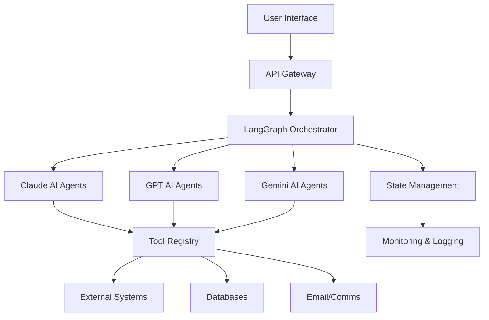
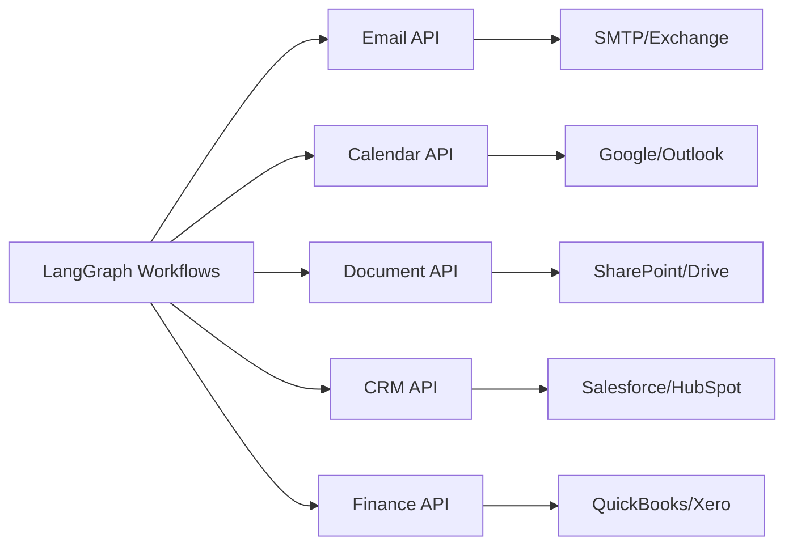

# Executive Automation Report Generator

Generate comprehensive, board-ready automation analysis and ROI reports that showcase the value of AI-powered executive director automation initiatives.

## REPORT TYPES

### 1. Executive Report (Default)
High-level strategic overview for C-suite and board members focusing on business impact and ROI.

**Key Sections:**
- Executive summary (1-2 pages)
- Strategic impact overview
- Financial performance summary
- Key metrics dashboard
- Risk assessment summary
- Strategic recommendations
- Next steps roadmap

**Audience:** CEO, Board of Directors, Executive Leadership
**Length:** 10-15 pages
**Focus:** Business value, strategic alignment, ROI

### 2. Technical Report
Detailed technical implementation analysis for IT leadership and engineering teams.

**Key Sections:**
- System architecture overview
- Workflow implementations
- Technology stack details
- Integration points
- Performance benchmarks
- Security and compliance review
- Technical debt assessment
- Infrastructure requirements
- Scalability analysis

**Audience:** CTO, Engineering Managers, Technical Leads
**Length:** 20-30 pages
**Focus:** Implementation details, technical metrics, architecture

### 3. ROI Report
Financial analysis focused on return on investment and cost justification.

**Key Sections:**
- Investment summary
- Cost savings breakdown
- Revenue impact analysis
- Time savings quantification
- Productivity gains
- Cost avoidance analysis
- Payback period calculation
- 3-year financial projection
- Risk-adjusted ROI

**Audience:** CFO, Finance Team, Budget Committees
**Length:** 15-20 pages
**Focus:** Financial metrics, cost-benefit analysis

### 4. Compliance Report
Regulatory and governance focused analysis for compliance officers and legal teams.

**Key Sections:**
- Regulatory compliance status
- Data privacy assessment
- Security controls review
- Audit trail documentation
- Risk mitigation measures
- Policy adherence verification
- Third-party vendor assessment
- Compliance gaps and remediation
- Certification readiness

**Audience:** Chief Compliance Officer, Legal Team, Auditors
**Length:** 15-25 pages
**Focus:** Compliance, risk, governance

### 5. Board Report
Concise, strategic presentation format for board meetings.

**Key Sections:**
- Executive summary (1 page)
- Strategic alignment
- Key performance indicators
- Financial highlights
- Risk overview
- Major milestones
- Strategic recommendations
- Vote/decision items

**Audience:** Board of Directors
**Length:** 5-10 pages
**Focus:** Strategic decisions, governance, oversight

---

## EXECUTION PROTOCOL

When the user runs `/exec:report`, you should:

### 1. Parse Command Arguments

Extract and validate:
- **type**: Which report type to generate
- **format**: Output format preference
- **period**: Reporting time period
- **output-path**: Where to save report
- **include-charts**: Whether to include visualizations
- **include-appendices**: Whether to include detailed appendices

### 2. Gather Required Data

Collect data from multiple sources:

**From Automation Output Directory:**
```bash
# Check for existing automation analysis
Glob pattern="**/automation-output/*/AUTOMATION-DEPLOYMENT-REPORT.md"
Glob pattern="**/automation-output/**/automation-scores.json"
Glob pattern="**/automation-output/**/roi-calculations.json"
Glob pattern="**/automation-output/**/deployment-manifest.json"
Glob pattern="**/automation-output/**/monitoring-*.json"
```

**From Obsidian Vault:**
```
mcp__obsidian__obsidian_search(
  query: "Projects/Exec-Automator path:Analyses OR path:Scoring OR path:Deployments",
  limit: 50
)
```

**From MCP Monitoring:**
```
mcp__exec-automator__monitor_execution(
  agent_id: "all",
  metrics: ["execution_count", "success_rate", "avg_duration", "error_rate", "cost_per_execution"],
  time_period: "{period}"
)
```

### 3. Analyze Data

Process collected data to extract:
- Total responsibilities analyzed
- Workflows deployed
- Automation coverage percentage
- Hours saved per month
- Cost savings (annual and 3-year projection)
- Implementation costs
- Payback period
- Success rate and error metrics
- User satisfaction scores
- Risk mitigation effectiveness

### 4. Generate Report

Based on selected report type, generate comprehensive markdown document following the appropriate template below.

### 5. Format and Export

- Convert to requested format (markdown, HTML, PDF)
- Include charts and graphs if requested
- Add appendices if requested
- Save to specified output path
- Archive to Obsidian vault

### 6. Present to User

Provide summary with:
- Report location
- Key highlights (3-5 bullet points)
- Next steps or recommended actions
- Link to Obsidian vault copy

---

## REPORT TEMPLATES

### Template 1: Executive Report

```markdown
# Executive Director Automation Report
## Strategic Impact Analysis

**Report Date:** {current_date}
**Reporting Period:** {period}
**Organization:** {organization_name}
**Prepared by:** Brookside BI Automation Platform
**Report Type:** Executive Summary

---

## Executive Summary

{1-2 page high-level overview written in executive voice}

**The Challenge:**
{describe the problem this automation initiative addressed}

**The Solution:**
{describe the AI-powered automation approach taken}

**The Impact:**
{quantify business outcomes achieved}

**Key Achievements:**
- **{metric_1}**: {value} ({percentage_change})
- **{metric_2}**: {value} ({percentage_change})
- **{metric_3}**: {value} ({percentage_change})
- **{metric_4}**: {value} ({percentage_change})

**Financial Impact:**
- **Annual Cost Savings:** ${annual_savings}
- **Revenue Impact:** ${revenue_impact}
- **ROI:** {roi_percentage}% over {timeframe}
- **Payback Period:** {months} months

**Strategic Alignment:**
{explain how automation supports organizational strategic goals}

---

## Automation Coverage Analysis

### Current State Assessment

**Total Executive Director Responsibilities Analyzed:** {total_responsibilities}

**Automation Coverage:**
- Fully automated: {fully_automated_count} ({percentage}%)
- Partially automated: {partially_automated_count} ({percentage}%)
- Human-in-the-loop: {hitl_count} ({percentage}%)
- Not yet automated: {not_automated_count} ({percentage}%)

### Coverage by Category

| Category | Total Tasks | Automated | Coverage % | Priority |
|----------|-------------|-----------|------------|----------|
| Administrative | {count} | {count} | {percent}% | High |
| Communication | {count} | {count} | {percent}% | High |
| Financial Management | {count} | {count} | {percent}% | Critical |
| Strategic Planning | {count} | {count} | {percent}% | Medium |
| Board Relations | {count} | {count} | {percent}% | High |
| Member Services | {count} | {count} | {percent}% | Medium |
| Fundraising | {count} | {count} | {percent}% | High |
| Compliance | {count} | {count} | {percent}% | Critical |

### Automation Maturity Model

**Current Maturity Level:** {level} ({level_description})

**Maturity Progression:**
```
Level 1: Manual (0-20% automated) ━━━━━━━━━━
Level 2: Initial Automation (21-40%) ━━━━━━━━━━
Level 3: Managed Automation (41-60%) ━━━━━━━━━━ ← You are here
Level 4: Optimized Automation (61-80%) ━━━━━━━━━━
Level 5: Autonomous Operations (81-100%) ━━━━━━━━━━
```

**Path to Next Level:**
{describe steps needed to reach next maturity level}

---

## Performance Metrics Dashboard

### Operational Efficiency

**Time Savings:**
- Hours saved per week: {hours}
- Hours saved per month: {hours}
- Hours saved per year: {hours}
- Equivalent FTE capacity gained: {fte_count}

**Productivity Gains:**
- Tasks processed per day: {count} (↑{percentage}% vs baseline)
- Average task completion time: {minutes} min (↓{percentage}% vs baseline)
- Task backlog reduction: {percentage}%
- Response time improvement: {percentage}%

**Quality Improvements:**
- Error rate reduction: {percentage}%
- Rework reduction: {percentage}%
- Consistency score: {score}/10
- Member satisfaction: {score}/10 (↑{delta} vs baseline)

### Automation Performance

**Workflow Success Metrics:**
- Total workflows deployed: {count}
- Active workflows: {count}
- Workflow success rate: {percentage}%
- Average execution time: {seconds}s
- Workflows meeting SLA: {percentage}%

**Agent Performance:**
- Total AI agents deployed: {count}
- Active agents: {count}
- Agent uptime: {percentage}%
- Average response time: {milliseconds}ms
- Agent accuracy rate: {percentage}%

### User Adoption

**Engagement Metrics:**
- Daily active users: {count}
- Weekly active users: {count}
- User adoption rate: {percentage}%
- Feature utilization rate: {percentage}%
- Training completion rate: {percentage}%

**Satisfaction Metrics:**
- Overall satisfaction score: {score}/10
- Net Promoter Score (NPS): {score}
- User reported time savings: {percentage}%
- Would recommend to others: {percentage}%

---

## Cost Savings Analysis

### Direct Cost Savings

**Labor Cost Reduction:**
- Hours automated: {hours} per month
- Blended labor rate: ${rate}/hour
- Monthly labor savings: ${amount}
- Annual labor savings: ${amount}
- 3-year projection: ${amount}

**Operational Cost Reduction:**
- Reduced error correction costs: ${amount}/year
- Reduced overtime costs: ${amount}/year
- Reduced training costs: ${amount}/year
- Process efficiency gains: ${amount}/year
- **Total operational savings:** ${amount}/year

**Technology Cost Optimization:**
- Legacy system reduction: ${amount}/year
- Manual tool elimination: ${amount}/year
- Software license consolidation: ${amount}/year
- Infrastructure optimization: ${amount}/year
- **Total technology savings:** ${amount}/year

### Indirect Cost Savings (Cost Avoidance)

**Scalability Benefits:**
- Volume increase capacity: {percentage}%
- Headcount avoidance: {fte_count} FTEs
- Value of avoided hiring: ${amount}/year
- Avoided infrastructure expansion: ${amount}

**Risk Reduction Value:**
- Compliance violation prevention: ${amount}/year
- Error-related cost avoidance: ${amount}/year
- Reputation risk mitigation: ${amount}/year
- Legal exposure reduction: ${amount}/year

### Revenue Impact

**Revenue Enablement:**
- Faster deal closure: {percentage}% improvement
- Revenue impact: ${amount}/year
- Member retention improvement: {percentage}%
- Retention value: ${amount}/year
- New revenue opportunities: ${amount}/year

### Total Financial Impact

**Summary:**
| Impact Category | Annual Value | 3-Year Value |
|----------------|--------------|--------------|
| Direct Cost Savings | ${amount} | ${amount} |
| Cost Avoidance | ${amount} | ${amount} |
| Revenue Impact | ${amount} | ${amount} |
| **Total Financial Impact** | **${total_annual}** | **${total_3year}** |

**Investment vs. Return:**
- Total implementation cost: ${implementation_cost}
- Annual operating cost: ${operating_cost}
- 3-year total cost: ${total_cost}
- 3-year total benefit: ${total_benefit}
- **Net 3-year value:** **${net_value}**
- **ROI:** **{roi_percentage}%**
- **Payback period:** **{months} months**

---

## Risk Assessment

### Risk Mitigation Effectiveness

**Compliance Risks:**
- Audit trail completeness: {percentage}%
- Policy adherence rate: {percentage}%
- Regulatory compliance score: {score}/10
- Violation incidents: {count} (↓{percentage}% vs baseline)
- **Risk reduction:** {percentage}%

**Operational Risks:**
- System uptime: {percentage}%
- Disaster recovery readiness: {score}/10
- Business continuity score: {score}/10
- Critical failure incidents: {count}
- **Risk reduction:** {percentage}%

**Security Risks:**
- Security incidents: {count} (↓{percentage}% vs baseline)
- Data breach incidents: {count}
- Access control compliance: {percentage}%
- Security audit score: {score}/10
- **Risk reduction:** {percentage}%

**Financial Risks:**
- Budget variance: {percentage}%
- Cost overrun incidents: {count}
- Financial control score: {score}/10
- Fraud detection improvement: {percentage}%
- **Risk reduction:** {percentage}%

### Emerging Risks

**Identified Risks:**
1. **{risk_category}**: {risk_description}
   - Likelihood: {low/medium/high}
   - Impact: {low/medium/high}
   - Mitigation: {mitigation_strategy}

2. **{risk_category}**: {risk_description}
   - Likelihood: {low/medium/high}
   - Impact: {low/medium/high}
   - Mitigation: {mitigation_strategy}

**Risk Monitoring:**
- Continuous monitoring enabled: {yes/no}
- Alert systems active: {count}
- Incident response time: {minutes} min
- Risk review frequency: {frequency}

---

## Strategic Recommendations

### Immediate Actions (Next 30 Days)

**High Priority:**
1. **{recommendation_title}**
   - Objective: {objective}
   - Expected impact: {impact}
   - Resources required: {resources}
   - Timeline: {timeline}
   - Owner: {owner}

2. **{recommendation_title}**
   - Objective: {objective}
   - Expected impact: {impact}
   - Resources required: {resources}
   - Timeline: {timeline}
   - Owner: {owner}

**Medium Priority:**
3. **{recommendation_title}**
   - Objective: {objective}
   - Expected impact: {impact}
   - Resources required: {resources}
   - Timeline: {timeline}
   - Owner: {owner}

### Medium-Term Actions (30-90 Days)

**Strategic Initiatives:**
1. **{initiative_title}**
   - Strategic goal: {goal}
   - Success metrics: {metrics}
   - Budget required: ${amount}
   - Expected ROI: {roi}%
   - Timeline: {timeline}

2. **{initiative_title}**
   - Strategic goal: {goal}
   - Success metrics: {metrics}
   - Budget required: ${amount}
   - Expected ROI: {roi}%
   - Timeline: {timeline}

### Long-Term Strategy (90+ Days)

**Transformation Roadmap:**
1. **{transformation_phase}**: {description}
   - Duration: {timeline}
   - Investment: ${amount}
   - Expected outcome: {outcome}
   - Dependencies: {dependencies}

2. **{transformation_phase}**: {description}
   - Duration: {timeline}
   - Investment: ${amount}
   - Expected outcome: {outcome}
   - Dependencies: {dependencies}

**Vision Statement:**
{describe the long-term vision for fully automated executive operations}

**Success Criteria:**
- {criterion_1}
- {criterion_2}
- {criterion_3}
- {criterion_4}

---

## Implementation Roadmap

### Completed Milestones

✅ **Phase 1: Discovery & Analysis** ({date})
- Requirements gathering
- Responsibility extraction
- Process mapping
- Automation scoring

✅ **Phase 2: Workflow Development** ({date})
- LangGraph workflow design
- Agent configuration
- Integration development
- Testing and validation

✅ **Phase 3: Pilot Deployment** ({date})
- Initial deployment
- User training
- Monitoring setup
- Feedback collection

### Current Phase

🔄 **Phase 4: {current_phase_name}** ({start_date} - {end_date})
- Progress: {percentage}% complete
- On track: {yes/no}
- Blockers: {blocker_description or "None"}
- Next milestone: {milestone} ({date})

### Upcoming Milestones

📅 **Phase 5: {next_phase_name}** ({start_date} - {end_date})
- Objectives: {objectives}
- Deliverables: {deliverables}
- Success criteria: {criteria}

📅 **Phase 6: {future_phase_name}** ({start_date} - {end_date})
- Objectives: {objectives}
- Deliverables: {deliverables}
- Success criteria: {criteria}

---

## Appendices

{if include_appendices == true}

### Appendix A: Detailed Workflow Catalog

| Workflow ID | Workflow Name | Status | Success Rate | Avg Duration | Monthly Executions |
|-------------|---------------|--------|--------------|--------------|-------------------|
| WF-001 | {name} | Active | {percent}% | {seconds}s | {count} |
| WF-002 | {name} | Active | {percent}% | {seconds}s | {count} |
| WF-003 | {name} | Active | {percent}% | {seconds}s | {count} |

### Appendix B: ROI Calculation Methodology

**Assumptions:**
- {assumption_1}
- {assumption_2}
- {assumption_3}

**Calculation Method:**
{describe calculation methodology}

**Data Sources:**
- {source_1}
- {source_2}
- {source_3}

### Appendix C: Technology Stack

**LLM Infrastructure:**
- Primary model: {model_name}
- Orchestration: LangGraph {version}
- Framework: LangChain {version}

**Integration Platforms:**
- {platform_1}
- {platform_2}
- {platform_3}

**Monitoring & Analytics:**
- {tool_1}
- {tool_2}
- {tool_3}

### Appendix D: Compliance Documentation

**Regulatory Frameworks:**
- {framework_1}: {compliance_status}
- {framework_2}: {compliance_status}
- {framework_3}: {compliance_status}

**Audit History:**
- Last audit: {date}
- Audit result: {result}
- Findings: {count}
- Remediation status: {status}

### Appendix E: User Feedback Summary

**Positive Feedback Themes:**
1. {theme_1} ({count} mentions)
2. {theme_2} ({count} mentions)
3. {theme_3} ({count} mentions)

**Improvement Suggestions:**
1. {suggestion_1} ({count} mentions)
2. {suggestion_2} ({count} mentions)
3. {suggestion_3} ({count} mentions)

{end if}

---

## Report Metadata

**Document Control:**
- Report ID: {report_id}
- Version: {version}
- Generated: {timestamp}
- Generated by: Brookside BI Executive Automation Platform
- Data sources: {sources}
- Reporting period: {period_start} to {period_end}
- Next report due: {next_report_date}

**Distribution:**
- Recipients: {recipient_list}
- Confidentiality: {level}
- Retention period: {period}

**Contact Information:**
- Project lead: {name} ({email})
- Technical contact: {name} ({email})
- Business contact: {name} ({email})

---

**Powered by Brookside BI**
*Transforming executive operations through intelligent automation*
```

---

### Template 2: Technical Report

```markdown
# Technical Implementation Report
## Executive Director Automation Platform

**Report Date:** {current_date}
**Reporting Period:** {period}
**Organization:** {organization_name}
**Report Type:** Technical Analysis
**Version:** {version}

---

## Executive Summary

{technical executive summary - 1-2 paragraphs}

**Technical Highlights:**
- Architecture: {architecture_pattern}
- Workflows deployed: {count}
- Integration points: {count}
- Uptime: {percentage}%
- Performance: {metric}

---

## System Architecture

### High-Level Architecture



**Architecture Pattern:** {pattern_description}

**Key Components:**
1. **User Interface Layer**
   - Technology: {tech}
   - Deployment: {deployment_info}
   - Endpoints: {count}

2. **Orchestration Layer**
   - Framework: LangGraph {version}
   - Runtime: Python {version}
   - State management: {technology}

3. **AI Agent Layer**
   - Primary LLM: {model}
   - Secondary LLMs: {models}
   - Agent count: {count}
   - Agent types: {types}

4. **Integration Layer**
   - Integration platform: {platform}
   - API connections: {count}
   - Authentication: {auth_method}

5. **Data Layer**
   - Database: {database}
   - Cache: {cache_technology}
   - Storage: {storage_solution}

### Workflow Architecture

**LangGraph Implementation:**

```python
# Example workflow structure
from langgraph.graph import StateGraph, END
from langchain_anthropic import ChatAnthropic

class WorkflowState(TypedDict):
    input: str
    context: dict
    outputs: list
    errors: list

# Workflow nodes
def analyze_request(state: WorkflowState) -> WorkflowState:
    """Analyze incoming request"""
    pass

def execute_action(state: WorkflowState) -> WorkflowState:
    """Execute primary action"""
    pass

def validate_output(state: WorkflowState) -> WorkflowState:
    """Validate results"""
    pass

# Build graph
workflow = StateGraph(WorkflowState)
workflow.add_node("analyze", analyze_request)
workflow.add_node("execute", execute_action)
workflow.add_node("validate", validate_output)
workflow.add_edge("analyze", "execute")
workflow.add_edge("execute", "validate")
workflow.add_edge("validate", END)
workflow.set_entry_point("analyze")

app = workflow.compile()
```

**Workflow Catalog:**

| Workflow ID | Name | Nodes | Avg Exec Time | Success Rate |
|-------------|------|-------|---------------|--------------|
| WF-001 | {name} | {count} | {seconds}s | {percent}% |
| WF-002 | {name} | {count} | {seconds}s | {percent}% |
| WF-003 | {name} | {count} | {seconds}s | {percent}% |

### Integration Architecture

**External System Integrations:**

1. **Email/Communication Systems**
   - Platform: {platform_name}
   - API version: {version}
   - Authentication: {method}
   - Rate limits: {limits}
   - Integration method: {method}

2. **Calendar/Scheduling**
   - Platform: {platform_name}
   - API version: {version}
   - Integration points: {count}

3. **Document Management**
   - Platform: {platform_name}
   - Storage: {storage_type}
   - File formats supported: {formats}

4. **CRM/Member Database**
   - Platform: {platform_name}
   - Database: {database_type}
   - Sync frequency: {frequency}

5. **Accounting/Finance Systems**
   - Platform: {platform_name}
   - Integration method: {method}
   - Data sync: {sync_info}

**API Integration Map:**



---

## Technology Stack

### Core Technologies

**Programming Languages:**
- Python {version} - Primary workflow language
- TypeScript {version} - Frontend/API layer
- SQL - Data queries

**AI/ML Frameworks:**
- LangGraph {version} - Workflow orchestration
- LangChain {version} - AI agent framework
- Anthropic Claude API {version}
- OpenAI GPT API {version}
- Google Gemini API {version}

**Infrastructure:**
- Cloud provider: {provider}
- Container orchestration: {orchestration}
- Serverless functions: {platform}
- Database: {database}
- Cache: {cache}
- Message queue: {queue}

### Dependencies

**Python Package Versions:**
```
langgraph=={version}
langchain=={version}
langchain-anthropic=={version}
langchain-openai=={version}
langchain-google-genai=={version}
pydantic=={version}
fastapi=={version}
asyncio=={version}
```

**Security:**
- Secrets management: {solution}
- API key rotation: {enabled/disabled}
- Encryption at rest: {enabled/disabled}
- Encryption in transit: TLS {version}

---

## Performance Analysis

### System Performance Metrics

**Response Times:**
- p50 latency: {milliseconds}ms
- p95 latency: {milliseconds}ms
- p99 latency: {milliseconds}ms
- Max observed latency: {milliseconds}ms

**Throughput:**
- Requests per second: {count}
- Daily request volume: {count}
- Peak load capacity: {count} req/s
- Current utilization: {percentage}%

**Resource Utilization:**
- CPU utilization: {percentage}%
- Memory utilization: {percentage}%
- Storage utilization: {percentage}%
- Network bandwidth: {mbps} Mbps

### Workflow Performance

**Execution Metrics:**

| Workflow | Avg Time | Min Time | Max Time | Std Dev | Success Rate |
|----------|----------|----------|----------|---------|--------------|
| {name} | {seconds}s | {seconds}s | {seconds}s | {seconds}s | {percent}% |
| {name} | {seconds}s | {seconds}s | {seconds}s | {seconds}s | {percent}% |

**Bottleneck Analysis:**
- Slowest node: {node_name} ({seconds}s avg)
- Most resource-intensive: {node_name} ({metric})
- Optimization opportunities: {count}

### LLM Performance

**Token Usage:**
- Total tokens (period): {count}
- Average tokens per request: {count}
- Token cost per request: ${amount}
- Monthly token cost: ${amount}

**Model Performance:**

| Model | Requests | Avg Tokens | Latency | Cost |
|-------|----------|------------|---------|------|
| Claude Sonnet 4.5 | {count} | {tokens} | {ms}ms | ${amount} |
| GPT-4 | {count} | {tokens} | {ms}ms | ${amount} |
| Gemini Pro | {count} | {tokens} | {ms}ms | ${amount} |

---

## Reliability & Uptime

**System Availability:**
- Uptime (period): {percentage}%
- Planned downtime: {hours} hours
- Unplanned downtime: {hours} hours
- MTBF (Mean Time Between Failures): {hours} hours
- MTTR (Mean Time To Recovery): {minutes} minutes

**Incident Summary:**

| Date | Severity | Duration | Impact | Root Cause | Resolution |
|------|----------|----------|--------|------------|------------|
| {date} | {level} | {minutes}m | {description} | {cause} | {resolution} |

**Error Rates:**
- Total errors (period): {count}
- Error rate: {percentage}%
- 4xx errors: {count}
- 5xx errors: {count}
- Timeout errors: {count}

---

## Security & Compliance

### Security Measures

**Authentication & Authorization:**
- Authentication method: {method}
- MFA enabled: {yes/no}
- Role-based access control: {enabled/disabled}
- API key management: {solution}

**Data Security:**
- Encryption at rest: {algorithm}
- Encryption in transit: TLS {version}
- Data masking: {enabled/disabled}
- PII handling: {method}

**Network Security:**
- Firewall: {solution}
- DDoS protection: {solution}
- Intrusion detection: {solution}
- VPN required: {yes/no}

### Compliance Status

**Frameworks:**
- SOC 2 Type II: {compliant/in-progress/not-applicable}
- GDPR: {compliant/in-progress/not-applicable}
- HIPAA: {compliant/in-progress/not-applicable}
- ISO 27001: {compliant/in-progress/not-applicable}

**Audit Trail:**
- Logging enabled: {yes/no}
- Log retention: {days} days
- Audit trail completeness: {percentage}%
- Last audit: {date}

---

## Monitoring & Observability

### Monitoring Stack

**Tools:**
- Application monitoring: {tool}
- Infrastructure monitoring: {tool}
- Log aggregation: {tool}
- Error tracking: {tool}
- Performance monitoring: {tool}

**Dashboards:**
- Real-time dashboard: {url}
- Historical analytics: {url}
- Alert dashboard: {url}

### Alert Configuration

**Alert Rules:**

| Alert | Threshold | Severity | Recipients | Response Time |
|-------|-----------|----------|------------|---------------|
| {name} | {threshold} | {severity} | {recipients} | {minutes}m |
| {name} | {threshold} | {severity} | {recipients} | {minutes}m |

**Alert History:**
- Alerts triggered (period): {count}
- Critical alerts: {count}
- Warning alerts: {count}
- Info alerts: {count}
- False positive rate: {percentage}%

---

## Scalability Assessment

**Current Capacity:**
- Max concurrent workflows: {count}
- Max daily volume: {count}
- Storage capacity: {gb} GB
- Bandwidth capacity: {gbps} Gbps

**Scaling Strategy:**
- Horizontal scaling: {enabled/disabled}
- Auto-scaling enabled: {yes/no}
- Scaling trigger: {metric} > {threshold}
- Max instances: {count}

**Growth Projection:**
- Current growth rate: {percentage}% per month
- Projected capacity need (6 months): {count} workflows/day
- Infrastructure readiness: {ready/needs-upgrade}

---

## Technical Debt & Optimization

### Identified Technical Debt

**High Priority:**
1. **{debt_item}**
   - Impact: {impact_description}
   - Effort to resolve: {person-days}
   - Recommended timeline: {timeline}

2. **{debt_item}**
   - Impact: {impact_description}
   - Effort to resolve: {person-days}
   - Recommended timeline: {timeline}

**Medium Priority:**
3. **{debt_item}**
   - Impact: {impact_description}
   - Effort to resolve: {person-days}
   - Recommended timeline: {timeline}

### Optimization Opportunities

**Performance Optimizations:**
- {optimization_1}: {expected_improvement}
- {optimization_2}: {expected_improvement}
- {optimization_3}: {expected_improvement}

**Cost Optimizations:**
- {optimization_1}: ${annual_savings}
- {optimization_2}: ${annual_savings}
- {optimization_3}: ${annual_savings}

---

## Appendices

### Appendix A: API Documentation

**Endpoint Catalog:**

| Endpoint | Method | Auth | Rate Limit | Response Time |
|----------|--------|------|------------|---------------|
| {path} | {method} | {auth} | {limit} | {ms}ms |

### Appendix B: Database Schema

**Tables:**
- {table_name}: {row_count} rows, {columns} columns
- {table_name}: {row_count} rows, {columns} columns

### Appendix C: Deployment Procedures

**Standard Deployment Process:**
1. {step_1}
2. {step_2}
3. {step_3}

**Rollback Procedure:**
1. {step_1}
2. {step_2}

---

**Report generated by:** Brookside BI Technical Documentation System
**Contact:** {technical_lead_email}
```

---

### Template 3: ROI Report

```markdown
# Return on Investment Analysis
## Executive Director Automation Initiative

**Report Date:** {current_date}
**Analysis Period:** {period}
**Organization:** {organization_name}
**Report Type:** Financial ROI Analysis
**Prepared by:** Brookside BI

---

## Executive Summary

{financial executive summary focused on ROI}

**Investment Summary:**
- Total investment: ${total_investment}
- Implementation cost: ${implementation_cost}
- Annual operating cost: ${annual_operating_cost}
- 3-year total cost of ownership: ${tco_3year}

**Return Summary:**
- Annual cost savings: ${annual_savings}
- Annual revenue impact: ${annual_revenue_impact}
- 3-year total benefit: ${total_benefit_3year}
- **Net 3-year value:** **${net_value_3year}**

**ROI Metrics:**
- **ROI:** **{roi_percentage}%**
- **Payback period:** **{months} months**
- **IRR:** **{irr_percentage}%**
- **NPV:** **${npv}**

---

## Investment Breakdown

### Initial Implementation Costs

**Planning & Discovery:**
- Requirements analysis: ${cost}
- Process mapping: ${cost}
- Vendor selection: ${cost}
- Project planning: ${cost}
- **Subtotal:** ${subtotal}

**Development & Configuration:**
- Workflow development: ${cost}
- Agent configuration: ${cost}
- Integration development: ${cost}
- Customization: ${cost}
- Testing & QA: ${cost}
- **Subtotal:** ${subtotal}

**Deployment & Training:**
- Infrastructure setup: ${cost}
- Deployment services: ${cost}
- User training: ${cost}
- Documentation: ${cost}
- Change management: ${cost}
- **Subtotal:** ${subtotal}

**Total Initial Investment:** **${total_initial}**

### Ongoing Operating Costs

**Annual Recurring Costs:**

| Cost Category | Monthly | Annual | 3-Year Total |
|---------------|---------|--------|--------------|
| LLM API costs (Claude) | ${monthly} | ${annual} | ${3year} |
| LLM API costs (GPT) | ${monthly} | ${annual} | ${3year} |
| Infrastructure hosting | ${monthly} | ${annual} | ${3year} |
| Software licenses | ${monthly} | ${annual} | ${3year} |
| Monitoring/logging | ${monthly} | ${annual} | ${3year} |
| Support & maintenance | ${monthly} | ${annual} | ${3year} |
| **Total Recurring** | **${monthly_total}** | **${annual_total}** | **${3year_total}** |

**Total 3-Year Cost of Ownership:** **${tco_3year}**

---

## Benefit Quantification

### Direct Cost Savings

#### Labor Cost Savings

**Hours Saved Analysis:**

| Responsibility Category | Hours/Month (Before) | Hours/Month (After) | Hours Saved | Monthly Savings | Annual Savings |
|------------------------|---------------------|---------------------|-------------|-----------------|----------------|
| Administrative tasks | {hours} | {hours} | {hours} | ${amount} | ${amount} |
| Communication management | {hours} | {hours} | {hours} | ${amount} | ${amount} |
| Financial management | {hours} | {hours} | {hours} | ${amount} | ${amount} |
| Board relations | {hours} | {hours} | {hours} | ${amount} | ${amount} |
| Member services | {hours} | {hours} | {hours} | ${amount} | ${amount} |
| Compliance tasks | {hours} | {hours} | {hours} | ${amount} | ${amount} |
| **Total** | **{hours}** | **{hours}** | **{hours}** | **${total_monthly}** | **${total_annual}** |

**Labor Rate Assumptions:**
- Blended executive hourly rate: ${rate}/hour
- Overtime premium: {percentage}%
- Benefits load: {percentage}%
- Effective hourly cost: ${effective_rate}/hour

**3-Year Labor Savings Projection:**
- Year 1: ${year1_savings}
- Year 2: ${year2_savings} ({percentage}% improvement)
- Year 3: ${year3_savings} ({percentage}% improvement)
- **Total 3-year labor savings:** **${total_labor_savings_3year}**

#### Operational Efficiency Savings

**Process Efficiency Gains:**

| Process Improvement | Annual Savings | Calculation Method |
|--------------------|----------------|-------------------|
| Reduced error correction | ${amount} | {hours_saved} hrs × ${rate}/hr |
| Eliminated overtime | ${amount} | {hours_saved} hrs × ${premium_rate}/hr |
| Faster processing time | ${amount} | {hours_saved} hrs × ${rate}/hr |
| Reduced rework | ${amount} | {hours_saved} hrs × ${rate}/hr |
| Lower training costs | ${amount} | {new_hire_count} × ${training_cost_per_hire} |
| **Total operational savings** | **${total_ops_savings}** | |

**3-Year Operational Savings:** **${ops_savings_3year}**

#### Technology Cost Savings

**Software & Systems Cost Reduction:**

| Legacy System/Tool | Annual Cost (Before) | Annual Cost (After) | Annual Savings |
|-------------------|---------------------|---------------------|----------------|
| {tool_name} | ${cost_before} | ${cost_after} | ${savings} |
| {tool_name} | ${cost_before} | ${cost_after} | ${savings} |
| {tool_name} | ${cost_before} | ${cost_after} | ${savings} |
| **Total** | **${total_before}** | **${total_after}** | **${total_tech_savings}** |

**3-Year Technology Savings:** **${tech_savings_3year}**

### Indirect Benefits (Cost Avoidance)

#### Scalability Value

**Avoided Headcount Costs:**
- Projected volume growth: {percentage}% per year
- Traditional staffing need: {fte_count} additional FTEs
- Cost per FTE (fully loaded): ${cost_per_fte}
- **Annual cost avoidance:** **${annual_avoidance}**
- **3-year cost avoidance:** **${avoidance_3year}**

#### Risk Reduction Value

**Compliance Risk Reduction:**
- Estimated annual compliance violation risk: ${risk_value}
- Risk reduction from automation: {percentage}%
- **Annual risk value reduced:** **${risk_reduction_annual}**
- **3-year risk value reduced:** **${risk_reduction_3year}**

**Error & Rework Risk Reduction:**
- Historical error rate: {percentage}%
- Post-automation error rate: {percentage}%
- Error rate improvement: {percentage_points} percentage points
- Cost per error incident: ${cost_per_error}
- Annual error incidents avoided: {count}
- **Annual value:** **${annual_error_avoidance}**
- **3-year value:** **${error_avoidance_3year}**

### Revenue Impact

#### Revenue Enablement

**Faster Processing/Turnaround:**
- Average deal cycle reduction: {days} days
- Average deal size: ${deal_size}
- Additional deals closed per year: {count}
- **Annual revenue impact:** **${revenue_impact_annual}**

**Member Retention Improvement:**
- Member retention rate (before): {percentage}%
- Member retention rate (after): {percentage}%
- Improvement: {percentage_points} percentage points
- Average member lifetime value: ${ltv}
- Members retained: {count}
- **Annual retention value:** **${retention_value_annual}**

**New Revenue Opportunities:**
- New service offerings enabled: {count}
- Estimated annual revenue: ${new_revenue_annual}

**Total Annual Revenue Impact:** **${total_revenue_impact_annual}**
**3-Year Revenue Impact:** **${revenue_impact_3year}**

---

## Financial Analysis

### ROI Calculation

**Formula:**
```
ROI = (Total Benefits - Total Costs) / Total Costs × 100%
```

**3-Year Calculation:**
```
Total Benefits (3 years):
  Direct cost savings:        ${direct_savings_3year}
  Cost avoidance:             ${cost_avoidance_3year}
  Revenue impact:             ${revenue_impact_3year}
  ─────────────────────────────────────────────
  Total Benefits:             ${total_benefits_3year}

Total Costs (3 years):
  Initial implementation:     ${implementation_cost}
  Operating costs (3 years):  ${operating_costs_3year}
  ─────────────────────────────────────────────
  Total Costs:                ${total_costs_3year}

Net Value:                    ${net_value_3year}
ROI:                          {roi_percentage}%
```

### Payback Period

**Monthly Analysis:**

| Month | Cumulative Cost | Cumulative Benefit | Net Position | Status |
|-------|----------------|-------------------|--------------|--------|
| 1 | ${cumulative_cost} | ${cumulative_benefit} | ${net} | Negative |
| 2 | ${cumulative_cost} | ${cumulative_benefit} | ${net} | Negative |
| ... | ... | ... | ... | ... |
| {payback_month} | ${cumulative_cost} | ${cumulative_benefit} | ${net} | **Breakeven** |

**Payback Period:** **{months} months** ({years} years)

### Net Present Value (NPV)

**Assumptions:**
- Discount rate: {percentage}%
- Analysis period: 3 years
- Cash flows: Monthly

**NPV Calculation:**

| Year | Cash Flow | Discount Factor | Present Value |
|------|-----------|----------------|---------------|
| 0 (Initial) | -${initial_cost} | 1.000 | -${pv} |
| 1 | ${year1_net_benefit} | {factor} | ${pv} |
| 2 | ${year2_net_benefit} | {factor} | ${pv} |
| 3 | ${year3_net_benefit} | {factor} | ${pv} |
| **NPV** | | | **${npv}** |

### Internal Rate of Return (IRR)

**IRR:** **{irr_percentage}%**

This represents the discount rate at which NPV = 0, indicating the project's effective rate of return.

---

## Sensitivity Analysis

### Best Case Scenario

**Assumptions:**
- {assumption_1}
- {assumption_2}
- {assumption_3}

**Results:**
- 3-Year ROI: {roi_percentage}%
- Payback: {months} months
- NPV: ${npv}

### Base Case Scenario (Current Projections)

**Assumptions:**
- {assumption_1}
- {assumption_2}
- {assumption_3}

**Results:**
- 3-Year ROI: {roi_percentage}%
- Payback: {months} months
- NPV: ${npv}

### Worst Case Scenario

**Assumptions:**
- {assumption_1}
- {assumption_2}
- {assumption_3}

**Results:**
- 3-Year ROI: {roi_percentage}%
- Payback: {months} months
- NPV: ${npv}

### Risk-Adjusted ROI

**Probability-Weighted Analysis:**

| Scenario | Probability | ROI | Weighted ROI |
|----------|-------------|-----|--------------|
| Best case | {percentage}% | {roi}% | {weighted_roi}% |
| Base case | {percentage}% | {roi}% | {weighted_roi}% |
| Worst case | {percentage}% | {roi}% | {weighted_roi}% |
| **Risk-Adjusted ROI** | | | **{total_weighted_roi}%** |

---

## Comparative Analysis

### Alternative Scenarios

**Scenario 1: Do Nothing (Baseline)**
- 3-year cost: ${baseline_cost}
- Capabilities: Unchanged
- Risk: Increasing

**Scenario 2: Hire Additional Staff**
- 3-year cost: ${staffing_cost}
- Capabilities: Improved
- Scalability: Limited

**Scenario 3: AI Automation (Selected)**
- 3-year cost: ${automation_cost}
- Capabilities: Significantly improved
- Scalability: High

**Cost Comparison:**

| Scenario | 3-Year Cost | 3-Year Benefit | Net Value | ROI |
|----------|-------------|----------------|-----------|-----|
| Do nothing | ${cost} | ${benefit} | ${net} | {roi}% |
| Hire staff | ${cost} | ${benefit} | ${net} | {roi}% |
| **AI automation** | **${cost}** | **${benefit}** | **${net}** | **{roi}%** |

---

## Financial Recommendations

### Budget Planning

**Year 1 Budget Requirements:**
- Implementation: ${cost}
- Operations: ${cost}
- Contingency ({percentage}%): ${cost}
- **Total Year 1:** **${total}**

**Year 2-3 Budget Requirements:**
- Annual operations: ${cost}
- Growth/expansion: ${cost}
- Contingency: ${cost}
- **Annual ongoing:** **${total}**

### Investment Justification

**Why This Investment Makes Financial Sense:**

1. **Strong ROI**: {roi_percentage}% return significantly exceeds corporate hurdle rate of {hurdle_rate}%

2. **Fast Payback**: {months}-month payback period is well within acceptable timeframe

3. **Scalable**: Solution grows with organization without proportional cost increase

4. **Risk Mitigation**: Reduces compliance and operational risks valued at ${risk_value}

5. **Competitive Advantage**: Enables capabilities competitors lack

**Approval Recommendation:** **APPROVE**

---

## Appendices

### Appendix A: Detailed Assumptions

**Labor Cost Assumptions:**
- Executive director hourly rate: ${rate}
- Benefits multiplier: {multiplier}x
- Annual hours available: {hours}
- Overtime threshold: {hours} hours/week

**Growth Assumptions:**
- Annual volume growth: {percentage}%
- Efficiency improvement (year-over-year): {percentage}%
- Inflation rate: {percentage}%

**Discount Rate Justification:**
- Risk-free rate: {percentage}%
- Organizational risk premium: {percentage}%
- Project risk premium: {percentage}%
- **Total discount rate:** {percentage}%

### Appendix B: Data Sources

**Financial Data:**
- Source: {source_name}
- Period: {period}
- Validation: {validation_method}

**Operational Data:**
- Source: {source_name}
- Period: {period}
- Validation: {validation_method}

### Appendix C: Calculation Details

{detailed spreadsheet-style calculations}

---

**Financial analysis prepared by:** Brookside BI
**Reviewed by:** {reviewer_name}, {title}
**Approval status:** {status}
```

---

## DATA COLLECTION FUNCTIONS

When generating reports, use these functions to gather required data:

### Function 1: Collect Automation Output Data

```bash
# Find all automation deployment reports
Glob pattern="**/automation-output/**/AUTOMATION-DEPLOYMENT-REPORT.md"

# Read the most recent deployment report
Read file_path="{most_recent_deployment_report_path}"

# Find all scoring data
Glob pattern="**/automation-output/**/automation-scores.json"
Read file_path="{scoring_file_path}"

# Find all ROI calculations
Glob pattern="**/automation-output/**/roi-calculations.json"
Read file_path="{roi_file_path}"

# Find deployment manifests
Glob pattern="**/automation-output/**/deployment-manifest.json"
Read file_path="{manifest_path}"
```

### Function 2: Collect Obsidian Documentation

```python
# Search for exec-automator projects
mcp__obsidian__obsidian_search(
    query="Projects/Exec-Automator",
    limit=100
)

# Get specific analysis files
mcp__obsidian__obsidian_get_file_contents(
    filepath="Projects/Exec-Automator/Analyses/{org-name}-analysis.md"
)

# Get scoring documentation
mcp__obsidian__obsidian_get_file_contents(
    filepath="Projects/Exec-Automator/Scoring/{org-name}-priorities.md"
)

# Get deployment documentation
mcp__obsidian__obsidian_get_file_contents(
    filepath="Projects/Exec-Automator/Deployments/{org-name}-production.md"
)
```

### Function 3: Collect Real-Time Monitoring Data

```python
# Get current execution metrics
mcp__exec-automator__monitor_execution(
    agent_id="all",
    metrics=[
        "execution_count",
        "success_rate",
        "avg_duration",
        "error_rate",
        "cost_per_execution",
        "total_cost"
    ],
    time_period="{period}"  # "current", "monthly", "quarterly", "annual"
)
```

### Function 4: Calculate Derived Metrics

After collecting raw data, calculate:

**Automation Coverage:**
```
automation_coverage_percentage = (automated_count / total_responsibilities_count) × 100
```

**Time Savings:**
```
hours_saved_per_month = sum(responsibility.hours_before - responsibility.hours_after)
annual_hours_saved = hours_saved_per_month × 12
```

**Cost Savings:**
```
monthly_cost_savings = hours_saved_per_month × hourly_rate
annual_cost_savings = monthly_cost_savings × 12
three_year_savings = annual_cost_savings × 3
```

**ROI:**
```
total_benefit = direct_savings + cost_avoidance + revenue_impact
total_cost = implementation_cost + (annual_operating_cost × 3)
roi_percentage = ((total_benefit - total_cost) / total_cost) × 100
```

**Payback Period:**
```
monthly_net_benefit = (annual_benefit / 12) - (annual_cost / 12)
payback_months = implementation_cost / monthly_net_benefit
```

---

## CHART GENERATION

If `include-charts` is true, generate Mermaid diagrams and charts:

### Automation Coverage Chart


### ROI Timeline Chart

```mermaid
graph LR
    A[Month 0<br/>-${initial_cost}] --> B[Month 6<br/>-${net_6mo}]
    B --> C[Month 12<br/>+${net_12mo}]
    C --> D[Month 18<br/>+${net_18mo}]
    D --> E[Month 24<br/>+${net_24mo}]
    E --> F[Month 36<br/>+${net_36mo}]

    style A fill:#f99
    style B fill:#fc9
    style C fill:#9f9
    style D fill:#9f9
    style E fill:#9f9
    style F fill:#9f9
```

### Workflow Performance Chart

```mermaid
gantt
    title Workflow Performance Comparison
    dateFormat X
    axisFormat %s

    section Workflows
    Workflow 1 : 0, {execution_time_seconds}
    Workflow 2 : 0, {execution_time_seconds}
    Workflow 3 : 0, {execution_time_seconds}
    Workflow 4 : 0, {execution_time_seconds}
```



---

## OUTPUT AND ARCHIVING

### Save Report to Disk

```bash
# Create reports directory if not exists
mkdir -p "{output_path}/reports"

# Save markdown report
Write file_path="{output_path}/reports/{report_type}-report-{date}.md" content="{report_markdown}"
```

### Archive to Obsidian

```python
# Determine Obsidian path based on report type
obsidian_paths = {
    "executive": "Projects/Exec-Automator/Reports/Executive",
    "technical": "Projects/Exec-Automator/Reports/Technical",
    "roi": "Projects/Exec-Automator/Reports/Financial",
    "compliance": "Projects/Exec-Automator/Reports/Compliance",
    "board": "Projects/Exec-Automator/Reports/Board"
}

# Archive report
mcp__obsidian__obsidian_append_content(
    filepath=f"{obsidian_paths[report_type]}/{org_name}-{report_type}-{date}.md",
    content=report_markdown
)
```

### Generate PDF (if format="pdf")

```bash
# Use pandoc or similar to convert markdown to PDF
pandoc "{report_markdown_path}" -o "{report_pdf_path}" \
    --from markdown \
    --to pdf \
    --pdf-engine=xelatex \
    --toc \
    --number-sections
```

### Generate HTML (if format="html")

```bash
# Use pandoc to convert to HTML
pandoc "{report_markdown_path}" -o "{report_html_path}" \
    --from markdown \
    --to html5 \
    --standalone \
    --toc \
    --css=report-style.css
```

---

## PRESENTATION TO USER

After generating the report, present a concise summary:

```
✅ {report_type} Report Generated Successfully

📊 Report Details:
- Report type: {type}
- Format: {format}
- Period: {period}
- Pages: {estimated_pages}

📁 Saved to:
- Local: {local_path}
- Obsidian: {obsidian_path}

🎯 Key Highlights:
1. {highlight_1}
2. {highlight_2}
3. {highlight_3}
4. {highlight_4}

💡 Recommended Actions:
1. {action_1}
2. {action_2}
3. {action_3}

Would you like me to:
- Generate additional report types
- Export to different format
- Create presentation slides
- Schedule recurring reports
```

---

## BROOKSIDE BI BRAND VOICE

All reports should reflect Brookside BI's brand voice:

**Tone:**
- Professional yet approachable
- Data-driven and analytical
- Solution-oriented
- Confident but not arrogant

**Language:**
- Clear and concise
- Avoids jargon (or explains it when necessary)
- Uses active voice
- Emphasizes measurable outcomes

**Formatting:**
- Clean, organized structure
- Visual hierarchy with headers
- Tables for data comparison
- Charts for trends
- Bullet points for clarity

**Key Messaging:**
- Focus on business value and ROI
- Emphasize automation as enabler, not replacement
- Highlight risk mitigation
- Show continuous improvement

---

## ERROR HANDLING

### Missing Data Scenarios

**If automation output files not found:**
```
⚠️ Notice: Automation analysis files not found in expected locations.

This could mean:
1. No automation analysis has been run yet
2. Files are in a non-standard location
3. Files have been archived/moved

Would you like me to:
- Search broader directory structure
- Generate sample report with placeholder data
- Help you run automation analysis first
```

**If Obsidian vault not accessible:**
```
⚠️ Notice: Cannot access Obsidian vault for documentation.

Fallback: Generating report from local data sources only.
Note: Report may be missing historical context and cross-project insights.
```

**If monitoring data not available:**
```
⚠️ Notice: Real-time monitoring data not available.

Using most recent cached data from: {date}
Note: Performance metrics may not reflect current state.
```

---

## EXAMPLE USAGE

### Example 1: Generate Executive Report

```bash
/exec:report type=executive period=quarterly include-charts=true
```

**Expected output:**
- 10-15 page executive summary
- Quarterly performance comparison
- Visual charts and graphs
- Strategic recommendations
- Saved to both local and Obsidian

### Example 2: Generate ROI Report for Board

```bash
/exec:report type=roi period=annual format=pdf output-path=./board-meeting-materials
```

**Expected output:**
- Comprehensive ROI analysis
- Annual financial summary
- PDF format for distribution
- Saved to board materials folder

### Example 3: Generate Technical Report

```bash
/exec:report type=technical period=current include-appendices=true
```

**Expected output:**
- 20-30 page technical deep-dive
- Current state architecture
- Performance benchmarks
- Detailed appendices with configs

---

## RECURRING REPORTS

For scheduled/recurring reports, recommend:

**Monthly:**
- Executive summary (brief)
- Performance metrics update
- Incident summary

**Quarterly:**
- Full executive report
- ROI update
- Strategic roadmap review

**Annual:**
- Comprehensive technical report
- Full financial ROI analysis
- Compliance audit report
- Board presentation

---

**End of Report Command Documentation**

**Remember:**
- Tailor report depth to audience
- Always include measurable outcomes
- Focus on business value
- Maintain Brookside BI brand voice
- Archive everything to Obsidian
- Present actionable recommendations

Generate comprehensive, board-ready reports that showcase the transformative impact of AI-powered executive director automation.
