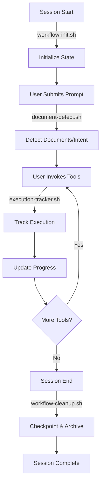

# Exec-Automator Hooks

Comprehensive hook system for tracking workflow execution, detecting documents, and managing state throughout the executive director automation platform lifecycle.

## Overview

The exec-automator plugin uses Claude Code hooks to provide intelligent workflow orchestration, automatic document detection, execution tracking, and state preservation. These hooks ensure seamless operation across sessions and maintain comprehensive audit trails.

## Hook Configuration

All hooks are defined in `hooks.json` and automatically registered with Claude Code when the plugin is loaded.

### Configuration Structure

```json
{
  "version": "1.0.0",
  "plugin": "exec-automator",
  "hooks": [
    {
      "name": "workflow-init",
      "event": "SessionStart",
      "script": "./scripts/workflow-init.sh",
      "description": "Initialize workflow state and prepare session",
      "priority": "high",
      "enabled": true
    }
    // ... additional hooks
  ],
  "settings": {
    "state_dir": "${CLAUDE_PLUGIN_ROOT}/state",
    "checkpoint_dir": "${OBSIDIAN_VAULT_PATH}/Projects/exec-automator/checkpoints",
    "log_level": "INFO"
  }
}
```

## Hook Scripts

### 1. workflow-init.sh

**Event:** SessionStart
**Priority:** High

**Purpose:**
Initializes the exec-automator platform at the start of each Claude Code session.

**What It Does:**
- Creates state directory structure
- Initializes session state JSON
- Verifies MCP server availability
- Loads responsibility pattern library
- Checks for pending work from previous sessions
- Creates Obsidian vault project structure
- Displays welcome banner with quick start commands

**Directory Structure Created:**
```
state/
├── sessions/           # Session state files
├── workflows/          # Workflow execution logs
├── analyses/           # Analysis queue and results
└── temp/               # Temporary working files

${OBSIDIAN_VAULT_PATH}/Projects/exec-automator/
├── analyses/           # Archived analysis results
├── reports/            # Generated reports
├── organizations/      # Organizational profiles
├── checkpoints/        # Session checkpoints
└── workflows/          # Generated LangGraph workflows
```

**Usage:**
Runs automatically at session start. No manual invocation required.

**Environment Variables:**
- `OBSIDIAN_VAULT_PATH`: Path to Obsidian vault (default: `${HOME}/obsidian`)
- `CLAUDE_ENV`: Environment (development|staging|production)

---

### 2. document-detect.sh

**Event:** UserPromptSubmit
**Priority:** Medium

**Purpose:**
Detects when users mention organizational documents or automation intent, then suggests appropriate exec-automator commands and workflows.

**Document Types Detected:**
- **RFPs** (Request for Proposals)
- **Job Descriptions**
- **Bylaws**
- **Contracts**
- **Strategic Plans**
- **Annual Reports**
- **Operations Manuals**

**Organization Types Detected:**
- Nonprofits (501c3, 501c6)
- Trade Associations
- Professional Associations
- Membership Organizations

**Context Detection:**
- Executive Director responsibilities
- Automation intent keywords
- Analysis intent keywords

**What It Does:**
- Analyzes user prompts for document/automation keywords
- Suggests appropriate `/exec:analyze` commands
- Recommends specialized agents (org-analyzer, workflow-designer, etc.)
- Provides workflow guidance based on detected intent
- Logs detection events to session state

**Example Triggers:**

**User Input:**
> "I have an RFP for an executive director position at a trade association"

**Hook Response:**
```
╔════════════════════════════════════════════════════════════════════╗
║          Exec-Automator Document Detection                         ║
╚════════════════════════════════════════════════════════════════════╝

[document-detect] INFO: Detected document type(s): rfp
[document-detect] SUGGESTION: RFP detected - Use org-analyzer agent
  Command: /exec:analyze <document> rfp standard
  Agent: org-analyzer
  Output: Complete organizational profile with ED responsibilities
```

**Usage:**
Runs automatically when users submit prompts. No manual invocation required.

**Pattern Matching:**
Uses regex patterns to detect:
- Document types: `rfp|request for proposal|scope of work`
- Organization types: `nonprofit|501c3|association`
- ED context: `executive director|ed position|chief executive`
- Automation intent: `automate|automation|ai agent|workflow`

---

### 3. execution-tracker.sh

**Event:** PostToolUse
**Priority:** Medium

**Purpose:**
Tracks workflow execution progress, monitors tool usage patterns, and maintains comprehensive execution state.

**What It Does:**
- Logs every tool invocation with timestamp and status
- Tracks workflow phase transitions
- Monitors MCP tool usage
- Calculates workflow progress percentage
- Detects analysis completion
- Suggests next steps based on current phase
- Monitors operation duration
- Tracks errors and failures
- Generates execution summaries

**Tracked Metrics:**
- Tool invocation count
- Average operation duration
- Workflow phase progression
- MCP tool usage by operation type
- Error count and types
- Progress percentage (0-100%)

**Workflow Phases:**
1. `idle` - No active workflow
2. `document-parsing` - Parsing uploaded documents
3. `responsibility-extraction` - Extracting ED responsibilities
4. `automation-scoring` - Scoring automation potential
5. `workflow-generation` - Generating LangGraph workflows
6. `profile-generation` - Creating organizational profiles
7. `complete` - Analysis complete

**Phase Transition Example:**
```
[execution-tracker] INFO: Workflow phase transition: document-parsing → responsibility-extraction
[execution-tracker] METRIC: Workflow progress: 40% (Phase: responsibility-extraction)
```

**Next Step Suggestions:**
```
[execution-tracker] INFO: Next step: Score automation potential
  Use: /exec:score <profile-id>
```

**Usage:**
Runs automatically after each tool use. No manual invocation required.

**Environment Variables:**
- `EXEC_AUTOMATOR_VERBOSE`: Set to `1` for debug logging
- `EXEC_AUTOMATOR_SUMMARY`: Set to `1` to display execution summary

**Log Files Generated:**
```
state/temp/
├── tool-usage.log              # All tool invocations
├── mcp-usage.log               # MCP tool invocations
├── current-phase.txt           # Current workflow phase
├── progress.txt                # Progress percentage
├── error-count.txt             # Error counter
├── errors.log                  # Error details
├── avg-duration.txt            # Average duration tracker
└── operation-count.txt         # Operation counter
```

---

### 4. workflow-cleanup.sh

**Event:** SessionEnd
**Priority:** High

**Purpose:**
Checkpoints workflow state, archives analysis results to Obsidian vault, and cleans up temporary files at session end.

**What It Does:**
- Creates comprehensive checkpoint with all session state
- Archives completed analyses to Obsidian vault
- Copies execution logs to checkpoint directory
- Generates session summary with metrics
- Creates Obsidian-formatted session summary document
- Finalizes session state to "completed"
- Cleans up temporary files
- Displays completion banner with resume instructions

**Checkpoint Contents:**
```
${OBSIDIAN_VAULT_PATH}/Projects/exec-automator/checkpoints/{session_id}/
├── session-state.json          # Complete session state
├── workflow-phase.txt          # Current workflow phase
├── tool-usage.log              # Tool invocation history
├── mcp-usage.log               # MCP tool usage log
├── phase-transitions.log       # Workflow phase changes
├── errors.log                  # Error log (if any)
├── checkpoint-metadata.json    # Checkpoint metadata
└── SESSION-SUMMARY.md          # Obsidian-formatted summary
```

**Session Summary Document:**
The hook generates a comprehensive Obsidian note with:
- Session metadata (ID, duration, timestamps)
- Activity metrics (tool usage, phase transitions)
- Quality metrics (error count, success rate)
- Resume instructions
- Recommended next steps based on phase reached

**Archive Locations:**
- **Analyses:** `${OBSIDIAN_VAULT_PATH}/Projects/exec-automator/analyses/{org_name}/`
- **Reports:** `${OBSIDIAN_VAULT_PATH}/Projects/exec-automator/reports/`
- **Checkpoints:** `${OBSIDIAN_VAULT_PATH}/Projects/exec-automator/checkpoints/{session_id}/`

**Session Summary Example:**
```
━━━━━━━━━━━━━━━━━━━━━━━━━━━━━━━━━━━━━━━━━━━━━━━━━━━
Session Summary: 20251217_143022_12345
━━━━━━━━━━━━━━━━━━━━━━━━━━━━━━━━━━━━━━━━━━━━━━━━━━━
Session duration: 1h 23m 45s
Workflow phase reached: automation-scoring
Overall progress: 60%
Tool invocations: 47
MCP tool invocations: 12
[workflow-cleanup] SUCCESS: No errors encountered
[workflow-cleanup] SUCCESS: Analyses completed: 2
━━━━━━━━━━━━━━━━━━━━━━━━━━━━━━━━━━━━━━━━━━━━━━━━━━━
```

**Completion Banner:**
```
╔════════════════════════════════════════════════════════════════════╗
║              Session Cleanup Complete                              ║
║                                                                    ║
║  All workflow state has been checkpointed and archived.           ║
║  Your work is preserved and ready to resume.                      ║
║                                                                    ║
║  Thank you for using Brookside BI Exec-Automator!                 ║
╚════════════════════════════════════════════════════════════════════╝
```

**Usage:**
Runs automatically at session end. No manual invocation required.

**Resume Previous Session:**
```bash
# Using the session resume command
/exec:resume 20251217_143022_12345

# Or manually load checkpoint
cat ${OBSIDIAN_VAULT_PATH}/Projects/exec-automator/checkpoints/20251217_143022_12345/session-state.json
```

---

## Hook Lifecycle



## State Management

### Session State Schema

```typescript
interface SessionState {
  session_id: string;
  start_time: string;
  end_time?: string;
  status: "active" | "completed" | "failed";
  workflow_phase: WorkflowPhase;
  documents_analyzed: Document[];
  organizations_profiled: Organization[];
  workflows_generated: Workflow[];
  agents_deployed: Agent[];
  checkpoints: Checkpoint[];
  metadata: {
    plugin_version: string;
    platform: string;
    environment: string;
  };
}

type WorkflowPhase =
  | "idle"
  | "document-parsing"
  | "responsibility-extraction"
  | "automation-scoring"
  | "workflow-generation"
  | "profile-generation"
  | "complete";
```

### State Persistence

All state is persisted in two locations:

1. **Working State** (ephemeral): `${PLUGIN_ROOT}/state/`
   - Active during session
   - Cleaned up at session end

2. **Archived State** (permanent): `${OBSIDIAN_VAULT_PATH}/Projects/exec-automator/checkpoints/`
   - Preserved across sessions
   - Version controlled via Obsidian Git
   - Searchable via Obsidian

## Environment Variables

### Required
- `CLAUDE_PLUGIN_ROOT`: Plugin root directory (auto-set by Claude Code)

### Optional
- `OBSIDIAN_VAULT_PATH`: Obsidian vault location (default: `${HOME}/obsidian`)
- `EXEC_AUTOMATOR_VERBOSE`: Enable verbose logging (`0` or `1`)
- `EXEC_AUTOMATOR_SUMMARY`: Display execution summaries (`0` or `1`)
- `CLAUDE_ENV`: Environment name (development|staging|production)

### Usage Example
```bash
# Enable verbose logging and summaries
export EXEC_AUTOMATOR_VERBOSE=1
export EXEC_AUTOMATOR_SUMMARY=1
export OBSIDIAN_VAULT_PATH="/path/to/my/vault"

# Start Claude Code session
claude code
```

## Logging

### Log Levels
- `INFO`: General information messages
- `WARN`: Warnings (non-critical issues)
- `ERROR`: Errors (critical failures)
- `SUCCESS`: Successful operations
- `METRIC`: Performance and usage metrics
- `DEBUG`: Detailed debugging (requires `EXEC_AUTOMATOR_VERBOSE=1`)

### Log Format
```
[hook-name] LEVEL: Message
```

### Example Logs
```
[workflow-init] INFO: Initializing workflow state directories...
[workflow-init] SUCCESS: State directories initialized
[document-detect] SUGGESTION: RFP detected - Use org-analyzer agent
[execution-tracker] METRIC: Workflow progress: 40% (Phase: responsibility-extraction)
[workflow-cleanup] SUCCESS: Checkpoint created: /path/to/checkpoint
```

## Error Handling

All hooks use defensive error handling:

```bash
set -e                    # Exit on error
trap 'exit 0' ERR        # Suppress errors for informational hooks
```

- **workflow-init.sh**: Critical errors stop session initialization
- **document-detect.sh**: Errors suppressed (informational only)
- **execution-tracker.sh**: Errors suppressed (tracking is non-critical)
- **workflow-cleanup.sh**: Errors logged but don't prevent cleanup

## Cross-Platform Compatibility

All hook scripts are designed to be cross-platform compatible:

- Use bash shell (available on Windows via Git Bash/WSL)
- Avoid platform-specific commands
- Use portable path handling
- Handle both Unix and Windows line endings
- Test on Linux, macOS, and Windows

## Testing Hooks

### Manual Testing

```bash
# Test workflow-init hook
cd exec-automator/hooks/scripts
./workflow-init.sh

# Test document-detect hook with sample prompt
echo "I have an RFP for an executive director position" | ./document-detect.sh

# Test execution-tracker hook
./execution-tracker.sh "Read" "success" "5"

# Test workflow-cleanup hook
./workflow-cleanup.sh
```

### Automated Testing

Create test scripts in `hooks/tests/`:

```bash
#!/bin/bash
# Test all hooks in sequence

echo "Testing workflow-init..."
./scripts/workflow-init.sh
echo "✓ workflow-init passed"

echo "Testing document-detect..."
echo "test RFP prompt" | ./scripts/document-detect.sh
echo "✓ document-detect passed"

echo "Testing execution-tracker..."
./scripts/execution-tracker.sh "Read" "success" "1"
echo "✓ execution-tracker passed"

echo "Testing workflow-cleanup..."
./scripts/workflow-cleanup.sh
echo "✓ workflow-cleanup passed"

echo "All hooks tested successfully!"
```

## Troubleshooting

### Hook Not Running

**Problem:** Hook doesn't execute when expected.

**Solutions:**
1. Check `hooks.json` for correct event mapping
2. Verify script has execute permissions: `chmod +x scripts/*.sh`
3. Check Claude Code logs for hook errors
4. Ensure `enabled: true` in hook configuration

### State Directory Issues

**Problem:** State files not being created.

**Solutions:**
1. Verify `${CLAUDE_PLUGIN_ROOT}` is set correctly
2. Check write permissions for state directory
3. Ensure parent directories exist
4. Check disk space

### Obsidian Integration Issues

**Problem:** Checkpoints not appearing in Obsidian vault.

**Solutions:**
1. Verify `OBSIDIAN_VAULT_PATH` is set correctly
2. Check vault directory exists and is writable
3. Verify Obsidian vault structure was created by workflow-init
4. Check Obsidian sync settings (if using Obsidian Sync)

### Missing Logs

**Problem:** Expected logs not appearing.

**Solutions:**
1. Enable verbose logging: `export EXEC_AUTOMATOR_VERBOSE=1`
2. Check state/temp directory for log files
3. Verify hooks are executing (check hook script exit codes)
4. Look for suppressed errors in hook output

## Best Practices

### For Plugin Developers

1. **Always preserve state**: Never delete state files without checkpointing
2. **Use structured logging**: Follow the log level conventions
3. **Handle errors gracefully**: Don't let hook failures break workflows
4. **Document state changes**: Update session state JSON when modifying workflow
5. **Test cross-platform**: Verify hooks work on Linux, macOS, and Windows

### For Plugin Users

1. **Set environment variables**: Configure `OBSIDIAN_VAULT_PATH` for proper archiving
2. **Review checkpoints**: Examine checkpoint summaries to track progress
3. **Resume interrupted work**: Use `/exec:resume` to continue previous sessions
4. **Clean up old checkpoints**: Periodically archive or delete old checkpoints
5. **Monitor logs**: Check execution logs for errors or warnings

## Integration with Other Components

### MCP Server Integration

Hooks track MCP tool usage and log to execution state:

```bash
# execution-tracker.sh detects MCP tools
mcp__exec-automator__parse_rfp
mcp__exec-automator__score_automation_potential
```

### Agent Integration

Hooks work seamlessly with exec-automator agents:

- `org-analyzer`: Document parsing tracked
- `workflow-designer`: Workflow generation tracked
- `finance-manager`: Agent deployment logged

### Command Integration

Hooks complement exec-automator commands:

- `/exec:analyze`: Triggers document-detect suggestions
- `/exec:score`: Progress tracked by execution-tracker
- `/exec:orchestrate`: Workflow execution logged
- `/exec:resume`: Uses checkpoints created by workflow-cleanup

## Performance Considerations

- **Minimal overhead**: Hooks execute in <100ms typically
- **Async logging**: Logs written asynchronously when possible
- **Lazy loading**: State loaded on-demand, not upfront
- **Incremental updates**: Session state updated incrementally
- **Cleanup optimization**: Old temp files cleaned in background

## Security Considerations

- **No sensitive data in logs**: Avoid logging API keys or credentials
- **Sanitize file paths**: Prevent path traversal attacks
- **Validate input**: Check arguments before processing
- **Secure state files**: Set appropriate permissions on state directories
- **Audit trail**: Comprehensive logging for security audits

## Version History

- **1.0.0** (2025-12-17): Initial release
  - workflow-init.sh
  - document-detect.sh
  - execution-tracker.sh
  - workflow-cleanup.sh

## Support

For issues, questions, or feature requests:

- **Email:** exec-automator@brooksidebi.com
- **Documentation:** See `agents/org-analyzer.md` for detailed workflows
- **GitHub:** [brooksidebi/exec-automator](https://github.com/brooksidebi/exec-automator) (when available)

---

**Brookside BI - Empowering nonprofits through intelligent automation**

**Version:** 1.0.0
**Last Updated:** 2025-12-17
**Maintained by:** Brookside BI Development Team

## Migration Example (Unified Hook Schema)

Use the shared schema at `schemas/hooks.schema.json` and keep every hook in the same flat format:

```json
{
  "$schema": "../../schemas/hooks.schema.json",
  "hooks": [
    {
      "name": "example-pre-check",
      "event": "PreToolUse",
      "matcher": "Write|Edit",
      "type": "prompt",
      "prompt": "Run plugin-specific pre-check guidance before writing files."
    },
    {
      "name": "example-post-script",
      "event": "PostToolUse",
      "matcher": "Bash",
      "type": "command",
      "script": "scripts/example-post-check.sh",
      "settings": {
        "timeout": 5000
      }
    }
  ],
  "settings": {
    "log_level": "info"
  }
}
```

Legacy nested event maps should be flattened into the `hooks` array above.
