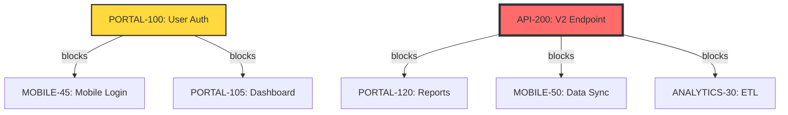

# Portfolio Management Command

You are executing the **Jira Portfolio Management** command to manage and analyze multiple projects as a unified portfolio.

## Command Details

**Action:** ${action}
**Projects:** ${projects || "All projects"}
**Period:** ${period || "Current period"}

---

## Action: Dashboard

**Objective:** Display portfolio overview with key metrics

**Steps:**

### 1. Activate Portfolio Manager Agent
```
Use Task tool to activate portfolio-manager agent with:
- Action: generate_dashboard
- Projects: ${projects}
- Period: ${period}
```

### 2. Expected Dashboard Output

```markdown
# Portfolio Dashboard - ${period}

## Overview
- **Total Projects:** 5
- **Total Issues:** 1,247
- **Completion:** 623/1,247 (49.96%)
- **Overall Health:** 78/100 (GOOD)
- **Strategic Alignment:** 85%

## Project Health

| Project          | Health | Completion | Issues | Team | Status    | Trend |
|------------------|--------|------------|--------|------|-----------|-------|
| Customer Portal  | 85     | 65%        | 243    | 8    | On Track  | ↑     |
| Mobile App       | 82     | 58%        | 189    | 6    | On Track  | →     |
| API Platform     | 75     | 71%        | 312    | 10   | On Track  | ↑     |
| Data Analytics   | 68     | 42%        | 267    | 7    | At Risk   | ↓     |
| Legacy Migration | 55     | 34%        | 236    | 4    | At Risk   | ↓     |

## Key Metrics

### Velocity
- **Portfolio Velocity:** 247 SP/sprint
- **Average per Project:** 49.4 SP/sprint
- **Trend:** Increasing (+5% from last period)

### Resource Utilization
- **Total Capacity:** 1,400 SP
- **Allocated:** 1,218 SP (87%)
- **Over-Allocated:** 3 team members
- **Under-Utilized:** 2 team members

### Top Risks
1. **Data Migration Delay** (P1, High Impact)
   - Blocks Customer Portal and Mobile App
   - Mitigation: Added contractors, revised timeline

2. **Skill Gap in ML** (P2, Medium Impact)
   - Data Analytics team lacks expertise
   - Mitigation: Training program initiated

### Upcoming Milestones
- ⏰ Data Analytics MVP (Mar 30)
- ⏰ Customer Portal Launch (Apr 15)
- ⏰ Legacy Migration Phase 1 (May 1)

## Strategic Alignment

| Objective              | Weight | Coverage | Status |
|------------------------|--------|----------|--------|
| Increase Revenue       | 30%    | 95%      | ✓ OK   |
| Customer Satisfaction  | 25%    | 105%     | ✓ OK   |
| Expand Market Share    | 20%    | 65%      | ⚠ GAP  |
| Operational Excellence | 15%    | 105%     | ✓ OK   |
| Innovation             | 10%    | 50%      | ⚠ GAP  |
```

### 3. Actions After Dashboard Generation
- Save dashboard to `/jira-orchestrator/sessions/portfolio/dashboard-${period}.md`
- Create Confluence page with dashboard
- Send summary to stakeholders

---

## Action: Dependencies

**Objective:** Analyze and visualize cross-project dependencies

**Steps:**

### 1. Activate Dependency Mapper Agent
```
Use Task tool to activate dependency-mapper agent with:
- Action: analyze_cross_project_dependencies
- Projects: ${projects}
```

### 2. Expected Dependency Output

```markdown
# Cross-Project Dependencies

## Summary
- **Total Dependencies:** 23
- **Blocking Dependencies:** 5
- **At Risk Dependencies:** 3
- **Critical Path Length:** 7 issues

## Dependency Matrix

|               | Portal | Mobile | API | Analytics | Migration |
|---------------|--------|--------|-----|-----------|-----------|
| Portal        | -      | 2      | 5   | 1         | 3         |
| Mobile        | 0      | -      | 4   | 0         | 0         |
| API           | 0      | 0      | -   | 2         | 1         |
| Analytics     | 0      | 1      | 1   | -         | 0         |
| Migration     | 0      | 0      | 0   | 0         | -         |

## Critical Dependencies

### 1. PORTAL-100 blocks MOBILE-45, PORTAL-105 (2 issues)
- **Status:** In Progress
- **Risk:** Medium
- **Impact:** Delays mobile app dashboard feature
- **Recommendation:** Prioritize completion

### 2. API-200 blocks PORTAL-120, MOBILE-50, ANALYTICS-30 (3 issues)
- **Status:** To Do
- **Risk:** High
- **Impact:** Blocks multiple projects
- **Recommendation:** Start immediately, assign senior developer

## Dependency Visualization



## Circular Dependencies
⚠️ **1 Circular Dependency Detected:**
- PORTAL-150 → API-210 → PORTAL-160 → PORTAL-150
- **Recommendation:** Remove link between API-210 and PORTAL-160
```

### 3. Actions After Dependency Analysis
- Update Jira with dependency comments
- Alert project leads on critical dependencies
- Schedule dependency review meeting

---

## Action: Resources

**Objective:** View and optimize resource allocation

**Steps:**

### 1. Activate Portfolio Manager Agent
```
Use Task tool to activate portfolio-manager agent with:
- Action: analyze_resource_allocation
- Projects: ${projects}
```

### 2. Expected Resource Output

```markdown
# Resource Allocation Analysis

## Team Allocation Matrix

| Person         | Portal | Mobile | API | Analytics | Migration | Total | Status |
|----------------|--------|--------|-----|-----------|-----------|-------|--------|
| Alice Johnson  | 13 SP  | 8 SP   | 0   | 5 SP      | 0         | 26 SP | ✓ OK   |
| Bob Smith      | 21 SP  | 13 SP  | 8   | 0         | 0         | 42 SP | ⚠ OVER |
| Carol Davis    | 5 SP   | 0      | 18  | 0         | 0         | 23 SP | ✓ OK   |
| Dave Wilson    | 0      | 16 SP  | 12  | 9 SP      | 0         | 37 SP | ⚠ OVER |
| Eve Martinez   | 8 SP   | 5 SP   | 0   | 0         | 0         | 13 SP | ⚡ UNDER|

**Legend:** OK (15-30 SP), UNDER (<15 SP), OVER (>30 SP)

## Over-Allocated Resources

### Bob Smith - 42 SP (40% over capacity)
- **Projects:** Portal (21), Mobile (13), API (8)
- **Recommendation:** Reassign API work to Carol or Eve
- **Impact:** Reduce burnout risk, improve velocity

### Dave Wilson - 37 SP (23% over capacity)
- **Projects:** Mobile (16), API (12), Analytics (9)
- **Recommendation:** Reassign Analytics work to new hire
- **Impact:** Focus on mobile and API delivery

## Under-Utilized Resources

### Eve Martinez - 13 SP (57% under capacity)
- **Projects:** Portal (8), Mobile (5)
- **Recommendation:** Add API or Analytics work
- **Impact:** Better capacity utilization

## Skill Gap Analysis

| Skill            | Required | Available | Gap | Status     |
|------------------|----------|-----------|-----|------------|
| React            | 5        | 6         | 0   | ✓ OK       |
| Node.js          | 4        | 5         | 0   | ✓ OK       |
| Python           | 3        | 2         | -1  | ⚠ GAP      |
| Machine Learning | 2        | 0         | -2  | ⚠ CRITICAL |
| DevOps           | 3        | 3         | 0   | ✓ OK       |

## Recommendations

1. **Immediate Actions**
   - Reassign Bob's API work (8 SP) to Carol or Eve
   - Reassign Dave's Analytics work (9 SP) to new ML hire
   - Add work to Eve's backlog (up to 17 SP)

2. **Hiring Needs**
   - Hire 1 Python/ML engineer for Analytics project
   - Consider contractor for Migration project

3. **Training Needs**
   - Python training for 2 team members
   - ML fundamentals workshop for Analytics team
```

### 3. Actions After Resource Analysis
- Share with team leads
- Update resource assignments in Jira
- Create hiring requisitions if needed

---

## Action: Health

**Objective:** Check portfolio health indicators

**Steps:**

### 1. Activate Portfolio Manager Agent
```
Use Task tool to activate portfolio-manager agent with:
- Action: calculate_portfolio_health
- Projects: ${projects}
```

### 2. Expected Health Output

```markdown
# Portfolio Health Report

## Overall Health: 78/100 (GOOD)
**Trend:** ↑ +3 points from last period

## Health Breakdown by Project

### Customer Portal - 85/100 (GOOD)
- **Schedule:** 90/100 (Ahead of plan)
- **Scope:** 80/100 (Minor creep detected)
- **Quality:** 85/100 (Good test coverage)
- **Risk:** 80/100 (Well managed)
- **Team:** 90/100 (High morale)
- **Stakeholder:** 85/100 (Satisfied)

**Trend:** ↑ Improving
**Action Items:** Monitor scope creep

### Legacy Migration - 55/100 (POOR)
- **Schedule:** 45/100 (3 weeks behind)
- **Scope:** 60/100 (Scope stable)
- **Quality:** 65/100 (Acceptable)
- **Risk:** 50/100 (High risk)
- **Team:** 60/100 (Team stretched)
- **Stakeholder:** 55/100 (Concerned)

**Trend:** ↓ Declining
**Action Items:**
- Add resources immediately
- Review timeline and scope
- Increase stakeholder communication

## Health Factors

### Schedule Health
- **On Time:** 3 projects
- **Ahead:** 0 projects
- **Behind:** 2 projects
- **Average SPI:** 0.92 (8% behind)

### Quality Health
- **Bug Ratio:** 12% (Target: <10%)
- **Critical Bugs:** 3
- **Test Coverage:** 78% (Target: >80%)
- **Code Review Rate:** 95%

### Risk Health
- **High Risks:** 2
- **Medium Risks:** 5
- **Low Risks:** 8
- **Mitigated Risks:** 12

## Leading Indicators (Early Warnings)
⚠️ **Concerns Detected:**
1. Data Analytics velocity declining for 2 sprints
2. Legacy Migration team turnover (1 member left)
3. Increasing bug count in API Platform

✓ **Positive Signals:**
1. Customer Portal velocity increasing
2. Mobile App test coverage improving
3. High team satisfaction in Portal team

## Recommendations
1. **Immediate:** Add resources to Legacy Migration
2. **Short-term:** Address Data Analytics velocity decline
3. **Monitor:** API Platform bug trend
```

---

## Action: Alignment

**Objective:** Assess strategic alignment

**Steps:**

### 1. Activate Portfolio Manager Agent
```
Use Task tool to activate portfolio-manager agent with:
- Action: assess_strategic_alignment
- Projects: ${projects}
```

### 2. Expected Alignment Output

```markdown
# Strategic Alignment Assessment

## Overall Alignment: 85%

## Strategic Objectives

### 1. Increase Revenue (Weight: 30%)
**Coverage: 95% ✓**
- Customer Portal: High alignment (40%)
- Data Analytics: High alignment (30%)
- Mobile App: Medium alignment (25%)

**Projects Contributing:**
- Customer Portal: New payment features
- Data Analytics: Revenue analytics dashboard
- Mobile App: In-app purchases

### 2. Improve Customer Satisfaction (Weight: 25%)
**Coverage: 105% ✓**
- Customer Portal: High alignment (40%)
- Mobile App: High alignment (35%)
- API Platform: Medium alignment (30%)

**Projects Contributing:**
- Customer Portal: Enhanced UX
- Mobile App: Push notifications
- API Platform: Faster response times

### 3. Expand Market Share (Weight: 20%)
**Coverage: 65% ⚠️ GAP**
- Mobile App: Medium alignment (25%)
- Customer Portal: Low alignment (15%)
- Data Analytics: Medium alignment (25%)

**Gap Analysis:**
- Need more international features
- Missing market expansion projects
- Consider new market initiatives

### 4. Operational Excellence (Weight: 15%)
**Coverage: 105% ✓**
- API Platform: High alignment (40%)
- Legacy Migration: High alignment (40%)
- Data Analytics: Medium alignment (25%)

**Projects Contributing:**
- API Platform: Performance improvements
- Legacy Migration: Tech debt reduction
- Data Analytics: Process automation

### 5. Innovation (Weight: 10%)
**Coverage: 50% ⚠️ GAP**
- Data Analytics: Medium alignment (30%)
- Mobile App: Low alignment (20%)

**Gap Analysis:**
- Limited innovation projects
- No experimental initiatives
- Consider innovation sandbox

## Alignment Scorecard

| Project          | OBJ1 | OBJ2 | OBJ3 | OBJ4 | OBJ5 | Total | Rank |
|------------------|------|------|------|------|------|-------|------|
| Customer Portal  | 0.40 | 0.40 | 0.15 | 0.10 | 0.05 | 1.10  | 1    |
| Mobile App       | 0.25 | 0.35 | 0.25 | 0.05 | 0.20 | 1.10  | 1    |
| API Platform     | 0.15 | 0.30 | 0.05 | 0.40 | 0.10 | 1.00  | 3    |
| Data Analytics   | 0.30 | 0.15 | 0.25 | 0.25 | 0.30 | 1.25  | 1    |
| Legacy Migration | 0.05 | 0.05 | 0.00 | 0.40 | 0.00 | 0.50  | 5    |

## Recommendations

### Address Gaps
1. **Market Expansion (OBJ3):** Initiate international feature project
2. **Innovation (OBJ5):** Create innovation initiative (10% time)

### Portfolio Optimization
- Consider reducing scope of Legacy Migration
- Increase investment in market expansion
- Add innovation budget

### Strategic Coverage
- **Well Covered:** Revenue, Customer Satisfaction, Operations
- **Under Covered:** Market Share, Innovation
- **Action:** Propose new projects or reprioritize existing
```

---

## Action: Report

**Objective:** Generate comprehensive executive report

**Steps:**

### 1. Activate Portfolio Manager Agent
```
Use Task tool to activate portfolio-manager agent with:
- Action: generate_executive_report
- Projects: ${projects}
- Period: ${period}
```

### 2. Report Generation Process
The agent will:
1. Aggregate all portfolio metrics
2. Generate executive summary
3. Create detailed project sections
4. Add visualizations and charts
5. Include recommendations
6. Format for Confluence
7. Create PDF version

### 3. Expected Report Structure

```markdown
# Portfolio Executive Report
## ${period}

### Executive Summary
[High-level overview, key achievements, top concerns]

### Portfolio Overview
[Metrics, health, alignment scores]

### Project Details
[Individual project status, risks, achievements]

### Cross-Project Analysis
[Dependencies, resource allocation, strategic alignment]

### Risks and Issues
[Top risks, mitigation plans, escalations]

### Financial Summary
[Budget vs. actual, forecasts]

### Recommendations
[Strategic recommendations, action items]

### Appendix
[Detailed metrics, methodology, glossary]
```

### 4. Actions After Report Generation
- Publish to Confluence
- Generate PDF
- Email to executives
- Schedule review meeting
- Archive in portfolio sessions

---

## Common Workflows

### Weekly Portfolio Review
```bash
# 1. Check dashboard
/jira:portfolio dashboard

# 2. Review dependencies
/jira:portfolio dependencies

# 3. Check health
/jira:portfolio health
```

### Monthly Executive Report
```bash
# Generate comprehensive report
/jira:portfolio report period=2024-06
```

### Quarterly Planning
```bash
# 1. Strategic alignment review
/jira:portfolio alignment

# 2. Resource planning
/jira:portfolio resources

# 3. Generate planning report
/jira:portfolio report period=2024-Q2
```

---

## Output Artifacts

All portfolio outputs are saved to:
```
/jira-orchestrator/sessions/portfolio/
  ├── dashboard-${period}.md
  ├── dependencies-${period}.json
  ├── dependencies-${period}.mermaid
  ├── resources-${period}.md
  ├── health-${period}.md
  ├── alignment-${period}.md
  └── report-${period}.md
```

## Confluence Integration

All reports are automatically published to:
- **Space:** PORTFOLIO
- **Parent Page:** Portfolio Management
- **Page Title:** [Report Type] - ${period}

---

## Best Practices

1. **Regular Reviews:** Run dashboard weekly
2. **Dependency Monitoring:** Check dependencies bi-weekly
3. **Executive Reporting:** Generate monthly reports
4. **Strategic Alignment:** Review quarterly
5. **Resource Planning:** Analyze monthly

---

## Error Handling

If no projects specified and unable to auto-detect:
- List all available projects
- Prompt user to select projects
- Provide example command

If insufficient data for analysis:
- Identify missing data points
- Recommend data collection
- Provide partial analysis with caveats

---

**Version:** 1.0.0
**Command Type:** Portfolio Management
**Agent:** portfolio-manager, dependency-mapper
