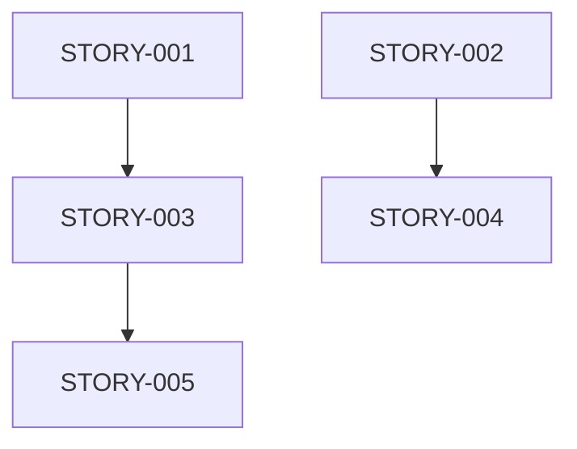
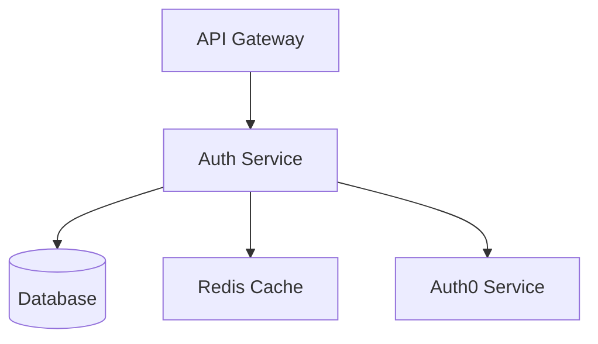

# Task Details Enrichment Skill

Automatically enrich Jira tasks with comprehensive context, technical requirements, dependencies, and estimates through intelligent analysis and extraction patterns.

## When to Use This Skill

Activate this skill when:
- A Jira issue lacks sufficient detail for implementation
- Need to extract hidden requirements from descriptions
- Analyzing issue complexity for estimation
- Identifying dependencies and blockers before starting work
- Converting vague requirements into actionable technical details
- Preparing issues for sprint planning
- Analyzing historical patterns for better estimates
- Gathering full context before orchestrating development work

## Core Capabilities

### 1. Context Extraction and Analysis
- Parse issue descriptions for technical requirements
- Extract acceptance criteria (explicit and implicit)
- Identify stakeholders and impacted systems
- Map business requirements to technical tasks
- Extract constraints (performance, security, compliance)

### 2. Dependency Mapping
- Identify linked issues and relationships
- Detect code-level dependencies from codebase analysis
- Map cross-team dependencies
- Identify blocking vs. blocked relationships
- Surface hidden dependencies through pattern matching

### 3. Complexity Assessment
- Analyze technical complexity indicators
- Estimate story points based on historical data
- Identify risk factors affecting complexity
- Compare with similar past issues
- Factor in team capacity and expertise

### 4. Requirement Decomposition
- Break down epics into stories
- Decompose stories into subtasks
- Extract testable acceptance criteria
- Generate technical design considerations
- Identify edge cases and error scenarios

### 5. Historical Analysis
- Find similar resolved issues
- Extract lessons learned from past work
- Identify patterns in issue resolution
- Leverage team velocity metrics
- Apply successful implementation patterns

## Enrichment Decision Tree

Use this decision tree to determine enrichment strategy:

```
START: Analyze Issue
│
├─ Is issue type Epic?
│  ├─ YES → Apply Epic Decomposition Strategy
│  │   ├─ Extract business objectives
│  │   ├─ Identify user journeys
│  │   ├─ Break into Stories
│  │   ├─ Map story dependencies
│  │   └─ Create epic roadmap
│  │
│  └─ NO → Continue to next check
│
├─ Does issue have clear acceptance criteria?
│  ├─ NO → Apply Acceptance Criteria Extraction
│  │   ├─ Analyze description for implicit criteria
│  │   ├─ Extract "should", "must", "will" statements
│  │   ├─ Identify testable conditions
│  │   ├─ Add Given-When-Then scenarios
│  │   └─ Flag missing requirements
│  │
│  └─ YES → Continue to next check
│
├─ Is technical complexity unclear?
│  ├─ YES → Apply Complexity Analysis
│  │   ├─ Analyze affected codebase areas
│  │   ├─ Identify integration points
│  │   ├─ Assess risk factors
│  │   ├─ Compare with historical issues
│  │   └─ Suggest story point estimate
│  │
│  └─ NO → Continue to next check
│
├─ Are dependencies unknown?
│  ├─ YES → Apply Dependency Mapping
│  │   ├─ Check linked issues
│  │   ├─ Analyze code dependencies
│  │   ├─ Identify team dependencies
│  │   ├─ Map external dependencies
│  │   └─ Create dependency graph
│  │
│  └─ NO → Continue to next check
│
├─ Is technical approach unclear?
│  ├─ YES → Apply Technical Design Enhancement
│  │   ├─ Suggest implementation patterns
│  │   ├─ Identify affected files/modules
│  │   ├─ Propose architecture approach
│  │   ├─ List potential risks
│  │   └─ Create design checklist
│  │
│  └─ NO → Continue to next check
│
├─ Are test scenarios missing?
│  ├─ YES → Apply Test Case Generation
│  │   ├─ Generate happy path scenarios
│  │   ├─ Identify edge cases
│  │   ├─ Create error scenarios
│  │   ├─ Add integration test cases
│  │   └─ Define performance criteria
│  │
│  └─ NO → Continue to final check
│
└─ Is sprint context needed?
   ├─ YES → Apply Sprint Context Analysis
   │   ├─ Check team capacity
   │   ├─ Analyze sprint goals alignment
   │   ├─ Review team velocity
   │   ├─ Identify resource constraints
   │   └─ Suggest sprint priority
   │
   └─ NO → Enrichment Complete
```

## Enrichment Strategies

### Strategy 1: Epic Decomposition

**When to Apply:**
- Issue type is Epic
- Large, vague requirements
- Multi-sprint initiatives
- Cross-functional features

**Process:**

1. **Extract Business Objectives**
   ```markdown
   ## Business Objectives Extracted:
   - Primary Goal: [What business problem does this solve?]
   - Success Metrics: [How will success be measured?]
   - Target Users: [Who benefits from this?]
   - Business Value: [What's the ROI/impact?]
   ```

2. **Identify User Journeys**
   - Map user personas involved
   - Extract user stories from description
   - Identify user pain points addressed
   - Define user workflows affected

3. **Break into Stories**
   ```markdown
   ## Suggested Stories:

   ### Story 1: [Story Title]
   **As a** [user type]
   **I want** [capability]
   **So that** [benefit]

   **Acceptance Criteria:**
   - [ ] Criterion 1
   - [ ] Criterion 2

   **Estimated Complexity:** [Story Points]
   **Priority:** [High/Medium/Low]
   ```

4. **Map Story Dependencies**
   - Create story dependency graph
   - Identify prerequisite stories
   - Suggest implementation order
   - Flag parallel work opportunities

5. **Create Epic Roadmap**
   - Phase 1: Foundation stories
   - Phase 2: Core feature stories
   - Phase 3: Enhancement stories
   - Phase 4: Polish and optimization

**Output Format:**
```markdown
# Epic Decomposition: [EPIC-KEY]

## Original Epic Summary
[Epic description]

## Business Objectives
- Objective 1
- Objective 2

## User Journeys Affected
1. Journey 1: [Description]
2. Journey 2: [Description]

## Recommended Stories

### Phase 1: Foundation (Sprint 1)
- [ ] STORY-001: [Title] (5 pts)
- [ ] STORY-002: [Title] (3 pts)

### Phase 2: Core Features (Sprint 2-3)
- [ ] STORY-003: [Title] (8 pts) - Depends on STORY-001
- [ ] STORY-004: [Title] (5 pts) - Depends on STORY-002

### Phase 3: Enhancements (Sprint 4)
- [ ] STORY-005: [Title] (3 pts)

## Dependency Graph


## Risk Factors
- Risk 1: [Description and mitigation]
- Risk 2: [Description and mitigation]

## Estimated Total Effort
- Total Story Points: 24
- Estimated Sprints: 4
- Team Size Recommended: 2-3 developers
```

### Strategy 2: Acceptance Criteria Extraction

**When to Apply:**
- Vague or missing acceptance criteria
- Description contains implicit requirements
- Need to clarify "done" conditions
- Preparing for development work

**Extraction Patterns:**

1. **Modal Verb Detection**
   - "must", "should", "shall", "will", "can"
   - "requires", "needs", "allows"
   - "enables", "supports", "provides"

2. **Behavior Keywords**
   - "when", "if", "then"
   - "after", "before", "during"
   - "given", "and", "but"

3. **Constraint Indicators**
   - "only", "except", "unless"
   - "within X seconds", "at least", "no more than"
   - "compatible with", "compliant with"

4. **Stakeholder Requirements**
   - "user can", "user should"
   - "system must", "application will"
   - "admin requires", "customer expects"

**Process:**

1. **Parse Description**
   ```python
   # Pseudo-code for extraction
   requirements = []
   for sentence in description.sentences:
       if contains_modal_verb(sentence):
           requirements.append(extract_requirement(sentence))
       if contains_behavior_keyword(sentence):
           requirements.append(convert_to_given_when_then(sentence))
   ```

2. **Categorize Requirements**
   - Functional requirements
   - Non-functional requirements (performance, security, usability)
   - Business rules
   - Constraints

3. **Convert to Testable Criteria**
   ```markdown
   ## Extracted Acceptance Criteria

   ### Functional
   - [ ] **AC1:** User can [action] when [condition]
   - [ ] **AC2:** System must [behavior] if [trigger]

   ### Non-Functional
   - [ ] **AC3:** Response time < 200ms for [operation]
   - [ ] **AC4:** Supports 1000 concurrent users

   ### Business Rules
   - [ ] **AC5:** Only [role] can [action]
   - [ ] **AC6:** [Entity] must validate [field]
   ```

4. **Add Given-When-Then Scenarios**
   ```gherkin
   Scenario: [Scenario Name]
     Given [initial context]
     When [action occurs]
     Then [expected outcome]
     And [additional expectation]
   ```

**Output Format:**
```markdown
# Acceptance Criteria Enrichment: [ISSUE-KEY]

## Original Description Analysis
**Keywords Found:** "must", "should", "will" (15 instances)
**Implicit Requirements Detected:** 8
**Testable Conditions:** 12

## Extracted Acceptance Criteria

### Functional Requirements
- [ ] **AC1:** User can submit form when all required fields are filled
  - Required fields: name, email, phone
  - Validation: email format, phone format

- [ ] **AC2:** System must send confirmation email within 1 minute
  - Email contains: submission ID, timestamp, summary

- [ ] **AC3:** User receives immediate feedback on validation errors
  - Error messages: clear, actionable, field-specific

### Non-Functional Requirements
- [ ] **AC4:** Form submission completes within 2 seconds
- [ ] **AC5:** Works on mobile devices (iOS 14+, Android 10+)
- [ ] **AC6:** Accessibility: WCAG 2.1 AA compliance

### Security Requirements
- [ ] **AC7:** Form data encrypted in transit (TLS 1.3)
- [ ] **AC8:** CSRF protection enabled
- [ ] **AC9:** Rate limiting: max 5 submissions per hour per user

## Test Scenarios

### Scenario 1: Successful Form Submission
```gherkin
Given user is on the contact form page
And all required fields are empty
When user fills in valid data for all required fields
And user clicks "Submit" button
Then form is submitted successfully
And user sees success message
And confirmation email is sent
```

### Scenario 2: Validation Error Handling
```gherkin
Given user is on the contact form page
When user enters invalid email format
And user clicks "Submit" button
Then form is not submitted
And user sees error message "Please enter a valid email address"
And error is highlighted on email field
```

## Missing Information (Requires Clarification)
- [ ] What happens if email service is down?
- [ ] Should form data be saved if submission fails?
- [ ] Is there a maximum character limit for text fields?
- [ ] What's the expected behavior for duplicate submissions?

## Recommended Next Steps
1. Review extracted criteria with Product Owner
2. Clarify missing information items
3. Add criteria as checklist to Jira issue
4. Update story point estimate based on complexity
```

### Strategy 3: Complexity Analysis and Estimation

**When to Apply:**
- Story point estimate is missing or unclear
- Need to assess technical risk
- Preparing sprint planning
- Analyzing implementation effort

**Complexity Factors:**

1. **Code Complexity Indicators**
   - Number of files to modify
   - Lines of code affected
   - Cyclomatic complexity of affected code
   - Number of integration points
   - Technology stack complexity

2. **Risk Factors**
   - New technology/framework
   - External dependencies
   - Data migration required
   - Breaking changes
   - Security implications
   - Performance requirements
   - Cross-team coordination needed

3. **Historical Comparison**
   - Similar issues resolved
   - Team velocity on similar work
   - Past estimation accuracy
   - Lessons from similar tickets

**Complexity Scoring Matrix:**

| Factor | Weight | Score (1-5) | Weighted Score |
|--------|--------|-------------|----------------|
| Code Changes | 0.25 | [1-5] | [calculated] |
| Integration Points | 0.20 | [1-5] | [calculated] |
| Risk Level | 0.20 | [1-5] | [calculated] |
| Testing Complexity | 0.15 | [1-5] | [calculated] |
| Dependencies | 0.10 | [1-5] | [calculated] |
| Uncertainty | 0.10 | [1-5] | [calculated] |
| **Total** | **1.00** | - | **[sum]** |

**Story Point Mapping:**
- 1-10: 1 point (trivial)
- 11-20: 2 points (simple)
- 21-30: 3 points (moderate)
- 31-40: 5 points (complex)
- 41-50: 8 points (very complex)
- 51+: 13 points or break down further

**Process:**

1. **Analyze Codebase Impact**
   ```bash
   # Identify affected files
   - Search for related code patterns
   - Identify modules/services affected
   - Count estimated file changes
   - Assess code quality of affected areas
   ```

2. **Assess Integration Complexity**
   - Number of APIs/services to integrate
   - Third-party dependencies
   - Database schema changes
   - Message queue/event impacts

3. **Compare with Historical Issues**
   ```sql
   -- Example query pattern
   SELECT issue_key, summary, story_points, resolution_time
   FROM jira_issues
   WHERE similarity(summary, '[current issue]') > 0.7
   AND status = 'Done'
   ORDER BY updated_date DESC
   LIMIT 10
   ```

4. **Calculate Complexity Score**
   - Apply scoring matrix
   - Factor in team expertise
   - Consider sprint context
   - Account for unknowns

**Output Format:**
```markdown
# Complexity Analysis: [ISSUE-KEY]

## Summary
**Recommended Story Points:** 5
**Confidence Level:** Medium (70%)
**Risk Level:** Medium
**Estimated Duration:** 2-3 days

## Complexity Breakdown

### Code Impact Analysis
- **Files to Modify:** ~8 files
  - `src/services/auth.service.ts` (high complexity)
  - `src/controllers/user.controller.ts` (medium complexity)
  - `src/models/user.model.ts` (low complexity)
  - ... 5 more files

- **Estimated LOC Changes:** 300-400 lines
- **New Files Required:** 2-3 files
  - `src/middleware/token-refresh.middleware.ts`
  - `src/services/token.service.ts`

### Integration Complexity
- **External APIs:** 1 (Auth0 integration)
- **Database Changes:** Medium
  - Add `refresh_token` column to users table
  - Migration required: backward compatible

- **Service Dependencies:** 3
  - Authentication service
  - User service
  - Session service

### Risk Factors (Score: 3.5/5)
- ⚠️ **High Risk:** Token security implementation
  - Mitigation: Security review required

- ⚠️ **Medium Risk:** Database migration
  - Mitigation: Test on staging first, rollback plan

- ℹ️ **Low Risk:** Breaking existing auth flow
  - Mitigation: Backward compatible design

### Historical Comparison

**Similar Issues:**
1. **PROJ-234:** "Add OAuth2 support" (8 points, 4 days)
   - Similar: Auth changes, token management
   - Different: Larger scope, more integrations

2. **PROJ-189:** "Fix session expiry" (3 points, 1 day)
   - Similar: Token handling
   - Different: Bug fix vs. feature

**Team Velocity:**
- Average points completed per sprint: 25
- Average time per 5-point story: 2.5 days
- Team expertise in auth: High

### Complexity Scoring

| Factor | Weight | Score | Weighted | Rationale |
|--------|--------|-------|----------|-----------|
| Code Changes | 0.25 | 3 | 0.75 | Moderate file count, medium LOC |
| Integration Points | 0.20 | 3 | 0.60 | Auth0 + DB + 3 services |
| Risk Level | 0.20 | 4 | 0.80 | Security implications |
| Testing Complexity | 0.15 | 3 | 0.45 | Auth testing required |
| Dependencies | 0.10 | 2 | 0.20 | Minimal blocking issues |
| Uncertainty | 0.10 | 3 | 0.30 | Some unknowns in token refresh |
| **Total** | **1.00** | - | **3.10** | **→ 5 Story Points** |

## Estimation Confidence

**High Confidence Factors:**
- Similar work done before
- Clear requirements
- Team has expertise

**Low Confidence Factors:**
- Auth0 integration details unclear
- Performance requirements not specified
- Migration rollback scenario undefined

**Recommended Actions Before Starting:**
- [ ] Clarify Auth0 token refresh configuration
- [ ] Define performance SLA for token operations
- [ ] Create migration rollback plan
- [ ] Security review acceptance criteria

## Testing Requirements

**Estimated Test Effort:** 30% of development time

- Unit tests: 8-10 test cases
- Integration tests: 5-6 scenarios
- Security tests: Token validation, encryption
- Performance tests: Token generation throughput
- Manual testing: Cross-browser auth flows

## Alternative Approaches

### Option 1: Full Implementation (5 points)
- Implement token refresh with Auth0
- Database migration
- Complete test coverage
- **Pros:** Complete solution
- **Cons:** Higher risk, longer timeline

### Option 2: Phased Approach (Split into 2 stories)
- Story 1: Token service + basic refresh (3 points)
- Story 2: Auth0 integration + migration (3 points)
- **Pros:** Lower risk per story, easier to test
- **Cons:** More coordination overhead

### Option 3: Use Existing Library (2 points)
- Integrate auth middleware library
- Minimal custom code
- **Pros:** Faster, battle-tested
- **Cons:** Less flexibility, external dependency

## Recommendation
Proceed with **Option 1** (5 points) if sprint capacity allows and team has Auth0 experience. Otherwise, consider **Option 2** for risk reduction.
```

### Strategy 4: Dependency Mapping

**When to Apply:**
- Complex issues with unclear dependencies
- Cross-team coordination required
- Before sprint planning
- Risk assessment needs

**Dependency Types:**

1. **Jira Issue Dependencies**
   - Blocks/Blocked by relationships
   - Parent/child (Epic → Story → Subtask)
   - Related issues
   - Cloned from/to

2. **Code Dependencies**
   - Shared libraries/modules
   - API contracts
   - Database schemas
   - Configuration dependencies

3. **Team Dependencies**
   - Other team's work required
   - Shared resources
   - Knowledge dependencies
   - Review/approval requirements

4. **External Dependencies**
   - Third-party APIs
   - Infrastructure changes
   - Vendor deliverables
   - Legal/compliance approvals

**Process:**

1. **Query Jira Links**
   ```javascript
   // Example using Jira API
   const links = await jira.getIssueLinks(issueKey);
   const blockers = links.filter(l => l.type === 'Blocks');
   const dependencies = links.filter(l => l.type === 'Depends on');
   ```

2. **Analyze Code Dependencies**
   ```bash
   # Search for module imports
   grep -r "import.*auth" src/

   # Find database references
   grep -r "users\\.refresh_token" src/

   # Identify API calls
   grep -r "auth0\\.api" src/
   ```

3. **Identify Team Dependencies**
   - Check issue assignments
   - Review component ownership
   - Analyze cross-team communication in comments

4. **Create Dependency Graph**
   ```mermaid
   graph TD
       CURRENT[Current Issue]
       CURRENT --> DEP1[Dependency 1]
       CURRENT --> DEP2[Dependency 2]
       DEP1 --> DEP3[Sub-dependency]
   ```

**Output Format:**
```markdown
# Dependency Analysis: [ISSUE-KEY]

## Dependency Summary
- **Total Dependencies:** 7
- **Blocking Issues:** 2 (CRITICAL)
- **Code Dependencies:** 3
- **Team Dependencies:** 2
- **External Dependencies:** 1

## Critical Path

**Estimated Timeline:** 5 days (including blockers)

## Blocking Issues (Must Resolve First)

### 🚨 PROJ-100: "Complete Auth0 API Configuration"
- **Status:** In Progress
- **Assignee:** @john-doe (Platform Team)
- **ETA:** 2 days
- **Impact:** Cannot start implementation until Auth0 credentials are ready
- **Action:** Follow up with Platform Team daily

### 🚨 PROJ-111: "Database Migration Framework Update"
- **Status:** In Review
- **Assignee:** @jane-smith (DevOps)
- **ETA:** 1 day
- **Impact:** Need new migration CLI for refresh_token column
- **Action:** Review PR and test migration locally

## Code Dependencies

### Module: `auth.service.ts`
- **Current State:** Stable, high test coverage
- **Required Changes:** Add token refresh method
- **Risk:** Low (well-tested module)
- **Owned By:** Authentication Team

### Module: `user.model.ts`
- **Current State:** Active development (PROJ-98)
- **Required Changes:** Add refresh_token field
- **Risk:** Medium (concurrent changes possible)
- **Owned By:** Backend Team
- **Action:** Coordinate with PROJ-98 assignee

### API: Auth0 Management API
- **Version:** v2
- **Documentation:** https://auth0.com/docs/api/management/v2
- **Dependencies:** Valid credentials from PROJ-100
- **Rate Limits:** 1000 requests/hour
- **Risk:** Low (well-documented)

## Team Dependencies

### Dependency 1: Security Review
- **Team:** Security Engineering
- **Contact:** @security-team
- **Required For:** Production deployment
- **Timeline:** 2-3 days after PR created
- **Action:** Schedule review in advance

### Dependency 2: API Documentation
- **Team:** Technical Writing
- **Contact:** @docs-team
- **Required For:** Public API changes
- **Timeline:** 1 day after PR merged
- **Action:** Provide API spec early

## External Dependencies

### Auth0 Service
- **Type:** Third-party SaaS
- **SLA:** 99.9% uptime
- **Rate Limits:** Apply to token refresh endpoint
- **Documentation:** Required reading before implementation
- **Risk:** Low (reliable service)
- **Fallback:** Graceful degradation to session-only auth

## Dependency Risk Matrix

| Dependency | Type | Status | Risk | Impact | Mitigation |
|------------|------|--------|------|--------|------------|
| PROJ-100 | Blocking Issue | In Progress | High | Cannot start | Daily follow-up |
| PROJ-111 | Blocking Issue | In Review | Medium | Delayed DB changes | Review and test PR |
| auth.service.ts | Code | Stable | Low | None | Standard testing |
| user.model.ts | Code | Active Dev | Medium | Merge conflicts | Coordinate with owner |
| Security Review | Team | Pending | Medium | Deployment delay | Schedule early |
| Auth0 API | External | Active | Low | Service outage | Fallback plan |

## Recommended Execution Order

1. **Pre-work (Days 1-2):**
   - [ ] Wait for PROJ-100 completion
   - [ ] Test PROJ-111 migration framework
   - [ ] Review Auth0 documentation
   - [ ] Schedule security review

2. **Implementation (Days 3-4):**
   - [ ] Coordinate with PROJ-98 on user.model.ts
   - [ ] Implement token refresh in auth.service.ts
   - [ ] Add database migration
   - [ ] Write tests

3. **Review & Deploy (Day 5):**
   - [ ] Security review
   - [ ] PR review
   - [ ] Documentation update
   - [ ] Deploy to staging

## Parallel Work Opportunities

While waiting for blockers, can work on:
- [ ] Write comprehensive tests (no blockers)
- [ ] Draft documentation (no blockers)
- [ ] Create DB migration script (after PROJ-111)
- [ ] Design API spec for docs team (no blockers)
```

### Strategy 5: Technical Design Enhancement

**When to Apply:**
- Technical approach unclear
- Need architecture guidance
- Identifying affected components
- Risk mitigation planning

**Output Format:**
```markdown
# Technical Design: [ISSUE-KEY]

## Architecture Impact

### Components Affected


### Proposed Changes

#### 1. Auth Service Enhancement
**File:** `src/services/auth.service.ts`
```typescript
// Proposed new method
async refreshAccessToken(refreshToken: string): Promise<TokenPair> {
  // Validate refresh token
  // Call Auth0 refresh endpoint
  // Update session cache
  // Return new token pair
}
```

#### 2. Database Schema
**Migration:** `migrations/YYYYMMDD_add_refresh_token.sql`
```sql
ALTER TABLE users
ADD COLUMN refresh_token VARCHAR(512) ENCRYPTED,
ADD COLUMN refresh_token_expires_at TIMESTAMP,
ADD INDEX idx_refresh_token (refresh_token);
```

#### 3. API Endpoint
**File:** `src/controllers/auth.controller.ts`
```typescript
POST /auth/refresh
Body: { refreshToken: string }
Response: { accessToken: string, refreshToken: string, expiresIn: number }
```

## Implementation Patterns

### Pattern 1: Token Rotation
- Issue new refresh token with each refresh
- Invalidate old refresh token
- Store token family for breach detection

### Pattern 2: Graceful Degradation
- If Auth0 unavailable, extend current session
- Log failure for monitoring
- Return cached credentials if valid

### Pattern 3: Security Best Practices
- Encrypt refresh tokens at rest
- Use HTTP-only cookies for web clients
- Implement token binding to prevent theft
- Add rate limiting per user

## Risk Mitigation

### Risk 1: Token Leakage
**Probability:** Low
**Impact:** High
**Mitigation:**
- Encrypt tokens in database
- Short-lived refresh tokens (7 days)
- Token rotation on each use
- Revocation endpoint

### Risk 2: Auth0 Service Outage
**Probability:** Very Low
**Impact:** High
**Mitigation:**
- Cache valid tokens in Redis
- Graceful degradation
- Monitoring and alerts
- SLA with Auth0

### Risk 3: Database Migration Failure
**Probability:** Low
**Impact:** Medium
**Mitigation:**
- Test migration on staging
- Backup before migration
- Rollback script ready
- Zero-downtime migration (add column, backfill, deploy)

## Performance Considerations

### Expected Load
- Token refresh rate: ~100 requests/minute
- Database queries: +200 queries/minute
- Auth0 API calls: +100 calls/minute

### Optimization Strategies
- Cache valid tokens in Redis (TTL = token expiry)
- Batch database updates
- Connection pooling for Auth0 API
- CDN for token validation keys

### Performance Targets
- Token refresh latency: < 200ms (p95)
- Database query time: < 50ms
- Cache hit rate: > 90%

## Testing Strategy

### Unit Tests (8-10 tests)
- Token validation logic
- Token rotation logic
- Error handling
- Edge cases (expired tokens, invalid format)

### Integration Tests (5-6 tests)
- End-to-end token refresh flow
- Database integration
- Auth0 API integration
- Cache integration

### Security Tests
- Token encryption verification
- Rate limiting validation
- Revocation functionality
- Token binding verification

### Performance Tests
- Load test: 1000 concurrent refreshes
- Latency measurement
- Database query optimization
- Cache performance

## Rollout Plan

### Phase 1: Internal Testing (Week 1)
- Deploy to dev environment
- Internal team testing
- Performance benchmarking

### Phase 2: Staging Validation (Week 2)
- Deploy to staging
- Security review
- Load testing
- Documentation finalization

### Phase 3: Production Rollout (Week 3)
- Feature flag deployment
- Gradual rollout (10% → 50% → 100%)
- Monitoring and alerting
- Rollback plan ready

## Monitoring and Alerts

### Metrics to Track
- Token refresh success rate
- Token refresh latency (p50, p95, p99)
- Auth0 API error rate
- Database query performance
- Cache hit rate

### Alerts
- Token refresh error rate > 1%
- Latency p95 > 500ms
- Auth0 API unavailable
- Database connection errors

## Documentation Requirements

### API Documentation
- OpenAPI spec for /auth/refresh endpoint
- Client integration guide
- Error code reference

### Internal Documentation
- Architecture decision record (ADR)
- Runbook for troubleshooting
- Database migration guide

### User Documentation
- None (internal API change)
```

## Integration with Atlassian MCP Tools

### Using Jira MCP for Enrichment

```typescript
// Example enrichment workflow using MCP tools

// 1. Fetch issue details
const issue = await mcp.atlassian.getIssue(issueKey);

// 2. Extract description
const description = issue.fields.description;

// 3. Analyze for requirements
const criteria = extractAcceptanceCriteria(description);

// 4. Find similar issues
const similarIssues = await mcp.atlassian.searchIssues(
  `text ~ "${issue.fields.summary}" AND status = Done ORDER BY updated DESC`
);

// 5. Analyze linked issues
const links = issue.fields.issuelinks;
const blockers = links.filter(l => l.type.name === 'Blocks');

// 6. Get historical data
const history = await mcp.atlassian.getIssueChangelog(issueKey);

// 7. Update issue with enrichment
await mcp.atlassian.updateIssue(issueKey, {
  fields: {
    customfield_10100: criteria, // Acceptance Criteria field
    customfield_10101: estimatedPoints, // Story Points
    description: enhancedDescription
  }
});

// 8. Add enrichment comment
await mcp.atlassian.addComment(issueKey, formatEnrichmentComment(analysis));
```

### Cross-referencing with Confluence

```typescript
// Link to related Confluence documentation

// 1. Search Confluence for related docs
const docs = await mcp.atlassian.searchConfluence(
  `space = PROJ AND text ~ "${issue.fields.summary}"`
);

// 2. Extract technical requirements from Confluence
const techSpec = await mcp.atlassian.getConfluencePage(docs[0].id);
const requirements = parseConfluenceContent(techSpec.body.storage.value);

// 3. Add documentation links to Jira
await mcp.atlassian.addWebLink(issueKey, {
  url: docs[0].url,
  title: "Related Technical Specification"
});
```

### Git History Integration

```typescript
// Analyze related code changes

// 1. Search git history for related commits
const relatedCommits = await searchCommits(
  `git log --grep="${issue.fields.summary}" --all`
);

// 2. Identify affected files
const affectedFiles = extractFilesFromCommits(relatedCommits);

// 3. Analyze code complexity
const complexity = await analyzeCodeComplexity(affectedFiles);

// 4. Add findings to Jira
await mcp.atlassian.addComment(issueKey, `
## Code Impact Analysis

### Recently Modified Files Related to This Issue:
${affectedFiles.map(f => `- ${f.path} (${f.changes} changes in last 30 days)`).join('\n')}

### Complexity Assessment:
- Average cyclomatic complexity: ${complexity.average}
- High complexity files: ${complexity.high.length}

### Recommendation:
${generateComplexityRecommendation(complexity)}
`);
```

## Enrichment Triggers and Automation

### Automatic Enrichment Triggers

1. **Issue Created**
   - Extract acceptance criteria from description
   - Search for similar historical issues
   - Suggest initial story point estimate

2. **Issue Moved to "Ready for Development"**
   - Full dependency analysis
   - Technical design suggestions
   - Test scenario generation

3. **Issue Assigned to Sprint**
   - Team capacity check
   - Complexity re-assessment
   - Resource allocation suggestions

4. **Issue Description Updated**
   - Re-extract acceptance criteria
   - Update complexity estimate
   - Flag new risks or dependencies

### Manual Enrichment Commands

```bash
# Trigger full enrichment
/enrich-task PROJ-123

# Specific enrichment types
/enrich-task PROJ-123 --criteria-only
/enrich-task PROJ-123 --complexity-only
/enrich-task PROJ-123 --dependencies-only

# Batch enrichment
/enrich-sprint "Sprint 24"
/enrich-epic EPIC-456
```

## Best Practices

### 1. Progressive Enrichment
- Start with lightweight analysis
- Add detail as issue progresses through workflow
- Avoid over-engineering in early stages

### 2. Human-in-the-Loop
- Always flag uncertain analysis for human review
- Provide confidence scores
- Suggest rather than dictate

### 3. Context Preservation
- Link to source information
- Document reasoning
- Maintain audit trail

### 4. Team Adaptation
- Learn from team's estimation accuracy
- Adapt to team velocity patterns
- Respect team's conventions

### 5. Continuous Learning
- Track estimation accuracy
- Refine complexity models
- Update pattern libraries

## Examples

### Example 1: Enriching a Vague Bug Report

**Original Issue:**
```
Title: Login not working
Description: Users can't log in sometimes
```

**After Enrichment:**
```markdown
Title: Login not working
Description: Users can't log in sometimes

---
## AI-Generated Enrichment

### Extracted Requirements (Needs Verification)
Based on the vague description, likely requirements:
- [ ] Identify specific scenarios where login fails
- [ ] Determine if issue is browser-specific
- [ ] Check if issue occurs for all users or specific roles
- [ ] Verify if related to recent deployments

### Missing Information (Critical)
- **Reproduction Steps:** How to reproduce the issue?
- **Affected Users:** All users or specific group?
- **Frequency:** Always, sometimes, rarely?
- **Browser/Device:** Which browsers/devices affected?
- **Error Messages:** What errors do users see?
- **Recent Changes:** Any recent deployments to auth system?

### Suggested Investigation Steps
1. Check application logs for authentication errors
2. Review Auth0 dashboard for failed login attempts
3. Test login flow in different browsers
4. Check if issue correlates with specific time periods
5. Review recent changes to auth.service.ts

### Similar Historical Issues
- **PROJ-89:** "Login timeout issues" (3 points, resolved in 1 day)
  - Root cause: Session expiry misconfiguration
  - Fix: Updated session timeout settings

### Preliminary Complexity Assessment
**Story Points:** Cannot estimate without reproduction steps
**Recommended Action:** Move to "Needs More Info" status

### Recommended Labels
- bug, authentication, needs-reproduction, priority-tbd
```

### Example 2: Enriching a Feature Story

**Original Issue:**
```
Title: Add export functionality
Description: Users should be able to export their data
```

**After Enrichment:**
```markdown
Title: Add export functionality
Description: Users should be able to export their data

---
## AI-Generated Enrichment

### Extracted Acceptance Criteria

#### Functional Requirements
- [ ] **AC1:** User can trigger data export from profile settings
- [ ] **AC2:** User can choose export format (CSV, JSON, PDF)
- [ ] **AC3:** Export includes all user data (profile, activity, preferences)
- [ ] **AC4:** User receives download link via email when export is ready
- [ ] **AC5:** Export file is available for download for 7 days

#### Non-Functional Requirements
- [ ] **AC6:** Export generation completes within 5 minutes for typical user
- [ ] **AC7:** Supports users with up to 10,000 records
- [ ] **AC8:** Export files are encrypted and access-controlled
- [ ] **AC9:** GDPR compliant (right to data portability)

### Technical Design Suggestions

#### Recommended Architecture
- **Async Processing:** Use job queue for export generation
- **Storage:** Temporary S3 bucket with 7-day TTL
- **Notification:** Email service integration
- **Formats:**
  - CSV: For spreadsheet import
  - JSON: For API integrations
  - PDF: For archival/printing

#### Affected Components
- User Settings UI
- Export Service (new)
- Job Queue Worker
- Email Notification Service
- S3 Storage

### Complexity Analysis
**Recommended Story Points:** 8

**Complexity Factors:**
- Multiple export formats: +2 complexity
- Async job processing: +2 complexity
- Email integration: +1 complexity
- Security/access control: +2 complexity
- GDPR compliance: +1 complexity

**Risk Factors:**
- ⚠️ Large data exports may timeout
- ⚠️ S3 costs for storage
- ℹ️ Email deliverability

### Dependencies
- Job queue infrastructure (existing)
- S3 bucket configuration (DevOps)
- Email template design (Design team)
- GDPR compliance review (Legal)

### Test Scenarios

#### Happy Path
```gherkin
Given user has data in the system
When user requests CSV export from settings
Then export job is queued
And user sees "Export in progress" message
And within 5 minutes, user receives email with download link
And user can download encrypted CSV file
And file contains all user data
```

#### Edge Cases
- Empty user data (no records to export)
- Very large dataset (10,000+ records)
- Multiple concurrent export requests
- Download link expiry after 7 days
- Network failure during download

### Estimated Effort Breakdown
- Export Service implementation: 1 day
- UI components: 0.5 day
- Format generators (CSV/JSON/PDF): 1 day
- Email integration: 0.5 day
- Testing: 1 day
- Documentation: 0.5 day
- **Total:** 4.5 days (≈ 8 story points)

### Related Documentation
- [Confluence: Data Export Requirements](link)
- [GDPR Right to Portability Spec](link)
- [S3 Bucket Configuration Guide](link)

### Recommended Sub-tasks
- [ ] TASK-1: Design export data schema
- [ ] TASK-2: Implement CSV export generator
- [ ] TASK-3: Implement JSON export generator
- [ ] TASK-4: Implement PDF export generator
- [ ] TASK-5: Build export service with job queue
- [ ] TASK-6: Create export UI in settings page
- [ ] TASK-7: Integrate email notification
- [ ] TASK-8: Add S3 storage and access control
- [ ] TASK-9: Write comprehensive tests
- [ ] TASK-10: GDPR compliance review
```

## Summary

This skill provides comprehensive task enrichment capabilities through:

1. **Intelligent Extraction**: Automatically parse and extract requirements from vague descriptions
2. **Complexity Analysis**: Assess technical complexity and provide accurate estimates
3. **Dependency Mapping**: Identify all blockers and dependencies before work starts
4. **Design Guidance**: Suggest technical approaches and architecture patterns
5. **Historical Learning**: Leverage past issues for better estimates and approaches
6. **Integration**: Use Atlassian MCP tools for seamless Jira/Confluence integration

Use this skill as part of the EXPLORE phase in the Jira Orchestration Workflow to ensure all issues have comprehensive context before development begins.
