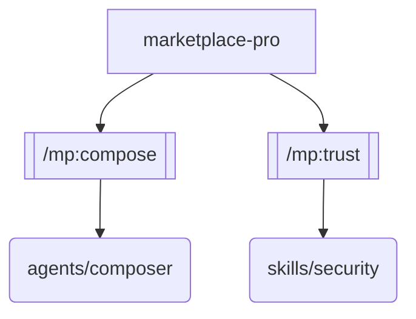

# Plugin Dev Studio

Development toolkit for building, testing, and visualizing Claude Code plugins with hot-reload support.

## Sub-commands

Process the `$ARGUMENTS` to determine which sub-command to run:

### `/mp:dev serve <plugin-path> [--watch]`

Start the hot-reload development server for a plugin.

1. Resolve `<plugin-path>` to an absolute path (default: current plugin directory)
2. Verify the plugin has a valid `.claude-plugin/plugin.json` manifest
3. Initialize the DevServer from `src/devstudio/server.ts`:
   - Create a `FileWatcher` on the plugin directory
   - Create a `HotReloader` with the resource registry
   - Perform initial full validation of all plugin resources
4. Report initial validation results:
   - List all discovered resources (commands, skills, agents)
   - Show validation errors with `file:line` references
   - Show the dependency graph (ASCII format)
5. If `--watch` is specified, keep the server running and report changes as they occur:
   - On file change: re-validate, show diff of what changed
   - On manifest change: re-read and re-validate the full manifest
   - Show inline error/warning markers for each affected file

**Output format:**
```
Dev Server started for: marketplace-pro v1.0.0
Watching: /path/to/plugin

Resources loaded:
  [OK]  /mp:compose  (commands/compose.md)
  [OK]  /mp:trust    (commands/trust.md)
  [ERR] /mp:dev      (commands/dev.md) -- missing frontmatter field "name"

Validation: 2 passed, 1 error, 0 warnings

Dependency Graph:
  marketplace-pro
  +-- provides: [plugin-composition, trust-scoring]
  +-- requires: [plugin-registry]
  \-- resources:
      +-- /mp:compose --> agents/composer
      \-- /mp:trust --> skills/security
```

### `/mp:dev playground <plugin-path>`

Launch the interactive command playground for testing.

1. Initialize a `PluginPlayground` from `src/devstudio/server.ts`
2. Register mock capabilities for the plugin's declared requirements
3. Enter interactive mode where the user can:
   - Execute commands: `run /mp:compose "intent description"`
   - View invocation log: `log`
   - Save the last invocation as a fixture: `save <fixture-name>`
   - List available mock capabilities: `caps`
4. All command invocations are recorded with full input/output pairs
5. Saved fixtures are written to `tests/fixtures/` as JSON files

### `/mp:dev graph <plugin-path>`

Show the dependency graph for a plugin.

1. Initialize a `DependencyGraphRenderer` from `src/devstudio/server.ts`
2. Build the resource graph by scanning the plugin directory
3. Display both ASCII and Mermaid representations:

**ASCII output:**
```
marketplace-pro
+-- provides: [plugin-composition, supply-chain-security, trust-scoring, ...]
+-- requires: [plugin-registry]
+-- conflicts: []
\-- resources:
    +-- /mp:compose --> agents/composer
    +-- /mp:trust --> skills/security
    +-- /mp:recommend --> skills/intelligence
    \-- /mp:dev --> [hot-reload runtime]
```

**Mermaid output:**
````markdown

````

### `/mp:dev validate <plugin-path>`

Run the full validation suite on a plugin without starting the dev server.

1. Initialize a `HotReloader` and run `fullValidation()`
2. Report results for each file with inline error markers:
   ```
   .claude-plugin/plugin.json
     [OK] Valid JSON structure
     [OK] Required fields present (name, version, description)
     [OK] Capabilities declared

   commands/compose.md
     [OK] Valid YAML frontmatter
     [OK] Required fields: name, description
     [WRN] Missing top-level heading after frontmatter (line 8)

   commands/dev.md
     [ERR] Missing required frontmatter field "name" (line 4)
   ```
3. Exit with a summary: `N files checked, E errors, W warnings`

### `/mp:dev fixture list`

List all saved test fixtures in `tests/fixtures/`.

Display each fixture with:
- Fixture ID (first 8 chars)
- Command that was executed
- Timestamp
- Pass/fail status from last replay (if available)

### `/mp:dev fixture replay <fixture-name>`

Replay a saved test fixture and compare output.

1. Load the fixture from `tests/fixtures/`
2. Re-execute the command with the same input
3. Compare output against the recorded baseline
4. Report any differences:
   ```
   Replaying: fixture-compose-abc12345
   Command: /mp:compose "build a REST API"

   output.text:        DIFF (expected 3 lines, got 4 lines)
   output.toolCalls:   MATCH
   output.filesModified: MATCH

   Result: FAIL (1 diff)
   ```

## Default Behavior

If no sub-command is provided, show this help summary with all available sub-commands and their usage.
