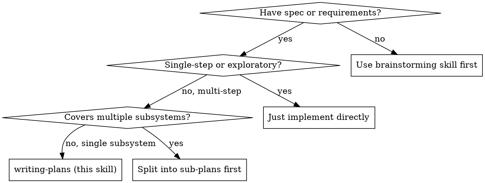

# Writing Plans (Enhanced)

## Overview

Write comprehensive implementation plans assuming the engineer has zero context for our codebase and questionable taste. Document everything they need to know: which files to touch, code to write, commands to run, and how to verify each step. Give them the whole plan as bite-sized tasks. DRY. YAGNI. TDD. Frequent commits.

Assume they are a skilled developer, but know almost nothing about our toolset or problem domain. Assume they don't know good test design well.

**Announce at start:** "I'm using the writing-plans skill to create the implementation plan."

**Context:** This should be run in a dedicated worktree (created by brainstorming skill).

**Save plans to:** `docs/superpowers/plans/YYYY-MM-DD-<feature-name>.md`
- (User preferences for plan location override this default)

## When to Use



## The Process

Write plans in five phases. Each phase has outputs the next phase depends on.

1. **Pre-Writing — Gather Context:** read spec, study codebase, identify patterns.
2. **Scope Check:** verify this is a single subsystem sized right for one plan.
3. **File Structure:** map files to create/modify before decomposing tasks.
4. **Task Decomposition:** bite-sized TDD steps (and non-TDD variants where appropriate).
5. **Self-Review:** check against spec, scan for placeholders, verify type consistency.

## Phase 1: Pre-Writing — Gather Context

**Don't skip this.** A plan written without context produces tasks that conflict with the codebase and force the implementer to guess.

**Read the spec twice.** The first read builds intuition. The second catches the details you glossed over. Note every explicit requirement and every implicit assumption.

**Study the codebase** before decomposing tasks:
- What conventions does the codebase follow? (naming, directory layout, test framework, lint rules)
- Where do similar features live? Read one complete example end-to-end.
- What are the extension points? (interfaces, base classes, plugin registries)
- How is this tech stack wired up? (dependency injection, config loading, build/test commands)

**Identify risks and unknowns:**
- Which tasks touch code you don't fully understand?
- Are there external dependencies (APIs, services, libraries) whose behavior you'd need to verify?
- Where could a naïve implementation break existing tests?

Capture findings briefly at the top of the plan under **Context** (codebase conventions, reference patterns, known risks). The implementer reads this before touching code.

## Phase 2: Scope Check

If the spec covers multiple independent subsystems, it should have been broken into sub-project specs during brainstorming. If it wasn't, suggest breaking this into separate plans — one per subsystem. Each plan should produce working, testable software on its own.

**Plan size guidance:**

| Task count | Shape | Notes |
|------------|-------|-------|
| 3–10 | Single plan | Normal size — keep tasks in one file |
| 11–20 | Single plan with phases | Group tasks under `## Phase N:` headings |
| 20+ | Split into multiple plans | One per phase or subsystem; link them |

If the plan keeps growing past 20 tasks, stop and ask: is this actually multiple features? Split before writing tasks you don't need yet (YAGNI).

## Phase 3: File Structure

Before defining tasks, map out which files will be created or modified and what each one is responsible for. This is where decomposition decisions get locked in.

- Design units with clear boundaries and well-defined interfaces. Each file should have one clear responsibility.
- You reason best about code you can hold in context at once, and your edits are more reliable when files are focused. Prefer smaller, focused files over large ones that do too much.
- Files that change together should live together. Split by responsibility, not by technical layer.
- In existing codebases, follow established patterns. If the codebase uses large files, don't unilaterally restructure — but if a file you're modifying has grown unwieldy, including a split in the plan is reasonable.

This structure informs the task decomposition. Each task should produce self-contained changes that make sense independently.

## Phase 4: Task Decomposition

### Bite-Sized Step Granularity

**Each step is one action (2–5 minutes):**
- "Write the failing test" — step
- "Run it to make sure it fails" — step
- "Implement the minimal code to make the test pass" — step
- "Run the tests and make sure they pass" — step
- "Commit" — step

### Task Metadata

Every task should carry metadata that tells the implementer (or a subagent) how to execute it:

```markdown
### Task N: [Component Name]

**Type:** TDD | Config | Refactor | Migration | Documentation | Infrastructure
**Depends on:** Task M (or: none)
**Parallel-safe:** yes | no
**Risk:** low | medium | high — [one-line reason if medium/high]
```

- **Depends on:** lets the executor order tasks correctly. Use `none` liberally — tasks that don't depend on prior work can run in parallel.
- **Parallel-safe:** if two tasks don't touch the same files or shared state, mark both as parallel-safe. Subagent-driven execution uses this to fan out.
- **Risk:** high-risk tasks (schema migrations, auth changes, file deletions) warrant extra verification steps and explicit rollback notes.

### Non-TDD Task Patterns

Not every task fits the red–green–commit loop. For non-code tasks, substitute a verification style that proves the task succeeded. See `./task-templates.md` for full templates.

| Task type | Verification instead of test |
|-----------|------------------------------|
| Config change | Load config, print resolved value, assert expected |
| File move/rename | `git status` shows the rename; imports still resolve; tests still pass |
| Documentation | Cross-links resolve; code blocks parse; examples runnable |
| Infrastructure / IaC | `terraform plan` / `kubectl diff` shows expected delta; dry-run |
| Refactor (no behavior change) | All pre-existing tests still pass; no new tests needed |
| Migration (data/schema) | Dry-run succeeds; rollback plan present; applied on copy first |

For any non-TDD task, state the verification command and expected output explicitly.

## Plan Document Header

**Every plan MUST start with this header:**

```markdown
# [Feature Name] Implementation Plan

> **For agentic workers:** REQUIRED SUB-SKILL: Use superpowers:subagent-driven-development (recommended) or superpowers:executing-plans to implement this plan task-by-task. Steps use checkbox (`- [ ]`) syntax for tracking.

**Goal:** [One sentence describing what this builds]

**Architecture:** [2-3 sentences about approach]

**Tech Stack:** [Key technologies/libraries]

**Context:**
- Codebase conventions: [one line]
- Reference pattern: [file path to similar feature]
- Known risks: [one line or "none"]

---
```

## Task Structure

### Standard TDD Task

````markdown
### Task N: [Component Name]

**Type:** TDD
**Depends on:** none
**Parallel-safe:** yes
**Risk:** low

**Files:**
- Create: `exact/path/to/file.py`
- Modify: `exact/path/to/existing.py:123-145`
- Test: `tests/exact/path/to/test.py`

- [ ] **Step 1: Write the failing test**

```python
def test_specific_behavior():
    result = function(input)
    assert result == expected
```

- [ ] **Step 2: Run test to verify it fails**

Run: `pytest tests/path/test.py::test_name -v`
Expected: FAIL with "function not defined"

- [ ] **Step 3: Write minimal implementation**

```python
def function(input):
    return expected
```

- [ ] **Step 4: Run test to verify it passes**

Run: `pytest tests/path/test.py::test_name -v`
Expected: PASS

- [ ] **Step 5: Commit**

```bash
git add tests/path/test.py src/path/file.py
git commit -m "feat: add specific feature"
```
````

For non-TDD task templates (config, migration, refactor, documentation, infrastructure), see `./task-templates.md`.

## No Placeholders

Every step must contain the actual content an engineer needs. These are **plan failures** — never write them:
- "TBD", "TODO", "implement later", "fill in details"
- "Add appropriate error handling" / "add validation" / "handle edge cases"
- "Write tests for the above" (without actual test code)
- "Similar to Task N" (repeat the code — the engineer may be reading tasks out of order)
- Steps that describe what to do without showing how (code blocks required for code steps)
- References to types, functions, or methods not defined in any task
- Verification steps missing from non-TDD tasks

## Remember
- Exact file paths always
- Complete code in every step — if a step changes code, show the code
- Exact commands with expected output
- Task metadata on every task
- DRY, YAGNI, TDD, frequent commits

## Phase 5: Self-Review

After writing the complete plan, look at the spec with fresh eyes and check the plan against it. This is a checklist you run yourself — not a subagent dispatch.

**1. Spec coverage:** Skim each section/requirement in the spec. Can you point to a task that implements it? List any gaps.

**2. Placeholder scan:** Search your plan for red flags — any of the patterns from the "No Placeholders" section above. Fix them.

**3. Type consistency:** Do the types, method signatures, and property names you used in later tasks match what you defined in earlier tasks? A function called `clearLayers()` in Task 3 but `clearFullLayers()` in Task 7 is a bug.

**4. Dependency ordering:** Does every `Depends on: Task M` refer to a task that comes before it? No forward references.

**5. Verification completeness:** Does every task have a verification step? TDD tasks need a "test passes" step. Non-TDD tasks need their specific verification (see Non-TDD Task Patterns).

**6. Commit granularity:** Does each task end with a commit? Are the commit messages specific ("feat: add foo") rather than vague ("wip", "update")?

**7. Parallel-safe accuracy:** For tasks marked `Parallel-safe: yes`, do they really not touch the same files or shared state as any other parallel-safe task?

If you find issues, fix them inline. No need to re-review — just fix and move on. If you find a spec requirement with no task, add the task.

**Optional: Dispatch the plan-document reviewer subagent** (see `./plan-document-reviewer-prompt.md`) for an independent read. Recommended for high-risk plans or when the implementer will be a fresh subagent with no spec exposure.

## Red Flags

**Plan is not ready to hand off when:**
- Any task has a placeholder ("TBD", "fill in", "add validation")
- A later task references a function, type, or file not defined in an earlier task
- Non-TDD tasks lack explicit verification commands
- Tasks marked `Parallel-safe: yes` actually modify overlapping files
- `Depends on:` forward-references (Task 3 depends on Task 7)
- Plan exceeds 20 tasks without being split into phases or sub-plans
- Context section is missing or empty — implementer has nothing to orient against
- High-risk tasks lack rollback notes

**Never:**
- Ship a plan with unresolved red flags
- Assume the implementer will "figure it out" — they won't; they'll guess wrong
- Batch edit tasks in bulk during Self-Review — fix per-issue so nothing regresses

## Handling Plan Updates During Execution

Plans encounter reality. When execution reveals the plan is wrong:

- **Small correction** (wrong path, typo, missed import): update the plan inline, note it in a commit.
- **Task re-ordering needed:** pause, update `Depends on:` metadata and task order, then resume.
- **New requirement surfaced:** add a new task at the right position. Do not expand an existing task beyond its scope.
- **Fundamental approach wrong:** stop execution. Re-enter brainstorming. Write a new plan.

Never let the plan drift from what's actually being built. A plan that doesn't match the code is worse than no plan.

## Observability: Telemetry Per Task

Plans improve when you measure how they executed. For each task, capture at minimum:

| Metric | Why it matters |
|--------|----------------|
| Wall-clock duration | Compare to the 2–5 min step assumption; very long tasks were too big |
| Pass on first attempt? | Low first-pass-pass rate = tasks are ambiguous |
| Retry count before green | Each retry is a signal the plan missed something |
| Test count added | Under-tested tasks are risk hotspots |
| Commits per task | More than 1 = task was not atomic |
| Blocker reason (if stuck) | Feeds future Pre-Writing context notes |

Persist these as a sibling `execution-log.md` next to the plan file. When writing the next plan, read the previous log to spot patterns (e.g., "tasks involving migrations always needed 2+ retries — budget more context there"). This closes the Plan → Execute → Learn → Plan loop.

## Automated Plan Validation

Run the linter on every plan before handing it off:

```bash
bash ./scripts/plan-lint.sh docs/superpowers/plans/YYYY-MM-DD-feature.md
```

Exit codes: `0` = clean, `1` = issues found (prints `file:line: issue`), `2` = usage error. The linter catches: placeholders (TBD/TODO/"fill in"/"implement later"), missing `**Context:**` block, tasks missing metadata, forward dependencies (Task 3 depends on Task 7), and vague commit messages ("wip", "update", <10 chars).

Linter passing is necessary but not sufficient — it catches mechanical errors; it cannot validate spec coverage. Run Self-Review (Phase 5) regardless.

## Execution Handoff

After saving the plan, offer execution choice:

**"Plan complete and saved to `docs/superpowers/plans/<filename>.md`. Two execution options:**

**1. Subagent-Driven (recommended)** — I dispatch a fresh subagent per task, review between tasks, fast iteration

**2. Inline Execution** — Execute tasks in this session using executing-plans, batch execution with checkpoints

**Which approach?"**

**If Subagent-Driven chosen:**
- **REQUIRED SUB-SKILL:** Use superpowers:subagent-driven-development
- Fresh subagent per task + two-stage review

**If Inline Execution chosen:**
- **REQUIRED SUB-SKILL:** Use superpowers:executing-plans
- Batch execution with checkpoints for review

## Integration

**Before this skill:**
- **superpowers:brainstorming** — Produces the spec this skill turns into a plan
- **superpowers:using-git-worktrees** — Isolated worktree for the feature

**During this skill:**
- `./task-templates.md` — Templates for TDD and non-TDD task types
- `./plan-document-reviewer-prompt.md` — Optional independent plan review
- `./scripts/plan-lint.sh` — Automated linter for placeholders, metadata, forward deps, vague commits
- `./scripts/test-plan-lint.sh` — Self-test for the linter (run before trusting linter output)

**After this skill:**
- **superpowers:subagent-driven-development** — Execute plan with fresh subagents per task (recommended)
- **superpowers:executing-plans** — Execute plan in a separate session with review checkpoints
- **superpowers:finishing-a-development-branch** — Complete development after all tasks
